## 1. Introdução

O phishing é um dos métodos mais frequentes empregados por cibercriminosos para obter informações sigilosas, senhas de acesso e informações financeiras, principalmente. Ainda que existam vários métodos para tentar atenuar esse tipo de ataque, a engenharia social ainda é um forte aliado nesse cenário e persiste como um elemento chave que explora as fragilidades humanas. Compreender como reconhecer e examinar e-mails fraudulentos é extremamente importante para fortalecer a segurança a tais ameaças. Neste artigo, vou mostrar a engenhosidade usada na página.

## 2. Do contexto

Recentemente tenho recebido no meu e-mail muitos e-mails phishing do "correios" e agora sobre uma multa na minha CNH a vencer 😮. E sempre com o princício da urgência...

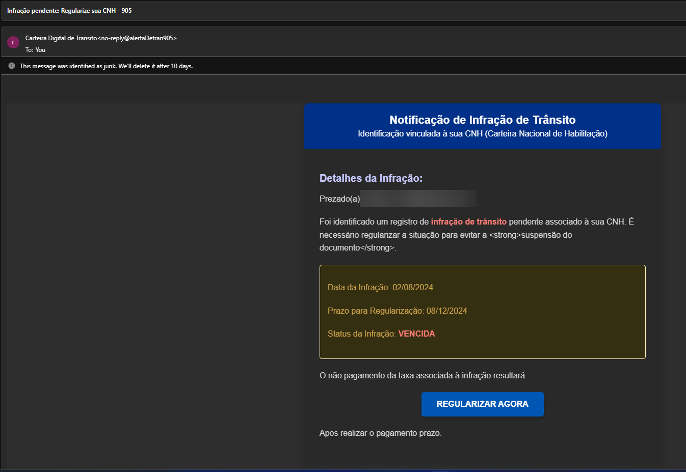

## 3. Análise da página

A primeira coisa que vemos é uma bela e bem feita imagem inicial de acesso.

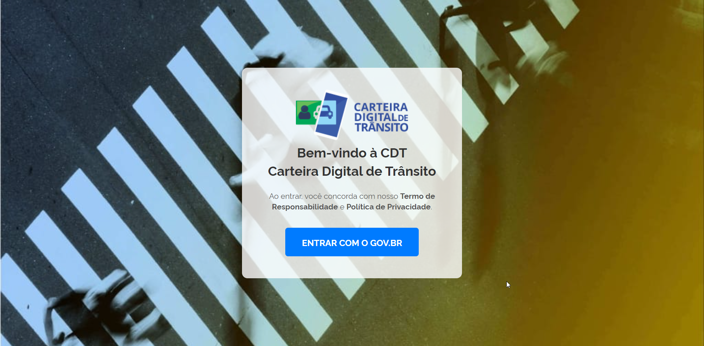

Que redireciona para uma página extremamente idêntica à original do GovBR.  A página faz validação de CPF, então precisa colocar um CPF válido, mas não precisa ser real.

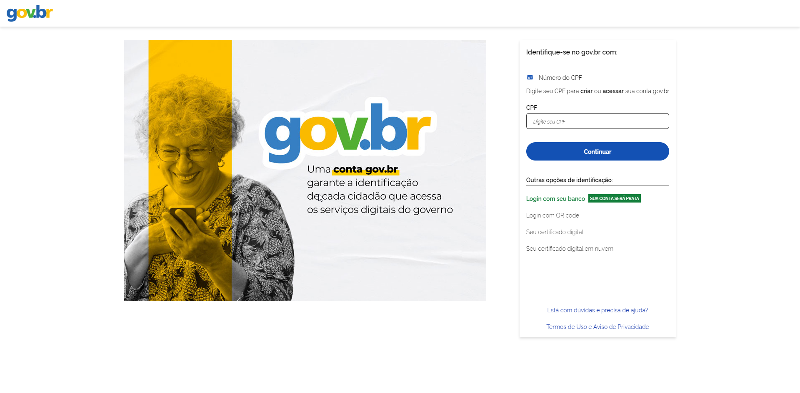

O site é um *fork* de outro site phishing (provavelmente de mesmo grupo) e utiliza a ferramenta **HTTrack**, uma ferramenta muito conhecida para fazer clones de páginas web.

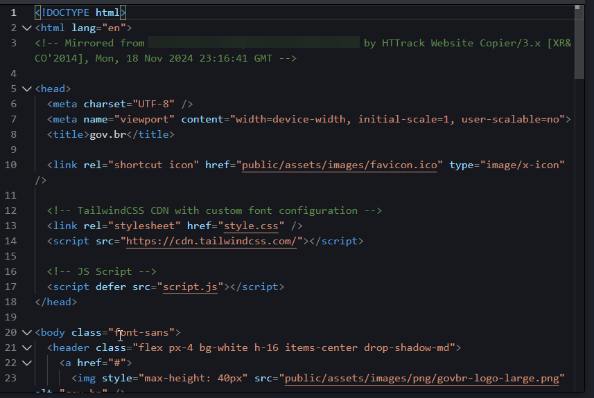

Ele também tem uma função que bloqueia o acesso ao códifo-fonte da página por meio de teclas de atalho.

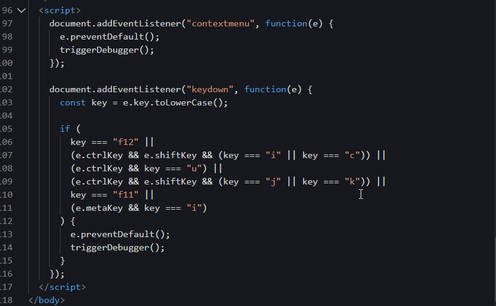

Ao "logar" com um CPF, uma página de *loading* falsa é carregada.

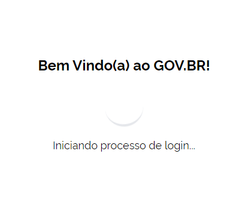

E logo depois algumas informações pessoais para oferecer mais confiança na página aparecem, como nome, data de nascimento e sexo.

E duas coisas interessantes acontece aqui. Ele puxa as informações do CPF de uma base de dados via API.

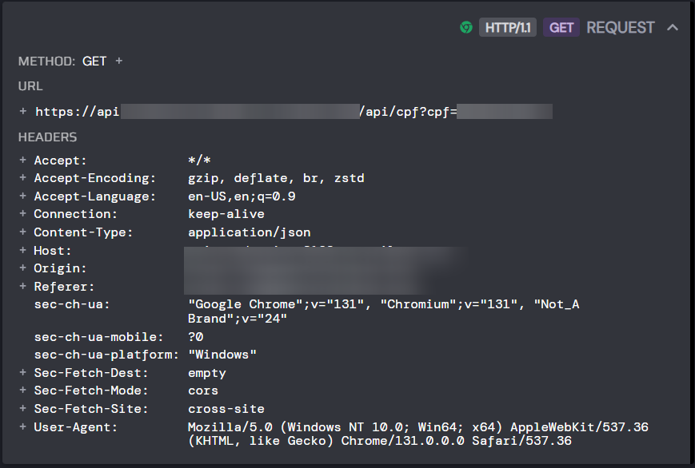
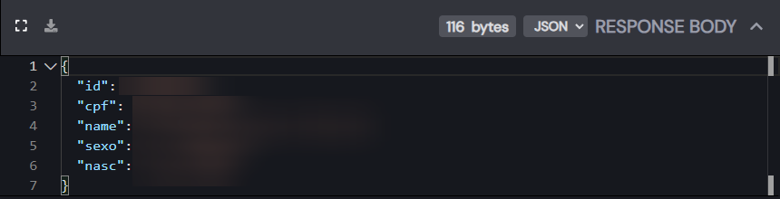

Eles usam um serviço de localização de IP para oferecer mais confiança ao golpe, como o endereço de IP é um dado público e pode ser consultado sua localização aproximada, quem não se atentar por acabar acreditando que isso seja real. O site utilizado é o [wtfismyip.com](https://wtfismyip.com/).

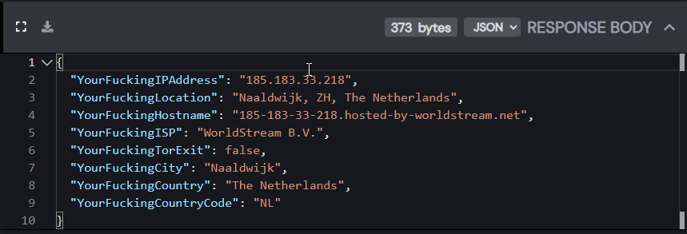
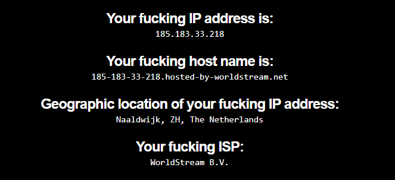

Ao final de tudo, a página nos leva para um serviço de pagamentos e nos cobra uma taxa para o pagamento e quitação da dívida. Apenas mais uma forma de roubar dinheiro.

## 3. Identificando outras páginas semelhantes

Nesse tipo de cenário é bastante comum o uso de múltiplos domínios para aumentar as chances de permanecer mais tempo online.

Com base nisso, podemos identificar todos os endereços usados por meio de pesquisa via hash do ícone do site.

Pode ser usando tanto o Shodan quanto o FOFA para essa pesquisa. No meu caso, eu usei o FOFA.

Você pode pesquisar por qualquer `Favicon hash generator` e gerar a hash ico.

No FOFA, você faz a pesquisa e é isso que se encontra.

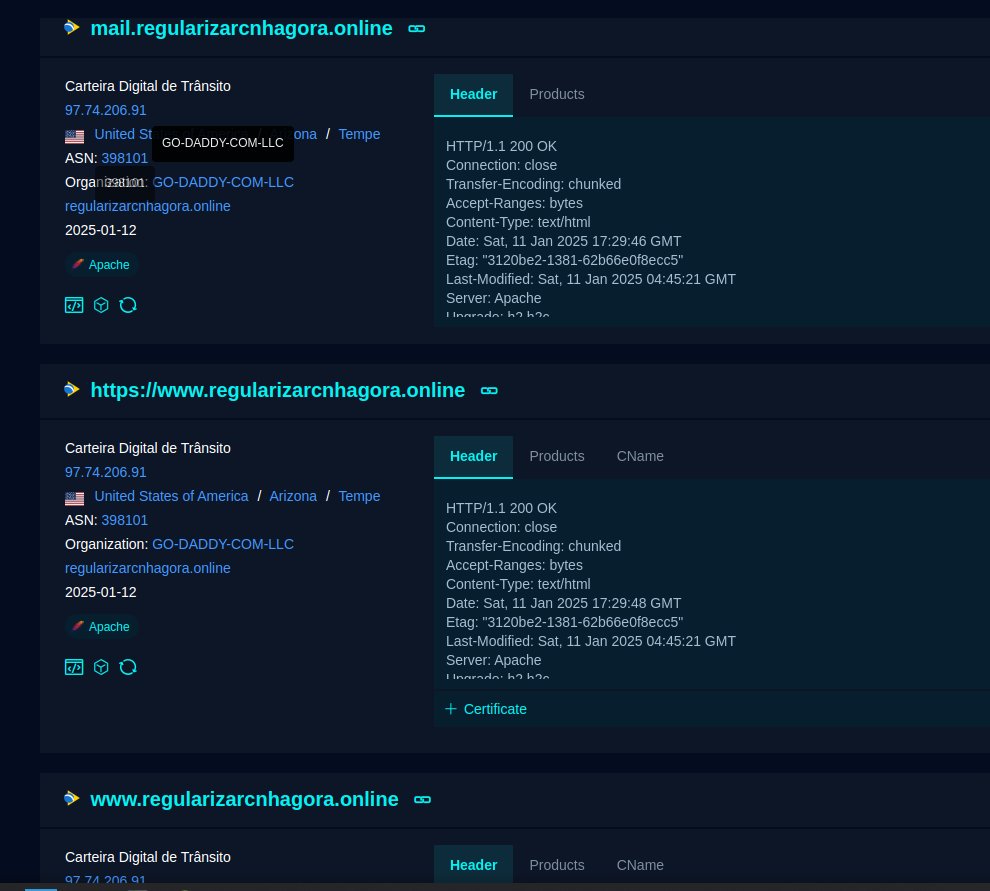

## 4. Melhores práticas de proteção contra phishing

Apesar da motivação desse _phishing_ ter sido apenas dinheiro, ainda assim é importante, no âmbito corporativo, algumas melhores práticas de conscientização contra esse tipo de ameaça.

**Educação e Conscientização:** A melhor defesa contra essa ameaça é a educação. Realizar treinamentos periódicos para ensinar os usuários a reconhecer sinais típicos de _phishing_, como erros gramaticais, URLs suspeitas e senso de urgência, podem reduzir drasticamente o risco.

**Verificação de URLs:** Antes de clicar em qualquer link, é importante verificar a URL cuidadosamente. Certifique-se de que ela corresponde exatamente ao endereço do site oficial e não apresenta caracteres suspeitos ou subdomínios estranhos.

**Uso de Autenticação Multifator (MFA):** Implementar a autenticação multifator em todas as contas sensíveis aumenta a segurança ao exigir uma segunda forma de autenticação, além da senha, mesmo que a senha seja comprometida.

**Ferramentas de Proteção contra Phishing:** Utilizar ferramentas de filtro de e-mails e navegadores que bloqueiam links de phishing conhecidos. Muitos provedores de e-mail, como o Gmail, já possuem filtros para detectar mensagens fraudulentas.

**Manutenção de Software e Sistemas:** Mantenha todos os sistemas operacionais, navegadores e aplicativos atualizados para corrigir vulnerabilidades conhecidas que podem ser exploradas por cibercriminosos.

## 5. Conclusão

O _phishing_ é uma ameaça constante e em constante evolução, explorando a fragilidade humana como seu elo mais fraco. Contudo, com as práticas certas de proteção, incluindo educação e o uso de tecnologias para este fim, podemos reduzir significativamente o risco de ser vítima desse tipo de ataque. A conscientização contínua sobre os métodos empregados pelos cibercriminosos e a adoção de defesas robustas são essenciais para garantir a segurança, seja ela pessoal ou corporativa.