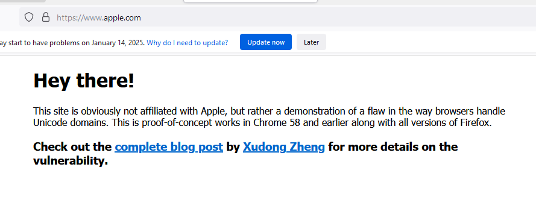
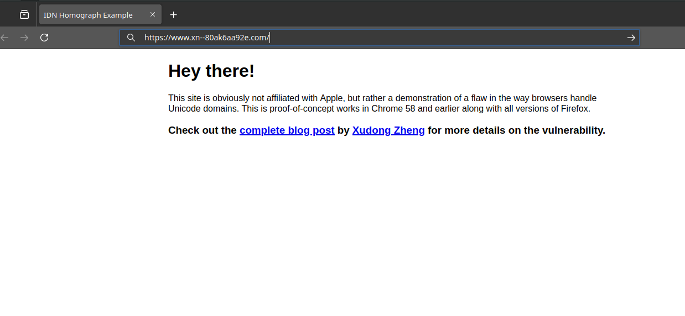
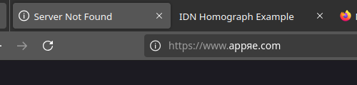

## **1. Introdução**

O **IDN Homograph Attack** é uma técnica de ataque onde o atacante registra um domínio malicioso que se parece visualmente com um domínio legítimo, mas usa caracteres de diferentes alfabetos que são indistinguíveis ao olho humano. Esse tipo de ataque é possível devido à existência de caracteres homográficos, ou seja, caracteres de diferentes alfabetos que possuem aparência idêntica.

Por exemplo, a letra latina "a" (a) pode ser substituída pela letra cirílica "а" (U+0430), que é visualmente idêntica. Isso permite que um atacante registre um domínio aparentemente igual ao original, mas que, na verdade, leva a um site ilegítimo e malicioso.

Neste artigo, vamos explorar o conceito de IDN Homograph Attack, demonstrar como ele pode ser construído e apresentar medidas de proteção.

>Testei alguns navegadores, como o Brave, Microsoft Edge, Firefox e Vivaldi e todos eles mostraram a forma nativa da URL. O Microsoft Edge e o Vivaldi, identificaram a URL como falsa e informaram o site oficial e redirecionamento.

## **2. Exemplo prático**

Considere o site legítimo [`apple.com`](https://www.apple.com). Um atacante pode registrar o domínio [`аррӏе.com`](https://www.аррӏе.com/), onde a letra "l" é um caractere do alfabeto cirílico. Para um usuário comum, ambos os domínios são visualmente idênticos, o que pode levá-lo a acessar o site falso e fornecer informações confidenciais.

## **3. Como funciona o IDN**

Os domínios IDN permitem o uso de caracteres Unicode em vez de apenas caracteres ASCII. No entanto, para que esses domínios possam ser resolvidos pelos servidores DNS, eles são convertidos para um formato chamado Punycode, que utiliza apenas caracteres ASCII. Um domínio como `xn--80ak6aa92e.com` é a representação Punycode do domínio homográfico `аррӏе.com`.

> Punycode trata-se de um protocolo de programação em que uma cadeia de caracteres Unicode é traduzida para a codificação de caracteres mais limitada permitida para nomes de domínio. Foi publicado na Internet através do RFC 3492.

<figure style="text-align: center;">
  
  <figcaption>Firefox na versão 94 onde era possível ver o IDN Homograph Attack funcionando.</figcaption>
</figure>

<figure style="text-align: center;">
  
  
  <figcaption>Firefox na versão 134 onde não é mais possível ver o IDN Homograph Attack funcionando.</figcaption>
</figure>

## **4. Medidas de Proteção**

Muito embora esse seja um recurso que hoje em dia é muito difícil de ocorrer, ainda vale algumas dicas de segurança, pois sabemos que existem empresas que possuem legados e, de repente, tais navegadores estejam obsoletos.

Empresas podem utilizar ferramentas como DNSTwist para monitorar domínios semelhantes ao seu e identificar possíveis tentativas de ataque. Treinar usuários para identificar domínios suspeitos. Adote soluções de segurança que bloqueiem domínios falsos conhecidos ou suspeitos antes que os usuários possam acessá-los. Utilizar regras de detecção que identifique `xn--` na URL.

## **5. Conclusão**

O IDN Homograph Attack é uma técnica sofisticada, capaz de enganar até mesmo usuários experientes. Embora os navegadores modernos já possuem recursos que mostram esse tipo de situação na sua forma nativa, a conscientização de usuários e o monitoramento ativo de domínios maliciosos continuam sendo importantes para prevenir ataques bem-sucedidos. Ao compreender como o ataque funciona e ao implementar medidas de segurança, é possível minimizar significativamente os riscos associados a essa ameaça.



Por favor, entre em contato comigo pelo meu <a href="https://www.linkedin.com/in/sandsoncosta">LinkedIn</a>. Vou ficar muito contente em receber um feedback seu.


---
<!-- begin wwww.htmlcommentbox.com -->
  
<a href="http://www.htmlcommentbox.com">Widget</a> is loading comments...

 <link rel="stylesheet" type="text/css" href="https://www.htmlcommentbox.com/static/skins/bootstrap/twitter-bootstrap.css?v=0" />
<!-- end www.htmlcommentbox.com -->