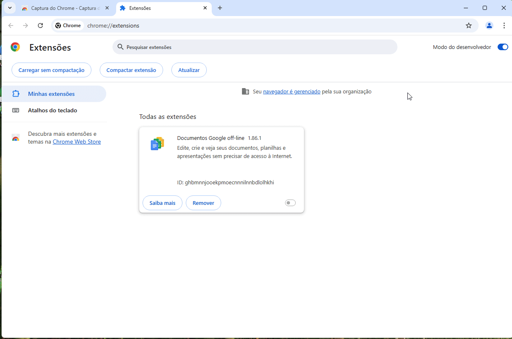
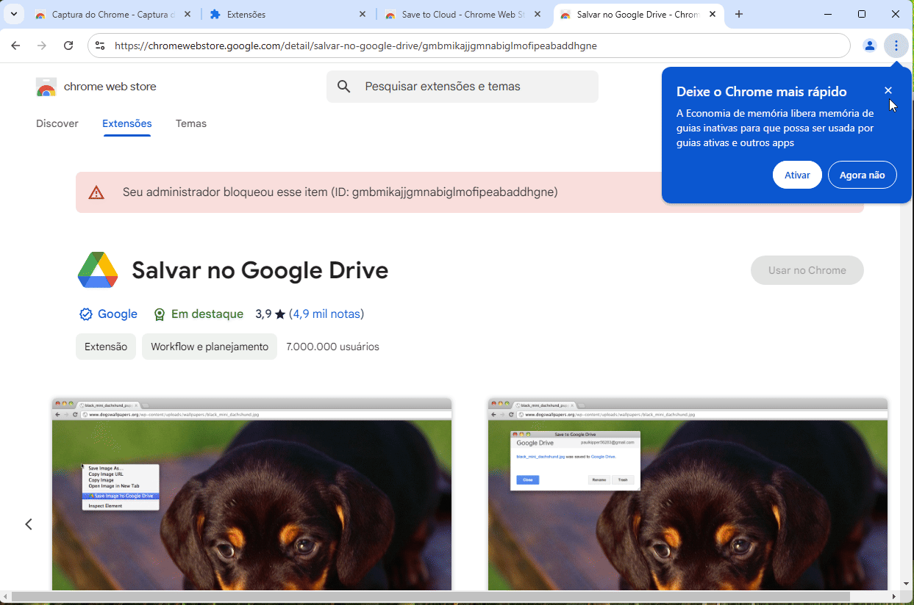

## 1. Introdução

Imagine um cenário onde um funcionário instala uma extensão maliciosa no navegador pra facilitar seu trabalho diário, uma extensão que coleta os dados de uma tabela web de um sistema interno altamente confidencial e converte para uma planilha de Excel. Essa extensão, de fato, faz seu trabalho, mas sem saber, o usuário está abrindo uma brecha para um ataque hacker, coleta de informações confidencias e etc.

Em junho de 2023, pesquisadores identificaram mais de 30 extensões maliciosas na Chrome Web Store, acumulando aproximadamente 87 milhões de downloads. Em agosto de 2022, a Kaspersky registrou mais de 1,3 milhão de tentativas de instalação de extensões maliciosas no primeiro semestre de 2022, com 70% dessas extensões sendo utilizadas como adware para segmentar usuários com anúncios, ou seja, que podem mostrar ao usuário anúncios personalizados maliciosos que podem levar à páginas infectadas. Exemplo disso é o ransomware BlackCat que, em sua campanha, se utiliza de propagandas falsas para distribuir o malware Nitrogen para acesso inicial.

Algum tempo atrás, eu publiquei no meu LinkedIn, um exemplo prático de como extensões maliciosas podem trazer perigos para o ambiente.

<figure style="text-align: center;">
  <video width="640" height="340" controls>
    <source src="poc.mp4" type="video/mp4">
    Seu navegador não suporta a tag de vídeo.
  </video>
  <figcaption><i>PoC de exemplo mostrando como extensões podem ser prejudiciais para o ambiente.</i></figcaption>
</figure>

Diante desse cenário, fica evidente que extensões maliciosas representam um risco eminente para a segurança corporativa, portanto, adotar medidas preventivas que limitam o uso indevido de extensões não homologadas, fortalece a postura de segurança da organização.

Neste artigo, vamos abordar um guia completo ensinando como impedir a instalação de extensões não autorizadas nos principais navegadores e implementar políticas de segurança eficientes.

## 2. Bloqueando extensões no Google Chrome

O Google Chrome é o melhor navegador para ambiente enterprise que se possa usar para um melhor controle operacional, tanto que ele possui um navegador exclusivo para esse fim. O **Google Chrome Enterprise** permite o gerenciamento por meio de Políticas de Grupo (GPO) no Windows e, consequentemente, bloqueio de extensões. Ele pode ser baixado e acessado em: [https://chromeenterprise.google/intl/pt_br/download/](https://chromeenterprise.google/intl/pt_br/download/).

Ao baixar, você terá na pasta o seguinte conteúdo:

```yml
GoogleChromeEnterpriseBundle64
    ├───Configuration
    │   ├───adm
    │   │   ├───am
    │   │   ├───...
    │   │   └───zh-TW
    │   ├───admx
    │   │   ├───am
    │   │   ├───...
    │   │   └───zh-TW
    │   └───examples
    ├───Documentation
    └───Installers
```

### 2.1. Utilizando Políticas de Grupo (GPO) no Windows

Dentro da pasta que você baixou possui templates adminstrativos que você deve incluir na sua pasta de `PolicyDefinitions`, tanto o ADMX quanto o ADML.

### 2.2. Configure a política de bloqueio de extensões externas:

Abra o Editor de Política de Grupo e crie uma nova política, aqui eu chamei de `Google Chrome`.

Navegue até: `Computer Configuration > Policies > Administrative Templates > Google > Google Chrome > Extensions`.

Ative a política **Blocks external extensions from being installed** e defina **Enabled** para bloquear todas.

Essa configuração evita que extensões que são configuradas para todos os usuários via `Windows Registry` seja instalada. Geralmente elas são configuradas em:

Para Google Chrome:
```yml
HKEY_LOCAL_MACHINE\SOFTWARE\Policies\Google\Chrome\ExtensionInstallForcelist
```
Para Microsof Edge:
```yml
HKEY_LOCAL_MACHINE\SOFTWARE\Policies\Microsoft\Edge\ExtensionInstallForcelist
```
### 2.3. Configure a política de bloqueio de qualquer extensão:

Navegue até: `Computer Configuration > Policies > Administrative Templates > Google > Google Chrome > Extensions`.

Ative a política **Configure extension installation blocklist** e defina **Enabled** para bloquear todas. Adicionalmente, na aba `Options`, clique em `Show...` e inclua um **\***. Essa opção ativa o bloqueio de qualquer extensão e também bloqueia a instalação de extensões por meio do Modo de Desenvolvedor.

<figure style="text-align: center;">
  
  <figcaption><i>Exemplo mostrando que não é possível instalar extensão com bloqueio via GPO.</i></figcaption>
</figure>

### 2.4. Configure a política de permissão de apenas extensões homologadas:

Como vimos no exemplo anterior, fomos capazes de bloquear qualquer extensão. Sabemos que há uma infinidade de extensões e gerenciar uma a uma é um trabalho de corno. Contudo, é mais fácil bloquear tudo e permitir somente as homologadas e, é o que vamos configurar agora.

Navegue até: `Computer Configuration > Policies > Administrative Templates > Google > Google Chrome > Extensions`.

Ative a política **Configure extension installation allow list** e defina **Enabled**. Adicionalmente, na aba `Options`, clique em `Show...` e inclua o ID da extensão no campo. Essa opção ativa a permissão de instalação de somente aquela extensão.

<figure style="text-align: center;">
  
  <figcaption><i>Exemplo mostrando instalação de somente extensão permitida.</i></figcaption>
</figure>

## 3. Bloqueando Extensões no Microsoft Edge

O Edge (baseado no Chromium) segue um processo semelhante ao Chrome. Basta seguir os mesmos processos que o do Google Chrome. Baixe o Edge Enterprise e as políticas de grupo do Microsoft Edge em [https://www.microsoft.com/en-us/edge/business/download](https://www.microsoft.com/en-us/edge/business/download), instale e configure as políticas.

## 4. Bloqueando Extensões no Mozilla Firefox

O Firefox também possui uma configuração via GPO. Basta seguir os mesmos exemplos anteriores. Baixar o ADMX e configurar. As políticas são bem intuitivas, também basta ler o resumo na política para entender.

## 5. Bloqueando via Firewall ou Proxy

Outra abordagem mais restritiva é bloquear a instalação de extensões via firewall ou proxy, bloqueando seus domínios.

Adicionar as URLs de extensões à lista de bloqueios:

- Chrome Web Store: https://chrome.google.com/webstore/
- Microsoft Edge Add-ons: https://microsoftedge.microsoft.com/addons/
- Firefox Add-ons: https://addons.mozilla.org/

## 6. Monitoramento e Auditoria

Além do bloqueio, é importante monitorar se extensões não permitidas estão instaladas. Nesse sentido, algumas automações podem ser criadas, como por exemplo um script Powershell em uma tarefa agendada que executa a cada X tempo e verifica se existe alguma extensão não permitida instalada, gerando um log no sistema, enviando via hook para um Slack, Teams ou Telegram etc...

### 6.1. Google Chrome e Edge

Execute no PowerShell:

```powershell
$usersPath = "C:\Users\*\AppData\Local\Google\Chrome\User Data\*\Extensions\*"
$extensionFolders = Get-ChildItem -Path $usersPath -Directory
$extensionFolders | ForEach-Object { $_.FullName }
========
OUTPUT
C:\Users\robert.baratheon\AppData\Local\Google\Chrome\User Data\Default\Extensions\ghbmnnjooekpmoecnnnilnnbdlolhkhi
C:\Users\robert.baratheon\AppData\Local\Google\Chrome\User Data\Default\Extensions\gmbmikajjgmnabiglmofipeabaddhgne
C:\Users\robert.baratheon\AppData\Local\Google\Chrome\User Data\Default\Extensions\nmmhkkegccagdldgiimedpiccmgmieda
C:\Users\vagrant\AppData\Local\Google\Chrome\User Data\Default\Extensions\ghbmnnjooekpmoecnnnilnnbdlolhkhi
C:\Users\vagrant\AppData\Local\Google\Chrome\User Data\Default\Extensions\nmmhkkegccagdldgiimedpiccmgmieda
```

Para o Microsoft Edge, substitua `Google\Chrome` por `Microsoft\Edge`.

### 6.2. Mozilla Firefox

Execute no PowerShell:

```powershell
$usersPath = "C:\Users\*\AppData\Roaming\Mozilla\Firefox\Profiles\*\extensions\"
$extensionFiles = Get-ChildItem -Path $usersPath -Filter *.xpi -Recurse
$extensionFiles | ForEach-Object { $_.FullName }
========
OUTPUT
C:\Users\robert.baratheon\AppData\Roaming\Mozilla\Firefox\Profiles\5q0zbxnj.default-release\extensions\addon@darkreader.org.xpi
C:\Users\robert.baratheon\AppData\Roaming\Mozilla\Firefox\Profiles\5q0zbxnj.default-release\extensions\treestyletab@piro.sakura.ne.jp.xpi
C:\Users\robert.baratheon\AppData\Roaming\Mozilla\Firefox\Profiles\5q0zbxnj.default-release\extensions\{2e5ff8c8-32fe-46d0-9fc8-6b8986621f3c}.xpi
```

## 7. Conclusão

As extensões de navegador, embora úteis, representam um risco significativo se não forem gerenciadas adequadamente. Como demonstramos neste artigo, medidas eficientes como a configuração de políticas de grupo (GPO), bloqueios no registro do Windows e restrições via firewall ou proxy são essenciais para mitigar esses riscos.

Além do bloqueio preventivo, a auditoria contínua é fundamental para identificar possíveis violações e garantir que apenas extensões homologadas estejam em uso. A segurança de ativos importantes para a empresa é um processo contínuo e, ao implementar essas práticas, sua organização fortalece sua defesa contra ameaças cibernéticas, reduzindo a superfície de ataque e garantindo a proteção dos dados corporativos.

## 8. Referências

- [Dozens of malicious extensions exposed on Chrome Web Store](https://www.cisoadvisor.com.br/dezenas-de-extensoes-maliciosas-encontradas-na-chrome-web-store/)
- [Extensões de navegador maliciosas atingiram quase 7 milhões de pessoas](https://minutodaseguranca.blog.br/extensoes-de-navegador-maliciosas-atingiram-quase-7-milhoes-de-pessoas/)
- [Nitrogen: A Malware Campaign Leveraging Search Ads](https://socradar.io/nitrogen-a-malware-campaign-leveraging-search-ads/)
- [Lista de políticas do Chrome Enterprise](https://chromeenterprise.google/policies/)
- [Policy templates for Firefox 135 and Firefox ESR 128.7](https://github.com/mozilla/policy-templates/releases)




Por favor, entre em contato comigo pelo meu <a href="https://www.linkedin.com/in/sandsoncosta">LinkedIn</a>.<br>Vou ficar muito contente em receber um feedback seu.


---
<!-- begin wwww.htmlcommentbox.com -->
  <div id="HCB_comment_box"><a href="http://www.htmlcommentbox.com">Widget</a> is loading comments...</div>
 <link rel="stylesheet" type="text/css" href="https://www.htmlcommentbox.com/static/skins/bootstrap/twitter-bootstrap.css?v=0" />
<!-- end www.htmlcommentbox.com -->