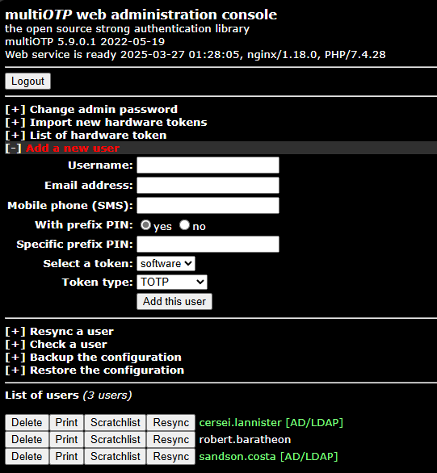
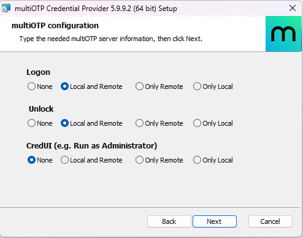

## 1. Introdução

A medida que novas ameaças surgem, novos métodos de evasão de defesas aparecem, os métodos tradicionais de autenticação - como o uso de senhas, ainda que complexas - muitas vezes já não são mais suficientes para mitigar riscos de segurança, soluções que visam aumentar essa segurança, como multi-fator de autenticação, já se tornaram extremamente importantes.

O próprio NIST, em suas revisões mais recentes, já removeu requisitos de complexidade como caracteres especiais em senhas. Essa alteração foi feita, em parte, porque os usuários encontram maneiras de contornar requisitos de complexidade rigorosos. Em vez de se esforçar para lembrar senhas complexas e correr o risco de serem bloqueados, eles podem escrever suas senhas e deixá-las perto de computadores físicos ou servidores. Ou simplesmente reciclam senhas antigas com base em palavras do dicionário, fazendo alterações mínimas durante a criação da senha, como incrementar um número no final.[^1]

Com isso, o próprio NIST[^2] sugere implementar um multi-fator de autenticação e, neste artigo venho trazer exatamente uma solução de 2FA para suprir essa necessidade, o **MultiOTP**. 

## 2. O que é o MultiOTP?

O MultiOTP é uma solução de 2FA de código aberto que implementa o conceito de _one-time password_ (OTP), que reforça a segurança de login no domínio. 

Desenvolvido em PHP e distribuído sob a licença LGPL, o MultiOTP oferece uma abordagem flexível e multiplataforma para adicionar uma camada extra de proteção em autenticações, sendo aplicável tanto em ambientes web quanto em integrações com servidores RADIUS, autenticação de redes e logins em estações de trabalho.

MultiOTP é, basicamente, uma biblioteca PHP, um utilitário de linha de comando e uma interface web que, juntos, fornecem uma solução completa para autenticação forte baseada em senhas descartáveis – ou OTPs. Essa abordagem minimiza o risco de que um invasor reutilize uma senha interceptada, já que cada código gerado é válido apenas por um curto período ou para uma única sessão de autenticação.

A solução é certificada pelo OATH (Initiative for Open Authentication) desde a versão 4.1.0 e suporta padrões amplamente utilizados, como HOTP (HMAC-Based One-Time Password) e TOTP (Time-Based One-Time Password).

## 3. Funcionalidades e Protocolos Suportados

Entre as principais funcionalidades do MultiOTP, destacam-se:

- **Geração de OTPs:** Pode gerar códigos baseados tanto em eventos (HOTP) quanto em tempo (TOTP), garantindo que o código expire rapidamente.
- **Compatibilidade com Hardware e Software:** Suporta tokens físicos (como chaves certificadas OATH) e aplicativos de autenticação (como o Google Authenticator).
- **Integração com SMS:** Possui a opção de enviar códigos por SMS, ampliando as possibilidades de autenticação forte.
- **Envio por E-mail:** Possui a opção de enviar códigos por e-mail, ampliando as possibilidades de autenticação forte.
- **Suporte a Protocolos de Autenticação:** Além de HOTP e TOTP, o MultiOTP oferece suporte aos protocolos CHAP, MS-CHAP e MS-CHAPv2, além de integrar-se a serviços como SMTP, LDAP e RADIUS para aplicações diversas.

Outras opções de uso para o MultiOTP, é a configuração de 2FA para autenticação SSH e para Windows RDWeb server.

> O MultiOTP oferece operação offline (não precisa de acesso à Internet), então você pode usá-lo para configurar autenticação multifator em ambientes desconectados. A maioria dos aplicativos similares são comerciais ou exigem acesso direto à Internet.

## 4. Configurando o MultiOTP no domínio

### 4.1. Ambiente de laboratório

No meu ambiente, vou utilizar um AD Windows Server 2019 e Windows 11 Pro. Uma imagem OVA (baixada pronta para uso no site do MultiOTP) para uma máquina virtual VMware.

> Você também pode implantar o multiOTP usando uma imagem OVA para uma máquina virtual VMware/Hyper-V ou um contêiner Docker. Ver site.

### 4.2. Configurando um Grupo de Segurança no AD

Vamos começar com a configuração necessária de usuário de serviço e grupos no AD.

- Crie um **grupo** no AD dedicado para os usuários que precisarão se autenticar com 2FA. No meu caso, eu criei um grupo chamado `2FAUsers` e adicionei os usuários que irão usar o OTP.
- Crie um **grupo** no AD dedicado para os usuários que **NÃO** precisarão se autenticar com 2FA. No meu caso, eu criei um grupo chamado `without2FA` e adicionei os usuários que **NÃO** irão usar o OTP.
- Crie um **usuário** no AD dedicado para configuração e sincronização do AD e o serviço de 2FA. No meu caso, eu criei o usuário `multiotp_srv` dentro da OU `ServiceAccounts`.

> [!NOTE] Observações!
>Ao ser instalado o MultiOTP no computador, quando for solicitado ao servidor OTP a validação e ele não identificar no grupo criado o usuário, vai dar erro de autenticação.
<br>
Primeiro, é da arquitetura do programa que se tenha um grupo.
<br>
Segundo, sempre dará erro porque o programa foi construído se baseando o princípio de **Zero Trust**[^3], ou seja, proteger tudo com 2FA. Então, com base nisso, ao tentar autenticar um usuário fora do grupo, dará erro e o usuário, se não estiver, dentro do grupo que não precisa de 2FA, será solicitado OTP e, consequentemente, ocorrerá erro de autenticação.


### 4.3. Configurando o servidor OTP

Vamos começar com a configuração de um servidor multiOTP que obterá usuários do AD, gerará códigos QR exclusivos para usuários e validará o segundo fator.

> [!IMPORTANT] Importante!
> 1. A configuração abaixo foi realizada na VM Linux baixada diretamente do site. Lá no site você tem várias opções de VM, além de que você mesmo pode provisionar uma VM no seu parque e instalar a partir do GitHub. Ver documentação oficial.
> 2. As configurações abaixo realizadas em um Linux são as mesmas que pode ser configuradas, se o servidor OTP for um Windows.
> 3. Acesse o link https://download.multiotp.net/ para acessar as diversas opções. 

Realize a seguinte configuração no terminal para configurar o servidor OTP:

```powershell
multiotp -config default-request-prefix-pin=1
multiotp -config default-request-ldap-pwd=0
multiotp -config ldap-server-type=1
multiotp -config ldap-cn-identifier="sAMAccountName"
multiotp -config ldap-group-cn-identifier="sAMAccountName"
multiotp -config ldap-group-attribute="memberOf"
multiotp -config ldap-ssl=0
multiotp -config ldap-port=389
multiotp -config ldap-domain-controllers=kingslanding.sevenkingdoms.local,ldap://192.168.56.10:389 #kingslanding é o hostname do DC.
multiotp -config ldap-base-dn="DC=sevenkingdoms,DC=local"
multiotp -config ldap-bind-dn="CN=multiotp_srv,OU=ServiceAccounts,DC=sevenkingdoms,DC=local"
multiotp -config ldap-server-password="Minhasenha@123"
multiotp -config ldap-in-group="2FAUsers" # Grupo do AD criado para habilitar usuários ao 2FA.
multiotp -config ldap-without2fa-in-group="without2FA" # Grupo do AD para exceção de users ao 2FA.
multiotp -config ldap-network-timeout=10
multiotp -config ldap-time-limit=30
multiotp -config ldap-activated=1
multiotp -config server-secret=secret2OTP
```

> [!DANGER] Atenção!
> A opção **ldap-without2fa-in-group** só está habilitada na versão `5.9.9.1`. Se você for utilizar a VM baixada no site, precisará atualizar, pois a versão que vem no servidor é a `5.9.0.1`.


> [!TIP]
> - **default-request-ldap-pwd:** [0|1] enabled/disabled - Define se o usuário coloca ou não senha. Se 0, usuário coloca a senha + pin, se 1, usuário coloca apenas o pin.
> - **ldap-in-group:** Será o grupo do AD que você criou para ser o grupo de usuários com o 2FA ativo.
> - **ldap-without2fa-in-group:** Será o grupo do AD que você criou para ***NÃO*** ser o grupo de usuários com o 2FA ativo.
> - **server-secret:** É a chave compartilhada entre as operações Cliente-Servidor.

> Para demais configurações, veja a documentação oficial. O link da documentação está em ***Referências***.

Ok! Depois de feito essas configurações iniciais, agora vamos sincronizar tudo! Execute:

```bash
multiotp -debug -display-log -ldap-users-sync
```

Se tudo ocorreu certo, você receberá o seguinte:

```bash
root@multiotp:~# multiotp -debug -display-log -ldap-users-sync

LOG 2025-03-27 14:25:51 debug LDAP Debug: *AD/LDAP synchronization started at 14:25:51 / Memory used: 1.6MB / Peak: 1.6MB

LOG 2025-03-27 14:25:51 info LDAP Info: AD/LDAP synchronization started

LOG 2025-03-27 14:25:51 debug System Debug: *LDAP cache folder value: /tmp/.ldap_cache/

LOG 2025-03-27 14:25:51 debug System Info: *File created: /etc/multiotp/users/cersei.lannister.db

LOG 2025-03-27 14:25:51 info System Info: User cersei.lannister automatically created

LOG 2025-03-27 14:25:51 debug System Info: *File created: /etc/multiotp/users/robert.baratheon.db

LOG 2025-03-27 14:25:51 info System Info: User robert.baratheon automatically created

LOG 2025-03-27 14:25:51 debug System Info: *File created: /etc/multiotp/users/robin.arryn.db

LOG 2025-03-27 14:25:51 info System Info: User robin.arryn automatically created

LOG 2025-03-27 14:25:51 debug System Info: *File created: /etc/multiotp/users/sandson.costa.db

LOG 2025-03-27 14:25:51 info System Info: User sandson.costa automatically created

LOG 2025-03-27 14:25:51 info LDAP Info: 4 users created, based on 4 LDAP entries (processed in 00:00:00)
19 *INFO: Requested operation successfully done
```

Você verá a quantidade de usuários importados dos grupos no qual você criou.

> [!IMPORTANT] Importante!
> Configure uma rotina para sincronizar regularmente novas contas do AD.
> O comando é: `multiotp -debug -display-log -ldap-users-sync`.
><br>
> Adicionalmente, se quiser adicionar uma segunda rotina com um tempo maior, tipo 6 meses, para limpar usuários já desativados/removidos do AD e remover do servidor OTP, crie um script para limpar a pasta `/etc/multitop/users`, aqui fica armazenado as informações de AD do usuário, apenas para questão de sanitização.

Acesse o serviço web, o acesso é o IP de sua VM: `https://<ip_VM>/`. Se você configurou o MultiOTP no Windows, o acesso é pelo link: `https://<ip_VM>:8112/`.

<figure style="text-align: center;">
  
  <figcaption><i><strong>Figura 1.</strong> Essa é a linda GUI do nosso MultiOTP. O importante é a funcionalidade. Foca no poder da ferramenta!</i></figcaption>
</figure>

<figure style="text-align: center;">
  
  <figcaption><i><strong>Figura 2.</strong> Essa é a tela após logado.</i></figcaption>
</figure>

Perceba que na figura 2, temos 3 usuários, dois deles referenciados como [AD/LDAP], isso indica que esses usuários foram importados do grupo no AD criado com exclusividade para o 2FA. O outro usuário que tem não tem essa marcação e está em cinza, é um usuário configurado manualmente para ser ignorado no 2FA, ele só precisa da senha. Quando você realizar o _sync_ novamente do AD, esses usuários serão removidos, sendo necessário recadastrar manualmente.

Quando configurado o grupo do AD que será excluído do 2FA e é importado no servidor OTP, a configuração fica assim:

<figure style="text-align: center;">
  
  <figcaption><i><strong>Figura 3.</strong> Os usuários <code>robert.baratheon</code> e <code>robin.arryn</code> foram importados como usuários que NÃO devem usar 2FA.</i></figcaption>
</figure>

> [!IMPORTANT] Importante!
> Perceba que nos prints estou utilizando a versão 5.9.0.1.
> <br>
> Na Figura 3, atualizei pra versão mais recente, que é a versão 5.9.9.1.
> <br>
> Se você estiver usando a VM disponbilizada pelos desenvolvedores, você precisa atualizar para a mais recente. Nessa versão da VM disponibilizada, a configuração `ldap-without2fa-in-group` não funciona.
> <br>
> Veja a documentação de como atualizar.

Ok! Depois que o LDAP está sincronizado e você já consegue visualizar os usuários em tela, agora é hora de gerar os _qrcodes_ dos usuários, para ser enviado para eles, repassados ou como você quiser distribuir.

### 4.4. Gerando o _QRCode_

Para gerar o _QRCode_ de usuários:

- Para criar somente a imagem para um usuário: `multiotp -qrcode username username.png`.
- Para criar a página HTML para um usuário: `multiotp -htmlinfo username username.html`.
- Para criar a página HTML para todos os usuários: `multiotp -htmlinfo /usr/local/bin/multiotp/`.

O caminho padrão para a geração de todos os _qrcodes_ dos usuários é o `/usr/local/bin/multiotp/`. O sistema não aceita a criação para outra pasta, pelo menos no meu teste eu não consegui gerar para outra pasta.

Você também pode gerar, individualmente o HTML pelo GUI clicando em `Print`, conforme **Figura 3**.

Abaixo um exemplo da página que é gerada:
<figure style="text-align: center;">
  <iframe src="multiotp.pdf" style="display: block; margin-left: auto; margin-right: auto; max-width: auto; height: 600px; width: 100%  "></iframe>
    <figcaption><i>Este PDF é um exemplo de como é a página HTML gerada. Pode ser gerado o PDF do HTML e enviado ao usuário ou enviado via e-mail como uma página HTML.</i></figcaption>
</figure>

Ok! Depois dessas configurações terem sido realizadas, seu servidor está pronto para ser usado.

## 5. Configurando o MultiOTP no computador

Agora é a hora da verdade! Vamos configurar e saber se vai de vera ou não!

Baixe e instale o `multiOTP Credential Provider 5.9.9.2` pelo link do GitHub: https://github.com/multiOTP/multiOTPCredentialProvider/releases.

<figure style="text-align: center;">
  
  <figcaption><i><strong>Figura 4.</strong> Tela de configuração do OTP.</i></figcaption>
</figure>

- Em **multiOTP Login Title** você personaliza o que quiser.
- Em **URL Server** você coloca o FQDN ou IP configurado, conforme imagem. Se você configurou o multiOTP no Windows, deve incluir a porta 8112, conforme exemplo no próprio programa.
- Em **Secret shared...** você inclui a senha configurada na instalação do servidor.
- A opção **No remote server, local multiOTP only** só é pra ser usada, se você quiser a autenticação descentralizada, ou seja, a própria máquina é servida como servidor, então você não precisa configurar servidor externo.

Selecione a seguinte configuração: 

<figure style="text-align: center;">
  
  <figcaption><i><strong>Figura 5.</strong> Segunda tela de configuração do OTP.</i></figcaption>
</figure>

- A primeira opção marcada habilita automagicamente o NumLock. Por padrão, na tela de login é desabilitada.
- A segunda opção marcada é default.
- A terceira opção marcada desabilita a solicitação de OTP para usuário que não necessitam de 2FA.

<figure style="text-align: center;">
  
  <figcaption><i><strong>Figura 6.</strong> Terceira tela de configuração do OTP.</i></figcaption>
</figure>

- Você configura se quer autenticação OTP somente para conexões remotas ou para conexões remotas e local ou somente local. No meu caso eu configurei para tudo.

Tudo certo! Depois de instalado, pode reiniciar ou apenas desconectar o usuário.

<figure style="text-align: center;">
  
  <figcaption><i><strong>Figura 7.</strong> Tela de login com a configuração personalizada.</i></figcaption>
</figure>

<figure style="text-align: center;">
  
  <figcaption><i><strong>Figura 8.</strong> Tela de solicitação do OTP.</i></figcaption>
</figure>

## 6. Outras configurações

Todos os registros são armazenados em `HKEY_CLASSES_ROOT\CLSID\{FCEFDFAB-B0A1-4C4D-8B2B-4FF4E0A3D978}` ou podem ser alterados em `C:\Program Files\multiOTP\config\multiotp.ini`.

Para alterar a logo da tela de autenticação é necessário criar um registro chamado `v1_bitmap_path` do tipo `REG_SZ` em `HKEY_CLASSES_ROOT\CLSID\{FCEFDFAB-B0A1-4C4D-8B2B-4FF4E0A3D978}` e incluir o caminho da imagem sem aspas. A imagem tem que ser do tipo `.bmp` e tamanho de `128x128`.

Eu criei um script automatizando isso, que pode ser acessado em: https://github.com/sandsoncosta/multiOTP-Change-Logo/tree/main.

Caso queira executar diretamente no powerhsell sem baixar o script, basta executar o seguinte comando: `iex (New-Object Net.WebClient).DownloadString("https://raw.githubusercontent.com/sandsoncosta/multiOTP-Change-Logo/refs/heads/main/multiOTP_Change_logo.ps1")`. Ele solicitará o caminho do arquivo, que deve ser repassado sem aspas e ele criará automaticamente a chave de registro.

<figure style="text-align: center;">
  
  <figcaption><i><strong>Figura 9.</strong> Execução do script alterando a logo de autenticação inicial.</i></figcaption>
</figure>

<figure style="text-align: center;">
  
  <figcaption><i><strong>Figura 10.</strong> Tela de solicitação do OTP.</i></figcaption>
</figure>

## 7. Observações e Recomendações

É importante fazer a implementação progressiva, selecionando poucos usuários ou equipes menos críticas para implantar aos poucos em todo o ambiente.

Outro ponto importante é que ele, por ser um _Credential Provider_, não oferece proteção para autenticações via terminal como, PSSession ou uso de ferramentas maliciosas como Impacket. Ele fornece proteção para autenticação local e remota como o RDP.

## Referências

- [Quais são as diretrizes de senha do NIST?](https://aiqon.com.br/blog/quais-sao-as-diretrizes-de-senha-do-nist/)
- [NIST Special Publication 800-63B:5.1.1 Memorized Secrets](https://pages.nist.gov/800-63-3/sp800-63b.html#sec5)
- [Zero Trust Architecture](https://nvlpubs.nist.gov/nistpubs/SpecialPublications/NIST.SP.800-207.pdf)
- [multiOTP](https://en.wikipedia.org/wiki/MultiOTP)
- [multiOTP open source](https://github.com/multiOTP)
- [Documentação Oficial do MultiOTP](https://download.multiotp.net/readme_5.9.9.1.txt)



Por favor, entre em contato comigo pelo meu <a href="https://www.linkedin.com/in/sandsoncosta">LinkedIn</a>.<br>Vou ficar muito contente em receber um feedback seu.


---
[^1]: Esta referência foi retirada do site Aiqon. Ver referências.
[^2]: Seção 5.1.1 Memorized Secrets do NIST Special Publication 800-63B. Ver referências.
[^3]: Referência do NIST dedicada exclusiva para a arquitetura Zero Trust. Ver referências.
