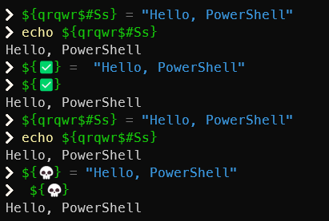
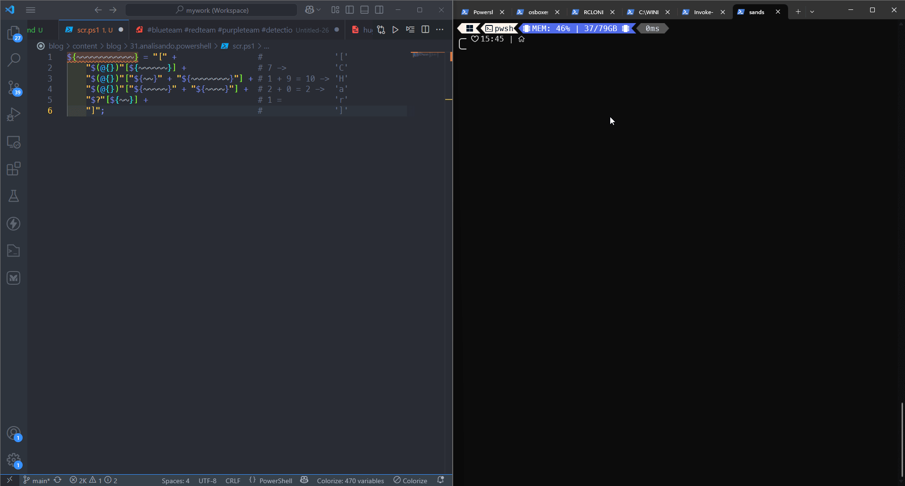

# 1. Introdução

A ofuscação é uma técnica usada com frequência em scripts maliciosos para dificultar a análise estática e esconder a intenção real do código. Neste artigo, vamos analisar um simples script PowerShell altamente ofuscado, demonstrar passo a passo como ele foi construído, desofuscá-lo e mostrar o resultado final: a execução do `calc.exe` via `Start-Process`.

# 2. Como funcionam as variáveis em PowerShell?

Você pode armazenar todos os tipos de valores em variáveis do PowerShell. Por exemplo, armazenar os resultados dos comandos e armazenar elementos que são usados em comandos e expressões, como nomes, caminhos, configurações e valores.

Uma variável é uma unidade de memória na qual os valores são armazenados. No PowerShell, as variáveis são representadas por strings de texto que começam com um cifrão `$`, como `$a`, `$process` ou `$my_var`.

Os nomes de variáveis não diferenciam maiúsculas de minúsculas e podem incluir espaços e **caracteres**. Mas, os nomes de variáveis que incluem caracteres especiais e espaços são difícil de usar e deve ser evitado. Para obter mais informações, consulte **about_Variables** na seção **Referências**.

Há vários tipos diferentes de variáveis no PowerShell:

- **Variáveis criadas pelo usuário:** As variáveis criadas pelo usuário são criadas e mantidas pelo usuário. Por padrão, as variáveis que você cria no comando do PowerShell existem somente enquanto a janela do PowerShell está aberta. Quando a janela do PowerShell é fechada, as variáveis são excluídas. Para salvar uma variável, adicione-a a seu perfil do PowerShell. Você também pode criar variáveis em scripts com escopo global ou local.
- **Variáveis automáticas:** As variáveis automáticas armazenam o estado do PowerShell. Estas variáveis são criadas pelo PowerShell e ele altera seus valores como necessário para manter sua precisão. Os usuários não podem alterar o valor dessas Variáveis. Por exemplo, a variável `$PSHOME` armazena o caminho para o diretório de instalação do PowerShell. Para obter mais informações, uma lista e uma descrição das variáveis automáticas, veja **about_Automatic_Variables** na seção **Referências**.
- **Variáveis de preferência:** As variáveis de preferência armazenam as preferências do usuário para PowerShell. Essas variáveis são criadas pelo PowerShell e são preenchidas com valores padrão. Os usuários podem alterar os valores dessas variáveis. Por exemplo, a variável `$MaximumHistoryCount` determina o número máximo de entradas no histórico da sessão. Para obter mais informações, uma lista e uma descrição das variáveis de preferência, veja **about_Preference_Variables** na seção **Referências**.

Aqui é um breve resumo, leia as referências para aprofundamento, se quiser. Vamos ao que interessa de fato.

# 3. Script ofuscado

Aqui temos nosso script de exemplo para estudar:

```powershell
# Comando: "Start-Process calc.exe" totalmente ofuscado
${~~~~~~~~~~~}  =+$(  );${~~~~}  =${~~~~~~~~~~~};${~~}=  ++  ${~~~~~~~~~~~}  ;  ${~~~~~}=++  ${~~~~~~~~~~~};${~}=  ++  ${~~~~~~~~~~~};${~~~~~~~~~~}=  ++${~~~~~~~~~~~};  ${~~~}  =++${~~~~~~~~~~~};${~~~~~~~~~}=++${~~~~~~~~~~~};${~~~~~~}  =  ++  ${~~~~~~~~~~~}  ;  ${~~~~~~~}=++  ${~~~~~~~~~~~}  ;  ${~~~~~~~~}  =  ++${~~~~~~~~~~~}  ;  ${~~~~~~~~~~~~}  ="["+"$(  @{  }  )  "[  ${~~~~~~}  ]+  "$(@{  })"["${~~}"  +  "${~~~~~~~~}"]  +"$(@{  }  )"["${~~~~~}"  +"${~~~~}"]  +"$?"[${~~}]+  "]"  ;  ${~~~~~~~~~~~}  =  "".("$(  @{})"[  "${~~}"  +  "${~~~~~~~~~~}"  ]  +  "$(  @{}  )  "[  "${~~}"+  "${~~~~~~~~~}"  ]  +  "$(  @{}  )"[${~~~~}  ]+  "$(@{}  )"[${~~~~~~~~~~}]  +"$?  "[${~~}  ]  +"$(  @{}  )  "[${~}]  )  ;  ${~~~~~~~~~~~}="$(  @{})"["${~~}"+  "${~~~~~~~~~~}"  ]+  "$(  @{}  )"[  ${~~~~~~~~~~}]+  "${~~~~~~~~~~~}"["${~~~~~}"  +  "${~~~~~~}"];  "  ${~~~~~~~~~~~}(${~~~~~~~~~~~~}${~~~~~~~}${~}+  ${~~~~~~~~~~~~}${~~}${~~}${~~~~~~~~~}+  ${~~~~~~~~~~~~}${~~~~~~~~}${~~~~~~}  +${~~~~~~~~~~~~}${~~}${~~}${~~~~~~~~~~}  +  ${~~~~~~~~~~~~}${~~}${~~}${~~~~~~~~~}+${~~~~~~~~~~~~}${~~~~~~~~~~}${~~~}+  ${~~~~~~~~~~~~}${~~~~~~~}${~~~~}+  ${~~~~~~~~~~~~}${~~}${~~}${~~~~~~~~~~}  +${~~~~~~~~~~~~}${~~}${~~}${~~}+  ${~~~~~~~~~~~~}${~~~~~~~~}${~~~~~~~~}+  ${~~~~~~~~~~~~}${~~}${~~~~}${~~}+  ${~~~~~~~~~~~~}${~~}${~~}${~~~}  +  ${~~~~~~~~~~~~}${~~}${~~}${~~~}  +  ${~~~~~~~~~~~~}${~}${~~~~~}  +  ${~~~~~~~~~~~~}${~~~~~~~~}${~~~~~~~~}+${~~~~~~~~~~~~}${~~~~~~~~}${~~~~~~}+${~~~~~~~~~~~~}${~~}${~~~~}${~~~~~~~}  +${~~~~~~~~~~~~}${~~~~~~~~}${~~~~~~~~}  +  ${~~~~~~~~~~~~}${~~~~~~~~~~}${~~~~~~~~~}  +${~~~~~~~~~~~~}${~~}${~~~~}${~~}  +  ${~~~~~~~~~~~~}${~~}${~~~~~}${~~~~}  +  ${~~~~~~~~~~~~}${~~}${~~~~}${~~}  )  "|&  ${~~~~~~~~~~~}
```

A primeira vista é uma coisa de outro mundo, mas é mais simples do que parece... tecnicamente falando 😅.

## 3.1. Criação de uma variável qualquer

Lembra que o PowerShell aceita caracteres especiais como variável? Então... Se você colocar qualquer coisa no terminal, ele vai aceitar. Veja:

<figure style="text-align: center;">
  
  <figcaption><i><strong>Figura 1.</strong> Uso de caracteres especiais e emojis como variáveis.</i></figcaption>
</figure>

### 3.1.1. Por que isso funciona?

Isso só funciona porque o nome da variável está entre `${}`, o que permite usar caracteres especiais e até mesmo emojis no nome da variável, mesmo que elas sejam inválidas ou até mesmo variáveis nativas da linguagem.


Embora seja tecnicamente válido, não é uma boa prática usar esse tipo de nome em código real, por causa da legibilidade e manutenção. Mas para análise de scripts maliciosos ou segurança ofensiva/defensiva, vale ouro entender isso.


## 3.2. Inicialização e Contadores

A linha abaixo inicia a criação de um contador numérico:

```powershell
${~~~~~~~~~~~} = +$();
${~~~~~~~~~~~} # 0
```

Isso inicializa `${~~~~~~~~~~~}` como `0`. O `+$()` é uma forma de forçar a conversão para número inteiro.

Logo em seguida, várias variáveis são definidas usando incremento `(++)` sobre `${~~~~~~~~~~~}`:

```powershell
${~~~~~~~~~~~}=+$();            # 0
${~~~~}=${~~~~~~~~~~~};         # 0
${~~}=++${~~~~~~~~~~~};         # 1
${~~~~~}=++${~~~~~~~~~~~};      # 2
${~}=++${~~~~~~~~~~~};          # 3
${~~~~~~~~~~}=++${~~~~~~~~~~~}; # 4
${~~~}=++${~~~~~~~~~~~};        # 5
${~~~~~~~~~}=++${~~~~~~~~~~~};  # 6
${~~~~~~}=++${~~~~~~~~~~~};     # 7
${~~~~~~~}=++${~~~~~~~~~~~};    # 8
${~~~~~~~~}=++${~~~~~~~~~~~};   # 9
```

Essas variáveis representam números de 0 a 9 e serão usadas como índices para acessar caracteres em strings, arrays e variáveis automáticas.

## 3.3. Construção de [Char]

Logo após essa criação dos inicializadores e contadores, temos uma concatenação:

```powershell
${~~~~~~~~~~~~}  ="["+"$(  @{  }  )  "[  ${~~~~~~}  ]+  "$(@{  })"["${~~}"  +  "${~~~~~~~~}"]  +"$(@{  }  )"["${~~~~~}"  +"${~~~~}"]  +"$?"[${~~}]+  "]"  ;
```

```powershell
${~~~~~~~~~~~~} = "[" +                 #               '['
    "$(@{})"[${~~~~~~}] +               # 7 ->          'C'
    "$(@{})"["${~~}" + "${~~~~~~~~}"] + # 1 + 9 = 10 -> 'H'
    "$(@{})"["${~~~~~}" + "${~~~~}"] +  # 2 + 0 = 2 ->  'a'
    "$?"[${~~}] +                       # 1 =           'r'
    "]";                                #               ']'
```

<figure style="text-align: center;">
  
  <figcaption><i><strong>Figura 2.</strong> Execução do script para prova técnica.</i></figcaption>
</figure>

**O que acontece aqui?**

- `$(@{})` é um hash table vazio. Mas como PowerShell trata tudo como objeto, isso gera a string `System.Collections.Hashtable`, e podemos indexar nela.
- `${~~~~~~} = 7` → `'C'` (7º caractere de `System.Collections.Hashtable`)
- `${~~} + ${~~~~~~~~} = 1 + 9 = 10` → `'H'`
- `${~~~~~} + ${~~~~} = 2 + 0 = 2` → `'a'`
- `$?` retorna `True`, que em string é `'True'` → `[1] = 'r'`

**Resultado:** `"[CHar]"`

Todo o resto vai seguir o mesmo padrão, até chegar na string que vamos ver na próxima seção.

## 3.4. Construção da Função `Invoke-Expression`

Esse trecho:

```powershell
"${~~~~~~~~~~~}(${~~~~~~~~~~~~}${~~~~~~~}${~}+${~~~~~~~~~~~~}${~~}${~~}${~~~~~~~~~}+${~~~~~~~~~~~~}${~~~~~~~~}${~~~~~~}+${~~~~~~~~~~~~}${~~}${~~}${~~~~~~~~~~}+${~~~~~~~~~~~~}${~~}${~~}${~~~~~~~~~}+${~~~~~~~~~~~~}${~~~~~~~~~~}${~~~}+${~~~~~~~~~~~~}${~~~~~~~}${~~~~}+${~~~~~~~~~~~~}${~~}${~~}${~~~~~~~~~~}+${~~~~~~~~~~~~}${~~}${~~}${~~}+${~~~~~~~~~~~~}${~~~~~~~~}${~~~~~~~~}+${~~~~~~~~~~~~}${~~}${~~~~}${~~}+${~~~~~~~~~~~~}${~~}${~~}${~~~}+${~~~~~~~~~~~~}${~~}${~~}${~~~}+${~~~~~~~~~~~~}${~}${~~~~~}+${~~~~~~~~~~~~}${~~~~~~~~}${~~~~~~~~}+${~~~~~~~~~~~~}${~~~~~~~~}${~~~~~~}+${~~~~~~~~~~~~}${~~}${~~~~}${~~~~~~~}+${~~~~~~~~~~~~}${~~~~~~~~}${~~~~~~~~}+${~~~~~~~~~~~~}${~~~~~~~~~~}${~~~~~~~~~}+${~~~~~~~~~~~~}${~~}${~~~~}${~~}+${~~~~~~~~~~~~}${~~}${~~~~~}${~~~~}+${~~~~~~~~~~~~}${~~}${~~~~}${~~})"
```

Tem seu output assim:

```powershell
iex([CHar]83+[CHar]116+[CHar]97+[CHar]114+[CHar]116+[CHar]45+[CHar]80+[CHar]114+[CHar]111+[CHar]99+[CHar]101+[CHar]115+[CHar]115+[CHar]32+[CHar]99+[CHar]97+[CHar]108+[CHar]99+[CHar]46+[CHar]101+[CHar]120+[CHar]101)
```

## 3.5. Montagem do Argumento final

Se pegarmos o comando anterior e executar somente os `[CHar]` que está entre parênteses:

```powershell
[CHar]83+[CHar]116+[CHar]97+[CHar]114+[CHar]116+[CHar]45+[CHar]80+[CHar]114+[CHar]111+[CHar]99+[CHar]101+[CHar]115+[CHar]115+[CHar]32+[CHar]99+[CHar]97+[CHar]108+[CHar]99+[CHar]46+[CHar]101+[CHar]120+[CHar]101
```

Temos:

```powershell
Start-Process calc.exe
```

O trecho ofuscado na seção anterior e neste seção está sendo construída dinamicamente:

- Os índices recuperam letras de strings padrão como `$( @{} )` e `$?`, formando a string `Start-Process calc.exe`.
- O método de string é invocado via `"".('S' + 't' + 'a' + ...)` → `Start-Process calc.exe`.

A parte final do script é responsável por montar caractere por caractere, invocando `[Char]` com valores numéricos: `[CHar]99+[CHar]97+[CHar]108+[CHar]99+[CHar]46+[CHar]101+[CHar]120+[CHar]101`.

# 4. O que vemos no SIEM

Muita gente usa PowerShell pra evasão, achando que só por estar ofuscado tá stealth. Pode até ser até certo ponto, esse modelo pode até se evadir de certas defesas, mas em ambientes maduros, PowerShell não é o vilão — ele pode estar habilitado, mas com logging avançado, regras de detecção bem afiadas e integração com o SIEM. Mesmo scripts super ofuscados, acabam sendo desofuscados em tempo real pelo próprio PowerShell, como vimos aqui. No log podemos identificar pelo `<mark>`EventID 4104`</mark>` pelo Channel `<mark>`**Microsoft-Windows-PowerShell/Operational**`</mark>`, se habilitado a auditoria no ambiente, é claro.

Na imagem abaixo, vemos as mesmas informações que debugamos aqui neste artigo. É um sequenciamento desde o primeiro script ofuscado até o script real. Resultado? O analista vê tudo que foi executado. Legal, não acha?

<figure style="text-align: center;">
  
  <figcaption><i><strong>Figura 3.</strong> Exemplo de log ofuscado executado no terminal que conseguimos ver no SIEM.</i></figcaption>
</figure>

# 5. Desafio

Segue um exemplo para você brincar. Tente não executar e desofuscar o comando. Pode usar o CyberChef para ajudar no decode:

```powershell
${**********}=  +$()  ;${*******}=${**********};${********}  =  ++  ${**********};  ${*********}  =(${**********}  =  ${**********}+${********}  )  ;${***********}  =(  ${**********}=  ${**********}+${********})  ;${****}=(${**********}  =${**********}  +  ${********});${******}=  (${**********}  =  ${**********}  +${********}  )  ;  ${***}  =(${**********}  =${**********}  +  ${********})  ;  ${*}=(${**********}  =${**********}+  ${********}  )  ;  ${*****}  =(${**********}  =  ${**********}+  ${********}  )  ;  ${************}=(${**********}=  ${**********}+  ${********}  );${**}  ="["  +"$(@{})"[${*}]  +  "$(@{  })"[  "${********}"  +"${************}"]+  "$(  @{}  )"["${*********}"  +"${*******}"]+"$?"[  ${********}  ]  +"]";  ${**********}="".("$(  @{  })"[  "${********}${****}"]+"$(@{  }  )  "[  "${********}${***}"  ]+  "$(@{  }  )  "[  ${*******}]  +  "$(  @{})  "[  ${****}]+  "$?  "[${********}  ]+"$(@{})  "[  ${***********}]);  ${**********}="$(  @{})  "[  "${********}${****}"]+  "$(  @{})"[  ${****}  ]+  "${**********}"[  "${*********}${*}"  ]  ;"${**********}(${**}${********}${*******}${********}  +  ${**}${************}${************}+${**}${********}${*******}${****}+${**}${********}${********}${********}+  ${**}${***********}${*********}+  ${**}${***********}${****}+  ${**}${*}${*}  +${**}${********}${********}${*}+  ${**}${********}${*******}${******}  +  ${**}${********}${********}${***}+${**}${********}${********}${********}  +  ${**}${***********}${*********}+${**}${************}${*****}  +  ${**}${********}${*******}${********}+${**}${********}${*******}${************}+${**}${***********}${****})  "|&${**********}
```

# 6. Conclusão

Mais importante do que escolher a melhor ferramenta de ofuscação é entender como ela funciona e melhor ainda, como desenvolver a sua própria ferramenta ou ofuscação. Olhar uma ofuscação maluca e ver o payload rodar é interessante, mas entender o raciocínio por trás da criação, o fluxo lógico e o porquê de cada passo… isso é o que transforma um operador em analista. Ver um payload passando por antivírus e EDR pode impressionar, mas conhecer as camadas que o tornam furtivo — e por que funcionam — é outro nível. As técnicas mudam. As ferramentas se atualizam. Mas os conceitos permanecem. Assim como um músico que entende a teoria por trás da melodia, quem domina a lógica da evasão não depende de scripts prontos: ele cria, adapta e evolui. Entender o fluxo, o raciocínio e a engenharia por trás de cada linha maliciosamente pensada não te torna apenas um executor. Te torna um estrategista.

# 7. Referências

- [PowerShell Documentation](https://learn.microsoft.com/en-us/powershell/?view=powershell-7.5)
- [about_Variables](https://learn.microsoft.com/en-us/powershell/module/microsoft.powershell.core/about/about_variables?view=powershell-7.5)
- [about_Automatic_Variables](https://learn.microsoft.com/en-us/powershell/module/microsoft.powershell.core/about/about_automatic_variables?view=powershell-7.5)
- [about_Preference_Variables](https://learn.microsoft.com/en-us/powershell/module/microsoft.powershell.core/about/about_preference_variables?view=powershell-7.5)
- [about_Hash_Tables](https://learn.microsoft.com/en-us/powershell/module/microsoft.powershell.core/about/about_hash_tables?view=powershell-7.4)


<div class="giscus"></div>




Por favor, entre em contato comigo pelo meu `<a href="https://www.linkedin.com/in/sandsoncosta">`LinkedIn`</a>`.`<br>`Vou ficar muito contente em receber um feedback seu.


---

<!-- begin wwww.htmlcommentbox.com -->

<div id="HCB_comment_box"><a href="http://www.htmlcommentbox.com">Widget</a> is loading comments...</div>
 <link rel="stylesheet" type="text/css" href="https://www.htmlcommentbox.com/static/skins/bootstrap/twitter-bootstrap.css?v=0" />
<!-- end www.htmlcommentbox.com -->
