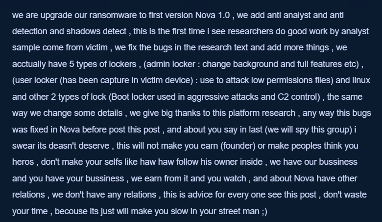
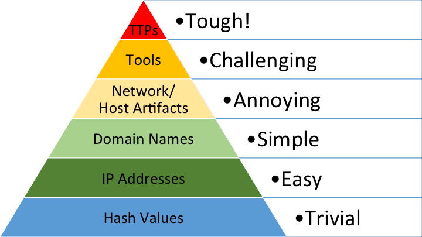

# 1. Introdução

É muito provável que você já tenha ouvido inúmeras vezes sobre a **Pirâmide da Dor (Pyramid of Pain)**. Talvez tenha lido algo no LinkedIn, visto em uma palestra ou escutado sobre o tema em alguma conversa técnica... enfim... O meu objetivo aqui não é repetir o que já foi dito em dezenas de artigos, mas trazer uma perspectiva realmente **técnica** da coisa, mostrando **como cada nível da pirâmide pode ser aplicado na prática**, especialmente no contexto de análise de ameaças e inteligência cibernética.

A **Pirâmide da Dor**, criada por **David J. Bianco**, é mais do que uma simples categorização de indicadores de ameaça, quando usada de forma estratégica, ela permite que analistas e organizações aumentem significativamente o custo operacional dos atacantes, forçando-os a mudar não apenas artefatos superficiais, mas suas táticas, técnicas e procedimentos (TTPs). Isso é claramente ilustrado no exemplo abaixo:

<figure style="text-align: center;">
  
  <figcaption><i><strong>Figura 1.</strong> Ator de ameaça lança nota pública em seu blog informando alterações em sua estrutura graças às ações de pesquisas de profissionais da área.</i></figcaption>
</figure>

Então, neste artigo, vamos entender **como aplicar objetivamente a Pirâmide da Dor** e o por que nosso foco não deve centrar apenas em identificar indicadores, mas em **responder a eles de forma eficaz e eficiente**. Em contextos de operações de inteligência cibernética, threat hunting e defesa proativa, **nem todos os indicadores tem o mesmo peso**, alguns deles são muito mais valiosos do que outros e causam mais dor.

# 2. Entendendo a estrutura da Pirâmide

<figure style="text-align: center;">
  
  <figcaption>
    <i><strong>Figura 2.</strong> Exemplo de como é a Pirâmide da Dor.  Foto/reprodução: David J. Bianco</i>
  </figcaption>
</figure>

**Hash Values**

- **Exemplos:** MD5, SHA1, SHA256 de artefatos.
- **Impacto:** Muito baixo.
- **Dificuldade de mudança:** Muito fácil.
- **Descrição:** O hash do artefato é a identidade digital do artefato e pode ser alterado facilmente ao recompilar o binário, incluindo um espaço a mais, por exemplo.

**IP Addresses**

- **Exemplos:** IPs de servidores de C2.
- **Impacto:** Baixo.
- **Dificuldade de mudança:** Fácil.
- **Descrição:** Atacantes podem mudar rapidamente de IP, usar proxies ou serviços de hospedagem diferentes.

**Domain Names**

- **Exemplos:** Domínios usados para _phishing_, uso em DNS ou C2.
- **Impacto:** Moderado.
- **Dificuldade de mudança:** Moderado.
- **Descrição:** Registrar um novo domínio é barato e rápido, mas ainda exige algum trabalho e logística. Ou caso tenham em mãos a posse de algum site comprometido, por exemplo.

**Network/Host Artifacts**

- **Exemplos:** Strings específicas em binários, caminhos de instalação incomuns, headers de pacotes anormais.
- **Impacto:** Moderado a alto
- **Dificuldade de mudança:** Difícil
- **Descrição:** Requer que o atacante altere partes do seu malware ou infraestrutura, como por exemplo, alterar a pasta de entrega da payload, alterar o header de requisição da infra do C2 ou URI de comando.

**Tools**

- **Exemplos:** Uso de ferramentas como Mimikatz, Cobalt Strike ou scripts personalizados.
- **Impacto:** Alto
- **Dificuldade de mudança:** Muito difícil
- **Descrição:** Mudar ou reescrever ferramentas implica esforço técnico considerável e pode comprometer a eficácia do ataque. Ter que reescrever a ferramenta ou desenvolver novas alternativas para evitar assinaturas já conhecidas do sofware é custoso.

**TTPs**

- **Exemplos:** Um atacante pode usar phishing (tática) com anexo malicioso em PDF (técnica) e, após acesso, utilizar RDP para se mover lateralmente (procedimento).
- **Impacto:** Extremamente alto
- **Dificuldade de mudança:** Extremamente difícil
- **Descrição:** Mudar TTPs significa alterar fundamentalmente a estratégia de ataque. Isso requer muito mais esforço, pois muitas vezes os atacantes seguem um _modus operandi_ que é difícil de modificar sem comprometer a eficácia ou aumentar os custos e tempo de desenvolvimento do ataque.

# 3. A Pirâmide da Dor dói mais para quem?

A Pirâmide da Dor é chamada assim porque ela representa a "dor" que você causa ao atacante quando detecta e bloqueia diferentes tipos de indicadores. David J. Bianco explica em seu blog que, _"O objetivo de detectar indicadores é responder a eles e, uma vez que você possa respondê-los com rapidez suficiente, **você <mark>negou</mark> ao adversário o uso desses indicadores quando ele estiver atacando você.**"_

Para o atacante, quanto mais alto o nível do indicador detectado (ex: TTPs), maior a dor e o esforço necessário para adaptar sua operação.

Para o defensor, lidar com indicadores do topo da pirâmide é mais complexo, pois exige mais capacidade analítica, contexto, e maturidade técnica.

Em oputras palavras, a pirâmide causa mais dor ao atacante quanto mais alto for o nível do indicador detectado. Para o defensor, também exige mais esforço e capacidade quanto mais alto na pirâmide ele opera, ou seja, quanto mais você sobe a pirâmide, mais custoso fica para os dois lados: Pro atacante fica mais difícil mudar TTPs do que mudar um hash. Pro defensor fica mais difícil detectar e responder a TTPs do que a um IP.

Isso pode parecer ruim ou um paradoxo: Quanto mais alto subimos na pirâmide, mais difícil também fica para nós defensores!? Mas é justamente aí que está a estratégia. Quanto maior o esforço do nosso lado, maior o impacto e o custo imposto ao adversário, pois uma vez que identificamos os TTPs, a partir dali teremos novas ideias e estratégias para mapear outras hipóteses, que é onde entre o perfil de um Threat Hunter.

###### **Leia também!**


Dentre as diversas abordagens em investigações de Threat Hunting, existe uma em que a análise pode ser conduzida com base em feeds de inteligência. Alguns desses feeds são mais específicos e costumam compartilhar, além de indicadores, pesquisas aprofundadas sobre malwares, atores de ameaça, incidentes cibernéticos, entre outros dados relevantes. São exemplos, a Cisco Talos e a Trend Micro, que oferecem conteúdos ricos para apoiar investigações mais estratégicas.


# 4. Por que a Pirâmide da Dor é importante?

A Pirâmide da Dor ensina que, para causar impacto real no adversário, não basta bloquear IPs ou hashes isolados. Defensores mais eficazes focam em identificar padrões de comportamento e técnicas — aspectos muito mais difíceis para os atacantes modificarem rapidamente.

Assim, ao investir em caçadas e detecções que buscam TTPs, estamos:
- Tornando as operações inimigas mais caras.
- Aumentando o tempo e o esforço necessário para eles retornarem.
-  Reduzindo as chances de ataques sucessivos semelhantes.

Em resumo, atacar o topo da pirâmide significa elevar o custo para o atacante — e isso é um dos pilares centrais da defesa cibernética moderna.

# 5. Aplicação estratégica da Pirâmide da Dor

## 5.1. Foco em TTPs e não apenas em IOCs básicos

- **Problema comum:** Organizações muitas vezes baseiam sua defesa na coleta de indicadores voláteis como hashes, IPs ou domínios.
- **Solução:** Caçar e detectar TTPs.
- **Exemplo prático:** Em uma campanha de ransomware como Conti, focar na detecção do padrão de execução do Cobalt Strike é mais eficaz do que simplesmente bloquear IPs usados pelo C2.
- **TTP detectada:** Uso de `rundll32.exe` para carregar payloads criptografados.
- **Resposta baseada na pirâmide:** Criar regras de detecção que monitoram o comportamento de `rundll32.exe` com parâmetros anômalos, independentemente do hash do DLL.
- **Benefício:** Atacante precisa modificar o seu modo de operar e não apenas mudar de hash/IP.

## 5.2. Coleta e análise de Inteligência Cibernética

A qualidade da inteligência influencia diretamente quão alto podemos atingir na pirâmide.

- **Boas práticas:** Correlacionar alertas de EDR/XDR para identificar padrões de movimento lateral, persistência, evasão. Utilizar frameworks como MITRE ATT&CK para mapear as TTPs observadas.
- **Exemplo prático:** Um adversário persistente (APT29) é detectado usando Golden Ticket Attack (T1558.001).
- **Análise:** Em vez de focar no hash da ferramenta usada (mimikatz.exe), caçamos a criação de tickets Kerberos anômalos no ambiente.

## 5.3. Compartilhamento de Inteligência de Ameaças

Organizações que produzem inteligẽncia e compartilham não apenas IOCs, mas TTPs, aumentam o custo para o atacante em escala, pois existe a possibilidade de identificar ataques iniciais em curso, observar lacunas que carecem de novas defesas ou novas regras. Ou seja, quanto mais cedo e mais amplo for o escopo de TTPs observadas e produzidas, mais ineficaz e caro se torna para o agente de ameaça a incursão no objetivo final de ataque.

Nesse cenário, se não possui equipe dedicada, contratar serviços de terceiros, como um MSSP, por exemplo, pode contribuir para sua operação de segurança.

###### **Leia também!**


O cyber threat hunting é uma atividade de investigação cibernética que pode ser motivada por diversos fatores. Em operações mais maduras, é comum que, antes de iniciar uma investigação, sejam obtidos triggers. Esses triggers podem ser provenientes de feeds de inteligência, atividades de gestão de vulnerabilidades, relatórios de pentest, respostas a incidentes, entre outras fontes.


## 5.4. Treinamento e conscientização de usuários

Ensinar as equipes de segurança e os usuários finais sobre as táticas, técnicas e procedimentos usados por atacantes pode ajudar a mitigar o risco de comprometimento, uma força de trabalho informada é uma camada crítica de defesa.

# 6. Conclusão

A Pirâmide da Dor é um modelo estratégico e não apenas uma teoria visual, ela permite as equipes de segurança focar seus esforços em indicadores que realmente afetam as operações adversárias, dificultando suas atividades e forçando-os a gastar mais tempo e recursos. Subir na pirâmide, focando na identificação e mitigação de TTPs, transforma uma postura defensiva reativa em uma totalmente ofensiva: forçamos o atacante a gastar mais tempo, recursos e a se expor mais para tentar nos atingir ~novamente~. Em um mundo onde as ameaças evoluem constantemente, nossa defesa (e hipóteses baseadas em TTPs) também precisa evoluir, atacando onde mais dói.

# 7. Referências

- [The Pyramid of Pain - David J. Bianco](https://detect-respond.blogspot.com/2013/03/the-pyramid-of-pain.html)
- [A Pirâmide da Dor no contexto da Cibersegurança - Anderson Alves](https://www.linkedin.com/pulse/pir%C3%A2mide-da-dor-contexto-ciberseguran%C3%A7a-anderson-alves-gljrf/)
- [Uso da Pirâmide da Dor de forma estratégica - Ismael Rocha](https://www.linkedin.com/pulse/uso-da-pir%25C3%25A2mide-dor-de-forma-estrat%25C3%25A9gica-ismael-rocha-04ndf/?trackingId=ZpD9pvmWRH2mFi4MQBGSQQ%3D%3D)
- [What is Security Control Failure?](https://www.attackiq.com/glossary/what-is-security-control-failure/)
- [Ending the Era of Security Control Failure](https://www.attackiq.com/lp/ending-the-era-of-security-control-failure/)



Por favor, entre em contato comigo pelo meu <a href="https://www.linkedin.com/in/sandsoncosta">LinkedIn</a>. Vou ficar muito contente em receber um feedback seu.

