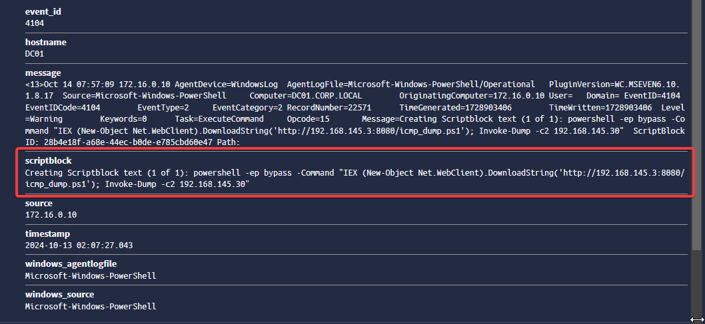
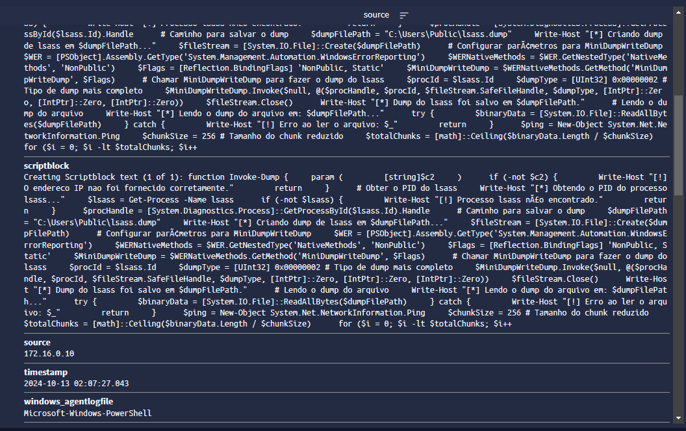
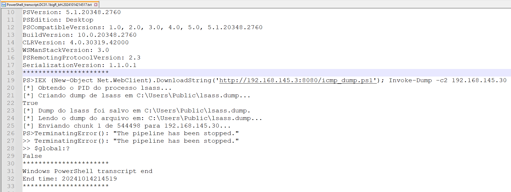

## 1. Introdução

Com o aumento do uso de ferramentas e scripts automatizados, o PowerShell passou a ser frequentemente utilizado por atacantes em ações maliciosas, como roubo de dados e execução de códigos maliciosos. Organizações que desejam aprimorar sua postura de segurança devem ativar políticas de auditoria no PowerShell, o que é fundamental para monitorar scripts e detectar atividades maliciosas. Neste artigo, vamos descrever como ativar as principais políticas de auditoria do PowerShell que são suficientes para aumentar a visibilidade do ambiente: **Script Block Logging** e **Transcript Logging**.

## 2. Entendendo o funcionamento de cada política

### 2.1. Script Block Logging (Registro de Blocos de Script)

O **Script Block Logging** é essencial para identificar atividades maliciosas, pois possibilita o registro de blocos de script em execução, mesmo que estejam ofuscados. Essa auditoria captura scripts legítimos e scripts mal-intencionados, fornecendo visibilidade detalhada das operações internas do PowerShell.

O Script Block Logging irá registar todas as entradas de script do PowerShell como, processamento de comandos, blocos de script e funções que é executado e gerar eventos no Event Viewer que podem ser encontrados em:

```yaml
Log: Microsoft-Windows-PowerShell/Operational
Event ID: 4104
```
Com essa auditoria habilitada, somos capazes de identificar eventos no SIEM, como no exemplo abaixo:



E também somos capazes de entender e identificar o que o script está fazendo além da execução, como podemos ver no exemplo:



### 2.2. Transcript Logging (Registro de Transcrições)

O **Transcript Logging** é uma funcionalidade que registra todas as interações de comando em um arquivo de transcrição. Isso possibilita registrar minuciosamente todas as ações feitas ao executar scripts, tais como comandos, resultados, falhas e informações importantes, como horários e usuários participantes. Este recurso permite a realização de auditorias e análises forenses, simplificando o rastreamento das atividades realizadas, a detecção de possíveis incidentes de segurança e a resposta eficiente a eles.

Com isso já podemos ler todas as informações em um arquivo txt, como no exemplo abaixo:



### 2.3. Habilitando via Diretiva de Grupo (GPO)

1. Crie uma nova política de GPO. Aqui eu chamei de ***Auditoria de Powershell***.
2. Navegue até o seguinte caminho: `Computer Configuration > Policies > Administrative Templates > Windows Components > Windows PowerShell`.
3. Abra o `Turn on PowerShell Script Block Logging`, selecione `Enabled` e dê OK.
4. Abra o `Turn on PowerShell Transcription`, selecione `Enabled`, em `Options: > Transcript output directory`, inclua um caminho para salvar os arquivos `.txt` dos scripts executados no powershell e dê OK.

## 4. Observações

A depender do tipo de script executado, esse Event ID específico, pode gerar muitos blocos de script, como no exemplo abaixo: 


Nesse cenário de execução do Mimikatz em memória, o comando executado não é criado, mas não quer dizer que ele não seja identificado. Conseguimos capturar a execução dele por meio de outros Event IDs.



  1. Existem outros Event ID relacionado ao Powershell que identificam o mesmo cenário, mas não são enviados por default para um SIEM e, pra configurar o envio, "é chatinho".
  <br>
  2. Também não há necessidade de envio desses logs para um SIEM, o Event ID 4104 é mais que suficiente para identificar e analisar anomalias.
  <br>
  3. Apenas para título de curiosidade são: 400, 403 e 600.


Vale ressaltar que essas políticas tem seus prós e contras e cabe a sua equipe analisar se ambos os cenários valem a pena para você.


**Prós do Script Block Logging:**

- Visibilidade detalhada.
- Detecção.
- Integração com SIEM.
- Análise de ameaças.

**Contras do Script Block Logging:**

- Volume de logs.
- Ruído.
- Performance.

**Prós do Transcript Logging:**

- Rastreamento completo.
- Facilidade de investigação.
- Visibilidade em longo prazo.

**Contras do Transcript Logging:**

- Espaço de armazenamento.
- Dificuldade em filtragem.
- Exposição de informações sensíveis.

## 5. Conclusão

Ambas as políticas trazem benefícios claros para aumentar a visibilidade e a segurança no uso do PowerShell, especialmente em um SOC que monitora ambientes, muitas vezes de grande porte. No entanto, é importante balancear a implementação com a infraestrutura disponível, armazenamento e capacidade de análise de logs.

Particularmente falando, somente o Script Block Logging é suficiente para compor o SIEM e termos logs sendo executados a nível de powershell. Mas tenha em mente que esse cenário gera muita informação e é necessário um trabalho a quatro mãos para remover falsos-positivos e trabalhar no que realmente importa, anomalias.

Acredite, existem empresas de médio/grande porte que não possuem essa política habilitada. Temos alguns possíveis cenários para isso que pode ser desconhecimento ou pode ser simplesmente contrato de EPS limitado. Portanto, é extremamente necessário colocar na ponta do lápis esse cenário e fazer uma consiência situacional do seu ambiente...