# Criação da GPO

Criar uma nova GPO "Auditoria de GPO".

Clicar com o direito e clicar em Edit.

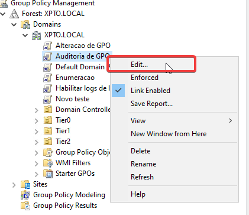

<p align="center">
  
</p>

Seguir para o caminho: *Computer Configuration > Policies > Windows Settings > Security Settings > Advanced Audit Policy Configuration > Audit Policies > DS Access*.

Clicar 2 vezes em *Audit Directory Service Changes* e marcar somente *Success*.

<p align="center">
  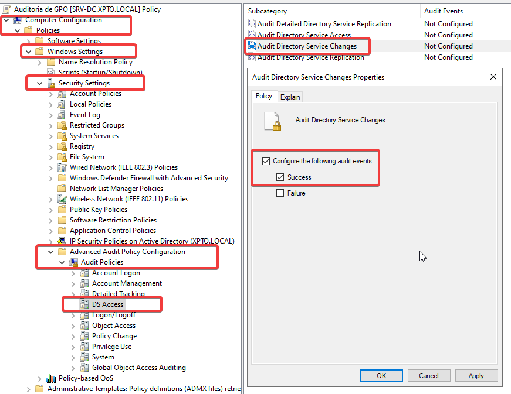
</p>

Seguir para o caminho: *Computer Configuration > Policies > Windows Settings > Security Settings > Advanced Audit Policy Configuration > Audit Policies > Object Access*.

Clicar 2 vezes em *Audit File System* e marcar somente *Success*.

<p align="center">
  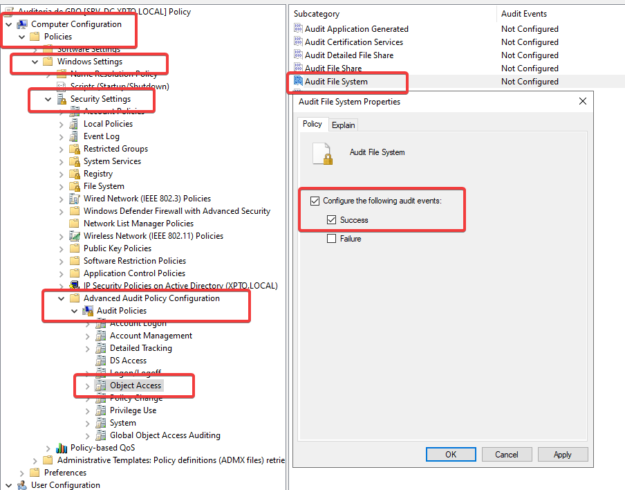
</p>

Force a atualização das políticas de GPO.


# Configurando a auditoria de objetos groupPolicyContainer usando ADSI Edit

No menu iniciar pesquise por ADSI Edit e inicie como admin.

Com o botão direito, clique em *Connect to...*.

Clique em OK.

Expanda o Domain naming context.

Expanda o DC=domain.

Expanda o CN=System.

Clique com o botão direito em *CN=Policies* e selecione Properties.

Em *Security* clique em *Advanced*.

<p align="center">
  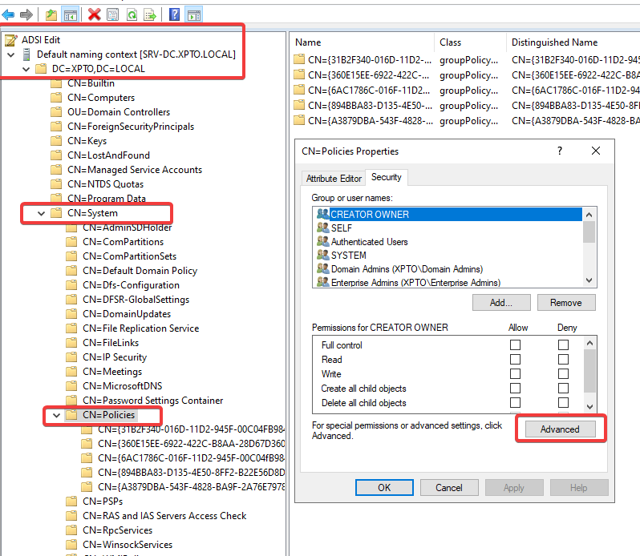
</p>

Na janela que abrir, clique em *Auditing*.

Depois clique em *Add*.

<p align="center">
  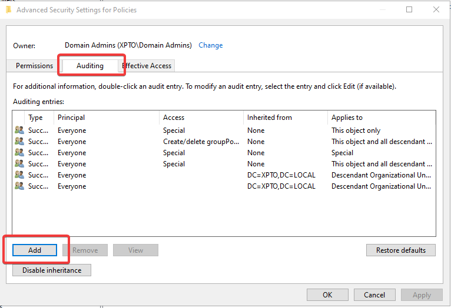
</p>

Na janela que abrir, clique em *Select a principal*.

Na janela que abrir, pesquise por *Everyone* e dê OK.

<p align="center">
  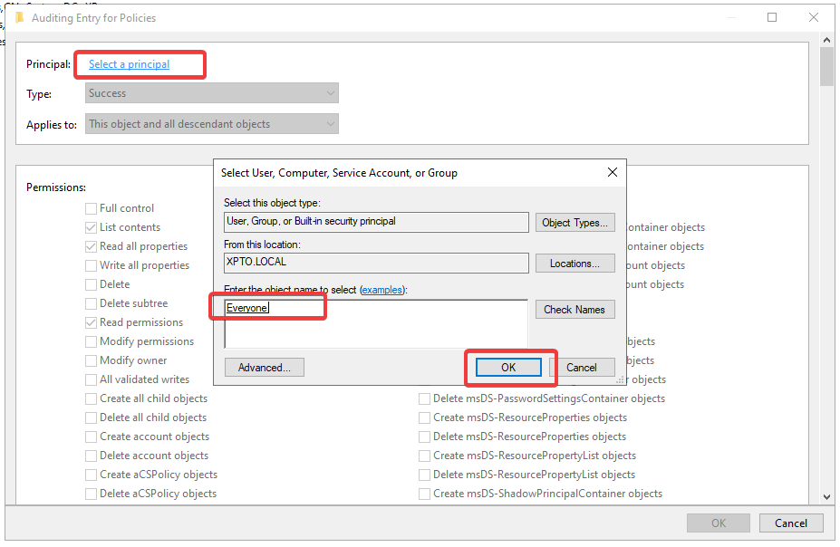
</p>

Em *Type* deixe *Success*.

Em *Applies to* deixe *This object and all descendant objects*.

<p align="center">
  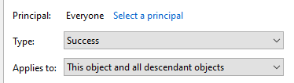
</p>

Na lista logo abaixo, pesquise por *Create groupPolicyContainer objects* e *Delete groupPolicyContainer objects*, marque as duas opções e dê OK.

<p align="center">
  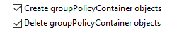
</p>

Pode dar OK em todas as janelas logo após isso.

# Configurando a auditoria da pasta SYSVOL


Navegue até *C:\\Windows\\SYSVOL\\domain*.

Abra as propriedades da pasta *Policies*.

Na janela que abrir, vá até *Security*, clique em *Advanced*.

Na janela que abrir, vá até *Auditing*. Se uma janela de bloqueio aparecer, clique em *Continue*.

Clique em *Add*.

Na janela que abrir, clique em *Select a principal*, depois pesquise por *Everyone* novamente e dê OK.

<p align="center">
  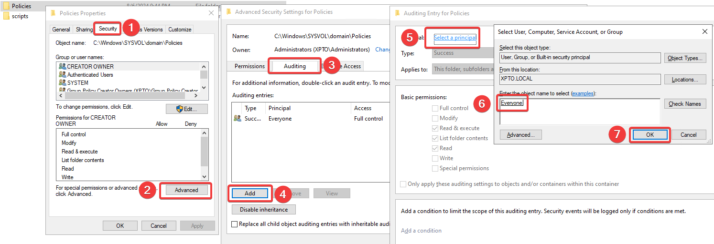
</p>

Em *Advanced Permissions*, clique em *Show advanced permissions* para listar todas as permissões avançadas. Logo após listar todas as opções, clique em *Full control* e dê OK.

<p align="center">
  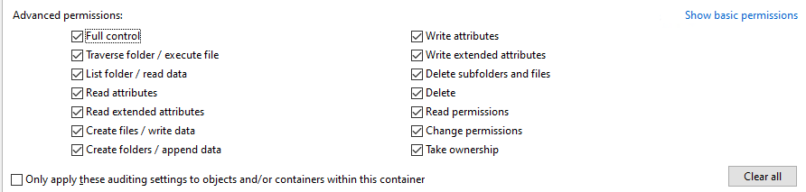
</p>

Pode dar OK em todas as janelas logo após isso.

Pronto!

# Lista dos EventID gerados

| Event ID |                     Descrição                     |
|:--------:|:-------------------------------------------------:|
|   5136   | Um objeto de serviço de diretório foi modificado. |
|   5137   |   Um objeto de serviço de diretório foi criado.   |
|   5138   | Um objeto de serviço de diretório foi recuperado. |
|   5139   |   Um objeto de serviço de diretório foi movido.   |
|   5141   |  Um objeto de serviço de diretório foi deletado.  |

<p align="center">
  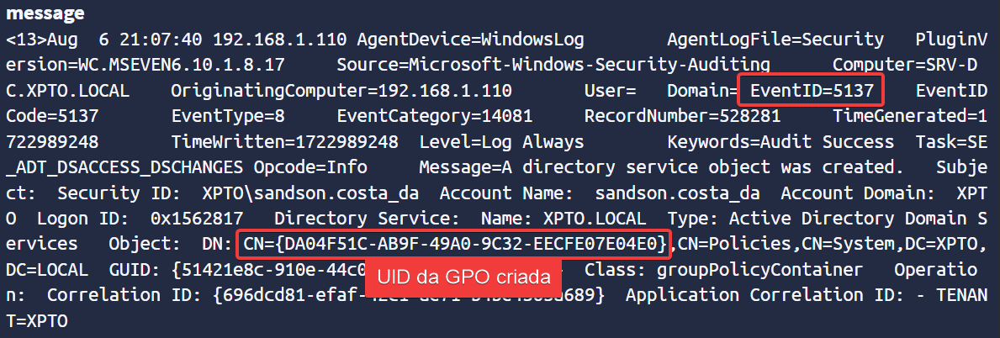
</p>

Para ver o nome da GPO via PowerShell:
```powershell
$gpoGuid = "4289D558-1E11-417D-95DE-19A1FCDD6AA1"
$gpo = Get-GPO -Guid $gpoGuid
$gpo.DisplayName

OUTPUT
-----------
Auditoria de GPO
```
