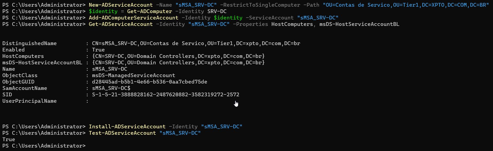
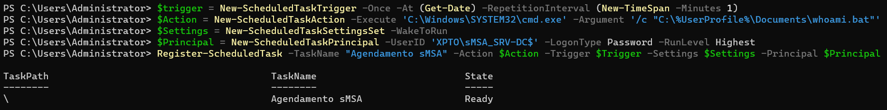
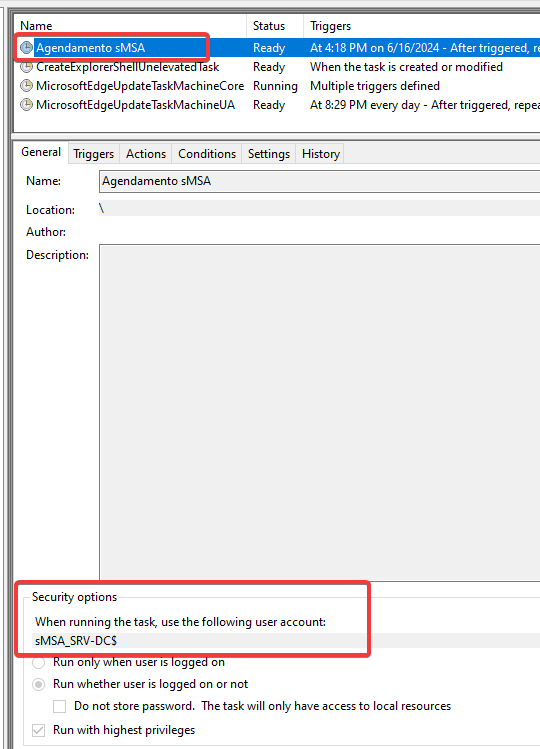
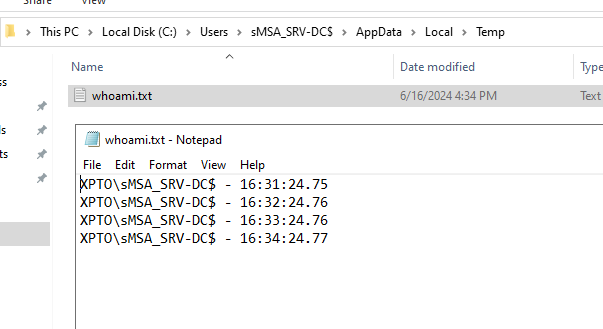
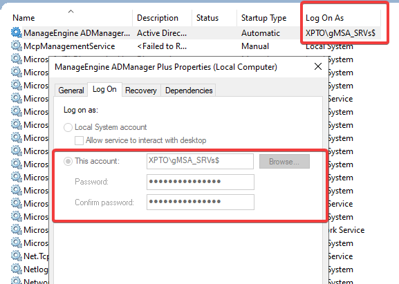

Neste artigo vamos abordar de forma prática a criação e uso das MSAs no ambiente Windows. Para entender melhor sobre cada uma delas, escrevi um artigo sobre. Para ler [clique aqui](https://sandsoncosta.github.io/blog/2024/06/entenda-o-que-s%C3%A3o-contas-de-servi%C3%A7o-e-como-us%C3%A1-las-teoria-parte-1/).
<!--more-->

## Introdução

A escolha entre [sMSA](https://sandsoncosta.github.io/blog/2024/06/entenda-o-que-s%C3%A3o-contas-de-servi%C3%A7o-e-como-us%C3%A1-las-teoria-parte-1/) e [gMSA](https://sandsoncosta.github.io/blog/2024/06/entenda-o-que-s%C3%A3o-contas-de-servi%C3%A7o-e-como-us%C3%A1-las-teoria-parte-1/) para serviços e criação de contas de AD depende de alguns fatores:

Essas questões destacam a importância das Contas de Serviço Gerenciadas (Managed Service Accounts - MSAs) como uma solução robusta para mitigar esses riscos e simplificar a administração de serviços no ambiente Windows.

## Quando usar sMSA e gMSA?

sMSA (Standalone Managed Service Account) e gMSA (Group Managed Service Account) são duas opções de contas de serviço gerenciadas no Active Directory que oferecem gerenciamento automático de senhas e outros benefícios de segurança. A escolha entre elas depende de alguns fatores:

**1. Escopo do serviço:**

sMSA: Use quando o serviço for executado em um único servidor.
gMSA: Use quando o serviço for executado em vários servidores ou se a identidade do serviço precisar ser conhecida por clientes externos.

**2. Alta disponibilidade:**

sMSA: Não suporta alta disponibilidade. Se o servidor falhar, o serviço será interrompido até que a senha seja redefinida manualmente.
gMSA: Suporta alta disponibilidade. As senhas são replicadas entre vários servidores, garantindo que o serviço continue funcionando mesmo em caso de falha de um servidor.

**3. Gerenciamento de credenciais:**

sMSA: As credenciais do sMSA são armazenadas localmente no servidor e não podem ser gerenciadas centralmente.
gMSA: As credenciais do gMSA são armazenadas no KDS (Key Distribution Service) e podem ser gerenciadas centralmente. Isso facilita a rotação de senhas e a recuperação de senhas em caso de perda.

**4. Suporte a serviços:**

sMSA: Suporta a maioria dos serviços do Windows.
gMSA: Suporta a maioria dos serviços do Windows, mas nem todos. Alguns serviços mais antigos podem não ser compatíveis com gMSA.

**5. Complexidade de implantação:**

sMSA: A implantação do sMSA é mais simples, pois não requer configuração adicional.
gMSA: A implantação do gMSA é mais complexa(não complexa) e requer a configuração do KDS.

Em resumo:

Use sMSA quando:

- O serviço for executado em um único servidor.
- A alta disponibilidade não for um requisito.
- O gerenciamento centralizado de credenciais não for necessário.
- O serviço for compatível com sMSA.
- Você deseja uma implantação simples.

Use gMSA quando:

- O serviço for executado em vários servidores ou se a identidade do serviço precisar ser conhecida por clientes externos.
- A alta disponibilidade for um requisito.
- O gerenciamento centralizado de credenciais for necessário.
- O serviço for compatível com gMSA.
- Você está disposto a investir mais tempo e esforço na implantação.

Exemplos de cenários para sMSA:

- Um serviço de web que é executado em um único servidor.
- Um agente de backup que é executado em um único servidor.
- Um serviço de impressão que é executado em um único servidor.

Exemplos de cenários para gMSA:

- Um serviço de compartilhamento de arquivos que é executado em vários servidores.
- Um serviço de email que é executado em vários servidores.
- Um serviço de banco de dados que é executado em vários servidores.

Lembre-se de que estas são apenas diretrizes gerais. A melhor escolha para o seu ambiente específico dependerá de suas necessidades e requisitos específicos.

## Vamos para a prática!


```powershell {title="Criando uma conta de serviço sMSA"}
# Se não passar o Path, ele vai pra OU default que é "Managed Service Accounts"
New-ADServiceAccount -Name "sMSA_SRV-DC" -RestrictToSingleComputer -Path "OU=Contas de Servico,OU=Tier1,DC=XPTO,DC=COM,DC=BR"
$serverIdentity = Get-ADComputer -Identity SRV-DC # O SRV-DC é o server que foi associado à conta de serviço, pode ser qualquer outro server.
Add-ADComputerServiceAccount -Identity $identity -ServiceAccount "sMSA_SRV-DC"
$smsaIdentity = Get-ADServiceAccount -Identity "sMSA_SRV-DC" -Properties HostComputers, msDS-HostServiceAccountBL
Install-ADServiceAccount -Identity "sMSA_SRV-DC"
Test-ADServiceAccount "sMSA_SRV-DC"
# Get-ADServiceAccount -Identity "sMSA_SRV-DC" -Properties *
# Com o * você retorna todas as propriedades do objeto.
```


### Testando a conta:

Para o teste vamos criar um arquivo `whoami.bat` simples.

```bat {title="whoami.bat"}
echo %userdomain%\%username% - %time% >> %Temp%\whoami.txt
```

Criando uma tarefa agendada via powershell.

```powershell {title="Criando uma conta de serviço gMSA"}
$trigger = New-ScheduledTaskTrigger -Once -At (Get-Date) -RepetitionInterval (New-TimeSpan -Minutes 1)
$Action = New-ScheduledTaskAction -Execute 'C:\Windows\SYSTEM32\cmd.exe' -Argument '/c "C:\Users\joseph.climber_da\Desktop\whoami.bat"'
$Settings = New-ScheduledTaskSettingsSet -WakeToRun
$Principal = New-ScheduledTaskPrincipal -UserID 'XPTO\sMSA_SRV-DC$' -LogonType Password -RunLevel Highest
Register-ScheduledTask -TaskName "Agendamento sMSA" -Action $Action -Trigger $Trigger -Settings $Settings -Principal $Principal
Write-Output (Get-Date).ToString("d/MMM/yyyy hh:mm:ss tt"); ls
```

<p align="center">
  
</p>

<p align="center">
  
</p>

Resultado:

<p align="center">
  
</p>

### Exemplo de criação de contas gMSA:


Antes de se criar uma conta gMSA, é necessário criar um chave raiz chamada KDS Root Key. Ele é feito apenas uma vez por floresta.

```powershell {title="Criando uma conta de serviço gMSA"}
#Esse comando abaixo força a replicação imediata da KDS, não recomendada para ambiente em PROD.
Add-KdsRootKey –EffectiveTime ((get-date).addhours(-10)) # usada para forçar a replicação
Get-KdsRootKey # Verificar se foi criada
Test-KdsRootKey -KeyId (Get-KdsRootKey).KeyId # verificar a chave

# -ManagedPasswordIntervalInDays 10 só pode ser criado durante a criação da gMSA.
# -PrincipalsAllowedToRetrieveManagedPassword: Você especifica quais máquinas podem usar essa conta, separado por vírgula.
New-ADServiceAccount -Name "gMSA_SRVs" -DNSHostName "gMSA_SRVs.XPTO.LOCAL" -Path "OU=Contas de Servico,OU=Tier1,DC=XPTO,DC=LOCAL" -PrincipalsAllowedToRetrieveManagedPassword SRV-DC$ -ManagedPasswordIntervalInDays 10
$identity = Get-ADComputer -Identity SRV-DC # O SRV-DC é o server que foi associado à conta de serviço, pode ser qualquer outro server.
Add-ADComputerServiceAccount -Identity $identity -ServiceAccount "sMSA_SRV-DC"
$smsaIdentity = Get-ADServiceAccount -Identity "sMSA_SRV-DC" -Properties HostComputers, msDS-HostServiceAccountBL
Install-ADServiceAccount -Identity "sMSA_SRV-DC"
Test-ADServiceAccount "sMSA_SRV-DC"
```

Para o meu teste com o gMSA, eu utilizei software de Gestão de AD, chamado ADManger, da Manage Engine. É um software que você é capaz de criar usuários via web de forma muito simples.

<p align="center">
  
</p>

Com isso você não se preocupa com gerenciamento de senhas.

That's it!

## Referências

- [Entenda O Que São Contas De Serviço E Como Usá-Las: Teoria - Parte 1](https://sandsoncosta.github.io/blog/2024/06/entenda-o-que-s%C3%A3o-contas-de-servi%C3%A7o-e-como-us%C3%A1-las-teoria-parte-1/)
- [Using a Managed Service Account (MSA or gMSA) in ADManager Plus](https://pitstop.manageengine.com/portal/en/kb/articles/using-a-managed-service-account-in-admanager-plus)